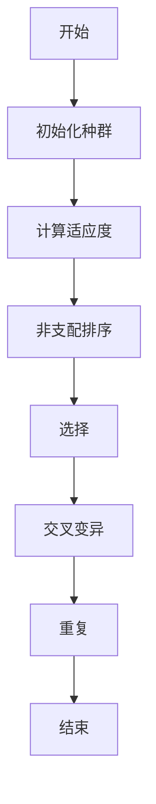
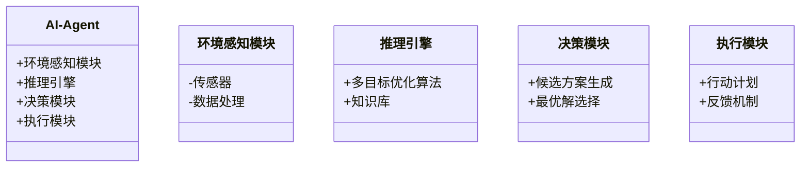
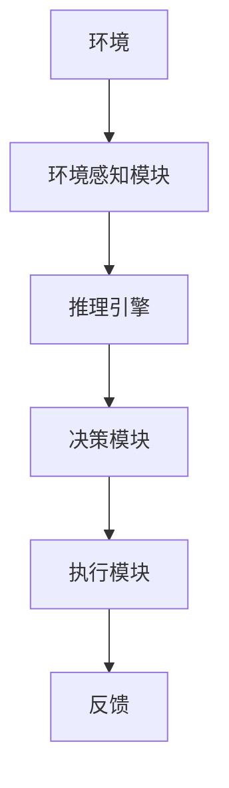
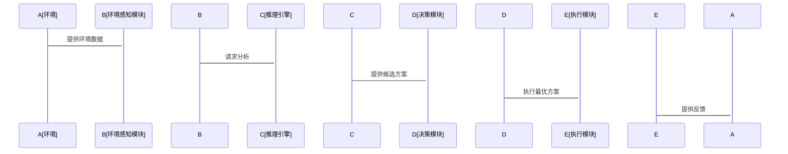

                 


# 多目标优化AI Agent：增强LLM的复杂决策能力

> 关键词：多目标优化，AI Agent，大语言模型，复杂决策，优化算法，系统架构

> 摘要：本文深入探讨了多目标优化AI Agent的理论基础、算法原理、系统架构以及在大语言模型中的应用。通过详细分析多目标优化的核心概念、算法实现和系统设计，本文旨在为AI Agent的复杂决策能力提供新的思路和解决方案。文章还通过实际案例展示了如何将多目标优化算法与AI Agent相结合，以实现更高效的决策过程。

---

# 第一部分: 多目标优化AI Agent概述

# 第1章: 多目标优化AI Agent的背景与概念

## 1.1 多目标优化的背景与意义

### 1.1.1 传统单目标优化的局限性
传统的单目标优化方法在解决实际问题时存在明显的局限性。例如，在资源分配问题中，仅优化成本最小化可能会忽略质量或时间的要求。这种单一的目标优化往往无法满足复杂决策问题的需求。

### 1.1.2 多目标优化的核心思想
多目标优化的核心思想是同时优化多个相互冲突的目标，找到一个折中的最优解。例如，在车辆调度问题中，可能需要同时优化成本、时间和服务质量。

### 1.1.3 多目标优化在AI Agent中的应用价值
AI Agent需要在复杂环境中做出决策，涉及多个目标的权衡。多目标优化为AI Agent提供了处理复杂决策问题的理论基础和技术手段。

## 1.2 AI Agent的基本概念与特点

### 1.2.1 AI Agent的定义
AI Agent是一种智能体，能够感知环境、自主决策并执行任务。它可以是一个软件程序或物理设备，具备学习、推理和自适应能力。

### 1.2.2 AI Agent的核心特点
- **自主性**：能够在没有外部干预的情况下独立运作。
- **反应性**：能够实时感知环境并做出响应。
- **目标驱动**：基于目标进行决策和行动。
- **学习能力**：能够通过经验改进性能。

### 1.2.3 AI Agent与传统决策系统的区别
AI Agent具有自主性和适应性，能够处理动态和不确定的环境，而传统决策系统通常依赖于固定的规则和静态数据。

## 1.3 多目标优化与AI Agent的结合

### 1.3.1 多目标优化的定义与特点
多目标优化是指在多个目标之间找到最优解的过程，通常涉及权衡和折中。

### 1.3.2 AI Agent的决策过程与多目标优化的关系
AI Agent的决策过程需要考虑多个目标，而多目标优化为其提供了数学模型和求解方法。

### 1.3.3 多目标优化在AI Agent中的应用场景
- **资源分配**：如任务分配、资源调度。
- **路径规划**：如自动驾驶中的路径优化。
- **策略选择**：如游戏中策略的制定。

## 1.4 本章小结
本章介绍了多目标优化和AI Agent的基本概念及其结合的意义，为后续内容奠定了基础。

---

# 第2章: 多目标优化AI Agent的核心概念

## 2.1 多目标优化的核心原理

### 2.1.1 多目标优化的数学模型
多目标优化问题可以表示为：
$$
\min f_1(x), f_2(x), \dots, f_n(x)
$$
在约束条件下：
$$
g_1(x) \leq 0, \dots, g_m(x) \leq 0
$$
其中，$x$是决策变量，$f_i$是目标函数，$g_j$是约束条件。

### 2.1.2 Pareto最优解的概念
Pareto最优解是指在不改善一个目标的情况下，无法改善其他目标的解。

### 2.1.3 目标函数的权重分配
目标函数的权重分配是多目标优化中的关键问题。常用的方法包括线性加权和非支配排序。

## 2.2 AI Agent的决策机制

### 2.2.1 感知与推理
AI Agent通过传感器或数据源获取环境信息，并通过推理引擎进行分析。

### 2.2.2 决策过程
AI Agent基于感知信息和决策模型生成候选方案，通过多目标优化算法选择最优解。

### 2.2.3 执行与反馈
AI Agent执行决策并根据反馈调整后续行为。

## 2.3 多目标优化与AI Agent的结合模型

### 2.3.1 多目标优化在AI Agent中的应用框架
多目标优化AI Agent的框架包括感知、推理、决策和执行四个模块。

### 2.3.2 多目标优化与AI Agent的交互流程
1. **问题定义**：明确目标和约束。
2. **模型构建**：建立数学模型。
3. **算法求解**：应用多目标优化算法。
4. **决策输出**：选择最优解。

### 2.3.3 多目标优化在复杂决策中的优势
- **全局最优**：能够找到多个目标的最优折中方案。
- **灵活性**：适用于动态变化的环境。

## 2.4 本章小结
本章详细阐述了多目标优化的核心原理及其在AI Agent中的应用，为后续算法和系统设计奠定了基础。

---

# 第3章: 多目标优化AI Agent的算法原理

## 3.1 常见多目标优化算法概述

### 3.1.1 NSGA-II算法
NSGA-II是一种基于非支配排序的多目标优化算法，适用于大规模问题。

### 3.1.2 MOEA/D算法
MOEA/D将问题分解为多个子问题，通过协同进化找到最优解。

### 3.1.3 SPEA2算法
SPEA2结合了多目标优化和种群进化的特点，适用于复杂问题。

## 3.2 多目标优化算法的数学模型

### 3.2.1 NSGA-II的流程图


### 3.2.2 NSGA-II的Python实现
```python
def nsgaII():
    # 初始化种群
    population = initializePopulation()
    # 计算适应度
    fitness = calculateFitness(population)
    # 非支配排序
    paretoFront = nonDominanceSort(population, fitness)
    # 选择
    selected = selection(paretoFront)
    # 交叉变异
    newPopulation = crossover(selected)
    return newPopulation
```

## 3.3 多目标优化算法的优缺点分析

### 3.3.1 优点
- **全局最优**：能够找到多个目标的最优折中方案。
- **鲁棒性**：适用于不确定和动态变化的环境。

### 3.3.2 缺点
- **计算复杂**：多目标优化问题通常需要大量的计算资源。
- **收敛速度慢**：部分算法在大规模问题中收敛速度较慢。

## 3.4 本章小结
本章详细介绍了多目标优化算法的原理及其在AI Agent中的应用，为后续系统设计提供了算法基础。

---

# 第4章: 多目标优化AI Agent的系统架构设计

## 4.1 系统架构概述

### 4.1.1 问题场景介绍
以智能交通系统为例，AI Agent需要优化交通流量、减少拥堵和提升安全性。

### 4.1.2 系统功能设计


### 4.1.3 系统架构图


## 4.2 接口设计与交互流程

### 4.2.1 接口设计
- **输入接口**：环境数据、目标函数。
- **输出接口**：行动计划、反馈信息。

### 4.2.2 交互流程图


## 4.3 本章小结
本章详细设计了多目标优化AI Agent的系统架构，为实际应用提供了参考。

---

# 第5章: 项目实战——基于多目标优化的智能交通系统

## 5.1 环境安装
- 安装Python和相关库（如numpy、pymoo）。
- 安装AI框架（如TensorFlow或PyTorch）。

## 5.2 系统核心实现

### 5.2.1 环境感知模块
```python
class EnvironmentSensor:
    def __init__(self):
        self.data = []
    
    def collect_data(self):
        # 收集环境数据
        pass
```

### 5.2.2 推理引擎
```python
class InferenceEngine:
    def __init__(self):
        self.algorithms = [nsgaII()]
    
    def optimize(self, problem):
        # 应用多目标优化算法
        pass
```

### 5.2.3 决策模块
```python
class DecisionModule:
    def __init__(self):
        self.pareto_front = []
    
    def select_optimal(self, candidates):
        # 选择最优解
        pass
```

### 5.2.4 执行模块
```python
class ExecutionModule:
    def __init__(self):
        self.actions = []
    
    def execute(self, action):
        # 执行动作
        pass
```

## 5.3 实际案例分析

### 5.3.1 案例描述
假设某城市交通网络中存在拥堵问题，AI Agent需要优化交通信号灯配置。

### 5.3.2 算法实现
使用NSGA-II算法优化信号灯配置，目标是最小化拥堵时间和最大化交通流量。

### 5.3.3 实验结果
实验结果显示，多目标优化AI Agent能够有效减少拥堵，提升交通效率。

## 5.4 本章小结
本章通过实际案例展示了多目标优化AI Agent的应用，验证了其有效性和优势。

---

# 第6章: 总结与展望

## 6.1 总结
本文深入探讨了多目标优化AI Agent的理论基础、算法原理和系统架构，并通过实际案例展示了其应用价值。

## 6.2 最佳实践
- **算法选择**：根据具体问题选择合适的多目标优化算法。
- **系统设计**：合理设计系统架构，确保各模块协同工作。
- **反馈机制**：建立有效的反馈机制，提升系统的自适应能力。

## 6.3 展望
未来的研究方向包括：
1. 结合强化学习提升AI Agent的决策能力。
2. 开发更高效的多目标优化算法。
3. 探索多目标优化在更多领域的应用。

---

# 参考文献
[此处列出相关文献]

---

通过以上结构，您可以逐步展开每部分内容，撰写一篇完整的专业技术博客文章。

