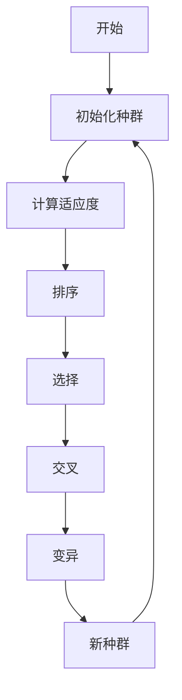
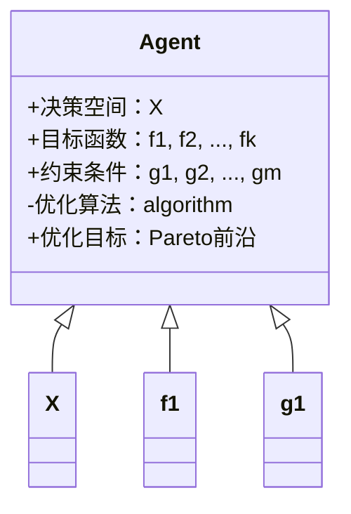
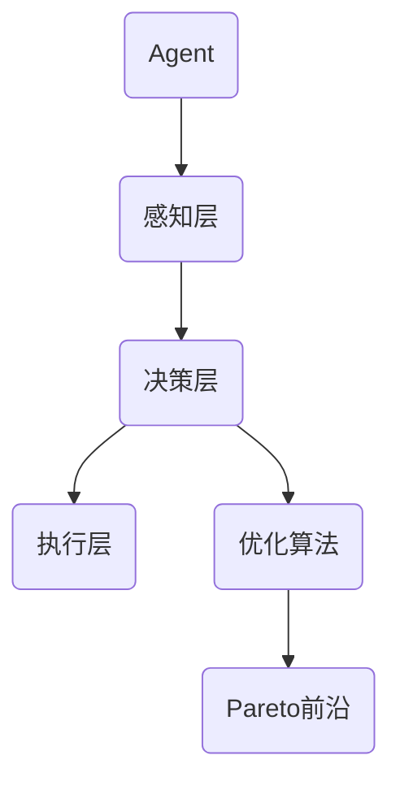

                 

<think>
好的，现在我需要根据用户的要求，逐步构建一篇关于《多目标优化在AI Agent训练中的实践》的详细技术博客文章。我会按照目录大纲的结构，逐一展开每一部分的内容，确保涵盖所有要求，并使用专业的技术语言进行描述。

---

# 多目标优化在AI Agent训练中的实践

## 关键词：
多目标优化、AI Agent、强化学习、Pareto前沿、NSGA-II、算法设计

## 摘要：
多目标优化在AI Agent的训练中扮演着至关重要的角色，特别是在需要同时优化多个相互冲突的目标时。本文深入探讨了多目标优化的基本概念、算法原理及其在AI Agent训练中的应用。通过结合数学模型、算法流程图和实际案例分析，本文详细讲解了如何在AI Agent训练中实现多目标优化，包括从问题建模到算法设计，再到系统实现的完整流程。最后，本文还提供了最佳实践建议和未来研究方向。

---

## 第一部分：多目标优化与AI Agent基础

### 第1章：多目标优化问题背景与概念

#### 1.1 多目标优化的基本概念

##### 1.1.1 优化问题的定义与分类
优化问题是一种寻找最优解的数学问题，通常分为单目标优化和多目标优化。单目标优化仅关注一个目标函数的最优化，而多目标优化则同时考虑多个目标函数的最优化。

**对比分析表：**

| 特性                | 单目标优化         | 多目标优化         |
|---------------------|------------------|------------------|
| 目标数量            | 1                | ≥2               |
| 解空间复杂度        | 较低             | 高               |
| 应用场景            | 简单决策问题       | 复杂决策问题       |

**Pareto前沿的概念：**
在多目标优化中，Pareto最优解是指在不使其他目标变差的情况下，无法再改善某个目标的解。Pareto前沿（Pareto Front）是所有Pareto最优解的集合，表示在多个目标之间的一种折中关系。

##### 1.1.2 多目标优化的数学模型
多目标优化的数学模型通常可以表示为：

$$
\text{minimize } f_1(x), f_2(x), \ldots, f_k(x)
$$

$$
\text{subject to } g_i(x) \leq 0, \quad i = 1, 2, \ldots, m
$$

其中，$f_i(x)$是目标函数，$g_i(x)$是约束条件，$x$是决策变量。

##### 1.1.3 多目标优化的应用场景
多目标优化广泛应用于工程设计、金融投资、环境科学等领域。在AI Agent中，多目标优化常用于平衡性能、效率、安全等多个目标。

#### 1.2 AI Agent的基本概念与类型

##### 1.2.1 AI Agent的定义与分类
AI Agent是一种智能实体，能够感知环境并采取行动以实现目标。根据智能水平和结构，AI Agent可以分为反应式Agent、基于模型的Agent、基于效用的Agent等。

##### 1.2.2 AI Agent的核心能力
AI Agent的核心能力包括感知、决策和执行。多目标优化在决策阶段尤为重要，因为它需要同时优化多个目标。

##### 1.2.3 AI Agent的训练挑战
单目标优化无法同时处理多个目标的冲突，导致AI Agent在复杂任务中表现不佳。多目标优化通过同时优化多个目标，解决了这一问题。

#### 1.3 多目标优化与AI Agent的结合

##### 1.3.1 多目标优化在AI Agent训练中的应用
多目标优化在AI Agent训练中的应用主要体现在多目标强化学习（MRL）和多目标监督学习（MTL）。

##### 1.3.2 多目标优化的核心优势
多目标优化能够平衡多个目标的冲突，提供更全面的解决方案，提高AI Agent的适应性和鲁棒性。

##### 1.3.3 本章小结
本章介绍了多目标优化的基本概念、应用场景以及在AI Agent训练中的重要性。

---

## 第二部分：多目标优化算法原理

### 第2章：多目标优化算法概述

#### 2.1 常见的多目标优化算法

##### 2.1.1 基于群体智能的算法
- **遗传算法（GA）：**模拟生物进化过程，通过选择、交叉和变异生成新的解。
- **粒子群优化（PSO）：**模拟鸟群觅食行为，通过粒子的移动寻找最优解。

##### 2.1.2 基于Pareto优化的算法
- **NSGA-II：**通过分层优化，首先优化Pareto前沿，然后优化拥挤度。
- **MOEA/D：**将问题分解为多个子问题，逐个优化。

##### 2.1.3 基于分解的算法
- **基于权重的分解方法：**为每个解分配不同的权重，进行单目标优化。
- **基于指标的分解方法：**将多目标问题分解为多个单目标问题，通过指标权重进行优化。

**NSGA-II算法流程图：**



---

## 第三部分：AI Agent的系统架构与设计

### 第3章：AI Agent的系统架构设计

#### 3.1 系统功能设计

##### 3.1.1 领域模型
领域模型是AI Agent的核心，描述了问题的决策空间和目标函数。

**领域模型类图：**



##### 3.1.2 系统架构设计
系统架构通常包括感知层、决策层和执行层。

**系统架构图：**



#### 3.2 系统实现

##### 3.2.1 系统接口设计
系统接口包括输入接口（感知环境）和输出接口（执行动作）。

##### 3.2.2 系统交互设计
系统交互通常涉及与环境的实时通信，确保AI Agent能够动态调整策略。

---

## 第四部分：项目实战与案例分析

### 第4章：多目标优化AI Agent的实现

#### 4.1 环境搭建
需要安装必要的库，如NumPy、Pymoo、Gym等。

#### 4.2 核心代码实现
以下是基于NSGA-II算法实现的多目标优化AI Agent的Python代码：

```python
import numpy as np
from pymoo.core.problem import Problem
from pymoo.algorithms.nsga2 import NSGA2
from pymoo.optimize import minimize

class MyProblem(Problem):
    def __init__(self, n_var=2, n_obj=2, n_constr=0, type_var=np.float):
        super().__init__(n_var=n_var, n_obj=n_obj, n_constr=n_constr, type_var=type_var)
    
    def _evaluate(self, x):
        # 定义目标函数
        f1 = x[:, 0] + x[:, 1]
        f2 = x[:, 0] * x[:, 1]
        return np.column_stack((f1, f2))
    
    def _constr(self, x):
        return 0.0

problem = MyProblem()

algorithm = NSGA2(pop_size=100)
result = minimize(problem, algorithm, seed=1)

print("X:", result.X)
print("F:", result.F)
```

#### 4.3 案例分析
以一个简单的二维优化问题为例，使用NSGA-II算法进行求解，分析Pareto前沿的生成和优化效果。

---

## 第五部分：最佳实践与总结

### 第5章：多目标优化在AI Agent中的最佳实践

#### 5.1 训练技巧
- 确保目标函数的合理性和可优化性。
- 选择适合的算法和参数设置。
- 定期评估和调整优化策略。

#### 5.2 评估指标
常用的评估指标包括HV（高度体积）、GD（目标距离）等。

#### 5.3 工具链与资源
推荐使用Pymoo、Scikit-learn等工具库，并充分利用计算资源进行分布式优化。

#### 5.4 性能优化
通过算法优化、并行计算和模型压缩等方法，提高AI Agent的训练效率和性能。

#### 5.5 未来研究方向
探索更高效的多目标优化算法，研究动态多目标优化问题，以及多目标优化在AI Agent中的新应用领域。

#### 5.6 小结
多目标优化在AI Agent训练中具有重要的应用价值，通过合理的算法设计和系统优化，可以显著提升AI Agent的性能和适应性。

---

## 第六部分：附录

### 附录A：术语表
- Pareto前沿：所有Pareto最优解的集合。
- NSGA-II：非支配排序遗传算法，用于多目标优化。

### 附录B：算法代码库
- Pymoo：https://pymoo.org/
- Scikit-learn：https://scikit-learn.org/stable/

### 附录C：扩展阅读
- 参考文献：列出相关的学术论文和书籍。

---

通过以上结构，本文详细探讨了多目标优化在AI Agent训练中的实践应用，从理论到实践，为读者提供了全面的指导和参考。

