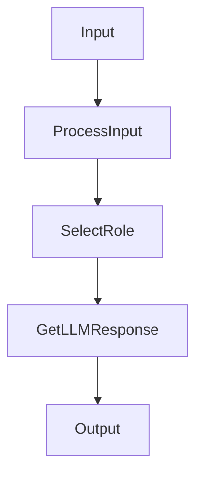
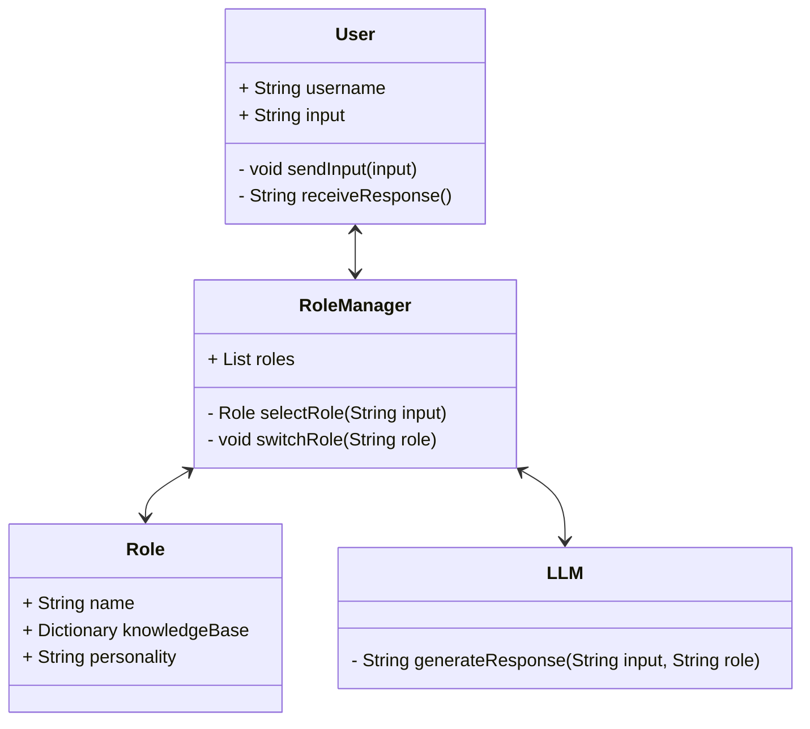
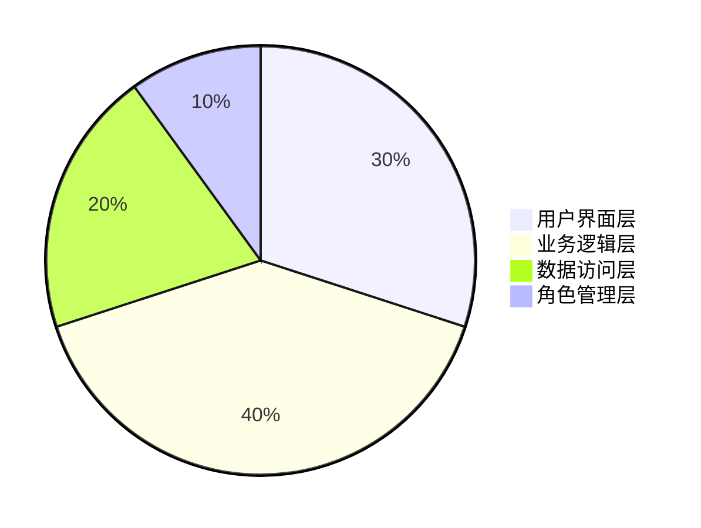
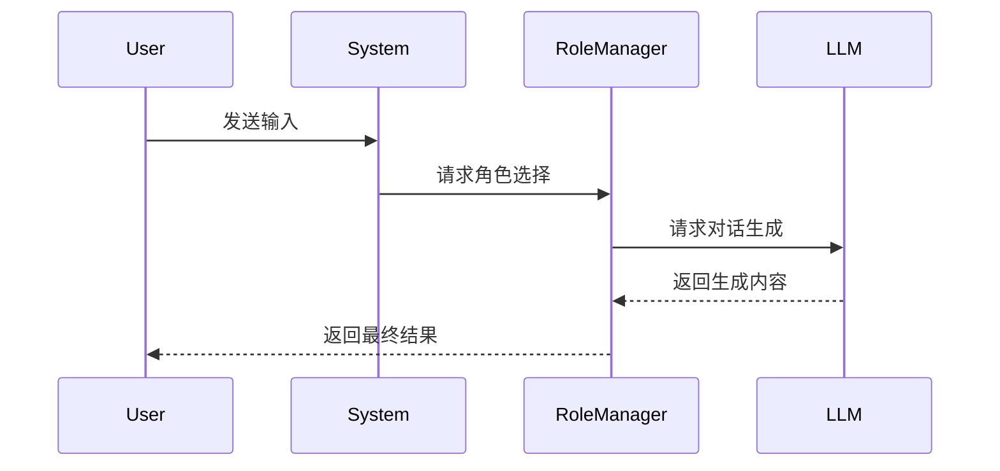

                 


# 多角色AI Agent：基于LLM的虚拟角色扮演系统

> 关键词：多角色AI Agent，LLM，虚拟角色扮演，自然语言处理，系统架构设计

> 摘要：本文详细探讨了基于大语言模型（LLM）的多角色AI Agent系统的设计与实现。通过分析多角色AI Agent的核心概念、算法原理、系统架构以及项目实战，展示了如何构建一个能够支持多种虚拟角色互动的智能化系统。文章内容涵盖背景介绍、核心概念解析、算法实现、系统设计、项目实战和最佳实践等部分，旨在为读者提供全面的技术指导。

---

## 第一部分: 多角色AI Agent概述

### 第1章: 多角色AI Agent的背景与问题背景

#### 1.1 问题背景
在现代人机交互系统中，单一角色的AI交互系统已经难以满足用户多样化的需求。用户希望与系统中的不同角色进行互动，以获得更丰富、更个性化的体验。传统的单角色AI系统在处理复杂场景时显得力不从心，例如在教育领域，学生可能需要与导师、同学、助教等多种角色进行互动；在客服领域，用户可能需要与技术支持、销售顾问、投诉处理员等不同角色进行交流。因此，支持多角色的AI Agent系统成为了一个亟待解决的技术难题。

#### 1.2 问题描述
多角色AI Agent系统的目标是通过构建一个能够支持多种虚拟角色的智能化系统，使得用户可以与不同的虚拟角色进行自然的对话交互。系统需要具备以下能力：
1. **角色切换**：根据用户需求动态切换不同的虚拟角色。
2. **对话管理**：在不同角色之间无缝切换，确保对话的连贯性和一致性。
3. **角色记忆**：每个角色需要具备独立的记忆能力，确保在切换角色后，能够保持角色的个性特征和对话历史。

#### 1.3 问题解决
通过引入大语言模型（LLM）技术，结合多角色管理机制，我们可以构建一个支持多种虚拟角色的AI Agent系统。系统将根据用户的输入动态选择合适的角色，并利用LLM的强大生成能力，提供高质量的对话体验。

#### 1.4 边界与外延
- **边界**：系统仅关注基于文本的对话交互，不涉及视觉或多模态信息。
- **外延**：系统支持的虚拟角色数量理论上可以无限扩展，但实际性能会受到计算资源的限制。

---

### 第2章: 多角色AI Agent的核心概念与联系

#### 2.1 核心概念原理
多角色AI Agent系统的核心原理是通过角色管理模块对多个虚拟角色进行统一管理，并利用LLM生成高质量的对话内容。每个角色都有独立的个性特征和知识库，系统可以根据用户的输入动态选择合适的角色，并切换到相应的角色知识库中进行对话生成。

#### 2.2 角色属性特征对比
以下表格展示了不同角色的属性特征对比：

| 角色类型   | 个性特征         | 知识库范围         | 对话风格       |
|------------|------------------|------------------|----------------|
| 导师角色    | 严肃、专业       | 教育领域知识       | 正式、严谨     |
| 同学角色    | 青涩、活泼       | 学生相关知识       | 亲切、自然     |
| 助教角色    | 耐心、细致       | 教学辅助知识       | �易懂、简洁     |
| 技术支持角色| 冷静、专业       | 技术支持文档       | 明确、直接     |

#### 2.3 ER实体关系图
以下是多角色AI Agent系统的ER实体关系图：

```mermaid
graph TD
    User -> Role: 选择角色
    Role -> LLM: 请求对话
    Role -> RoleManager: 切换角色
    User -> System: 输入指令
    System -> RoleManager: 管理角色
```

---

## 第三部分: 算法原理

### 第3章: 算法原理

#### 3.1 算法流



#### 3.2 算法实现

以下是一个简单的Python代码示例，展示了如何利用LLM生成对话内容：

```python
from transformers import pipeline

# 加载预训练模型
model = pipeline('text-generation', model='gpt2')

# 定义角色选择函数
def select_role(user_input):
    # 根据用户输入选择合适的角色
    if '同学' in user_input:
        return '同学角色'
    elif '导师' in user_input:
        return '导师角色'
    else:
        return '默认角色'

# 对话生成函数
def generate_response(user_input):
    role = select_role(user_input)
    print(f"选择的角色：{role}")
    response = model(role + ": " + user_input + "。请生成回复。")[0]['generated_text']
    return response

# 示例对话
user_input = "你好，同学，今天作业有什么问题吗？"
print(generate_response(user_input))
```

#### 3.3 数学模型

以下是LLM的简单数学模型示意图：

$$ P(\text{output} | \text{input}) = \prod_{i=1}^{n} P(w_i | w_{i-1}, ..., w_{i-k}) $$

其中，$w_i$ 表示输出序列中的第$i$个词，$k$表示上下文的长度。

---

## 第四部分: 系统分析与架构设计

### 第4章: 系统分析与架构设计

#### 4.1 项目介绍
本项目旨在构建一个支持多角色的AI Agent系统，用户可以通过与不同角色的虚拟助手互动，获得个性化的服务体验。

#### 4.2 系统功能设计

以下是系统功能设计的类图：



#### 4.3 系统架构设计

以下是系统的分层架构图：



#### 4.4 接口设计
系统采用RESTful API接口设计：

- **POST /api/role/select**: 选择角色
- **POST /api/llm/generate**: 生成对话内容
- **GET /api/role/list**: 获取可用角色列表

#### 4.5 交互流程

以下是用户与系统之间的交互流程图：



---

## 第五部分: 项目实战

### 第5章: 项目实战

#### 5.1 环境安装
安装所需的Python库：

```bash
pip install transformers
```

#### 5.2 核心代码实现

以下是核心代码实现：

```python
from transformers import pipeline

# 加载预训练模型
model = pipeline('text-generation', model='gpt2')

# 角色管理模块
class RoleManager:
    def __init__(self):
        self.roles = {
            '导师角色': {'knowledge_base': '教育领域知识', 'personality': '严肃、专业'},
            '同学角色': {'knowledge_base': '学生相关知识', 'personality': '亲切、自然'}
        }

    def select_role(self, input_str):
        if '同学' in input_str:
            return '同学角色'
        elif '导师' in input_str:
            return '导师角色'
        else:
            return '默认角色'

# 对话生成模块
class DialogueGenerator:
    def __init__(self, model):
        self.model = model

    def generate_response(self, input_str, role):
        prompt = f"{role}: {input_str}。请生成回复。"
        response = self.model(prompt)[0]['generated_text']
        return response

# 示例使用
def main():
    role_manager = RoleManager()
    generator = DialogueGenerator(model)
    
    while True:
        user_input = input("请输入您的需求：")
        selected_role = role_manager.select_role(user_input)
        response = generator.generate_response(user_input, selected_role)
        print(f"{selected_role} 的回复：{response}")

if __name__ == "__main__":
    main()
```

#### 5.3 案例分析与实现解读
以下是一个实际案例分析：

**输入**：用户输入“你好，同学，今天作业有什么问题吗？”

**过程**：
1. 用户选择“同学角色”。
2. 系统生成回复：“你好！我今天在做作业时遇到了一些问题，特别是关于数学部分的题目。你能帮我解答一下吗？”

**输出**：生成回复：“当然可以！请告诉我具体是哪道题，我会尽力帮你解答。”

---

## 第六部分: 最佳实践

### 第6章: 最佳实践

#### 6.1 小结
本文详细介绍了基于LLM的多角色AI Agent系统的构建过程，从背景分析到系统设计，再到项目实战，为读者提供了一个全面的技术指南。

#### 6.2 注意事项
- **性能优化**：在实际应用中，建议使用更高效的模型和优化算法，以提高系统的响应速度。
- **安全性**：确保系统具备适当的安全机制，防止恶意输入和攻击。

#### 6.3 拓展阅读
建议读者进一步阅读以下内容：
1. 大语言模型的优化与调优。
2. 多角色对话系统的高级实现。

---

# 结语

通过本文的详细介绍，读者可以掌握多角色AI Agent系统的核心技术，并将其应用到实际项目中。希望本文能够为相关领域的技术爱好者和开发者提供有价值的参考和启发。

