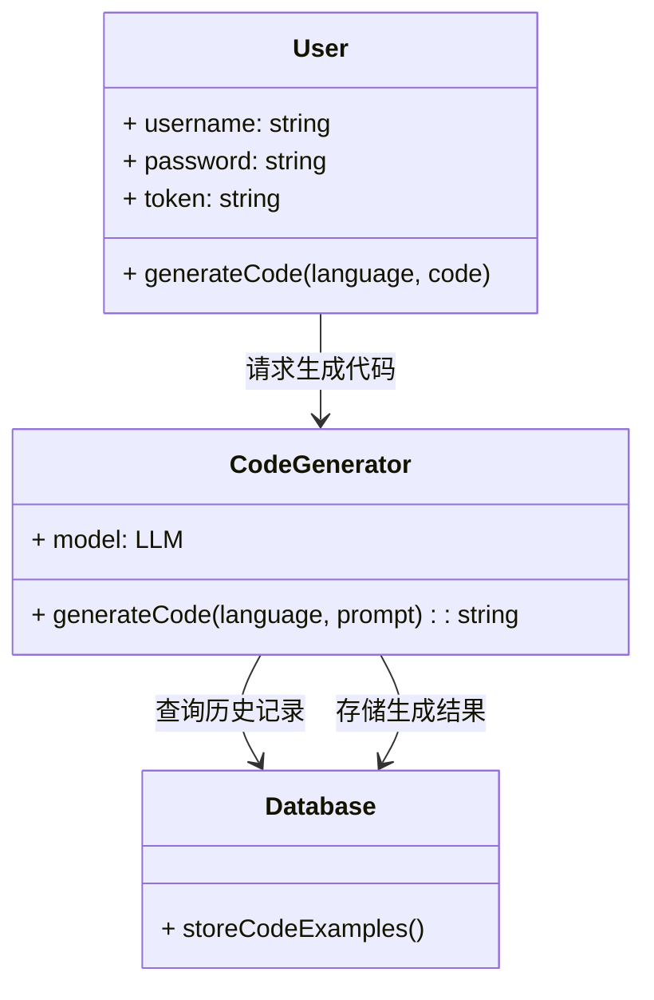
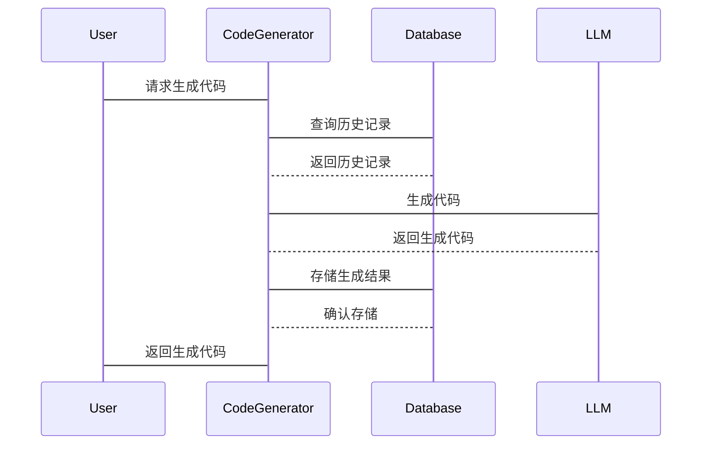

                 


# 多语言代码生成AI Agent：LLM在软件开发中的应用

## 关键词：多语言代码生成、LLM、AI Agent、自然语言处理、软件开发

## 摘要：  
本文探讨了多语言代码生成AI Agent在软件开发中的应用，详细介绍了大语言模型（LLM）如何通过自然语言处理技术生成多种语言的代码片段。文章从基础概念、算法原理、系统架构到项目实战，全面分析了多语言代码生成的实现过程，并展望了其在软件开发中的未来发展方向。通过本文，读者将深入了解如何利用LLM提升代码生成的效率和质量，从而在实际项目中实现更高效的开发流程。

---

# 第1章：引言

## 1.1 多语言代码生成的背景与重要性

### 1.1.1 软件开发中的多语言需求  
在现代软件开发中，跨平台和跨国团队协作日益普遍。开发人员需要编写适用于多种编程语言（如Python、Java、JavaScript等）的代码，以满足不同平台和项目需求。然而，手动编写多语言代码不仅耗时，还容易出错。

### 1.1.2 大语言模型的崛起  
近年来，大语言模型（LLM）如GPT-3、GPT-4等在自然语言处理领域取得了显著进展。这些模型不仅能够理解人类语言，还能生成高质量的文本内容。将LLM应用于代码生成，特别是在多语言代码生成方面，展现出巨大的潜力。

### 1.1.3 多语言代码生成的潜力与挑战  
多语言代码生成能够显著提高开发效率，降低维护成本。然而，不同编程语言的语法和语义差异较大，如何训练一个能够准确生成多种语言代码的模型，是当前面临的主要挑战。

---

# 第2章：多语言代码生成概述

## 2.1 多语言代码生成的定义与特点

### 2.1.1 多语言代码生成的定义  
多语言代码生成是指通过AI技术，自动生成适用于多种编程语言的代码片段或完整程序。与单语言代码生成相比，多语言生成更加复杂，需要考虑不同语言的语法和语义差异。

### 2.1.2 多语言代码生成的优势  
- **提高效率**：通过自动化生成代码，减少开发人员的重复劳动。
- **降低错误率**：AI生成的代码通常比手动编写更准确。
- **支持跨平台开发**：生成适用于多种平台的代码，简化了跨平台开发流程。

### 2.1.3 多语言代码生成的分类  
- **基于模型的生成**：利用预训练的大语言模型生成代码。
- **基于规则的生成**：通过编程规则和模板生成代码。
- **混合型生成**：结合模型和规则，生成高质量代码。

## 2.2 大语言模型（LLM）简介

### 2.2.1 LLM的基本概念  
大语言模型是一种基于深度学习的自然语言处理模型，通过大量文本数据的预训练，能够理解和生成人类语言。其核心是Transformer架构，包含编码器和解码器两个部分。

### 2.2.2 LLM的核心技术  
- **自注意力机制**：通过计算输入序列中每个词与其他词的相关性，生成位置无关的上下文表示。
- **前馈神经网络**：对输入进行非线性变换，生成最终的输出。

### 2.2.3 LLM与传统NLP模型的区别  
与传统NLP模型相比，LLM具有以下优势：  
1. **更大的参数规模**：通常包含 billions 级别的参数，能够捕捉更复杂的语言模式。  
2. **更强的上下文理解能力**：能够处理长文本，并准确捕捉上下文信息。  
3. **多任务学习能力**：可以在多种NLP任务（如翻译、问答、文本生成）上表现出色。

---

# 第3章：LLM的算法原理

## 3.1 语言模型的训练与优化

### 3.1.1 语言模型的训练目标  
语言模型的目标是通过给定的上下文，预测下一个词的概率分布。常用的损失函数是交叉熵损失函数，公式如下：

$$
\text{Loss} = -\sum_{i=1}^{n} \log P(w_i | w_{<i})
$$

其中，$w_i$ 表示第 $i$ 个词，$P(w_i | w_{<i})$ 表示在已知前 $i-1$ 个词的情况下，生成第 $i$ 个词的概率。

### 3.1.2 模型的优化方法  
通常使用梯度下降或Adam优化器来优化模型参数。优化过程如下：

1. 计算损失函数。
2. 计算梯度。
3. 更新模型参数。

### 3.1.3 模型的评估指标  
常用的评估指标包括困惑度（Perplexity）和BLEU分数。困惑度衡量模型对测试数据的预测能力，BLEU分数衡量生成文本的质量。

## 3.2 变压器模型（Transformer）结构

### 3.2.1 编码器与解码器的结构  
Transformer模型由编码器和解码器组成。编码器将输入序列转换为上下文向量，解码器根据编码器输出生成目标序列。

### 3.2.2 自注意力机制的公式  
自注意力机制的计算公式如下：

$$
\text{Attention}(Q, K, V) = \text{softmax}\left(\frac{QK^T}{\sqrt{d_k}}\right)V
$$

其中，$Q$、$K$、$V$ 分别是查询、键、值向量，$d_k$ 是键的维度。

### 3.2.3 解码器中的位置编码  
为了处理序列的位置信息，解码器引入位置编码。常用的位置编码公式如下：

$$
\text{pos}(i, j) = \sin\left(\frac{i}{10000^{j/\text{dim}}}\right)
$$

其中，$i$ 是位置索引，$j$ 是维度索引，$\text{dim}$ 是位置编码的维度。

---

# 第4章：多语言代码生成的实现

## 4.1 多语言模型的训练策略

### 4.1.1 多语言数据集的构建  
需要收集多种编程语言的代码数据，通常包括语法结构和注释信息。

### 4.1.2 模型的微调  
在预训练好的LLM基础上，使用多语言代码数据进行微调，以适应代码生成任务。

### 4.1.3 跨语言迁移学习  
通过在一种语言上预训练模型，然后将其迁移到其他语言，减少训练数据的需求。

## 4.2 代码生成的质量评估

### 4.2.1 语法正确性  
通过语法检查工具验证生成代码的语法是否正确。

### 4.2.2 语义准确性  
通过代码运行结果验证生成代码是否符合预期功能。

### 4.2.3 可读性评估  
评估生成代码的可读性和代码结构的合理性。

---

# 第5章：系统架构设计

## 5.1 系统需求分析

### 5.1.1 功能需求  
- 支持多种编程语言的代码生成。
- 提供交互式代码编辑界面。
- 支持代码片段的复用和扩展。

### 5.1.2 性能需求  
- 快速响应用户请求。
- 高效处理大规模数据。

## 5.2 系统功能设计

### 5.2.1 领域模型设计  
通过Mermaid图展示系统功能模块及其交互关系。



### 5.2.2 系统架构设计  
通过Mermaid图展示系统架构的分层结构。


### 5.2.3 系统接口设计  
通过Mermaid图展示系统接口的交互流程。



---

# 第6章：项目实战

## 6.1 环境搭建

### 6.1.1 安装依赖  
- Python 3.8+
- Hugging Face Transformers库
- Jupyter Notebook

## 6.2 核心代码实现

### 6.2.1 加载预训练模型  
```python
from transformers import AutoTokenizer, AutoModelForCausalLM
model_name = "gpt2"
tokenizer = AutoTokenizer.from_pretrained(model_name)
model = AutoModelForCausalLM.from_pretrained(model_name)
```

### 6.2.2 定义生成函数  
```python
def generate_code(prompt, max_length=100):
    inputs = tokenizer.encode(prompt, return_tensors="pt")
    outputs = model.generate(inputs, max_length=max_length, do_sample=True)
    return tokenizer.decode(outputs[0], skip_special_tokens=True)
```

### 6.2.3 多语言支持的实现  
```python
def generate_multilingual_code(prompt, language, max_length=100):
    # 加载多语言模型
    multilingual_tokenizer = AutoTokenizer.from_pretrained("microsoft/unilm")
    multilingual_model = AutoModelForCausalLM.from_pretrained("microsoft/unilm")
    inputs = multilingual_tokenizer.encode(prompt, return_tensors="pt")
    outputs = multilingual_model.generate(inputs, max_length=max_length, do_sample=True, language=language)
    return multilingual_tokenizer.decode(outputs[0], skip_special_tokens=True)
```

## 6.3 代码解读与分析

### 6.3.1 代码生成过程  
1. 用户输入生成代码的提示和目标语言。
2. 系统调用多语言模型生成代码。
3. 返回生成的代码。

### 6.3.2 案例分析  
例如，生成一个Python函数：

```python
def add_numbers(a, b):
    return a + b
```

生成JavaScript函数：

```javascript
function addNumbers(a, b) {
    return a + b;
}
```

---

# 第7章：总结与展望

## 7.1 现状与挑战

### 7.1.1 当前技术的瓶颈  
- 多语言模型的准确性和生成质量仍需提高。
- 计算资源需求较高，限制了中小企业的应用。

### 7.1.2 未来发展方向  
- 提高模型的生成质量，优化代码的可读性和可维护性。
- 探索多语言代码生成与其他AI技术（如计算机视觉）的结合。

## 7.2 最佳实践 Tips

### 7.2.1 选择合适的模型  
根据具体需求选择适合的模型，如GPT-3、GPT-4或专门的代码生成模型。

### 7.2.2 数据质量的重要性  
确保训练数据的多样性和高质量，减少生成代码的错误率。

### 7.2.3 优化生成结果  
通过后处理技术（如语法检查、代码优化工具）进一步提升生成代码的质量。

## 7.3 小结  
多语言代码生成AI Agent的应用前景广阔，通过不断的技术进步和实践积累，将为软件开发带来更大的效率提升和创新可能。

---

# 结语

通过本文的详细分析，读者可以深入了解多语言代码生成的技术细节和实现方法。未来，随着AI技术的不断发展，多语言代码生成将变得更加智能和高效，为软件开发注入新的活力。

