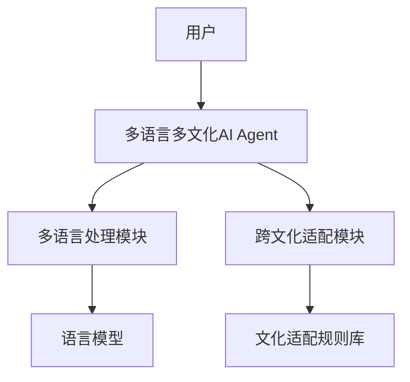
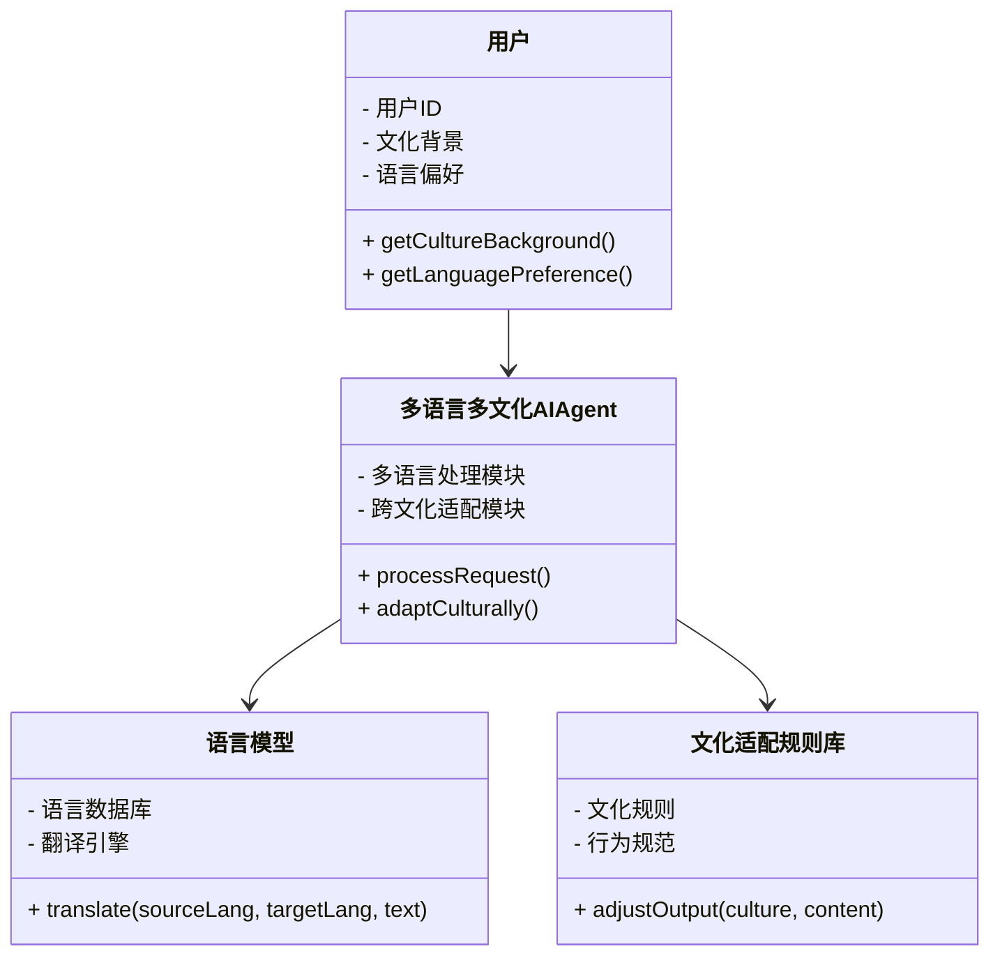

                 


# 多语言多文化AI Agent：LLM在跨文化交流中的应用

## 关键词：
- 多语言AI Agent
- 跨文化交際
- 大型语言模型（LLM）
- AI跨文化适配
- 跨语言交流

## 摘要：
本文探讨了多语言多文化AI Agent在跨文化交流中的应用，结合大型语言模型（LLM）的技术优势，分析了其在多语言处理和文化适配中的核心作用。文章从背景介绍、核心概念、算法原理、系统架构、项目实战到最佳实践，全面解析了LLM在跨文化交流中的应用前景和挑战，为AI Agent在多语言多文化环境中的实际应用提供了理论支持和实践指导。

---

# 第1章: 多语言多文化AI Agent的背景介绍

## 1.1 多语言多文化AI Agent的定义与特点

### 1.1.1 多语言与多文化的基本概念
- **多语言**：指AI Agent能够理解和处理多种语言，具备跨语言信息处理的能力。
- **多文化**：指AI Agent能够理解并适应不同文化背景下的语境和行为习惯。

### 1.1.2 多语言多文化AI Agent的核心特点
- **跨语言能力**：支持多种语言的输入输出，能够进行语言间的转换和理解。
- **文化适配性**：能够根据不同的文化背景调整输出内容，避免文化冲突。
- **智能交互**：具备自然语言处理能力，能够与用户进行流畅的对话。

### 1.1.3 跨文化交際中的AI Agent角色
- AI Agent作为中介，连接不同语言和文化背景的用户。
- 在跨国商务、旅游、教育等领域发挥重要作用。

## 1.2 跨文化交流的挑战与AI Agent的作用

### 1.2.1 跨文化交流的核心问题
- 语言障碍：不同语言的语法、词汇差异可能导致误解。
- 文化差异：文化背景影响沟通方式和表达习惯。

### 1.2.2 AI Agent在跨文化交際中的优势
- 提供24/7的实时支持，打破时间和空间限制。
- 高效处理多语言信息，提升交流效率。

### 1.2.3 跨文化交際中的语言与文化障碍
- 语言障碍可能导致信息传递不准确。
- 文化差异可能导致沟通策略的不同。

## 1.3 LLM在跨文化交流中的应用前景

### 1.3.1 LLM的基本原理
- 基于深度学习的神经网络模型，能够理解和生成自然语言文本。
- 通过大量多语言数据训练，具备跨语言处理能力。

### 1.3.2 LLM在多语言处理中的优势
- 支持多种语言的文本生成和理解。
- 能够捕捉不同语言间的语义联系。

### 1.3.3 跨文化交際中的LLM应用场景
- 跨语言翻译：提供高质量的多语言翻译服务。
- 跨文化适配：根据用户文化背景调整输出内容。

---

# 第2章: 多语言与跨文化的核心概念与联系

## 2.1 多语言与跨文化的定义与特征对比

### 2.1.1 多语言的核心概念
- **多语言能力**：AI Agent能够处理多种语言。
- **语言间的关联性**：不同语言间存在语义和语法的差异。

### 2.1.2 跨文化的核心概念
- **文化背景**：指用户的教育、习俗、价值观等。
- **文化差异**：不同文化背景下，相同的语言表达可能含义不同。

### 2.1.3 多语言与跨文化的对比分析
| 特性         | 多语言               | 跨文化               |
|--------------|----------------------|----------------------|
| 核心内容     | 处理多种语言          | 适应不同文化背景     |
| 关注点       | 语言结构和语法        | 社会习俗和价值观      |
| 应用场景     | 跨语言翻译、信息处理  | 跨文化沟通、文化适配 |

## 2.2 多语言多文化AI Agent的概念模型

### 2.2.1 实体关系图（ER图）


### 2.2.2 领域模型（类图）


---

# 第3章: 多语言多文化AI Agent的算法原理

## 3.1 大型语言模型（LLM）的基本原理

### 3.1.1 编码器-解码器结构
- 编码器将输入文本转换为向量表示。
- 解码器根据向量生成目标语言的文本。

### 3.1.2 注意力机制
- 通过自注意力机制捕捉文本中的语义关系。
- 在多语言处理中，注意力机制帮助模型理解不同语言间的关联。

### 3.1.3 损失函数
- 使用交叉熵损失函数优化模型。
- 在多语言训练中，模型同时优化多种语言的损失。

## 3.2 多语言LLM的训练与优化

### 3.2.1 多语言数据预处理
- 收集和整理多种语言的平行文本数据。
- 数据清洗和标注，确保数据质量。

### 3.2.2 模型微调
- 在通用预训练模型基础上，进行多语言微调。
- 通过任务特定的训练数据优化模型性能。

### 3.2.3 跨文化适配策略
- 在模型中引入文化适配规则。
- 根据用户的文化背景动态调整输出内容。

## 3.3 多语言多文化AI Agent的实现流程

### 3.3.1 输入处理
- 接收用户的输入，识别语言和文化背景。
- 根据语言偏好选择合适的处理模块。

### 3.3.2 跨语言处理
- 使用语言模型进行翻译或语义转换。
- 确保语义的准确传递。

### 3.3.3 跨文化适配
- 调用文化适配规则库，调整输出内容。
- 确保输出符合用户的文化习惯。

---

# 第4章: 多语言多文化AI Agent的系统分析与架构设计

## 4.1 系统功能设计

### 4.1.1 多语言支持
- 提供多种语言的输入和输出功能。
- 支持实时翻译和多语言对话。

### 4.1.2 跨文化适配
- 根据用户文化背景调整输出内容。
- 提供文化相关的建议和指导。

## 4.2 系统架构设计

### 4.2.1 模块划分
- 用户交互模块：接收输入并返回输出。
- 多语言处理模块：负责语言理解和生成。
- 跨文化适配模块：调整输出内容以适应文化背景。

### 4.2.2 接口设计
- 用户与AI Agent的交互接口。
- 多语言处理模块与语言模型的接口。
- 跨文化适配模块与文化规则库的接口。

## 4.3 系统交互流程

### 4.3.1 用户发起请求
- 用户输入问题或指令。
- 系统识别语言和文化背景。

### 4.3.2 系统处理请求
- 多语言处理模块进行翻译或语义转换。
- 跨文化适配模块调整输出内容。

### 4.3.3 返回结果
- 系统将处理后的结果返回给用户。

---

# 第5章: 多语言多文化AI Agent的项目实战

## 5.1 项目环境安装

### 5.1.1 安装Python环境
```bash
python --version
pip install --upgrade pip
```

### 5.1.2 安装必要的库
```bash
pip install transformers
pip install torch
```

## 5.2 核心代码实现

### 5.2.1 多语言处理模块
```python
from transformers import AutoTokenizer, AutoModelForSeq2Seq
import torch

class MultiLanguageProcessor:
    def __init__(self, model_name):
        self.tokenizer = AutoTokenizer.from_pretrained(model_name)
        self.model = AutoModelForSeq2Seq.from_pretrained(model_name)
        
    def translate(self, source_lang, target_lang, text):
        inputs = self.tokenizer.encode(text, src_lang=source_lang, tgt_lang=target_lang, return_tensors="pt")
        outputs = self.model.generate(inputs.input_ids, max_length=50)
        return self.tokenizer.decode(outputs[0], skip_special_tokens=True)
```

### 5.2.2 跨文化适配模块
```python
class CulturalAdapter:
    def __init__(self, culture_rules):
        self.culture_rules = culture_rules
        
    def adapt(self, content, culture):
        # 根据文化规则调整内容
        return self.culture_rules.get(culture, lambda x: x)(content)
```

## 5.3 功能测试与案例分析

### 5.3.1 测试多语言翻译
```python
processor = MultiLanguageProcessor("facebook/m2m-100")
translated = processor.translate("zh", "en", "你好，很高兴见到你。")
print(translated)  # Output: "Hello, nice to meet you."
```

### 5.3.2 测试文化适配
```python
adapter = CulturalAdapter({
    "en": lambda x: x + ". Please feel free to contact us anytime.",
    "zh": lambda x: x + ". 请随时联系我们。"
})
adapted_content = adapter.adapt("欢迎光临", "zh")
print(adapted_content)  # Output: "欢迎光临. 请随时联系我们。"
```

## 5.4 项目小结

通过以上代码实现，我们成功构建了一个支持多语言和文化适配的AI Agent。该系统能够根据用户的文化背景和语言偏好，提供个性化的服务，提升跨文化交流的效率和准确性。

---

# 第6章: 最佳实践与小结

## 6.1 最佳实践

### 6.1.1 模型选择
- 根据具体需求选择合适的LLM模型。
- 考虑模型的多语言支持能力和推理速度。

### 6.1.2 数据处理
- 确保数据的多样性和代表性。
- 处理文化敏感性问题，避免偏见。

## 6.2 小结

本文详细探讨了多语言多文化AI Agent在跨文化交流中的应用，结合LLM的技术优势，分析了其在多语言处理和文化适配中的核心作用。通过系统的架构设计和项目实战，展示了如何实现一个高效、准确的多语言多文化AI Agent。

## 6.3 注意事项

- 模型的泛化能力有限，需结合具体场景进行优化。
- 文化适配需要不断更新和维护文化规则库。
- 数据隐私和安全问题需严格把控。

## 6.4 拓展阅读

- 《多语言模型的训练与优化》
- 《跨文化交际中的语言与非语言因素》

---

通过本文的分析与实践，我们不仅了解了多语言多文化AI Agent的核心技术，还掌握了其实现方法和应用场景。希望这些内容能为读者在实际项目中提供有价值的参考。

