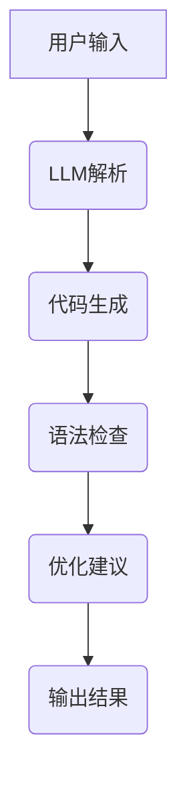
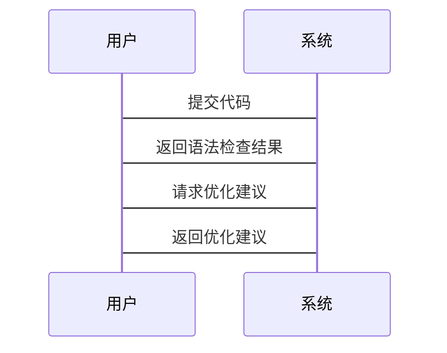

                 


# 多语言编程AI Agent：LLM在软件开发全周期的应用

## 关键词：
- 多语言编程
- AI Agent
- LLM
- 软件开发
- 全周期应用

## 摘要：
本文深入探讨了多语言编程AI Agent在软件开发全周期中的应用，从背景概念、核心原理到实际项目实现，系统地分析了LLM技术如何提升编程效率和代码质量。文章详细介绍了多语言编程的挑战、LLM的工作原理、在各开发阶段的具体应用，并通过项目实战展示了AI Agent的实现过程和最佳实践。

---

# 第1章: 多语言编程AI Agent的背景与概念

## 1.1 多语言编程的挑战与机遇

### 1.1.1 多语言编程的复杂性
在现代软件开发中，多语言编程越来越普遍。开发团队可能需要使用多种编程语言来满足不同的需求，例如前端使用JavaScript，后端使用Python，数据库使用SQL等。然而，多语言编程也带来了复杂性：
- **语法差异**：每种语言都有不同的语法规范，容易出错。
- **环境管理**：不同语言需要不同的运行环境和依赖库。
- **代码协调**：多语言代码的集成和调试较为复杂。

### 1.1.2 AI在多语言编程中的潜力
AI技术，特别是大语言模型（LLM），为多语言编程带来了新的可能性：
- **自动化代码生成**：AI可以自动生成符合需求的代码片段。
- **跨语言转换**：AI可以帮助将一种语言的代码转换为另一种语言。
- **智能辅助工具**：AI可以实时提供语法建议和最佳实践。

### 1.1.3 软件开发全周期中的多语言需求
在软件开发的全生命周期中，多语言需求贯穿始终：
- **需求分析**：明确是否需要多语言支持。
- **设计阶段**：选择适合的编程语言。
- **开发阶段**：编写和管理多语言代码。
- **测试阶段**：验证多语言环境下的代码兼容性。
- **部署阶段**：确保多语言环境的正确配置。

---

## 1.2 LLM的定义与特点

### 1.2.1 大语言模型的基本概念
大语言模型（LLM）是一种基于深度学习的自然语言处理模型，能够理解和生成多种语言的文本。LLM的核心是其强大的语言建模能力，能够捕捉语言的语义和上下文信息。

### 1.2.2 LLM的核心能力
LLM具有以下核心能力：
- **自然语言理解**：能够理解用户输入的自然语言指令。
- **文本生成**：能够生成符合上下文的自然语言文本。
- **多语言支持**：能够理解和生成多种语言的文本。

### 1.2.3 LLM与传统编程工具的区别
与传统编程工具相比，LLM的优势在于其智能化和灵活性：
- **智能化**：LLM可以理解上下文，提供个性化的代码建议。
- **灵活性**：LLM可以适应多种编程语言和开发场景。
- **学习能力**：LLM可以通过大量数据不断优化性能。

---

## 1.3 多语言编程AI Agent的定义

### 1.3.1 多语言编程AI Agent的定义
多语言编程AI Agent是一种基于LLM的智能辅助工具，旨在帮助开发者在多语言编程环境中提高效率和代码质量。

### 1.3.2 其核心功能与特点
多语言编程AI Agent的核心功能包括：
- **代码生成**：根据需求生成多语言代码片段。
- **语法检查**：实时检查代码语法错误。
- **代码优化**：提供代码优化建议。
- **跨语言转换**：将一种语言的代码转换为另一种语言。

### 1.3.3 与传统编程辅助工具的对比
与传统编程辅助工具相比，多语言编程AI Agent的优势在于其智能化和跨语言能力：
- **智能化**：能够理解上下文，提供个性化的代码建议。
- **跨语言支持**：支持多种编程语言，能够进行跨语言转换。
- **自我学习**：通过不断学习用户习惯，优化代码生成和建议。

---

## 1.4 LLM在多语言编程中的应用前景

随着AI技术的不断进步，LLM在多语言编程中的应用前景广阔：
- **提高开发效率**：通过自动化代码生成和优化，显著提高开发效率。
- **降低错误率**：通过语法检查和代码优化，减少人为错误。
- **跨语言协作**：支持团队成员使用不同语言开发，促进协作。

---

# 第2章: LLM在软件开发全周期中的应用

## 2.1 软件开发全周期概述

### 2.1.1 需求分析阶段
在需求分析阶段，开发者需要明确项目需求，并将其转化为具体的开发任务。LLM可以辅助需求分析，通过自然语言理解技术，帮助开发者提取关键需求信息。

### 2.1.2 系统设计阶段
在系统设计阶段，开发者需要设计系统的架构和模块划分。LLM可以辅助生成系统设计文档，并提供代码生成建议。

### 2.1.3 代码实现阶段
在代码实现阶段，开发者需要编写代码。LLM可以提供语法检查、代码生成和优化建议，帮助开发者高效地完成代码实现。

### 2.1.4 测试与调试阶段
在测试与调试阶段，开发者需要编写和执行测试用例。LLM可以辅助生成测试用例，并提供调试建议。

### 2.1.5 部署与维护阶段
在部署与维护阶段，开发者需要部署代码并进行后续维护。LLM可以辅助生成部署脚本，并提供代码维护建议。

---

## 2.2 LLM在各阶段的具体应用

### 2.2.1 需求分析中的自然语言理解
在需求分析阶段，LLM可以通过自然语言理解技术，帮助开发者提取需求中的关键信息，并生成需求文档。

### 2.2.2 系统设计中的代码生成
在系统设计阶段，LLM可以根据设计文档生成相应的代码框架，帮助开发者快速开始编码。

### 2.2.3 代码实现中的语法检查与优化
在代码实现阶段，LLM可以实时检查代码语法错误，并提供优化建议，帮助开发者提高代码质量。

### 2.2.4 测试中的自动化测试用例生成
在测试阶段，LLM可以辅助生成自动化测试用例，并提供测试脚本生成建议。

### 2.2.5 部署中的多语言环境配置
在部署阶段，LLM可以辅助生成部署脚本，并提供多语言环境配置建议，确保代码顺利运行。

---

## 2.3 LLM在多语言编程中的优势

### 2.3.1 提高开发效率
通过自动化代码生成和优化，LLM可以帮助开发者快速完成开发任务，显著提高开发效率。

### 2.3.2 降低错误率
通过语法检查和代码优化，LLM可以减少人为错误，提高代码质量。

### 2.3.3 跨语言协作
支持团队成员使用不同语言开发，促进协作，提高开发效率。

---

## 2.4 LLM在软件开发中的局限性

尽管LLM在多语言编程中有诸多优势，但也存在一些局限性：
- **理解能力有限**：LLM对某些复杂场景的理解可能不够准确。
- **代码上下文理解不足**：LLM可能无法完全理解代码的上下文，导致生成的代码不符合实际需求。
- **依赖数据质量**：LLM的表现依赖于训练数据的质量，如果数据不完整或有偏差，可能会影响结果。

---

# 第3章: 多语言编程AI Agent的核心原理

## 3.1 大语言模型的基本原理

### 3.1.1 概率语言模型的数学基础
概率语言模型的核心思想是通过计算每个词的条件概率，生成最有可能的文本序列。数学公式如下：
$$ P(w_1, w_2, ..., w_n) = \prod_{i=1}^n P(w_i | w_1, ..., w_{i-1}) $$

### 3.1.2 Transformer架构的简要介绍
Transformer架构是现代大语言模型的核心结构，主要包括编码器和解码器两部分。编码器负责将输入文本转换为向量表示，解码器负责将向量表示转换为输出文本。

### 3.1.3 注意力机制的核心思想
注意力机制是Transformer架构的核心，其思想是让模型在处理每个词时，能够关注与当前词相关的其他词，从而更好地捕捉文本的语义信息。

---

## 3.2 多语言模型的训练策略

### 3.2.1 多语言数据的预处理方法
多语言模型的训练需要对多语言数据进行预处理，包括分词、标注和对齐等步骤。

### 3.2.2 跨语言迁移学习的实现
跨语言迁移学习是一种通过在一种语言上训练模型，然后将其迁移到其他语言的技术。其核心是利用跨语言特征，减少对语言特异性信息的依赖。

### 3.2.3 跨语言模型的评估指标
评估跨语言模型的性能需要使用通用的指标，如BLEU、ROUGE和METEOR等。

---

## 3.3 多语言编程AI Agent的实现机制

### 3.3.1 代码解析与生成的流程
多语言编程AI Agent的代码解析与生成流程包括以下步骤：
1. 接收用户输入的自然语言指令。
2. 通过LLM生成对应的代码片段。
3. 对生成的代码进行语法检查和优化。
4. 输出最终的代码结果。

### 3.3.2 多语言语法检查的实现
多语言语法检查的实现需要对每种语言的语法规则进行建模，并通过LLM进行实时检查。

### 3.3.3 自动化测试用例生成的算法
自动化测试用例生成的算法包括以下步骤：
1. 分析代码的功能需求。
2. 生成相应的测试用例。
3. 执行测试用例，记录结果。

---

## 3.4 多语言编程AI Agent的算法流程图



---

## 3.5 多语言编程AI Agent的系统架构

### 3.5.1 系统功能模块划分
多语言编程AI Agent的系统功能模块包括：
- **用户交互模块**：接收用户输入，输出结果。
- **代码解析模块**：解析用户输入，生成代码片段。
- **语法检查模块**：检查代码语法错误。
- **优化建议模块**：提供代码优化建议。

### 3.5.2 系统架构设计
多语言编程AI Agent的系统架构设计采用分层架构，包括用户界面层、业务逻辑层和数据访问层。

---

## 3.6 多语言编程AI Agent的系统交互图



---

# 第4章: 多语言编程AI Agent的系统架构

## 4.1 系统功能模块划分

### 4.1.1 用户交互模块
用户交互模块是系统的核心模块，负责接收用户的输入，并输出相应的结果。

### 4.1.2 代码解析模块
代码解析模块负责解析用户的输入，生成相应的代码片段。

### 4.1.3 语法检查模块
语法检查模块负责检查生成的代码语法是否正确。

### 4.1.4 优化建议模块
优化建议模块负责提供代码优化建议。

---

## 4.2 系统架构设计

### 4.2.1 分层架构设计
分层架构设计将系统划分为用户界面层、业务逻辑层和数据访问层，每层之间通过接口进行交互。

### 4.2.2 微服务架构设计
微服务架构设计将系统功能分解为多个独立的服务，每个服务负责特定的功能。

### 4.2.3 组件间交互
组件间交互通过RESTful API进行，确保系统的松耦合和高扩展性。

---

## 4.3 系统架构图


---

## 4.4 系统接口设计

### 4.4.1 用户交互接口
用户交互接口是系统与用户之间的桥梁，支持多种输入方式，包括文本输入和语音输入。

### 4.4.2 代码解析接口
代码解析接口负责接收用户的输入，并生成相应的代码片段。

### 4.4.3 语法检查接口
语法检查接口负责检查生成的代码语法是否正确。

---

## 4.5 系统交互图


---

# 第5章: 多语言编程AI Agent的项目实战

## 5.1 项目背景与目标

### 5.1.1 项目背景
本项目旨在开发一个多语言编程AI Agent，帮助开发者在多语言编程环境中提高效率和代码质量。

### 5.1.2 项目目标
项目目标包括：
- 实现代码生成功能。
- 提供语法检查和优化建议。
- 支持多种编程语言。

---

## 5.2 项目环境与工具

### 5.2.1 开发环境
开发环境包括：
- **操作系统**：Linux/MacOS/Windows
- **编程语言**：Python
- **深度学习框架**：TensorFlow/PyTorch

### 5.2.2 工具安装
需要安装以下工具：
- **Python**：用于开发和部署。
- **Jupyter Notebook**：用于实验和测试。
- **Hugging Face Transformers**：用于加载和训练大语言模型。

---

## 5.3 项目核心实现

### 5.3.1 代码解析与生成
代码解析与生成模块是项目的的核心模块，负责接收用户的输入，并生成相应的代码片段。以下是代码解析与生成的实现步骤：

#### 步骤1：加载预训练模型
```python
from transformers import AutoTokenizer, AutoModelForCausalLM
tokenizer = AutoTokenizer.from_pretrained('gpt2')
model = AutoModelForCausalLM.from_pretrained('gpt2')
```

#### 步骤2：生成代码片段
```python
input_text = "Please generate Python code to calculate the sum of two numbers."
inputs = tokenizer.encode(input_text, return_tensors='pt')
outputs = model.generate(inputs, max_length=50)
generated_code = tokenizer.decode(outputs[0], skip_special_tokens=True)
print(generated_code)
```

#### 步骤3：语法检查
```python
def is_valid_code(code):
    try:
        exec(code)
        return True
    except:
        return False
```

---

### 5.3.2 语法检查与优化建议
语法检查与优化建议模块负责检查生成的代码语法是否正确，并提供优化建议。以下是语法检查与优化建议的实现步骤：

#### 步骤1：语法检查
```python
def check_syntax(code):
    try:
        ast.parse(code)
        return True
    except:
        return False
```

#### 步骤2：提供优化建议
```python
def get_optimization_suggestions(code):
    # 这里可以集成其他工具或库，如 pylint 或 flake8
    return "建议使用更简洁的变量名，并添加注释说明代码的功能。"
```

---

### 5.3.3 自动化测试与部署
自动化测试与部署模块负责生成自动化测试用例，并部署生成的代码。以下是自动化测试与部署的实现步骤：

#### 步骤1：生成测试用例
```python
def generate_test_cases(function):
    # 这里可以使用 pytest 等工具生成测试用例
    pass
```

#### 步骤2：部署代码
```python
def deploy_code(code):
    # 这里可以集成云平台的部署接口
    pass
```

---

## 5.4 项目实战总结

通过本项目，我们可以看到多语言编程AI Agent的强大能力。它不仅可以生成代码，还可以提供语法检查和优化建议，显著提高开发效率和代码质量。

---

# 第6章: 多语言编程AI Agent的最佳实践

## 6.1 最佳实践

### 6.1.1 选择合适的LLM模型
选择合适的LLM模型是项目成功的关键。可以根据项目需求选择开源模型或商业模型。

### 6.1.2 确保数据质量
数据质量直接影响模型的性能。需要确保训练数据的多样性和代表性。

### 6.1.3 定期优化模型
模型性能需要定期优化，可以根据用户反馈和实际需求进行调整。

---

## 6.2 小结

通过本文的介绍，我们深入了解了多语言编程AI Agent的背景、核心原理和系统架构，并通过项目实战展示了其具体实现。希望本文能为读者在多语言编程AI Agent的开发和应用中提供有价值的参考。

---

## 6.3 注意事项

### 6.3.1 模型性能
模型性能是影响用户体验的关键因素。需要确保模型的响应速度和生成代码的准确性。

### 6.3.2 数据隐私
在实际应用中，需要特别注意数据隐私问题，确保用户数据的安全性和合规性。

### 6.3.3 用户反馈
用户反馈是优化模型的重要依据。需要建立有效的反馈机制，及时收集和处理用户反馈。

---

## 6.4 拓展阅读

### 6.4.1 大语言模型的前沿研究
- [Transformers: Pre-training of Self-attentional Neural Networks](https://arxiv.org/abs/1805.09404)
- [BERT: Pre-training of Deep Bidirectional Transformers for NLP](https://arxiv.org/abs/1810.0469)

### 6.4.2 多语言编程工具
- [GitHub](https://github.com)
- [LeetCode](https://leetcode.com)

---

# 结语

随着AI技术的不断进步，多语言编程AI Agent将在软件开发全周期中发挥越来越重要的作用。希望本文能为读者在多语言编程AI Agent的开发和应用中提供有价值的参考。

