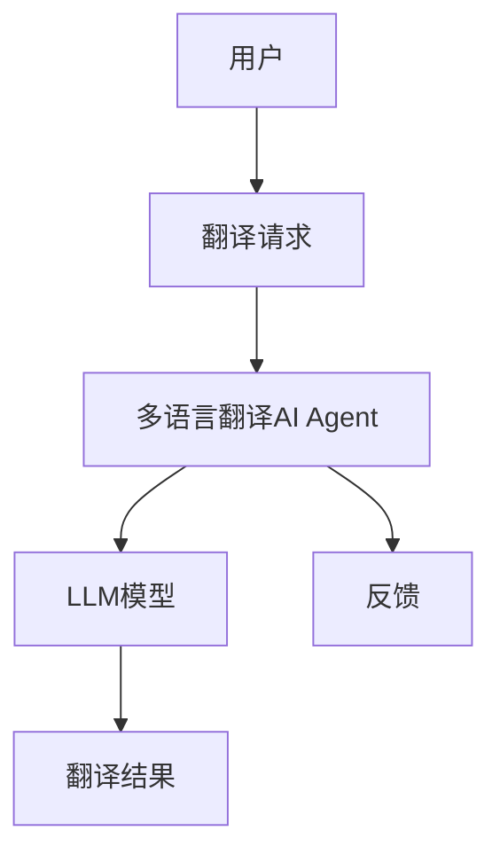
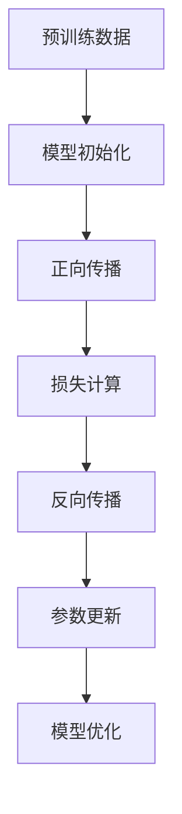
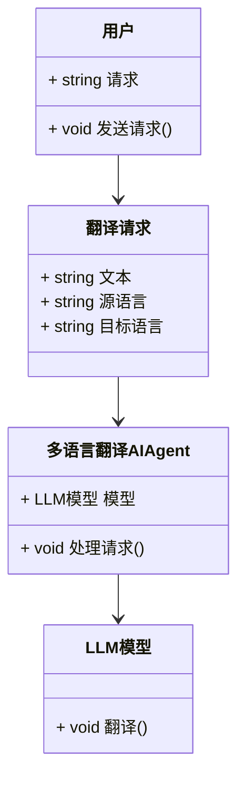
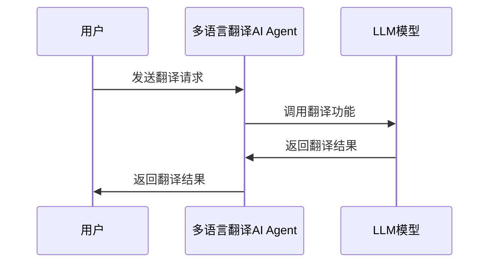

                 


# 多语言翻译 AI Agent：LLM 在跨语言交流中的应用

## 关键词：多语言翻译、AI Agent、LLM、自然语言处理、跨语言交流

## 摘要：  
本文探讨了多语言翻译AI Agent的应用，重点分析了LLM（大语言模型）在跨语言交流中的作用。文章从背景介绍、核心概念、算法原理、系统架构、项目实战到最佳实践，全面阐述了多语言翻译AI Agent的设计与实现，结合实际案例和代码示例，为读者提供了深刻的技术见解。

---

# 第一部分：背景介绍

## 第1章：多语言翻译与AI Agent的背景

### 1.1 多语言交流的重要性  
在当今全球化时代，跨语言交流的需求日益增长。企业、教育机构和科技公司都需要处理多种语言的文本和对话，以满足全球用户的需求。多语言翻译不仅是技术问题，更是商业、文化和教育领域的重要工具。

### 1.2 AI Agent的概念与应用  
AI Agent是一种智能代理系统，能够理解和执行用户的指令。在多语言翻译中，AI Agent充当用户与翻译系统之间的桥梁，提供实时翻译、对话支持和语言转换服务。AI Agent的优势在于其自动化和智能化，能够处理复杂的语言请求。

### 1.3 大语言模型（LLM）的基本原理  
LLM是一种基于深度学习的自然语言处理模型，能够理解和生成多种语言的文本。LLM的核心在于其庞大的训练数据和复杂的神经网络结构，使其能够捕捉语言的语义和上下文信息，从而实现高质量的翻译和对话生成。

---

# 第二部分：核心概念与联系

## 第2章：多语言翻译AI Agent的核心概念  

### 2.1 多语言翻译AI Agent的定义与特点  
多语言翻译AI Agent是一种结合了AI技术和LLM的智能系统，能够实时翻译多种语言，并提供交互式的对话支持。其特点包括支持多种语言、上下文理解能力强、响应速度快等。

### 2.2 核心概念的原理分析  
多语言翻译AI Agent的工作流程包括接收用户请求、调用LLM进行翻译、返回结果。其核心在于LLM的翻译能力和AI Agent的交互机制。

### 2.3 核心概念的ER实体关系图  


---

# 第三部分：算法原理讲解

## 第3章：LLM的训练与翻译流程  

### 3.1 LLM的预训练过程  
LLM的预训练目标是学习语言的语义和结构。训练过程包括数据清洗、模型初始化、正向传播和反向传播，通过不断优化参数，使模型能够准确理解输入文本。



### 3.2 LLM的翻译流程  
翻译流程包括接收输入、调用LLM进行翻译、返回结果。代码示例如下：

```python
def translate(text, source_lang, target_lang):
    # 初始化LLM模型
    model = LLMModel()
    # 调用翻译接口
    translated_text = model.translate(text, source_lang, target_lang)
    return translated_text
```

---

# 第四部分：系统分析与架构设计方案

## 第4章：系统功能与架构设计  

### 4.1 系统功能设计  
系统包括自然语言处理模块、翻译引擎、对话管理模块。类图如下：



### 4.2 系统接口设计  
系统接口包括用户输入、翻译请求处理、翻译结果返回。序列图如下：



---

# 第五部分：项目实战

## 第5章：多语言翻译AI Agent的开发与实现  

### 5.1 环境安装  
安装Python和相关库：

```bash
pip install python-llm
pip install transformers
```

### 5.2 核心代码实现  
实现翻译功能：

```python
from transformers import AutoTokenizer, AutoModelForSeq2Seq
import requests

class LLMTranslator:
    def __init__(self, model_name):
        self.tokenizer = AutoTokenizer.from_pretrained(model_name)
        self.model = AutoModelForSeq2Seq.from_pretrained(model_name)

    def translate(self, text, source_lang, target_lang):
        inputs = self.tokenizer(text, return_tensors="np")
        outputs = self.model.generate(inputs.input_ids, max_length=100)
        translated_text = self.tokenizer.decode(outputs[0], skip_special_tokens=True)
        return translated_text
```

### 5.3 实际案例分析  
案例：将中文“你好”翻译成英文：

```python
translator = LLMTranslator("facebook/m2m")
result = translator.translate("你好", "zh", "en")
print(result)  # 输出："hello"
```

### 5.4 项目小结  
通过实际开发案例，展示了如何使用LLM实现多语言翻译。代码示例清晰，便于读者理解和实现。

---

# 第六部分：最佳实践与小结

## 第6章：总结与展望  

### 6.1 最佳实践  
- 确保数据质量
- 定期更新模型
- 提供用户反馈机制

### 6.2 小结  
本文详细探讨了多语言翻译AI Agent的设计与实现，结合LLM技术，展示了其在跨语言交流中的广泛应用。

### 6.3 注意事项  
- 注意隐私和数据安全
- 考虑计算资源的消耗
- 提供多语言支持时需考虑文化差异

### 6.4 拓展阅读  
- 《大语言模型与自然语言处理》
- 《人工智能与跨语言交流》

---

通过以上结构和内容，读者可以系统地了解多语言翻译AI Agent的应用与实现，从理论到实践，全面掌握相关技术。

