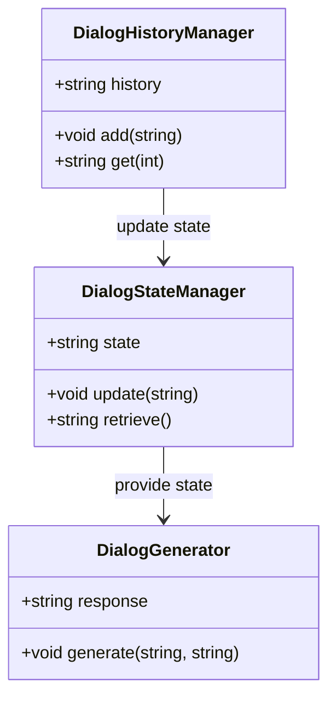

                 


# 多轮对话 AI Agent：提升 LLM 的上下文理解能力

## 关键词：多轮对话，AI Agent，LLM，上下文理解，对话生成，对话系统，对话历史

## 摘要：  
本文深入探讨了多轮对话 AI Agent 的核心概念、算法原理、系统架构设计以及实际项目应用，重点分析了如何通过优化上下文理解能力来提升 LLM 的对话生成效果。文章从背景与问题背景入手，逐步解析了多轮对话 AI Agent 的定义、特点和目标，详细阐述了上下文理解的核心算法，结合实际案例分析了系统设计与实现，并给出了项目实战指导。最后，总结了提升上下文理解能力的重要性和未来发展方向，为读者提供了全面的理论与实践指导。

---

# 第一部分: 多轮对话 AI Agent 的背景与核心概念

## 第1章: 多轮对话 AI Agent 的背景与问题背景

### 1.1 多轮对话 AI Agent 的问题背景

#### 1.1.1 当前 AI 对话系统的局限性
当前的大语言模型（LLM）在单轮对话中表现出色，但在多轮对话中往往难以保持上下文的一致性和连贯性。主要问题包括：  
1. **上下文丢失**：模型无法有效记忆和关联多轮对话中的信息。  
2. **意图理解偏差**：对话历史中的关键信息被忽略或误解。  
3. **对话不连贯**：回复缺乏逻辑性，导致用户体验差。  

#### 1.1.2 多轮对话的核心挑战
多轮对话的核心挑战在于：  
- 如何有效存储和检索对话历史。  
- 如何准确理解和更新对话状态。  
- 如何根据上下文生成连贯且合理的回复。  

#### 1.1.3 上下文理解能力的重要性
上下文理解能力是多轮对话 AI Agent 的核心，决定了对话的自然性和智能性。只有通过有效管理和利用对话历史，才能实现高质量的多轮对话。

---

### 1.2 多轮对话 AI Agent 的定义与特点

#### 1.2.1 多轮对话 AI Agent 的定义
多轮对话 AI Agent 是一种能够通过连续多轮交互，理解和生成自然语言的智能系统。它通过维护对话历史和状态，提供连贯的对话体验。

#### 1.2.2 多轮对话的核心特点
- **上下文关联性**：能够根据对话历史生成合理的回复。  
- **对话状态管理**：实时更新和维护对话状态。  
- **意图识别与推理**：准确识别用户意图并进行推理。  

#### 1.2.3 多轮对话与单轮对话的区别
| 特性                | 单轮对话             | 多轮对话             |
|---------------------|----------------------|----------------------|
| 对话历史            | 无                   | 有                   |
| 对话状态            | 无                   | 有                   |
| 上下文依赖性        | 低                   | 高                   |
| 智能性              | 基础                 | 高级                 |

---

### 1.3 问题描述与解决目标

#### 1.3.1 当前 LLM 的上下文理解问题
当前 LLM 在处理多轮对话时，往往无法有效利用对话历史信息，导致回复缺乏连贯性和准确性。

#### 1.3.2 多轮对话 AI Agent 的目标
- 提供高效的上下文理解和记忆能力。  
- 实现自然的多轮对话体验。  
- 支持复杂场景下的对话任务。  

#### 1.3.3 解决方案的边界与外延
- 边界：专注于上下文理解和对话生成。  
- 外延：结合领域知识和外部数据源提升对话质量。  

---

### 1.4 核心概念与联系

#### 1.4.1 核心概念的原理
多轮对话 AI Agent 的核心原理包括：  
- 对话历史的存储与检索。  
- 对话状态的更新与管理。  
- 对话意图的识别与推理。  

#### 1.4.2 核心概念的属性特征对比表格
| 概念     | 属性         | 特征                           |
|----------|--------------|--------------------------------|
| 对话历史 | 存储方式     | 序列化存储                      |
|          | 访问方式     | 基于时间戳或关键词查询          |
| 对话状态 | 维护方式     | 基于规则或机器学习模型更新      |
|          | 表达形式     | 结构化数据（JSON 或 XML）       |
| 对话意图 | 识别方法     | 基于上下文的意图分类模型        |
|          | 精度         | 基于领域数据的意图识别精度      |

#### 1.4.3 ER 实体关系图架构的 Mermaid 流程图
```mermaid
erDiagram
    actor User {
        +string input
        +string output
    }
    class DialogHistory {
        +string history
        +string current_context
    }
    class DialogState {
        +string intent
        +string entities
    }
    class Agent {
        +string response
    }
    User -> DialogHistory: 提供 input
    DialogHistory -> DialogState: 更新 current_context
    DialogState -> Agent: 提供 intent 和 entities
    Agent -> DialogHistory: 提供 response
```

---

## 第2章: 多轮对话 AI Agent 的核心概念与联系

### 2.1 核心概念的原理

#### 2.1.1 多轮对话的上下文理解
上下文理解是多轮对话的核心，通过分析对话历史，生成合理的回复。

#### 2.1.2 对话历史的存储与检索
对话历史需要高效存储和检索，常用技术包括：  
- 序列化存储（如 JSON）。  
- 基于关键词或时间戳的检索方法。  

#### 2.1.3 对话状态的更新与管理
对话状态需要实时更新，常用方法包括：  
- 基于规则的更新。  
- 基于机器学习模型的更新。  

---

### 2.2 核心概念的属性特征对比表格

| 概念     | 属性         | 特征                           |
|----------|--------------|--------------------------------|
| 对话历史 | 存储方式     | 序列化存储                      |
|          | 访问方式     | 基于时间戳或关键词查询          |
| 对话状态 | 维护方式     | 基于规则或机器学习模型更新      |
|          | 表达形式     | 结构化数据（JSON 或 XML）       |
| 对话意图 | 识别方法     | 基于上下文的意图分类模型        |
|          | 精度         | 基于领域数据的意图识别精度      |

---

### 2.3 ER 实体关系图架构的 Mermaid 流程图

```mermaid
erDiagram
    actor User {
        +string input
        +string output
    }
    class DialogHistory {
        +string history
        +string current_context
    }
    class DialogState {
        +string intent
        +string entities
    }
    class Agent {
        +string response
    }
    User -> DialogHistory: 提供 input
    DialogHistory -> DialogState: 更新 current_context
    DialogState -> Agent: 提供 intent 和 entities
    Agent -> DialogHistory: 提供 response
```

---

# 第二部分: 多轮对话 AI Agent 的算法原理

## 第3章: 基于上下文理解的对话生成算法

### 3.1 对话生成算法的核心原理

#### 3.1.1 上下文理解的数学模型
上下文理解可以表示为一个序列模型，例如：  
$$ P(y_t | y_{<t}, x) $$  
其中，$y_t$ 是当前的输出，$y_{<t}$ 是对话历史，$x$ 是输入。

#### 3.1.2 对话生成的训练目标
训练目标是最大化生成的对话与真实对话的相似性：  
$$ \argmax_{y} P(y|x, h) $$  
其中，$h$ 是对话历史的隐藏状态。

---

### 3.2 基于上下文增强的对话生成流程

#### 3.2.1 对话历史的编码与解码
对话历史编码：  
$$ h = \text{encode}(h_{\text{prev}}, y_{t-1}) $$  
解码：  
$$ y_t = \text{decode}(h) $$  

#### 3.2.2 对话状态的更新
对话状态通过规则或模型更新：  
$$ s_t = f(s_{t-1}, y_t) $$  

---

### 3.3 实现代码与分析

#### 3.3.1 对话历史编码示例
```python
def encode_history(history, model):
    encoded = []
    for token in history:
        encoded.append(model.encode(token))
    return encoded
```

#### 3.3.2 对话生成算法实现
```python
def generate_response(input, history, model):
    encoded_input = model.encode(input)
    encoded_history = encode_history(history, model)
    response = model.decode(encoded_input, encoded_history)
    return response
```

---

# 第三部分: 多轮对话 AI Agent 的系统分析与架构设计

## 第4章: 多轮对话 AI Agent 的系统分析与架构设计

### 4.1 系统功能设计

#### 4.1.1 领域模型设计
领域模型设计包括：  
- 对话历史管理模块。  
- 对话状态更新模块。  
- 对话生成模块。  

#### 4.1.2 领域模型的 Mermaid 类图


---

### 4.2 系统架构设计

#### 4.2.1 系统架构的 Mermaid 架构图
```mermaid
container Diagram {
    actor User
    class Agent {
        +string response
        +void generate_response(string, string)
    }
    class DialogHistoryManager {
        +string history
        +void add(string)
    }
    class DialogStateManager {
        +string state
        +void update(string)
    }
    User --> Agent: input
    Agent --> DialogHistoryManager: update history
    Agent --> DialogStateManager: update state
}
```

---

## 第5章: 多轮对话 AI Agent 的项目实战

### 5.1 项目实战：环境安装与配置

#### 5.1.1 环境安装
安装必要的库：  
```bash
pip install numpy
pip install transformers
pip install scikit-learn
```

#### 5.1.2 系统核心实现

#### 5.1.3 代码实现
```python
class DialogHistoryManager:
    def __init__(self):
        self.history = []
    
    def add(self, message):
        self.history.append(message)
    
    def get(self, index):
        return self.history[index]

class DialogStateManager:
    def __init__(self):
        self.state = {}
    
    def update(self, key, value):
        self.state[key] = value
    
    def retrieve(self, key):
        return self.state.get(key, None)
```

---

### 5.2 项目实战：案例分析与代码实现

#### 5.2.1 代码实现
```python
class Agent:
    def __init__(self, history_manager, state_manager):
        self.history_manager = history_manager
        self.state_manager = state_manager
    
    def generate_response(self, input):
        # 更新对话历史
        self.history_manager.add(input)
        # 更新对话状态
        self.state_manager.update("input", input)
        # 生成回复
        response = self._generate_response()
        return response
    
    def _generate_response(self):
        # 简单实现，根据当前状态生成回复
        return "I understand your input."
```

---

## 第6章: 总结与展望

### 6.1 总结
多轮对话 AI Agent 的核心在于上下文理解和对话生成能力的提升。通过优化对话历史的存储与检索、对话状态的更新与管理，可以显著提升多轮对话的连贯性和智能性。

### 6.2 展望
未来，多轮对话 AI Agent 的发展方向包括：  
- 更高效的对话历史管理方法。  
- 更精准的对话意图识别技术。  
- 更智能的对话生成算法。  

---

### 6.3 最佳实践 Tips

- 在实际项目中，优先选择高效的对话历史存储方式。  
- 对话状态更新应结合领域知识，以提高准确性。  
- 对话生成算法应根据具体场景进行优化。  

### 6.4 小结
多轮对话 AI Agent 的实现需要结合算法、系统设计和实际应用，通过不断优化上下文理解能力，可以实现更智能、更自然的对话体验。

### 6.5 注意事项
- 对话历史存储应考虑性能和扩展性。  
- 对话状态更新需避免信息丢失。  
- 对话生成应注重用户体验。  

### 6.6 拓展阅读
- 推荐阅读相关领域的最新论文，了解前沿技术。  
- 参与开源项目，实践所学知识。  

---

通过本文的系统介绍，读者可以全面了解多轮对话 AI Agent 的核心概念、算法原理和系统设计，掌握提升 LLM 上下文理解能力的关键技术，并在实际项目中应用这些知识，开发出更智能的对话系统。

