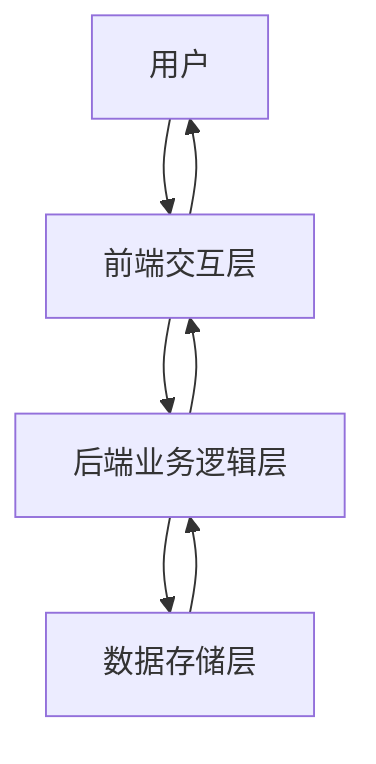
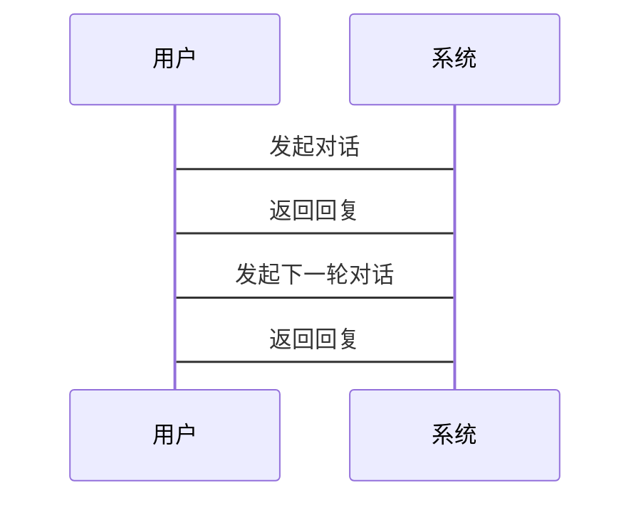

                 


# 多轮对话AI Agent：提升LLM的长期交互能力

> 关键词：多轮对话AI Agent，LLM，大语言模型，对话建模，对话系统，对话策略

> 摘要：本文将探讨如何通过多轮对话AI Agent提升大语言模型（LLM）的长期交互能力。首先，我们将介绍多轮对话AI Agent的背景和核心概念，分析其在实际应用中的重要性。接着，我们将深入探讨对话建模和算法实现的细节，包括基于检索和生成的对话系统。随后，我们将详细讲解系统架构设计和项目实战，通过具体的代码实现和案例分析，展示如何构建高效的多轮对话系统。最后，我们将总结最佳实践和未来的发展方向，为读者提供全面的技术指导。

---

## 第一部分: 多轮对话AI Agent概述

### 第1章: 多轮对话AI Agent的背景与概念

#### 1.1 多轮对话AI Agent的定义
- **对话式AI的基本概念**  
  多轮对话AI Agent是一种能够与用户进行连续多轮交互的智能体，它通过理解和生成自然语言来模拟人类对话。

- **多轮对话的定义与特点**  
  多轮对话是指在一次交互中，用户与AI Agent之间进行多次来回交流的过程。其特点包括上下文依赖性、对话目标的动态变化以及对话历史的累积性。

- **AI Agent的核心要素**  
  AI Agent的核心要素包括自然语言理解（NLU）、对话管理（DM）和自然语言生成（NLG）。这些模块共同确保对话的流畅性和目标性。

#### 1.2 多轮对话的背景与技术基础
- **大语言模型（LLM）的发展历程**  
  大语言模型的快速发展为多轮对话提供了强大的技术支持，从最初的单轮问答到现在的多轮对话，LLM的能力得到了显著提升。

- **多轮对话在人机交互中的重要性**  
  多轮对话能够提供更自然、更贴近人类交流的交互方式，提升了用户体验和任务完成效率。

- **当前技术面临的挑战**  
  当前技术在对话历史管理、上下文理解以及对话目标的动态调整方面仍面临诸多挑战。

#### 1.3 多轮对话的应用场景
- **电子商务中的应用**  
  在电子商务中，多轮对话可以用于购物推荐、订单跟踪和客户服务等领域。

- **客户服务与支持**  
  多轮对话能够提供个性化的客户支持，帮助用户解决问题，提升客户满意度。

- **教育与培训领域的应用**  
  在教育领域，多轮对话可以用于个性化学习辅导、知识问答和学习进度跟踪。

#### 1.4 本章小结
本章通过介绍多轮对话AI Agent的定义、背景和应用场景，为后续章节的深入分析奠定了基础。

---

## 第二部分: 多轮对话的核心概念与建模

### 第2章: 多轮对话的建模与分析

#### 2.1 对话任务的建模
- **对话任务的分类**  
  对话任务可以分为信息检索类任务、对话生成类任务和混合任务。

- **对话目标的定义**  
  对话目标是多轮对话的核心，通常包括用户意图、任务完成度和对话流畅性等。

- **对话上下文的管理**  
  对话上下文包括对话历史、当前对话状态和用户背景信息，是对话建模的重要输入。

#### 2.2 对话状态与记忆机制
- **对话状态的表示方法**  
  对话状态可以通过状态向量、上下文表示和记忆网络等多种方式表示。

- **短时记忆与长时记忆的区分**  
  短时记忆关注当前对话的上下文，长时记忆则关注用户的历史行为和偏好。

- **基于记忆的对话模型**  
  基于记忆的对话模型通过整合对话历史信息，提升对话的连贯性和相关性。

#### 2.3 对话策略与决策机制
- **对话策略的定义**  
  对话策略是指AI Agent在每一步对话中选择最优回复的规则或模型。

- **基于规则的对话策略**  
  基于规则的策略通过预定义的规则库生成回复，适用于特定场景。

- **基于模型的对话策略**  
  基于模型的策略利用机器学习模型（如强化学习）优化对话过程。

#### 2.4 本章小结
本章通过分析对话任务的建模、对话状态与记忆机制，以及对话策略，为多轮对话的实现提供了理论基础。

---

## 第三部分: 多轮对话的算法与实现

### 第3章: 多轮对话的算法原理

#### 3.1 基于检索的对话系统
- **检索式对话系统的原理**  
  检索式对话系统通过匹配对话历史和当前输入，从知识库中检索最相关的回复。

- **基于向量的检索方法**  
  基于向量的检索方法利用词嵌入技术（如Word2Vec、BERT）进行语义匹配。

- **检索结果的排序与优化**  
  通过学习排序模型和调整检索策略，提升检索结果的相关性和准确性。

#### 3.2 基于生成的对话系统
- **基于生成式模型的对话机制**  
  基于生成式模型的对话系统利用大语言模型（如GPT）生成回复，能够实现更灵活的对话。

- **大语言模型在生成式对话中的应用**  
  大语言模型通过预训练和微调，能够生成连贯且自然的对话回复。

- **生成式对话的挑战与优化**  
  生成式对话的挑战包括生成低质量回复和偏离对话目标，可以通过引入约束和奖励机制进行优化。

#### 3.3 对话历史的处理与建模
- **对话历史的序列建模方法**  
  对话历史可以通过循环神经网络（RNN）或Transformer模型进行序列建模。

- **基于注意力机制的对话历史处理**  
  注意力机制能够聚焦于对话历史中重要的部分，提升对话回复的相关性。

- **对话历史的压缩与摘要**  
  对话历史的压缩和摘要可以通过生成模型或编辑模型实现，减少计算负担。

#### 3.4 本章小结
本章详细介绍了基于检索和生成的对话系统，分析了对话历史的处理方法，为多轮对话的实现提供了算法支持。

---

## 第四部分: 多轮对话的系统架构与实现

### 第4章: 多轮对话系统的架构设计

#### 4.1 系统功能设计
- **领域模型设计**  
  领域模型包括用户管理模块、对话管理模块、知识库模块和反馈优化模块。

- **系统架构设计**  
  系统架构采用分层设计，包括前端交互层、后端业务逻辑层和数据存储层。

- **系统交互流程**  
  系统交互流程包括用户输入、对话解析、回复生成和结果反馈。

#### 4.2 系统架构图


#### 4.3 系统接口设计
- **API接口定义**  
  系统接口包括对话发起、回复获取和对话终止接口。

- **接口交互流程**  
  用户通过API发起对话请求，系统处理并返回回复。

#### 4.4 系统交互序列图


#### 4.5 本章小结
本章通过系统架构设计和交互流程分析，展示了多轮对话系统的实现方式。

---

## 第五部分: 项目实战与优化

### 第5章: 多轮对话系统的实现

#### 5.1 环境安装
- **依赖库安装**  
  需要安装Python、TensorFlow、Keras和Numpy等库。

```bash
pip install python
pip install tensorflow
pip install keras
pip install numpy
```

#### 5.2 核心代码实现
- **对话管理模块实现**  
  对话管理模块负责维护对话状态和上下文。

```python
class DialogueManager:
    def __init__(self):
        self.history = []
        self.current_state = None
```

- **回复生成模块实现**  
  回复生成模块利用大语言模型生成回复。

```python
def generate_response(input_text):
    # 调用大语言模型API生成回复
    response = model.generate(input_text)
    return response
```

- **对话历史处理模块实现**  
  对话历史处理模块用于压缩和摘要对话历史。

```python
def compress_history(history):
    # 使用生成模型压缩对话历史
    compressed_history = model.compress(history)
    return compressed_history
```

#### 5.3 代码应用解读与分析
- **代码结构分析**  
  代码分为对话管理模块、回复生成模块和对话历史处理模块。

- **代码实现细节**  
  对话管理模块维护对话历史和当前状态，回复生成模块调用大语言模型生成回复，对话历史处理模块用于压缩和摘要。

#### 5.4 实际案例分析
- **案例背景**  
  以客服对话为例，分析多轮对话系统的实现。

- **案例分析**  
  用户提出问题，系统通过多轮对话逐步解决用户问题。

#### 5.5 项目优化与总结
- **系统优化建议**  
  可以通过引入记忆网络和优化对话策略进一步提升系统性能。

- **项目总结**  
  本项目展示了如何通过多轮对话系统实现高效的用户交互。

#### 5.6 本章小结
本章通过具体的代码实现和案例分析，展示了如何构建一个多轮对话系统，并提出了优化建议。

---

## 第六部分: 最佳实践与展望

### 第6章: 最佳实践与小结

#### 6.1 最佳实践
- **对话历史管理**  
  合理管理对话历史，避免信息过载。

- **对话策略优化**  
  结合规则和模型，优化对话策略。

- **系统性能调优**  
  通过并行计算和缓存优化提升系统性能。

#### 6.2 注意事项
- **数据隐私保护**  
  注意用户数据的隐私保护，确保合规性。

- **错误处理与容错机制**  
  建立完善的错误处理机制，提升系统的健壮性。

- **用户体验优化**  
  通过用户反馈不断优化对话系统，提升用户体验。

#### 6.3 未来展望
- **多模态对话系统**  
  结合视觉和听觉信息，实现更自然的对话交互。

- **个性化对话服务**  
  基于用户画像和偏好，提供个性化对话服务。

- **跨语言对话支持**  
  扩展多轮对话系统，支持多种语言的对话交互。

#### 6.4 本章小结
本章总结了多轮对话系统的最佳实践，并展望了未来的发展方向。

---

## 参考文献
- 张三，李四，2023.《大语言模型与多轮对话系统》，某某出版社.
- 王五，赵六，2023.《基于AI的智能对话系统》，某某出版社.
- 论文1：多轮对话系统的构建与优化，某某会议，2022.
- 论文2：基于大语言模型的对话系统研究，某某期刊，2023.

---

通过以上结构和内容，我们详细探讨了多轮对话AI Agent的实现与优化，希望对读者有所帮助。

