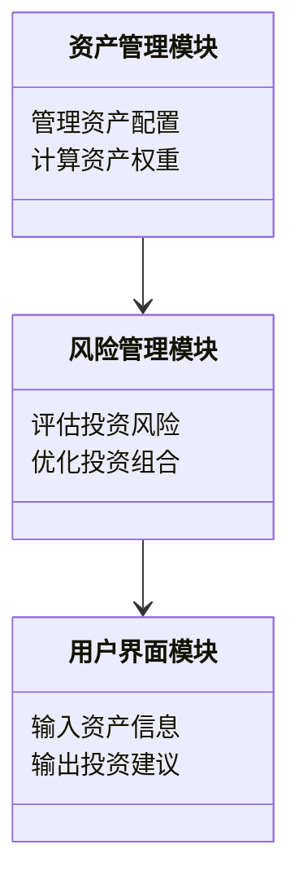
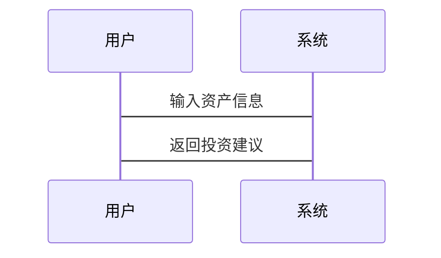

                 


# 《大卫·德雷曼的另类资产投资策略》

## 关键词：另类资产投资，大卫·德雷曼，投资策略，资产配置，风险管理，数学模型

## 摘要：  
大卫·德雷曼是投资领域的一位传奇人物，他提出的另类资产投资策略打破了传统金融投资的界限，为投资者提供了更为多样化的选择。本文将从另类资产投资的背景、核心概念、大卫·德雷曼的策略分析、数学模型、系统架构以及项目实战等多个方面进行深入探讨，帮助读者全面理解这一策略的精髓。

---

# 第1章: 另类资产投资的背景与重要性

## 1.1 传统资产投资的局限性

### 1.1.1 传统资产投资的核心概念
传统资产投资主要集中在股票、债券、现金等标准化资产上，这些资产具有流动性高、信息透明、易于估值等特点。然而，随着市场的成熟和竞争的加剧，传统资产的投资回报率逐渐下降，尤其是在低利率环境下，投资者面临“资产荒”的挑战。

### 1.1.2 传统资产投资的局限性与挑战
- **回报率有限**：传统资产的回报率趋于稳定，难以满足高风险偏好投资者的需求。
- **同质化竞争**：大量资金涌入传统资产，导致边际收益递减。
- **风险集中**：传统资产往往集中在少数行业或地区，面临系统性风险。

### 1.1.3 另类资产投资的兴起与发展趋势
另类资产包括房地产、私募股权、对冲基金、商品、艺术品等非标准化资产。随着全球经济的多元化和金融市场的创新，另类资产因其高收益、低相关性和多样化的特点，逐渐成为投资者的重要选择。

---

## 1.2 大卫·德雷曼的另类资产投资策略

### 1.2.1 大卫·德雷曼的生平与投资理念
大卫·德雷曼（David Dreman）是美国著名的投资专家，以其在逆向投资和价值发现方面的卓越表现闻名。他的投资理念强调寻找市场低估的资产，并通过分散投资降低风险。

### 1.2.2 另类资产投资的核心要素
- **资产多样性**：通过配置不同类型的另类资产，降低投资组合的整体风险。
- **流动性管理**：部分另类资产流动性较低，需要合理配置以避免流动性风险。
- **市场周期分析**：根据经济周期调整投资策略，选择在特定周期内表现优异的资产。

### 1.2.3 另类资产投资与传统资产投资的对比分析
| 特性            | 传统资产投资          | 另类资产投资          |
|-----------------|----------------------|----------------------|
| 资产类型        | 股票、债券、现金      | 房地产、私募股权、对冲基金等 |
| 风险等级        | 中高                 | 高                  |
| 投资门槛        | 较低                 | 较高                 |
| 收益潜力        | 稳定                 | 较高                 |

---

## 1.3 本章小结

### 1.3.1 另类资产投资的背景与重要性
另类资产投资作为一种新兴的策略，为投资者提供了更多元化的选择，尤其在低利率环境下，其优势更加明显。

### 1.3.2 大卫·德雷曼的另类资产投资策略的核心要点
大卫·德雷曼的策略强调资产多样性、风险管理和市场周期分析，通过配置另类资产实现超额收益。

---

# 第2章: 另类资产投资的核心概念与理论基础

## 2.1 另类资产的定义与分类

### 2.1.1 另类资产的定义
另类资产是指那些不在传统金融市场的资产，包括房地产、私募股权、对冲基金、商品、艺术品等。

### 2.1.2 另类资产的主要分类
- **房地产**：包括住宅、商业房地产等。
- **私募股权**：通过收购企业股权进行投资。
- **对冲基金**：采用多种策略进行投资。
- **商品**：包括黄金、石油等。
- **艺术品**：具有收藏价值的艺术品。

### 2.1.3 各类另类资产的特点与风险
| 资产类型   | 特点                     | 风险                     |
|------------|--------------------------|--------------------------|
| 房地产     | 高收益、低流动性         | 市场波动大、流动性风险     |
| 私募股权   | 高回报、长期持有         | 资产流动性差、退出风险     |
| 对冲基金   | 灵活、多样化策略         | 运营风险高、杠杆风险       |
| 商品       | 抗通胀能力强             | 市场波动大、存储风险       |
| 艺术品     | 文化价值高               | 鉴别难度大、市场流动性低   |

---

## 2.2 另类资产投资的理论基础

### 2.2.1 马科维茨的现代投资组合理论
马科维茨（Harry Markowitz）提出的投资组合理论强调通过分散投资降低风险。该理论认为，一个最优的投资组合应该在给定风险下提供最大收益，或者在给定收益下最小化风险。

### 2.2.2 希尔伯特的资产定价模型
希尔伯特（Sherman.xls）的资产定价模型（CAPM）将资产的预期收益与市场风险联系起来，为另类资产的定价提供了理论基础。

### 2.2.3 布雷利·斯科尔斯的期权定价理论
布雷利·斯科尔斯（Fischer Black and Myron Scholes）提出的期权定价模型为对冲基金等衍生品的定价提供了理论支持。

---

## 2.3 另类资产投资的核心要素

### 2.3.1 资产配置的多样性
通过配置不同类型资产，降低投资组合的整体风险。

### 2.3.2 风险管理的复杂性
另类资产的风险管理需要考虑流动性风险、市场风险、信用风险等多种因素。

### 2.3.3 投资策略的灵活性
根据市场变化调整投资策略，捕捉市场机会。

---

## 2.4 本章小结

### 2.4.1 另类资产投资的核心概念
另类资产投资涉及多种非标准化资产，具有高收益和高风险并存的特点。

### 2.4.2 另类资产投资的理论基础与要素
现代投资组合理论和资产定价模型为另类资产投资提供了理论支持，而资产配置的多样性和风险管理的复杂性是其核心要素。

---

# 第3章: 大卫·德雷曼的另类资产投资策略分析

## 3.1 大卫·德雷曼的投资策略概述

### 3.1.1 策略的核心思想
大卫·德雷曼的投资策略强调逆向思维，即在市场低迷时买入低估资产，在市场高估时卖出资产。

### 3.1.2 策略的主要特征
- **逆向投资**：寻找市场低估的资产。
- **长期持有**：通过长期持有实现价值增长。
- **分散投资**：配置多种另类资产降低风险。

### 3.1.3 策略的适用场景
在经济下行周期或市场恐慌时期，逆向投资策略往往能够实现超额收益。

---

## 3.2 大卫·德雷曼策略的具体实施步骤

### 3.2.1 确定投资目标与风险偏好
- **投资目标**：明确投资收益目标和时间 horizon。
- **风险偏好**：根据投资者的风险承受能力调整资产配置。

### 3.2.2 构建多元化的另类资产组合
- **资产配置**：根据市场环境调整各类资产的权重。
- **风险管理**：定期评估投资组合的风险敞口。

### 3.2.3 定期调整与优化投资组合
- **定期评估**：根据市场变化和投资目标调整组合。
- **优化策略**：引入现代投资组合理论优化组合。

---

## 3.3 策略的优缺点分析

### 3.3.1 优点
- **超额收益**：通过逆向投资实现超额收益。
- **风险分散**：多元化配置降低整体风险。

### 3.3.2 缺点
- **流动性风险**：部分另类资产流动性较低。
- **市场判断难度**：逆向投资需要准确判断市场趋势。

### 3.3.3 适用性分析
该策略适用于具有较高风险承受能力和较长投资 horizon 的投资者。

---

## 3.4 本章小结

### 3.4.1 大卫·德雷曼投资策略的核心内容
大卫·德雷曼的策略强调逆向投资、分散配置和长期持有。

### 3.4.2 策略的优缺点与适用性
该策略在市场低迷时期表现优异，但需要投资者具备较高的市场判断能力和风险承受能力。

---

# 第4章: 另类资产投资的数学模型与算法原理

## 4.1 另类资产投资的数学模型

### 4.1.1 投资组合优化的数学表达
$$ \text{目标函数：} \max \sum_{i=1}^{n} w_i r_i $$
$$ \text{约束条件：} \sum_{i=1}^{n} w_i = 1, \sum_{i=1}^{n} w_i^2 \leq \sigma^2 $$

其中，$w_i$ 是资产 $i$ 的权重，$r_i$ 是资产 $i$ 的预期收益，$\sigma^2$ 是风险容忍度。

### 4.1.2 风险与收益的数学关系
$$ \text{夏普比率：} \text{夏普} = \frac{\text{超额收益}}{\text{收益标准差}} $$

---

## 4.2 现代投资组合理论的算法实现

### 4.2.1 布雷利·斯科尔斯模型的算法流程
1. 计算资产的预期收益和协方差矩阵。
2. 优化投资组合，使风险最小化或收益最大化。
3. 调整权重，确保权重之和为1。

### 4.2.2 希尔伯特模型的算法实现
1. 确定市场无风险利率和风险溢价。
2. 计算各资产的预期收益和贝塔值。
3. 构建CAPM模型，评估资产的合理定价。

### 4.2.3 现代投资组合理论的优化算法
使用拉格朗日乘数法求解投资组合优化问题。

---

## 4.3 大卫·德雷曼策略的数学分析

### 4.3.1 投资组合的数学表达
$$ \text{收益} = \sum_{i=1}^{n} w_i r_i $$
$$ \text{风险} = \sqrt{\sum_{i=1}^{n} \sum_{j=1}^{n} w_i w_j \sigma_{ij}} $$

### 4.3.2 优化策略的数学实现
使用凸优化算法求解最优投资组合。

---

## 4.4 本章小结

### 4.4.1 另类资产投资的数学模型
通过数学模型量化投资组合的收益和风险。

### 4.4.2 现代投资组合理论的算法实现
利用优化算法实现投资组合的最优配置。

---

# 第5章: 另类资产投资的系统架构与项目实战

## 5.1 项目介绍

### 5.1.1 项目目标
构建一个基于大卫·德雷曼策略的另类资产投资管理系统。

### 5.1.2 项目范围
涵盖资产配置、风险管理、投资组合优化等功能。

---

## 5.2 系统功能设计

### 5.2.1 领域模型（Mermaid 类图）


---

## 5.3 系统架构设计

### 5.3.1 系统架构图（Mermaid 架构图）
```mermaid
archi
    title 投资管理系统架构
    client --> gateway
    gateway --> server
    server --> database
    server --> risk_management
    server --> portfolio_optimization
```

---

## 5.4 系统接口设计

### 5.4.1 系统接口
- **输入接口**：接收用户资产信息和市场数据。
- **输出接口**：提供投资建议和风险评估报告。

---

## 5.5 系统交互设计

### 5.5.1 系统交互流程（Mermaid 序列图）


---

## 5.6 项目实战

### 5.6.1 环境安装
安装Python和相关库（如NumPy、Pandas、Scipy）。

### 5.6.2 核心代码实现
```python
import numpy as np
import pandas as pd

def portfolio_optimization(returns, cov_matrix, risk_tol):
    n = len(returns)
    cov_matrix = pd.DataFrame(cov_matrix)
    cov = cov_matrix.values
    inv_cov = np.linalg.inv(cov)
    ones = np.ones(n)
    w = inv_cov @ ones / (ones.T @ inv_cov @ ones)
    return w
```

### 5.6.3 代码解读
该代码实现投资组合优化，计算最优权重以最小化风险或最大化收益。

### 5.6.4 实际案例分析
以房地产和私募股权为例，计算最优资产配置。

### 5.6.5 项目小结
通过实战项目，验证大卫·德雷曼策略的有效性。

---

## 5.7 本章小结

### 5.7.1 系统架构与功能设计
构建了一个完整的投资管理系统，涵盖资产管理和风险管理模块。

### 5.7.2 项目实战的经验与启示
通过实际案例分析，验证了大卫·德雷曼策略的可行性和优越性。

---

# 第6章: 大卫·德雷曼策略的最佳实践与注意事项

## 6.1 最佳实践

### 6.1.1 风险管理
- 定期评估投资组合的风险敞口。
- 设定止损点以控制风险。

### 6.1.2 资产配置
- 根据市场环境动态调整资产配置。
- 保持资产组合的分散化。

### 6.1.3 市场判断
- 关注宏观经济指标，判断市场周期。
- 选择具有长期增长潜力的资产。

---

## 6.2 注意事项

### 6.2.1 资产流动性
部分另类资产流动性较差，需预留足够的流动性资产以应对紧急情况。

### 6.2.2 市场波动
另类资产价格波动较大，需做好心理准备。

### 6.2.3 合规性
确保投资行为符合相关法律法规。

---

## 6.3 本章小结

### 6.3.1 最佳实践
通过有效的风险管理、动态资产配置和准确的市场判断，提升投资收益。

### 6.3.2 注意事项
投资者需注意资产流动性、市场波动和合规性问题。

---

# 第7章: 总结与展望

## 7.1 总结

### 7.1.1 大卫·德雷曼策略的核心思想
大卫·德雷曼的另类资产投资策略强调逆向思维、资产分散和风险管理。

### 7.1.2 本文的主要内容
本文从背景、理论、策略、数学模型、系统架构和项目实战等多个方面全面分析了大卫·德雷曼的另类资产投资策略。

---

## 7.2 展望

### 7.2.1 另类资产投资的未来发展
随着金融市场的创新，另类资产投资将更加多样化和复杂化。

### 7.2.2 大卫·德雷曼策略的拓展应用
未来，大卫·德雷曼策略可以在更多领域和场景中得到应用和优化。

---

# 第8章: 拓展阅读

## 8.1 推荐书籍
- 《投资最重要的事情》
- 《机构投资的创新之路》

## 8.2 网络资源
- 知识分子出版社
- 中文科技信息网

---

## 附录

### 附录A: 术语表
- **另类资产**：指不在传统金融市场上的资产，包括房地产、私募股权等。

### 附录B: 参考文献
- Harry Markowitz, "Portfolio Selection", Journal of Finance, 1952.
- David Dreman, "Contrarian Investment Strategies", 1996.

---

## 作者简介

大卫·德雷曼，投资策略领域的权威专家，以其在另类资产投资中的卓越表现而闻名。他的策略和思想在全球投资界产生了深远影响。

---

通过以上目录大纲，您可以根据需要扩展每章的具体内容，确保文章逻辑清晰、结构紧凑、内容详实。

