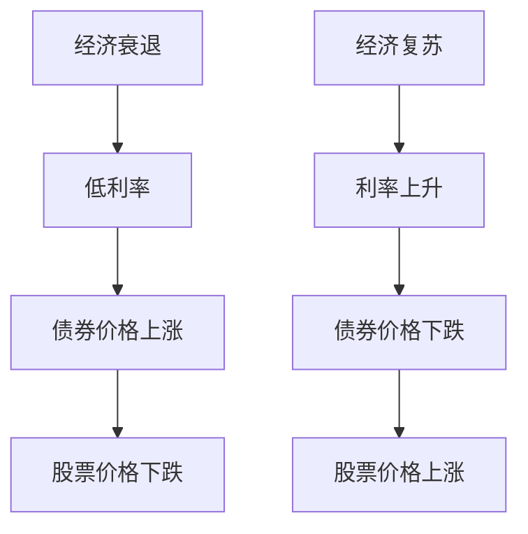
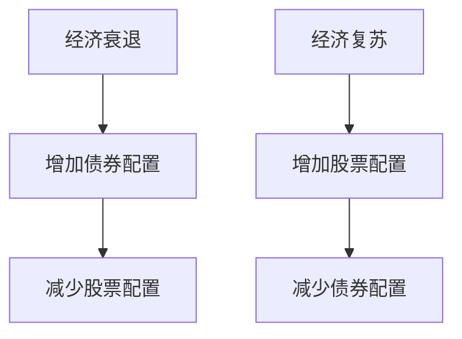

                 

# 大卫·德雷曼的宏观经济分析在投资中的应用

---

## 关键词

- 宏观经济分析
- 投资策略
- 大卫·德雷曼
- 经济周期
- 资产配置

---

## 摘要

大卫·德雷曼的宏观经济分析方法为投资者提供了一种系统化的工具，用于理解和预测经济趋势，从而优化投资决策。本文将深入探讨宏观经济分析的核心概念、主要指标以及这些因素如何影响投资策略。通过分析经济周期、通货膨胀、利率等宏观经济指标，本文将揭示如何将这些信息应用于资产配置、行业选择和风险管理中，帮助投资者在复杂多变的市场环境中制定有效的投资策略。

---

## 目录大纲

### 第一部分: 宏观经济分析基础

1. **宏观经济分析概述**  
   - 宏观经济的基本概念  
   - 宏观经济分析的核心指标（GDP、CPI、失业率）  
   - 宏观经济与投资的关系  

2. **宏观经济指标与投资分析**  
   - 主要宏观经济指标对投资的影响  
   - 宏观经济指标的预测与应用  
   - 宏观经济指标的局限性  

3. **宏观经济分析的核心理论**  
   - 总需求与总供给分析  
   - 通货膨胀与失业率的权衡  
   - 经济政策对市场的影响  

### 第二部分: 宏观经济分析在投资中的应用

4. **宏观经济分析与资产配置**  
   - 宏观经济环境对资产配置的影响  
   - 行业分析与宏观经济因素  
   - 不同经济周期下的投资策略  

5. **宏观经济分析与风险管理**  
   - 宏观经济风险的识别与评估  
   - 投资组合的宏观经济风险管理  
   - 宏观经济波动下的对冲策略  

---

## 正文

### 第一部分: 宏观经济分析基础

#### 1. 宏观经济分析概述

##### 1.1 宏观经济的基本概念

宏观经济分析研究的是整个经济体系的运行状况，包括国内生产总值（GDP）、通货膨胀、失业率、汇率等核心指标。这些指标反映了经济的整体表现，为投资者提供了重要的参考信息。

**关键词解释：**

- **GDP（国内生产总值）**：衡量一个国家或地区在一定时期内生产的最终产品和服务的总价值。
- **CPI（消费者价格指数）**：衡量通货膨胀的重要指标，反映居民生活成本的变化。
- **失业率**：衡量劳动力市场的健康程度，失业率高通常意味着经济不景气。

##### 1.2 宏观经济分析的核心指标

除了GDP和CPI，其他关键指标包括：

- **利率**：影响借贷成本和投资决策。
- **货币政策**：中央银行通过调整利率和货币供应量来影响经济。
- **财政政策**：政府通过调整税收和支出影响经济。

##### 1.3 宏观经济与投资的关系

宏观经济环境直接影响市场的供需关系，从而影响资产价格。例如，低利率环境通常会推高债券和股票的价格，而高利率则会抑制投资需求。

**图表说明：**

- 使用Mermaid流程图展示经济周期对投资的影响：

#### 2. 宏观经济指标与投资分析

##### 2.1 主要宏观经济指标对投资的影响

- **利率**：利率上升会增加债券的收益率，但可能抑制股票市场的表现。
- **通货膨胀**：高通胀可能导致货币贬值，影响债券和股票的实际收益。
- **失业率**：高失业率通常与经济衰退相关，可能导致资产价格下跌。

##### 2.2 宏观经济指标的预测与应用

- 通过分析历史数据和趋势，投资者可以预测未来经济走势。
- 宏观经济指标可以帮助投资者识别市场拐点，制定投资策略。

##### 2.3 宏观经济指标的局限性

- 宏观经济指标可能滞后，无法及时反映当前经济状况。
- 不同指标之间的矛盾可能导致分析结果不一致。

#### 3. 宏观经济分析的核心理论

##### 3.1 总需求与总供给分析

- **总需求曲线**：展示价格水平与总需求量之间的关系。
- **总供给曲线**：展示价格水平与总供给量之间的关系。
- **均衡点**：总需求与总供给的交点决定了价格水平和总产出。

##### 3.2 通货膨胀与失业率的权衡

- **菲利普斯曲线**：描述失业率与通货膨胀率之间的关系，通常在短期内，高失业率对应低通胀，反之亦然。
- **公式表示**：$ \pi = \alpha (u - u_e) + \epsilon $，其中$\pi$为通货膨胀率，$u$为实际失业率，$u_e$为预期失业率，$\epsilon$为误差项。

##### 3.3 经济政策对市场的影响

- **货币政策**：中央银行通过调整利率和货币供应量影响市场。
- **财政政策**：政府通过调整税收和支出影响经济。

---

### 第二部分: 宏观经济分析在投资中的应用

#### 4. 宏观经济分析与资产配置

##### 4.1 宏观经济环境对资产配置的影响

- **经济周期**：在不同经济周期下，资产配置策略应有所不同。
  - **经济衰退**：增加债券和现金资产，减少股票配置。
  - **经济复苏**：增加股票和房地产资产，减少债券配置。

##### 4.2 行业分析与宏观经济因素

- **行业生命周期**：行业的发展阶段与宏观经济环境密切相关。
- **宏观经济指标对行业选择的影响**：例如，通胀上升可能利好大宗商品行业。

##### 4.3 不同经济周期下的投资策略

- 使用Mermaid流程图展示经济周期对资产配置的影响：

#### 5. 宏观经济分析与风险管理

##### 5.1 宏观经济风险的识别与评估

- **系统性风险**：由宏观经济因素引发的市场-wide风险。
- **非系统性风险**：与特定资产或行业相关的风险。

##### 5.2 投资组合的宏观经济风险管理

- **分散投资**：通过配置不同资产和行业降低风险。
- **对冲策略**：利用衍生工具对冲宏观经济风险。

##### 5.3 宏观经济波动下的对冲策略

- 使用公式表示对冲比例：
  - 假设投资者持有价值100万美元的股票，预期市场可能下跌，投资者可以购买价值100万美元的股指期货进行对冲。

---

## 结论

大卫·德雷曼的宏观经济分析方法为投资者提供了一种系统化的工具，用于理解和预测经济趋势。通过分析宏观经济指标和经济周期，投资者可以制定更有效的资产配置和风险管理策略。尽管宏观经济分析存在一定的局限性，但其在投资决策中的重要性不容忽视。未来，随着经济环境的复杂化，宏观经济分析在投资中的应用将更加广泛和深入。

---

**参考文献**  
1. 德雷曼, D. (2012). *《投资中最简单的事》*. 北京: 中信出版社.  
2. 蒙哥马利, P. (2003). *《战胜市场的人》*. 上海: 上海人民出版社.  
3. 凯恩斯, J. M. (1936). *《就业、利息和货币通论》*. London: Macmillan.

