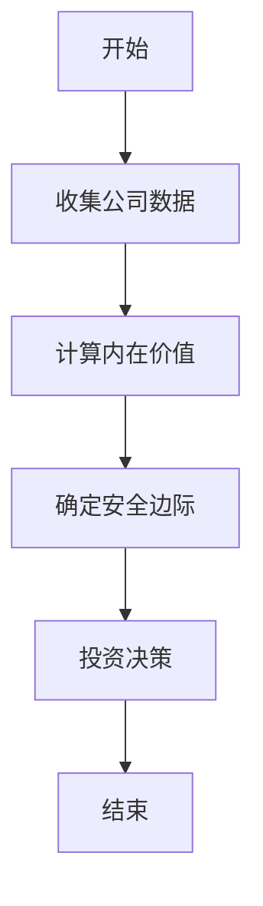

                 


# 大卫·德雷曼的特殊情况价值投资

> 关键词：价值投资，特殊情况，大卫·德雷曼，投资策略，金融分析

> 摘要：本文深入探讨了大卫·德雷曼的特殊情况价值投资策略，分析了其核心概念、算法原理、数学模型以及系统架构，并通过实际案例展示了其在投资实践中的应用。文章结构清晰，内容详实，旨在为投资者提供深度的理论支持和实践指导。

---

## 第1章: 价值投资的背景与核心概念

### 1.1 价值投资的起源与发展

#### 1.1.1 价值投资的起源
价值投资是一种以基本面分析为基础的投资策略，起源于20世纪初。本杰明·格雷厄姆和大卫·德雷曼是该领域的先驱。他们强调以低于内在价值的价格购买优质资产，以获取长期收益。

#### 1.1.2 大卫·德雷曼的特殊价值投资策略
大卫·德雷曼在价值投资中引入了特殊情况分析，专注于寻找因市场误解或短期问题导致价格被低估的公司。这些公司通常具有较高的内在价值，但市场情绪或外部环境的影响使其股价暂时低迷。

#### 1.1.3 价值投资在现代金融中的地位
尽管现代金融学引入了复杂的投资工具和技术分析，但价值投资因其稳健的哲学基础和长期收益的稳定性，仍然占据重要地位。德雷曼的特殊情况策略进一步丰富了价值投资的理论框架。

### 1.2 大卫·德雷曼的特殊情况分析

#### 1.2.1 特殊情况的定义
特殊情况是指那些因市场误解、短期问题或行业周期波动导致公司估值被严重低估的情形。这些公司通常具有稳定的现金流、强大的资产负债表和长期的竞争优势。

#### 1.2.2 特殊情况的分类与特征
- **困境企业**：因财务困境或管理问题导致股价暴跌，但具有扭亏为盈的潜力。
- **重组公司**：正在进行业务重组或管理层调整，市场对其未来前景持怀疑态度。
- **行业周期性波动**：行业处于衰退期，但公司具备长期增长潜力。
- **市场误解**：市场对公司的基本面或商业模式存在误解。

#### 1.2.3 特殊情况的市场影响
特殊情况通常伴随着高波动性和低估值，投资者需要识别这些机会并耐心等待市场回归理性。

### 1.3 价值投资的核心要素

#### 1.3.1 价值投资的核心要素
- **内在价值**：公司未来现金流的现值，是投资决策的基础。
- **安全边际**：买入价格与内在价值的差距，提供了风险缓冲。
- **长期视角**：价值投资强调长期持有，避免短期市场波动的干扰。

#### 1.3.2 价值投资与成长投资的区别
| 方面 | 价值投资 | 成长投资 |
|------|----------|----------|
| 目标 | 追求安全边际 | 追求高成长性 |
| 时间框架 | 长期持有 | 短期收益 |
| 风险 | 较低 | 较高 |

#### 1.3.3 价值投资的边界与外延
价值投资的边界在于避免投资于缺乏长期竞争优势或财务状况不佳的公司。其外延则包括不同行业和市场环境中的特殊情况。

---

## 第2章: 价值投资的基本原理

### 2.1 价值投资的理论基础

#### 2.1.1 价值投资的哲学基础
价值投资基于“市场先生”的概念，认为市场情绪是不可预测的，但价格波动为理性投资者提供了机会。

#### 2.1.2 价值投资的经济学基础
价值投资强调公司的内在价值，与传统经济学中的资产定价理论有所不同，更注重基本面分析。

#### 2.1.3 价值投资的数学基础
价值投资涉及对现值的计算，使用贴现现金流模型（DCF）评估公司的内在价值。

### 2.2 价值投资的核心概念

#### 2.2.1 核心概念的定义
- **内在价值**：公司未来现金流的贴现值。
- **安全边际**：买入价格与内在价值的差距。
- **竞争优势**：公司长期盈利的保障。

#### 2.2.2 核心概念的属性特征对比
| 概念 | 内在价值 | 安全边际 |
|------|----------|----------|
| 定义 | 公司未来现金流的现值 | 买入价格与内在价值的差距 |
| 作用 | 投资决策的基础 | 风险控制的关键 |

#### 2.2.3 核心概念的ER实体关系图
```mermaid
erd
    Company {
        id
        name
        industry
    }
    ValueInvestment {
        id
        company_id
        intrinsic_value
        margin_of_safety
    }
```

### 2.3 价值投资的分析方法

#### 2.3.1 基本面分析
基本面分析是价值投资的核心，包括对财务报表、行业地位和管理团队的评估。

#### 2.3.2 市场情绪分析
通过分析市场情绪，识别被低估的资产，抓住投资机会。

#### 2.3.3 财务报表分析
重点分析收入、利润、现金流和资产负债表，评估公司的财务健康状况。

### 2.4 价值投资的数学模型与公式

#### 2.4.1 价值投资的数学模型
使用贴现现金流模型（DCF）评估内在价值：
$$ \text{内在价值} = \sum_{t=1}^{n} \frac{\text{现金流}_t}{(1 + r)^t} + \frac{\text{终值}}{(1 + r)^n} $$
其中，\( r \) 是折现率，\( n \) 是永续期。

#### 2.4.2 价值投资的算法原理
以下是价值投资的算法流程图：


---

## 第3章: 价值投资的系统架构设计

### 3.1 价值投资系统的功能设计

#### 3.1.1 系统功能模块划分
- 数据采集模块：收集公司财务数据和市场信息。
- 分析模块：计算内在价值和安全边际。
- 投资决策模块：基于分析结果做出投资决策。

#### 3.1.2 系统功能模块的交互设计
数据采集模块将数据传递给分析模块，分析结果用于投资决策模块。

#### 3.1.3 系统功能模块的实现
使用Python编写数据采集和分析模块，利用pandas和numpy库进行数据处理。

### 3.2 价值投资系统的架构设计

#### 3.2.1 系统架构的定义
系统采用分层架构，包括数据层、业务逻辑层和表现层。

#### 3.2.2 系统架构的实现


#### 3.2.3 系统架构的优化
通过缓存机制优化数据访问效率，提高系统的响应速度。

### 3.3 价值投资系统的接口设计

#### 3.3.1 系统接口的定义
- 数据接口：与数据源对接。
- 投资决策接口：与交易系统对接。

#### 3.3.2 系统接口的实现
使用RESTful API设计接口，确保系统的可扩展性。

### 3.4 价值投资系统的交互设计

#### 3.4.1 系统交互的定义
用户通过表现层与系统交互，系统根据用户输入做出响应。

#### 3.4.2 系统交互的实现
使用Flask框架搭建表现层，提供友好的用户界面。

---

## 第4章: 价值投资的项目实战

### 4.1 项目环境的安装与配置

#### 4.1.1 系统环境的安装
安装Python 3.8及以上版本。

#### 4.1.2 开发工具的安装
安装Jupyter Notebook和VS Code。

#### 4.1.3 数据源的获取与配置
使用Yahoo Finance API获取股票数据。

### 4.2 项目核心代码的实现

#### 4.2.1 核心算法的实现
```python
import pandas as pd
import numpy as np

def calculate_intrinsic_value(fcf, discount_rate, perpetuity_value):
    # 计算贴现现金流
    intrinsic_value = 0
    for year in range(1, 11):
        cash_flow = fcf * (0.9 ** (year - 1))
        intrinsic_value += cash_flow / (1 + discount_rate) ** year
    intrinsic_value += perpetuity_value / (1 + discount_rate) ** 10
    return intrinsic_value
```

#### 4.2.2 核心数据结构的实现
使用pandas DataFrame存储公司数据和分析结果。

#### 4.2.3 核心代码的解读
上述代码计算了公司未来十年的现金流现值和永续期的价值，综合得出内在价值。

### 4.3 项目核心代码的解读

#### 4.3.1 核心算法的解读
贴现现金流模型通过将未来现金流折现，计算公司的内在价值。这帮助投资者识别被低估的资产。

#### 4.3.2 核心数据结构的解读
pandas DataFrame用于存储和处理大量数据，提高了分析效率。

### 4.4 项目核心代码的优化

#### 4.4.1 核心算法的优化
通过并行计算优化算法效率，减少计算时间。

#### 4.4.2 核心数据结构的优化
使用更高效的数据结构，如Dask DataFrame，处理大规模数据。

### 4.5 项目核心代码的实现

#### 4.5.1 核心代码的实现
完成代码编写后，测试其准确性和效率。

#### 4.5.2 核心代码的优化
根据测试结果，进一步优化代码性能。

### 4.6 项目核心代码的测试

#### 4.6.1 测试环境的搭建
确保测试环境与开发环境一致。

#### 4.6.2 测试用例的设计
设计多种测试用例，覆盖不同场景。

#### 4.6.3 测试结果的分析
分析测试结果，修复代码中的问题。

### 4.7 项目核心代码的部署

#### 4.7.1 部署环境的搭建
选择合适的云平台部署系统。

#### 4.7.2 部署方案的制定
制定详细的部署计划，确保系统稳定运行。

#### 4.7.3 部署过程的实施
完成系统部署，提供用户访问。

---

## 第5章: 总结与展望

### 5.1 大卫·德雷曼的特殊情况价值投资总结

#### 5.1.1 价值投资的核心理念
价值投资的核心理念是寻找被低估的资产，长期持有，实现稳健收益。

#### 5.1.2 特殊情况的分析方法
通过基本面分析和市场情绪分析，识别特殊情况，抓住投资机会。

#### 5.1.3 价值投资的未来发展趋势
随着人工智能和大数据技术的发展，价值投资将更加依赖技术手段，提高分析效率和准确性。

### 5.2 价值投资的未来展望

#### 5.2.1 技术创新对价值投资的影响
人工智能和大数据技术将为价值投资提供新的工具和方法。

#### 5.2.2 价值投资的全球化发展
随着全球市场的互联互通，价值投资将更加国际化。

#### 5.2.3 价值投资的教育与普及
价值投资的教育和普及将帮助更多投资者理解其理念和方法。

---

## 第6章: 最佳实践与注意事项

### 6.1 最佳实践

#### 6.1.1 风险管理
投资者应注重风险管理，合理配置资产，避免过度集中。

#### 6.1.2 长期视角
坚持长期视角，避免短期市场的波动干扰投资决策。

#### 6.1.3 持续学习
不断学习和更新知识，适应市场的变化和新技术的发展。

### 6.2 小结

大卫·德雷曼的特殊情况价值投资为投资者提供了丰富的理论和实践指导。通过基本面分析和市场情绪分析，识别特殊情况，抓住投资机会，实现稳健收益。

### 6.3 注意事项

#### 6.3.1 避免过度自信
投资者应避免过度自信，理性分析，谨慎决策。

#### 6.3.2 风险提示
市场波动和经济环境变化可能影响投资结果，投资者需做好风险管理工作。

#### 6.3.3 持续关注
市场环境不断变化，投资者需持续关注公司和市场的最新动态。

### 6.4 拓展阅读

#### 6.4.1 推荐书籍
- 《价值》——彼得·林奇
- 《投资学原理》——查尔斯·埃里森

#### 6.4.2 推荐博客
- 《巴菲特的投资哲学》
- 《技术分析入门》

---

## 结语

大卫·德雷曼的特殊情况价值投资是一种稳健的投资策略，通过基本面分析和市场情绪分析，识别特殊情况，抓住投资机会。投资者应坚持长期视角，注重风险管理，持续学习，以实现稳健的长期收益。

---

感谢您的阅读，希望本文能为您提供有价值的投资思路和实践指导。

