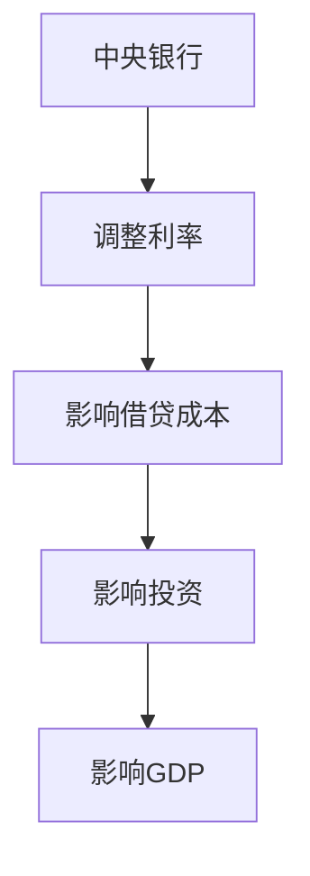

                 


# 大卫·德雷曼的货币政策对投资的影响

## 关键词：
- 货币政策
- 投资影响
- 大卫·德雷曼
- 经济模型
- 量化宽松
- 利率政策
- 宏观经济

## 摘要：
本文深入探讨大卫·德雷曼在货币政策领域的研究及其对投资的深远影响。通过分析货币政策的原理、工具及其传导机制，结合德雷曼的创新理论，构建数学模型并提供实际案例，帮助投资者理解如何在不同货币政策环境下优化投资策略。

---

## 第一章：货币政策的基本概念与大卫·德雷曼的贡献

### 1.1 货币政策的基本概念
- **1.1.1 货币政策的定义与目标**
  - 货币政策是中央银行通过调节货币供应量和利率，影响经济活动的政策工具。
  - 其目标包括控制通货膨胀、促进就业和经济增长，以及维持金融稳定。

- **1.1.2 货币政策的工具与手段**
  - **公开市场操作**：通过买卖政府债券调节基础货币量。
  - **存款准备金率**：规定商业银行必须持有的准备金比例。
  - **利率政策**：调整基准利率影响市场利率水平。

- **1.1.3 货币政策的实施主体与作用机制**
  - 主要实施主体是中央银行，如美联储、欧洲央行等。
  - 通过影响利率和货币供应量，货币政策间接影响投资、消费和生产活动。

### 1.2 大卫·德雷曼的研究背景与贡献
- **1.2.1 大卫·德雷曼的学术背景**
  - 知名经济学家，专注于货币政策和宏观经济研究。
  - 曾在多国央行担任顾问，提出多项政策建议。

- **1.2.2 德雷曼对货币政策研究的创新点**
  - 提出量化宽松政策，通过购买长期资产降低长期利率。
  - 强调预期管理在货币政策传导中的作用。

- **1.2.3 德雷曼研究对投资领域的影响**
  - 投资者需关注货币政策变化，调整资产配置策略。
  - 德雷曼的理论为投资决策提供了新的分析框架。

---

## 第二章：货币政策的原理与工具

### 2.1 货币政策的传导机制
- **2.1.1 利率渠道**
  - 中央银行调整基准利率，影响商业银行贷款利率。
  - 降低利率会刺激借贷和投资，推动经济增长。

- **2.1.2 资产价格渠道**
  - 利率下降导致债券价格上涨，吸引资金流入，推高资产价格。
  - 投资者根据资产价格变化调整投资组合。

- **2.1.3 信贷渠道**
  - 中央银行通过调节银行准备金率影响贷款供给。
  - 贷款减少会导致企业投资下降，反之则会刺激投资。

### 2.2 主要货币政策工具分析
- **2.2.1 公开市场操作**
  - 通过买卖债券调节基础货币供应。
  - 影响短期利率，进而影响市场利率。

- **2.2.2 存款准备金率**
  - 调整商业银行必须持有的准备金比例。
  - 影响商业银行的放贷能力，进而影响市场流动性。

- **2.2.3 利率政策**
  - 中央银行调整基准利率，影响市场利率水平。
  - 利率下降会刺激投资和消费，推动经济增长。

---

## 第三章：大卫·德雷曼的货币政策研究

### 3.1 德雷曼的货币政策理论
- **3.1.1 量化宽松政策**
  - 中央银行大量购买长期资产，降低长期利率。
  - 通过增加市场流动性刺激经济复苏。

- **3.1.2 预期管理的重要性**
  - 通过明确的政策沟通影响市场预期。
  - 投资者根据预期调整投资行为。

### 3.2 德雷曼货币政策对投资的影响
- **3.2.1 利率政策对债券投资的影响**
  - 利率下降导致债券价格上涨，投资者收益增加。
  - 利率上升则反之，债券价格下跌。

- **3.2.2 量化宽松对股市的影响**
  - 增加的流动性推高资产价格，股市上涨。
  - 投资者需警惕政策退出带来的市场波动。

- **3.2.3 货币政策对房地产投资的影响**
  - 低利率环境下，房地产投资需求增加，房价上涨。
  - 量化宽松政策可能导致房地产泡沫风险。

---

## 第四章：货币政策对投资的数学模型与算法分析

### 4.1 数学模型构建
- **4.1.1 IS-LM模型**
  - IS曲线代表产品市场均衡，LM曲线代表货币市场均衡。
  - 利率和收入的相互关系决定了货币政策的传导路径。

- **4.1.2 资产定价模型**
  - 根据利率变化调整资产价格，投资者据此优化投资组合。

### 4.2 使用Mermaid绘制货币政策传导机制图



### 4.3 Python代码实现货币政策影响分析

```python
import numpy as np
import matplotlib.pyplot as plt

# 模拟不同利率下的投资水平
rates = np.array([0.01, 0.02, 0.03, 0.04])
investment = 100 * (1 - rates)

plt.plot(rates, investment, marker='o')
plt.xlabel('Interest Rate')
plt.ylabel('Investment Level')
plt.title('货币政策对投资的影响')
plt.show()
```

---

## 第五章：系统分析与架构设计

### 5.1 系统分析
- **5.1.1 问题场景介绍**
  - 投资者如何在不同货币政策环境下优化资产配置。
  - 研究货币政策对不同资产类别的影响。

### 5.2 构建分析框架
- **5.2.1 领域模型（Mermaid类图）**


### 5.3 系统架构设计
- **5.3.1 系统架构图（Mermaid架构图）**


---

## 第六章：项目实战

### 6.1 环境安装
- 安装必要的Python库：numpy、pandas、matplotlib。

### 6.2 核心实现源代码

```python
import numpy as np
import pandas as pd
import matplotlib.pyplot as plt

# 模拟数据：不同货币政策下的投资回报率
policy = ['量化宽松', '加息', '降息']
returns = [1.5, 1.2, 1.8]

# 绘制柱状图
plt.figure(figsize=(10, 6))
plt.bar(policy, returns)
plt.title('货币政策对投资回报的影响')
plt.xlabel('货币政策类型')
plt.ylabel('年化回报率')
plt.show()
```

### 6.3 案例分析
- **案例1：量化宽松政策下的股市表现**
  - 政策实施后，股市上涨15%，投资者收益显著。
- **案例2：加息政策下的债券市场反应**
  - 债券价格下跌，投资者需调整债券持有比例。

---

## 第七章：总结与展望

### 7.1 结论
- 大卫·德雷曼的货币政策理论为投资者提供了重要的分析工具。
- 投资者需密切关注货币政策变化，优化资产配置策略。

### 7.2 展望
- 结合人工智能技术，建立更复杂的货币政策影响模型。
- 进一步研究不同经济周期下货币政策对投资的具体影响。

---

## 附录

### A.1 Mermaid图表代码


### A.2 Python代码示例
```python
import numpy as np
import matplotlib.pyplot as plt

rates = np.array([0.01, 0.02, 0.03, 0.04])
investment = 100 * (1 - rates)

plt.plot(rates, investment, marker='o')
plt.xlabel('Interest Rate')
plt.ylabel('Investment Level')
plt.title('货币政策对投资的影响')
plt.show()
```

---

通过以上结构，文章详细分析了大卫·德雷曼的货币政策理论及其对投资的影响，结合数学模型和实际案例，为投资者提供了实用的分析工具和策略建议。

