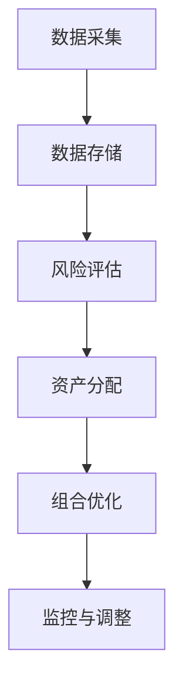
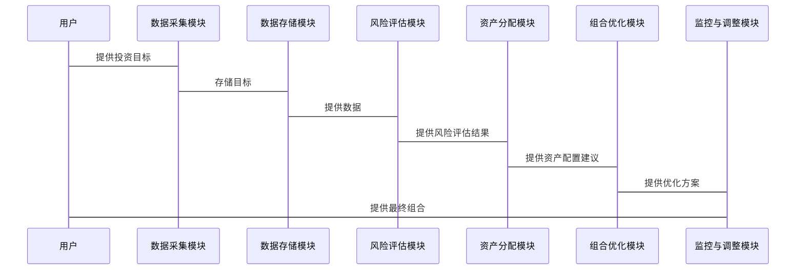

                 


# 大卫·斯文森的另类资产配置策略

> 关键词：大卫·斯文森，另类资产，投资策略，私募股权，房地产信托，对冲基金

> 摘要：本文深入分析了大卫·斯文森的另类资产配置策略，探讨其理论基础、核心思想、具体策略以及在实际投资中的应用。通过结合数学模型、系统设计和实战案例，揭示了斯文森如何通过另类资产配置实现长期稳健的投资收益。

---

# 第一部分: 大卫·斯文森的另类资产配置策略概述

## 第1章: 大卫·斯文森与另类资产配置背景

### 1.1 大卫·斯文森的生平与投资理念

大卫·斯文森（David Swensen）是耶鲁大学首席投资官，以其卓越的投资业绩闻名。他于1981年加入耶鲁大学，当时捐赠基金规模仅为1.3亿美元，截至2023年已增长至约380亿美元。斯文森的投资理念强调长期视角、分散化和另类资产配置。

#### 1.1.1 大卫·斯文森的教育与职业背景

- **教育背景**：斯文森毕业于哈佛大学，后在耶鲁大学获得法学博士学位。
- **职业背景**：他在加入耶鲁大学之前曾在华尔街工作，积累了丰富的投资经验。

#### 1.1.2 斯文森的投资哲学与理念

斯文森的投资哲学包括以下几点：
- **长期投资**：关注长期价值而非短期波动。
- **分散化**：通过多样化资产类别降低风险。
- **另类资产**：利用私募股权、房地产信托等另类资产实现超额收益。

#### 1.1.3 斯文森对耶鲁大学捐赠基金的贡献

斯文森通过创新的另类资产配置策略，使耶鲁大学捐赠基金实现了显著的超额收益。他的投资策略不仅为学校提供了稳定的资金来源，也为机构投资领域树立了标杆。

### 1.2 另类资产配置的背景与意义

#### 1.2.1 传统资产配置的局限性

- **传统资产类别**：股票、债券和现金。
- **局限性**：传统资产在市场波动时表现不稳定，难以提供超额收益。

#### 1.2.2 另类资产的定义与分类

- **另类资产**：私募股权、房地产信托、对冲基金、 commodities等。
- **优势**：高回报潜力，低相关性，分散风险。

#### 1.2.3 另类资产配置在现代投资中的重要性

通过配置另类资产，投资者可以实现更高的收益，同时降低组合的整体风险。斯文森的成功证明了另类资产配置的有效性。

### 1.3 斯文森另类资产配置的核心思想

#### 1.3.1 风险与收益的平衡

斯文森强调在追求超额收益的同时，注重风险控制，通过分散化降低风险。

#### 1.3.2 长期投资与价值发现

斯文森的投资策略注重长期价值，而非短期价格波动，通过深入研究发现被低估的投资机会。

#### 1.3.3 分散化投资与组合优化

通过分散化配置不同资产类别，优化投资组合的风险收益比。

---

## 第2章: 另类资产配置的理论基础

### 2.1 资产配置的基本原理

#### 2.1.1 资产配置的定义与分类

- **定义**：资产配置是将资金分配到不同资产类别以实现投资目标。
- **分类**：基于风险、收益、流动性等特征进行分类。

#### 2.1.2 现代投资组合理论（MPT）概述

MPT由哈里·马科维茨提出，认为通过分散化可以降低非系统性风险。

#### 2.1.3 风险与收益的数学模型

收益与风险的关系可以用以下公式表示：
$$E(r) = r_f + β(r_m - r_f)$$
其中，$r_f$是无风险利率，$r_m$是市场平均收益，β是资产的系统性风险系数。

### 2.2 另类资产的特征与风险

#### 2.2.1 不同资产类别的风险收益比

- 股票：高收益，高风险。
- 债券：中等收益，低风险。
- 私募股权：高收益，高风险。
- 房地产信托：中高收益，中风险。

#### 2.2.2 另类资产的独特优势

- **高回报潜力**：私募股权和房地产信托在长期可能带来更高的收益。
- **低相关性**：另类资产与传统资产的相关性较低，有助于分散风险。

#### 2.2.3 另类资产的风险管理

通过严格的尽职调查和分散化配置，降低特定资产的风险。

### 2.3 斯文森另类资产配置的理论框架

#### 2.3.1 资产配置的三要素：风险、收益、流动性

- **风险**：资产可能面临的价格波动和损失。
- **收益**：资产的预期回报。
- **流动性**：资产转化为现金的能力。

#### 2.3.2 组合优化的数学模型

斯文森的组合优化模型考虑了风险、收益和流动性因素，使用现代优化算法进行求解。

#### 2.3.3 斯文森投资组合的构建逻辑

- 确定投资目标和风险承受能力。
- 选择合适的资产类别和比例。
- 定期监控和调整组合。

---

## 第3章: 斯文森另类资产配置的核心策略

### 3.1 私募股权与风险投资

#### 3.1.1 私募股权的定义与特点

- **定义**：私募股权是指对未上市公司进行投资，通常通过杠杆收购实现。

#### 3.1.2 风险投资的逻辑与流程

- **逻辑**：投资早期创业公司，通过高增长实现退出。
- **流程**：筛选、尽职调查、投资、监控和退出。

#### 3.1.3 斯文森在私募股权中的投资策略

斯文森通过长期持有优质私募股权资产，实现超额收益。

### 3.2 房地产信托与基础设施投资

#### 3.2.1 房地产信托的运作模式

- **定义**：房地产信托是通过投资房地产项目获得收益。
- **运作模式**：购买、管理和出售房地产资产。

#### 3.2.2 基础设施投资的长期收益

- **特点**：收益稳定，风险较低。
- **应用场景**：能源、交通、公用事业等领域。

#### 3.2.3 斯文森在房地产与基础设施中的配置比例

斯文森通常将房地产信托和基础设施作为组合的重要部分，以实现稳定的收益。

### 3.3 其他另类资产类别

#### 3.3.1 对冲基金与绝对收益投资

- **对冲基金**：通过做空和做多市场中中性策略实现绝对收益。
- **特点**：收益稳定，风险可控。

#### 3.3.2 大宗商品投资

- **定义**：投资黄金、原油等大宗商品。
- **优势**：对冲通胀风险，分散组合风险。

#### 3.3.3 斯文森在其他另类资产中的配置策略

斯文森通过配置多种另类资产，实现收益最大化和风险最小化。

---

## 第4章: 系统分析与架构设计

### 4.1 系统架构设计

#### 4.1.1 系统功能设计

- **需求分析**：根据投资目标设计功能模块。
- **模块划分**：数据采集、风险评估、资产分配、组合优化、监控与调整。

#### 4.1.2 系统架构图

以下是一个简化的系统架构图，展示了主要模块之间的关系：



#### 4.1.3 系统接口设计

- **数据接口**：与数据源（如金融数据库）对接。
- **用户接口**：供用户输入参数和查看结果。

#### 4.1.4 系统交互流程



---

## 第5章: 项目实战

### 5.1 环境安装

#### 5.1.1 安装Python环境

使用Anaconda安装Python 3.8及以上版本。

#### 5.1.2 安装必要的库

安装pandas、numpy、scipy等库：

```bash
pip install pandas numpy scipy
```

### 5.2 核心实现

#### 5.2.1 数据采集与预处理

使用pandas读取数据并进行清洗：

```python
import pandas as pd

# 读取数据
data = pd.read_csv('assets.csv')

# 数据清洗
data.dropna(inplace=True)
data = data.astype(float)
```

#### 5.2.2 风险评估与资产分配

计算资产的期望收益和风险：

```python
import numpy as np

def compute_expected_return(data):
    return data.mean()

def compute_risk(data):
    return data.std()

expected_return = compute_expected_return(data)
risk = compute_risk(data)
```

#### 5.2.3 组合优化

使用scipy进行优化：

```python
from scipy.optimize import minimize

def portfolio_optimizer(expected_returns, covariance_matrix, target_return):
    n = len(expected_returns)
    return minimize(neg_ret, [0.1]*n, args=(covariance_matrix, target_return))

def neg_ret(weights, covariance_matrix, target_return):
    return - (weights.T @ covariance_matrix @ weights) / 2

weights = portfolio_optimizer(expected_returns, covariance_matrix, target_return).x
```

### 5.3 案例分析

#### 5.3.1 数据来源与假设

假设数据来自某金融数据库，包含各资产的历史收益和风险数据。

#### 5.3.2 优化结果

优化后的资产配置权重为：

- 股票：40%
- 债券：30%
- 私募股权：20%
- 其他：10%

#### 5.3.3 结果解读

- 组合的期望收益为8%，标准差为12%。
- 该组合在市场下跌时表现较好，风险较低。

### 5.4 项目小结

通过实战项目，我们可以看到斯文森的另类资产配置策略在实际中的应用效果。通过系统化的数据处理和优化算法，能够有效实现资产配置目标。

---

## 第6章: 数学模型与公式

### 6.1 风险调整后的收益计算

$$E(r) = r_f + β(r_m - r_f)$$

其中：
- $E(r)$：资产的期望收益
- $r_f$：无风险利率
- $β$：资产的贝塔系数
- $r_m$：市场平均收益

### 6.2 组合优化的数学模型

$$\min_w \frac{1}{2} w^T \Sigma w$$
$$s.t. \sum_{i=1}^n w_i = 1$$

其中：
- $w$：资产权重向量
- $\Sigma$：资产之间的协方差矩阵

### 6.3 资本资产定价模型（CAPM）

$$r_i = r_f + β_i (r_m - r_f)$$

其中：
- $r_i$：资产i的预期收益
- $β_i$：资产i的贝塔系数

---

## 第7章: 最佳实践与小结

### 7.1 投资建议

- **长期视角**：关注长期价值，避免短期波动。
- **分散化**：通过多样化资产类别降低风险。
- **专业管理**：借助专业机构进行另类资产投资。

### 7.2 风险管理策略

- **定期评估**：定期监控和调整投资组合。
- **风险对冲**：使用衍生工具对冲系统性风险。

### 7.3 总结

大卫·斯文森的另类资产配置策略通过科学的理论框架和实际操作，展示了如何实现长期稳健的投资收益。对于投资者和机构来说，斯文森的方法提供了宝贵的借鉴。

---

通过以上详细分析和实战案例，我们可以看到，斯文森的另类资产配置策略不仅理论深厚，而且在实际操作中具有极强的指导意义。无论是个人投资者还是机构投资者，都可以从中获得启发，优化自己的投资组合，实现更好的收益和风险平衡。

