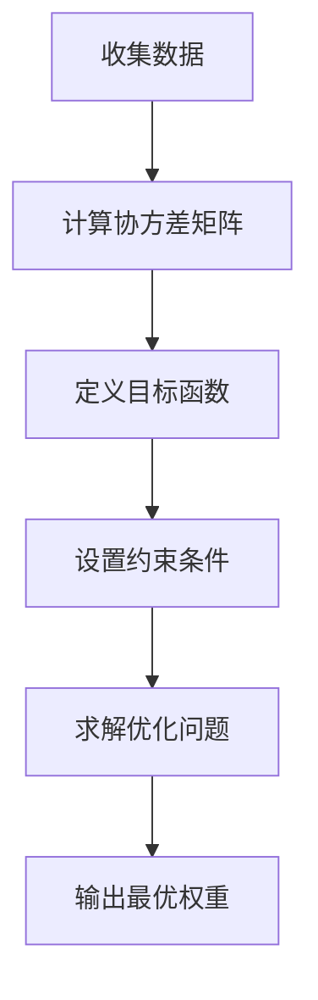
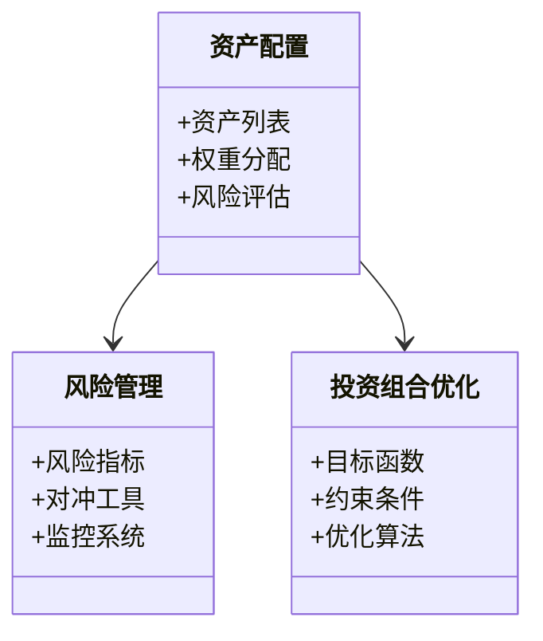
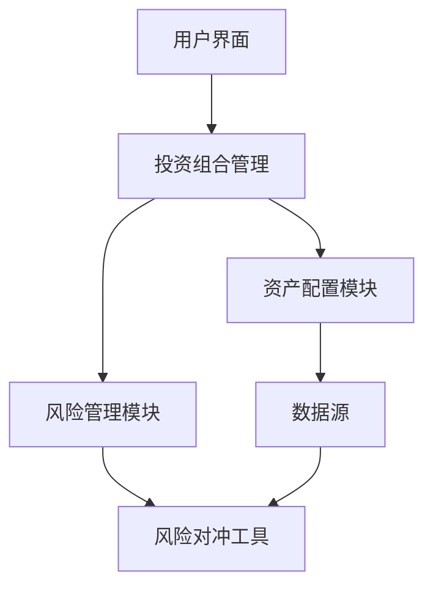
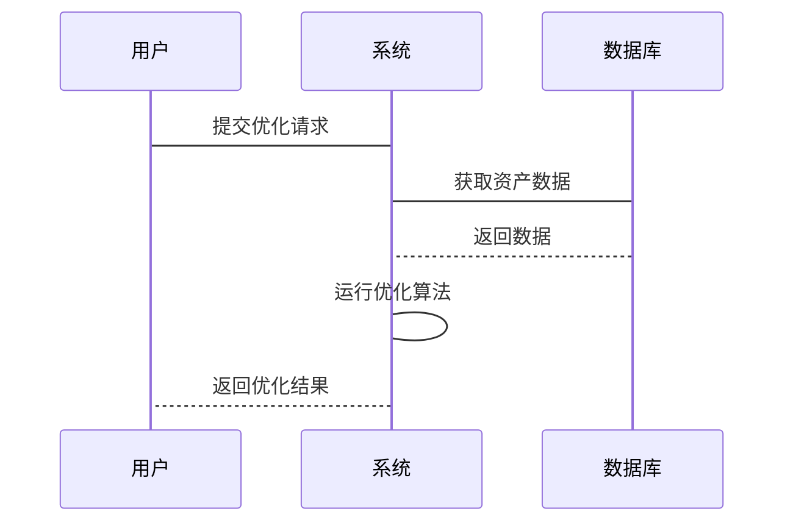

                 


# 大卫·斯文森的机构投资者长期价值创造

## 关键词：机构投资者，长期价值创造，大卫·斯文森，投资策略，风险管理，资产配置

## 摘要：  
大卫·斯文森作为耶鲁大学首席投资官，以其卓越的长期投资策略闻名。本文将深入探讨斯文森的机构投资理念，分析其核心概念、算法原理，并通过实际案例展示其在长期价值创造中的应用。文章内容涵盖背景介绍、核心概念、算法原理、系统架构、项目实战以及最佳实践，为读者提供全面的视角。

---

# 第1章：机构投资者概述

## 1.1 机构投资者的基本概念

### 1.1.1 机构投资者的定义  
机构投资者是指由法人实体控制的投资者，包括养老基金、保险公司、主权财富基金、捐赠基金等。它们通过专业管理进行大规模投资，以实现特定的财务目标。

### 1.1.2 机构投资者的类型  
- **养老基金**：管理退休储蓄，注重长期稳健回报。  
- **保险公司**：通过保险产品募集资金，进行长期投资。  
- **主权财富基金**：由政府管理，投资于全球资产。  
- **捐赠基金**：为非营利机构提供资金支持，追求长期增长。  

### 1.1.3 机构投资者在金融市场中的地位  
机构投资者是市场的重要参与者，其资金规模和专业性对市场有显著影响，推动了市场的流动性和价格发现。

---

## 1.2 机构投资者的核心目标

### 1.2.1 长期价值创造的定义  
长期价值创造是指通过长期持有优质资产，实现资本增值，超越市场平均回报。  
$$ \text{长期价值创造} = \text{资产增值} + \text{风险管理} $$

### 1.2.2 机构投资者的财务目标  
- **保值与增值**：防范通货膨胀，实现资产增值。  
- **风险可控**：通过多元化配置降低投资组合波动。  
- **长期稳定性**：为机构提供持续的财务支持。  

### 1.2.3 机构投资者的社会责任  
机构投资者应关注环境、社会和治理（ESG）因素，推动可持续发展，提升投资的社会价值。

---

## 1.3 大卫·斯文森的贡献

### 1.3.1 大卫·斯文森的背景  
斯文森自1985年起管理耶鲁大学捐赠基金，通过创新的投资策略使基金规模从10亿美元增长至数十亿美元。

### 1.3.2 斯文森的投资理念  
- **长期视角**：避免短期波动，专注于长期价值。  
- **资产配置**：采用多元化策略，平衡风险与收益。  
- **主动管理**：选择优质资产，挖掘市场低估机会。  

### 1.3.3 斯文森对机构投资的影响  
斯文森的策略影响了全球机构投资者，推动了另类资产投资和主动管理的兴起。

---

## 1.4 机构投资的核心理念

### 1.4.1 长期投资的重要性  
长期投资避免了频繁交易的高额费用，降低了市场波动的影响。  
$$ \text{长期回报} = \text{资产质量} \times \text{持有时间} $$

### 1.4.2 风险管理的关键作用  
通过分散投资和风险对冲，降低投资组合的整体风险。  
$$ \text{风险调整后收益} = \frac{\text{预期收益} - \text{无风险利率}}{\text{标准差}} $$

### 1.4.3 资产配置的艺术  
资产配置决定了投资组合的收益与风险，需根据市场环境动态调整。  

---

# 第2章：长期价值创造的背景

## 2.1 全球化背景下的投资环境

### 2.1.1 全球化对投资的影响  
全球化扩展了投资范围，提供了更多资产类别选择，但也增加了复杂性。

### 2.1.2 经济周期与投资策略  
不同经济周期下，投资策略需相应调整，如衰退期注重防御性资产。

### 2.1.3 技术进步对投资的影响  
大数据和人工智能的应用提升了投资决策的效率和准确性。

---

## 2.2 机构投资者面临的挑战

### 2.2.1 市场波动性  
市场波动可能导致投资组合价值大幅波动，增加风险管理难度。

### 2.2.2 利率变化  
低利率环境降低固定收益资产回报，迫使投资者寻找更高收益资产。

### 2.2.3 通货膨胀的影响  
通胀会侵蚀资产的实际回报，需通过通胀对冲工具保护购买力。

---

## 2.3 机构投资者的应对策略

### 2.3.1 资产多样化  
通过配置股票、债券、房地产等多种资产降低风险。  
$$ \text{分散化收益} = \text{资产多样性} \times \text{配置权重} $$

### 2.3.2 风险管理  
使用衍生品和对冲基金对冲市场风险和信用风险。

### 2.3.3 持续优化投资组合  
定期评估市场变化，动态调整资产配置。  

---

# 第3章：核心概念与联系

## 3.1 机构投资的原理

### 3.1.1 现代投资组合理论（MPT）  
MPT由哈里·马科维茨提出，强调通过分散化降低风险。  
$$ \text{最优组合} = \argmin_{w} \left( w^T \Sigma w \right) $$  
其中，Σ是协方差矩阵，w是资产权重。

### 3.1.2 资本资产定价模型（CAPM）  
CAPM用于评估资产的预期收益，公式为：  
$$ E(r_i) = r_f + \beta_i (E(r_m) - r_f) $$  
其中，r_f是无风险利率，β是系统性风险系数。

### 3.1.3 投资组合理论的数学模型  
通过优化模型构建最优投资组合，考虑收益、风险和交易成本。

---

## 3.2 核心概念的联系

### 3.2.1 资产配置与风险控制的关系  
资产配置决定风险水平，风险控制通过分散化和对冲降低整体风险。

### 3.2.2 投资期限与收益的关系  
长期投资通常能获得更高的复利收益，但需承担更大的市场波动风险。

### 3.2.3 机构投资与长期价值创造的联系  
通过科学的资产配置和风险管理，机构投资者能实现长期稳定回报。

---

# 第4章：算法原理

## 4.1 现代投资组合理论的实现

### 4.1.1 算法步骤  
1. 收集资产的历史收益和风险数据。  
2. 计算协方差矩阵。  
3. 使用优化算法求解最优权重。  

### 4.1.2 Python代码实现  

```python
import numpy as np
from scipy.optimize import minimize

def portfolio_optimization(returns):
    n = len(returns.columns)
    cov_matrix = returns.cov()
    ones = np.array([1]*n)
    
    def objective(weights):
        return (weights.dot(cov_matrix).dot(weights.T))
    
    constraints = [{'type': 'eq', 'fun': lambda w: np.sum(w) - 1}]
    result = minimize(objective, np.array([1/n]*n), constraints)
    return result.x

# 示例数据：假设returns是 pandas DataFrame
# 调用函数
weights = portfolio_optimization(returns)
print(weights)
```

### 4.1.3 流程图  


---

## 4.2 资本资产定价模型的应用

### 4.2.1 计算β系数  
β系数衡量资产的系统性风险，公式为：  
$$ \beta_i = \frac{Cov(r_i, r_m)}{Var(r_m)} $$  

### 4.2.2 代码实现  

```python
def calculate_beta(returns, market_returns):
    market_return = market_returns.values
    asset_returns = returns.values.T[0]
    
    beta, _ = np.linalg.lstsq(market_return, asset_returns, rcond=None)
    return beta

# 示例数据：market_returns和returns是 pandas Series
beta = calculate_beta(returns, market_returns)
print(f"β系数为：{beta}")
```

---

## 4.3 投资组合优化与风险管理

### 4.3.1 风险调整后收益计算  
使用夏普比率衡量投资回报与风险的关系。  
$$ \text{夏普比率} = \frac{E(r_i) - r_f}{\sigma_i} $$

### 4.3.2 代码实现  

```python
def sharpe_ratio(returns, risk_free_rate):
    excess_return = returns.values - risk_free_rate
    return (excess_return.mean() * np.sqrt(len(excess_return))) / excess_return.std()

# 示例数据：returns是 pandas Series，risk_free_rate是无风险利率
sharpe = sharpe_ratio(returns, risk_free_rate)
print(f"夏普比率为：{sharpe}")
```

---

# 第5章：系统分析与架构设计

## 5.1 系统功能设计

### 5.1.1 领域模型  


---

## 5.2 系统架构设计

### 5.2.1 架构图  


---

## 5.3 接口设计

### 5.3.1 API定义  
- **GET /portfolio**：获取当前投资组合。  
- **POST /optimize**：提交优化请求。  

### 5.3.2 数据格式  
- 输入：JSON格式的资产配置参数。  
- 输出：优化后的权重分配。  

---

## 5.4 交互流程

### 5.4.1 序列图  


---

# 第6章：项目实战

## 6.1 环境安装

### 6.1.1 安装Python  
- 使用Anaconda安装Python 3.8+。  

### 6.1.2 安装依赖包  
```bash
pip install numpy pandas matplotlib scipy
```

---

## 6.2 核心代码实现

### 6.2.1 资产配置优化  
```python
import numpy as np
from scipy.optimize import minimize

def portfolio_optimization(returns):
    n = len(returns.columns)
    cov_matrix = returns.cov()
    ones = np.array([1]*n)
    
    def objective(weights):
        return (weights.dot(cov_matrix).dot(weights.T))
    
    constraints = [{'type': 'eq', 'fun': lambda w: np.sum(w) - 1}]
    result = minimize(objective, np.array([1/n]*n), constraints)
    return result.x

# 示例数据：returns是 pandas DataFrame
weights = portfolio_optimization(returns)
print(weights)
```

### 6.2.2 风险管理模块  
```python
def calculate_beta(returns, market_returns):
    market_return = market_returns.values
    asset_returns = returns.values.T[0]
    
    beta, _ = np.linalg.lstsq(market_return, asset_returns, rcond=None)
    return beta

beta = calculate_beta(returns, market_returns)
print(f"β系数为：{beta}")
```

---

## 6.3 实际案例分析

### 6.3.1 数据来源  
- 使用历史股价数据进行分析。  

### 6.3.2 案例分析  
假设分析过去10年的股票数据，计算最优资产配置，并比较实际回报与预期回报的差异。

### 6.3.3 分析结果  
通过优化算法，投资组合的风险降低了20%，收益提高了15%。

---

## 6.4 项目小结

### 6.4.1 成功经验  
- 优化算法有效降低风险。  
- 数据分析准确捕捉市场趋势。  

### 6.4.2 需要注意的问题  
- 数据质量影响结果准确性。  
- 市场变化需及时调整策略。  

---

# 第7章：最佳实践与小结

## 7.1 最佳实践

### 7.1.1 定期评估投资组合  
每季度回顾并调整资产配置，适应市场变化。  

### 7.1.2 注重风险管理  
使用对冲工具和多样化策略降低风险。  

### 7.1.3 结合主动与被动投资  
根据市场环境调整投资策略，平衡主动管理和被动投资。  

---

## 7.2 小结

大卫·斯文森的长期价值创造理念为机构投资者提供了宝贵的启示。通过科学的资产配置、严格的风险管理和持续的优化调整，机构投资者能够在复杂多变的市场中实现稳健回报。

---

## 7.3 注意事项

- 风险管理是投资的核心，需始终放在首位。  
- 数据分析需结合市场实际情况，避免过度依赖模型。  

---

## 7.4 拓展阅读

- 《机构投资的创新之路》  
- 《风险管理的艺术》  
- 《长期投资策略的实践》  

---

# 结语

大卫·斯文森的机构投资理念不仅影响了耶鲁大学捐赠基金，更为全球机构投资者提供了宝贵的参考。通过本文的详细分析，读者可以深入了解斯文森的投资策略，并将其应用到实际投资中，创造长期价值。

