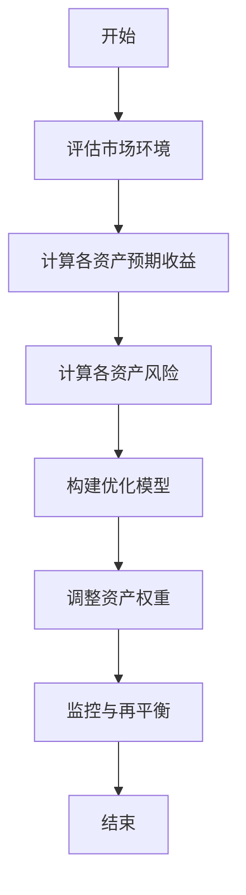
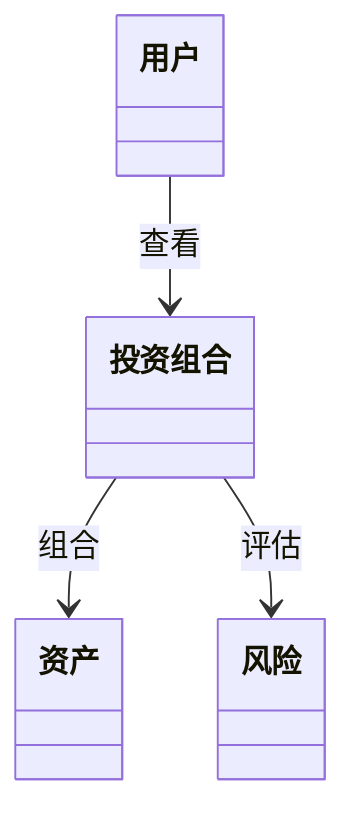
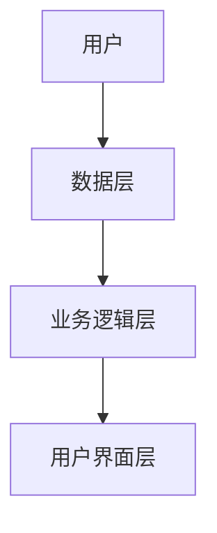
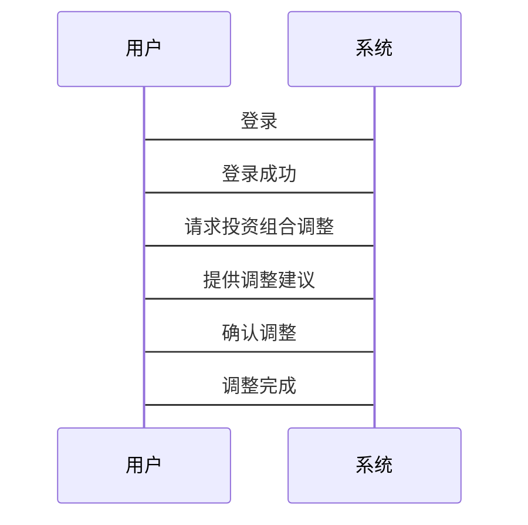

                 


# 大卫·斯文森的耐心资本：长期投资的艺术

## 关键词：
- 耐心资本
- 长期投资
- 资产配置
- 投资组合优化
- 风险管理

## 摘要：
大卫·斯文森的耐心资本理论强调长期投资的重要性，通过科学的资产配置和风险管理，实现稳定的收益。本文详细解析耐心资本的核心理念，探讨其在现代投资中的应用，并通过实际案例和数学模型，展示如何构建和优化投资组合，帮助读者掌握长期投资的艺术。

---

# 第一部分: 耐心资本的背景与核心理念

## 1.1 大卫·斯文森与耐心资本概述

### 1.1.1 大卫·斯文森的生平与投资理念
大卫·斯文森是耶鲁大学首席投资官，以其卓越的投资业绩闻名。他提出耐心资本理论，强调长期投资的重要性，避免短期波动的干扰。

### 1.1.2 耐心资本的定义与核心思想
耐心资本是一种长期投资策略，注重资产配置和风险管理，追求稳定增长。斯文森认为，投资应基于长期目标，而非短期收益。

### 1.1.3 长期投资在现代金融中的重要性
长期投资有助于分散风险，避免市场波动的影响，同时利用复利效应实现财富增长。斯文森的成功证明了长期策略的有效性。

## 1.2 耐心资本的背景与问题背景

### 1.2.1 现代投资环境的挑战
当前市场波动加剧，投资者面临短期压力和信息过载的挑战。短期投资行为可能导致决策失误，忽视长期价值。

### 1.2.2 短期投资行为的局限性
频繁交易增加成本和风险，忽视资产配置的重要性。短期投资难以应对市场的不确定性。

### 1.2.3 长期投资如何解决这些问题
长期投资通过分散投资降低风险，利用复利效应实现财富增长，帮助投资者克服短期波动的干扰。

## 1.3 耐心资本的核心概念与问题描述

### 1.3.1 耐心资本的定义与特征
耐心资本是一种长期持有策略，注重资产配置和风险管理，强调时间和复利的重要性。

### 1.3.2 长期投资与短期投资的对比
长期投资注重价值，短期投资关注价格波动。长期策略更注重风险控制，短期策略可能忽视市场趋势。

### 1.3.3 耐心资本在机构投资中的应用
耐心资本广泛应用于机构投资，如大学捐赠基金，通过长期配置实现稳定的收益。

## 1.4 耐心资本的边界与外延

耐心资本的应用范围广泛，不仅限于机构投资，同样适用于个人投资者。其理念强调长期思维，应用于各种投资策略。

---

# 第二部分: 耐心资本的核心理论与数学模型

## 2.1 耐心资本的核心理论

### 2.1.1 投资组合理论
通过现代投资组合理论，构建最优资产配置，分散风险，实现收益最大化。

### 2.1.2 资产配置策略
根据市场环境调整资产权重，平衡风险与收益，实现长期目标。

## 2.2 耐心资本的数学模型与算法原理

### 2.2.1 投资组合优化的数学模型
使用均值-方差优化模型，计算最优资产配置。公式如下：

$$ \text{目标函数：} \min \sigma^2 $$
$$ \text{约束条件：} \sum w_i = 1, \sum w_i r_i = \mu $$

### 2.2.2 风险调整后的收益
使用夏普比率评估风险调整后的收益，公式为：

$$ \text{夏普比率} = \frac{E(r) - r_f}{\sigma} $$

### 2.2.3 动态资产配置算法
根据市场变化调整投资组合，实现动态优化。流程图展示如下：



---

# 第三部分: 系统分析与架构设计

## 3.1 投资管理系统设计

### 3.1.1 系统功能需求
系统需提供资产配置、风险评估、投资组合优化和动态调整功能。

### 3.1.2 系统架构设计
架构采用分层设计，包括数据层、业务逻辑层和用户界面层。类图和架构图如下：





### 3.1.3 接口设计与交互流程
用户通过登录界面访问系统，进行投资组合调整。流程图展示如下：



---

# 第四部分: 项目实战与投资案例

## 4.1 模拟投资组合配置

### 4.1.1 投资组合配置
配置60%股票、30%债券、10%另类资产。使用Python代码计算最优权重。

### 4.1.2 动态调整策略
根据市场变化，定期评估并调整投资组合。案例分析展示如何应对市场波动。

## 4.2 Python代码实现

### 4.2.1 计算最优权重
```python
import numpy as np

returns = np.array([0.1, 0.05, 0.08])
cov_matrix = np.array([[0.02, 0.01, 0.015],
                        [0.01, 0.03, 0.02],
                        [0.015, 0.02, 0.03]])

# 使用均值-方差优化
def optimize_portfolio(returns, cov_matrix):
    n = len(returns)
    ones = np.ones(n)
    inv_cov = np.linalg.inv(cov_matrix)
    w = inv_cov.dot(ones) / (ones.T.dot(inv_cov.dot(ones)))
    return w

weights = optimize_portfolio(returns, cov_matrix)
print("最优权重：", weights)
```

### 4.2.2 计算风险调整后收益
```python
import numpy as np

mu = np.array([0.1, 0.05, 0.08])
sigma = np.array([0.1, 0.05, 0.07])

sharpe_ratio = (mu - 0.02) / sigma
print("夏普比率：", sharpe_ratio)
```

## 4.3 投资案例分析

### 4.3.1 股票、债券和另类资产配置
分析不同资产类别在组合中的表现，展示长期投资的优势。

### 4.3.2 根据市场变化调整投资组合
根据经济周期调整资产配置，应对市场波动。

---

# 第五部分: 耐心资本的最佳实践与投资策略

## 5.1 耐心资本的核心策略

### 5.1.1 长期投资心态的培养
保持耐心，避免情绪化决策，专注于长期目标。

### 5.1.2 定期投资组合复盘
定期评估投资组合的表现，根据市场变化进行调整。

## 5.2 耐心资本的注意事项

### 5.2.1 风险管理的重要性
设置止损点，分散投资，降低风险。

### 5.2.2 避免短期波动干扰
关注长期趋势，忽略短期市场波动。

## 5.3 投资策略总结

### 5.3.1 资产配置策略
根据风险承受能力和目标，合理配置各类资产。

### 5.3.2 定期再平衡
定期调整投资组合，保持最优配置。

---

# 第六部分: 附录

## 6.1 附录A: 耐心资本相关文献

## 6.2 附录B: Python代码库

## 6.3 附录C: 参考资料

---

# 总结

耐心资本是一种长期投资策略，通过科学的资产配置和风险管理，实现稳定的收益。本文详细解析了大卫·斯文森的理论，探讨了其在现代投资中的应用，并通过实际案例和数学模型，展示了如何构建和优化投资组合。希望读者能从中学到长期投资的艺术，实现财富的稳健增长。

