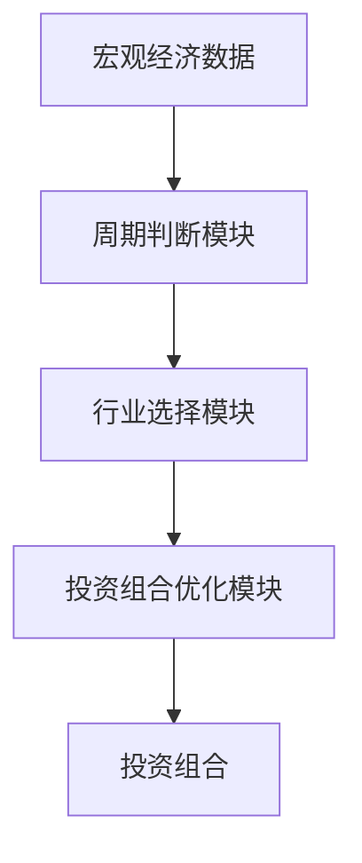

                 


# 大卫·温特斯的周期性价值投资：把握行业轮动机会

## 关键词：周期性价值投资、行业轮动、大卫·温特斯、经济周期、投资策略

## 摘要：  
本文深入探讨了大卫·温特斯的周期性价值投资理念，分析了如何通过行业轮动把握市场周期性机会。文章从经济周期的定义、行业轮动的策略、周期性价值投资的核心原理、技术分析与投资策略、风险管理与组合优化等方面展开，结合实际案例和系统架构，为投资者提供了一套完整的周期性价值投资方法论。

---

# 第一章: 引言

## 1.1 什么是周期性价值投资
周期性价值投资是一种结合了价值投资和周期性分析的投资策略，强调在经济周期的不同阶段选择具有周期性优势的行业和公司进行投资。其核心理念是通过分析经济周期的波动，找到那些在特定周期阶段表现优于市场的行业或股票。

## 1.2 行业轮动的基本概念
行业轮动是指在不同的经济周期阶段，不同行业表现出现轮动的现象。例如，在经济衰退阶段，防御性行业（如公用事业、医疗保健）可能表现较好；而在经济复苏阶段，周期性行业（如材料、工业）可能表现更强。

## 1.3 本文的核心内容
本文将从以下几个方面展开：  
1. 经济周期的分析与行业轮动的关系。  
2. 周期性价值投资的核心策略与实施方法。  
3. 技术分析在周期性投资中的应用。  
4. 风险管理与投资组合优化。  
5. 实战案例分析与系统架构设计。

---

# 第二章: 经济周期与行业轮动

## 2.1 经济周期的定义与阶段
### 2.1.1 经济周期的四个阶段
1. **衰退阶段**：经济增长放缓，企业盈利下降，投资者信心不足。  
2. **复苏阶段**：经济开始回升，企业盈利逐步恢复。  
3. **过热阶段**：经济增长过快，通胀上升，央行可能加息。  
4. **滞胀阶段**：经济增长停滞，通胀高企，企业盈利能力下降。

### 2.1.2 经济周期的驱动因素
- **货币政策**：央行的利率政策对经济周期有重要影响。  
- **财政政策**：政府的支出和税收政策也会影响经济周期。  
- **外部环境**：国际贸易、地缘政治等因素也会对经济周期产生影响。

### 2.1.3 经济周期对市场的影响
在不同的经济周期阶段，市场的表现会有所不同。例如，在衰退阶段，防御性行业表现较好；在过热阶段，周期性行业表现较好。

## 2.2 行业轮动的驱动因素
### 2.2.1 经济周期对行业的直接影响
- **防御性行业**：如公用事业、医疗保健，在衰退阶段表现较好。  
- **周期性行业**：如材料、工业，在复苏和过热阶段表现较好。  

### 2.2.2 宏观经济指标与行业轮动
- **GDP增速**：GDP增速放缓时，防御性行业可能表现较好；GDP增速加快时，周期性行业可能表现较好。  
- **利率水平**：低利率环境下，周期性行业可能受益；高利率环境下，防御性行业可能更受青睐。  

### 2.2.3 行业轮动的周期性规律
行业轮动通常遵循一定的周期性规律，例如：  
1. 在衰退阶段，防御性行业表现较好。  
2. 在复苏阶段，周期性行业逐渐走强。  
3. 在过热阶段，周期性行业继续走强，但需警惕政策调控风险。  
4. 在滞胀阶段，市场整体表现不佳，防御性行业可能相对较好。

## 2.3 行业轮动的策略选择
### 2.3.1 如何选择具有周期性优势的行业
- **行业周期分析**：分析行业所处的周期阶段，选择处于上升周期的行业。  
- **估值分析**：选择估值合理的行业，避免估值过高的行业。  
- **政策分析**：关注政策对行业的支持或打压。

### 2.3.2 行业轮动的时机把握
- **提前布局**：在经济周期拐点出现前，提前布局相关行业。  
- **顺势而为**：在行业轮动趋势中，顺势而为，避免逆势操作。  

### 2.3.3 行业轮动的风险控制
- **分散投资**：避免过度集中于单一行业或板块。  
- **设置止损**：在行业轮动过程中，设置止损点，控制风险。  
- **定期调整**：根据市场变化，定期调整投资组合。

---

# 第三章: 周期性价值投资的核心策略

## 3.1 周期性价值投资的核心原理
周期性价值投资的核心在于通过分析经济周期的波动，选择那些在特定周期阶段具有估值优势的行业或公司进行投资。其核心思想是：  
1. 在经济衰退阶段，选择防御性行业的低估股票进行投资。  
2. 在经济复苏或过热阶段，选择周期性行业的低估股票进行投资。  

## 3.2 周期性价值投资的实施步骤
### 3.2.1 确定经济周期阶段
- **数据收集**：收集GDP增速、利率、通胀等宏观经济数据。  
- **周期判断**：根据宏观经济数据，判断当前经济所处的周期阶段。  

### 3.2.2 选择具有周期性优势的行业
- **行业分析**：分析各行业的周期性特征，选择与当前经济周期阶段相匹配的行业。  
- **估值分析**：选择估值合理的行业，避免估值过高的行业。  

### 3.2.3 构建投资组合
- **行业配置**：根据周期性分析结果，配置相关行业。  
- **个股选择**：在选定的行业中，选择具有估值优势的个股。  

## 3.3 周期性价值投资的数学模型
### 3.3.1 经济周期判断模型
使用宏观经济指标（如GDP增速、利率、通胀）构建经济周期判断模型。  
公式：  
$$ \text{经济周期阶段} = f(\text{GDP增速}, \text{利率}, \text{通胀}) $$  

### 3.3.2 行业选择模型
根据经济周期阶段，选择具有周期性优势的行业。  
公式：  
$$ \text{行业选择} = f(\text{经济周期阶段}, \text{行业周期性特征}) $$  

## 3.4 周期性价值投资的系统架构
### 3.4.1 系统功能设计
- **数据收集模块**：收集宏观经济数据和行业数据。  
- **周期判断模块**：根据宏观经济数据判断经济周期阶段。  
- **行业选择模块**：根据经济周期阶段选择具有周期性优势的行业。  
- **投资组合优化模块**：根据行业选择结果构建投资组合。  

### 3.4.2 系统架构图


---

# 第四章: 技术分析与投资策略

## 4.1 技术分析在周期性投资中的应用
### 4.1.1 技术分析的基本概念
技术分析是通过分析历史价格和成交量数据，预测未来价格走势的一种方法。其核心思想是：  
1. 市场价格反映所有信息。  
2. 历史价格走势具有周期性。  
3. 市场价格走势具有延续性。  

### 4.1.2 技术分析在周期性投资中的作用
技术分析可以帮助投资者更好地把握行业轮动的时机。例如：  
- **趋势线**：通过趋势线分析行业指数的走势，判断行业的上升或下降趋势。  
- **成交量分析**：通过成交量分析判断行业的买卖力量强弱。  

## 4.2 技术分析的实战应用
### 4.2.1 行业指数的趋势分析
以某行业指数为例，分析其趋势线和支撑线。  
```mermaid
line_chart
    "2020": 100
    "2021": 120
    "2022": 110
    "2023": 130
    "2024": 140
```

### 4.2.2 技术指标的应用
- **相对强弱指数（RSI）**：用于判断行业指数的超买或超卖状态。  
- **移动平均线（MA）**：用于判断行业指数的短期或长期趋势。  

### 4.2.3 技术分析的优缺点
- **优点**：可以帮助投资者更好地把握行业轮动的时机。  
- **缺点**：技术分析具有一定的主观性，且市场波动较大时可能失效。  

## 4.3 技术分析与周期性投资的结合
### 4.3.1 周期性分析与技术分析的结合
- 在经济周期判断的基础上，结合技术分析判断行业轮动的时机。  
- 例如：在经济衰退阶段，结合技术分析判断防御性行业的买卖时机。  

### 4.3.2 技术分析的系统化应用
- 使用技术指标构建行业轮动的交易系统。  
- 例如：使用RSI和MA指标构建行业指数的买卖信号。  

---

# 第五章: 风险管理与投资组合优化

## 5.1 风险管理的核心原则
### 5.1.1 风险分散
通过投资不同行业和不同股票，分散投资风险。  
### 5.1.2 仓位管理
根据市场波动和个人风险承受能力，合理控制仓位。  
### 5.1.3 设置止损
在投资组合中设置止损点，避免重大亏损。  

## 5.2 投资组合优化的策略
### 5.2.1 行业配置优化
根据经济周期阶段，动态调整行业配置比例。  
### 5.2.2 股票选择优化
在选定的行业中，选择具有估值优势的个股。  
### 5.2.3 定期再平衡
定期调整投资组合，确保与经济周期阶段匹配。  

## 5.3 风险管理的数学模型
### 5.3.1 风险分散模型
$$ \text{投资组合风险} = \sqrt{\sum_{i=1}^{n} w_i^2 \sigma_i^2} $$  
其中，\( w_i \) 为第 \( i \) 个资产的权重，\( \sigma_i \) 为第 \( i \) 个资产的波动率。  

### 5.3.2 仓位管理模型
$$ \text{仓位} = \frac{\text{账户资金}}{\text{投资标的当前价格}} \times \text{杠杆比例} $$  

---

# 第六章: 实战案例分析

## 6.1 实战案例背景
假设当前经济处于复苏阶段，选择周期性行业（如材料、工业）进行投资。

## 6.2 实战案例分析
### 6.2.1 行业选择
根据经济周期判断，当前处于复苏阶段，选择材料行业。  
### 6.2.2 股票选择
在材料行业中，选择估值合理的公司（如某材料公司）。  
### 6.2.3 投资组合构建
将资金分配到材料行业，并持有一定比例的防御性行业（如公用事业）作为对冲。  

## 6.3 实战案例小结
通过周期性分析和行业轮动策略，成功捕捉到了材料行业的上涨机会，投资组合表现优于市场指数。

---

# 第七章: 总结与展望

## 7.1 本文总结
本文系统地介绍了大卫·温特斯的周期性价值投资理念，分析了经济周期与行业轮动的关系，提出了周期性价值投资的核心策略和技术分析方法，最后结合实战案例进行了详细分析。

## 7.2 未来展望
随着市场环境的变化，周期性价值投资将面临新的机遇和挑战。未来的研究可以进一步结合人工智能和大数据技术，优化行业轮动策略，提高投资收益。

---

通过本文的学习，读者可以掌握周期性价值投资的核心方法，并能够在实际投资中灵活运用，把握行业轮动带来的投资机会。

