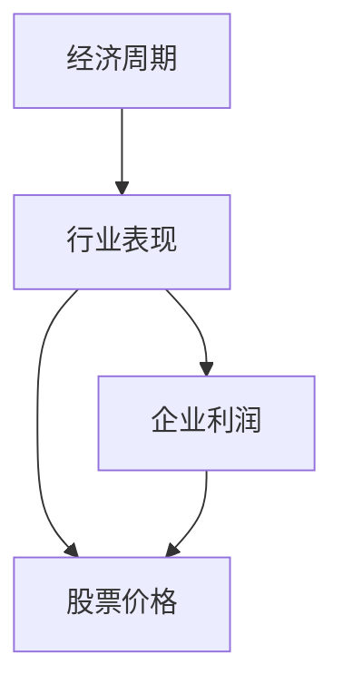

                 


# 大卫·温特斯的周期性行业价值投资

> 关键词：周期性行业、价值投资、大卫·温特斯、行业分析、财务指标

> 摘要：本文深入探讨了周期性行业的价值投资策略，结合大卫·温特斯的投资理念，系统性地分析了周期性行业的定义、核心要素、财务指标、投资策略、风险管理及行业案例。通过详细的技术分析和实际案例，帮助投资者理解周期性行业的投资机会和挑战，掌握周期性行业的价值投资方法。

---

# 第1章 周期性行业的定义与特点

## 1.1 周期性行业的定义

### 1.1.1 周期性行业的基本概念

周期性行业是指那些业务表现受经济周期波动显著影响的行业。这类行业在经济繁荣时表现良好，而在经济衰退时则可能面临业绩下滑。周期性行业的波动性较高，但同时也伴随着较高的投资机会。

**周期性行业的定义公式：**
$$
\text{周期性行业} = f(\text{经济周期波动}, \text{行业表现})
$$

### 1.1.2 周期性行业的分类与特征

周期性行业可以分为强周期性和弱周期性行业。强周期性行业受经济波动影响较大，例如建筑材料、汽车制造和能源行业；弱周期性行业受经济波动影响较小，例如信息技术和医疗行业。

**行业分类对比表格：**

| 行业类别 | 特点 | 代表行业 |
|----------|------|-----------|
| 强周期性 | 波动性高，与经济周期高度相关 | 建筑材料、汽车制造、能源 |
| 弱周期性 | 波动性低，与经济周期相关性较低 | 信息技术、医疗、公用事业 |

### 1.1.3 周期性行业与宏观经济的关系

周期性行业与宏观经济密切相关，经济周期的波动直接影响行业的供需关系和价格水平。例如，在经济衰退期间，建筑材料的需求可能大幅下降，而在经济复苏期间，汽车制造业的销售可能显著增长。

**经济周期与行业表现的图解：**



---

## 1.2 周期性行业的核心要素

### 1.2.1 周期性行业的核心概念

周期性行业的核心概念包括行业周期、行业波动性和行业竞争力。行业周期是指行业的兴衰过程，通常分为繁荣期、衰退期、萧条期和复苏期。

**行业周期的四个阶段：**

1. **繁荣期**：行业需求旺盛，企业利润增长。
2. **衰退期**：行业需求下降，企业利润减少。
3. **萧条期**：行业需求极度疲软，企业可能面临亏损。
4. **复苏期**：行业需求逐步恢复，企业利润开始回升。

### 1.2.2 周期性行业的核心要素对比表格

| 核心要素 | 定义 | 重要性 |
|----------|------|--------|
| 行业周期 | 行业的兴衰过程 | 高，决定投资机会 |
| 行业波动性 | 行业收益的波动程度 | 高，影响投资风险 |
| 行业竞争力 | 行业内的竞争程度 | 高，影响企业的市场份额 |

### 1.2.3 周期性行业ER实体关系图

```mermaid
erDiagram
    client++<--"投资周期性行业">
    client --> "行业周期"
    client --> "行业波动性"
    client --> "行业竞争力"
```

---

## 1.3 周期性行业的投资价值

### 1.3.1 周期性行业的投资价值来源

周期性行业的投资价值来源于其在经济周期中的波动性。在经济繁荣期，周期性行业的股票价格可能大幅上涨；而在经济衰退期，周期性行业的股票价格可能被低估，为投资者提供抄底机会。

### 1.3.2 周期性行业的投资机会与风险

**投资机会：**
- 在经济复苏期，周期性行业的股票可能被低估，提供较高的投资回报。
- 在经济繁荣期，周期性行业的股票可能达到峰值，提供较高的卖出收益。

**投资风险：**
- 周期性行业的波动性较高，可能面临较大的价格波动风险。
- 经济衰退期，周期性行业的企业可能面临较高的违约风险。

### 1.3.3 周期性行业投资的长期与短期策略

**长期策略：**
- 投资那些具有强大竞争优势和稳定现金流的周期性企业。
- 选择那些在经济衰退期仍能保持盈利的周期性行业。

**短期策略：**
- 在经济衰退期买入被低估的周期性股票。
- 在经济复苏期卖出周期性股票以锁定收益。

---

## 1.4 本章小结

本章详细介绍了周期性行业的定义、分类、核心要素及其与宏观经济的关系。通过对比分析和图解，帮助读者理解周期性行业的特点及其投资价值。

---

# 第2章 周期性行业价值投资的核心概念

## 2.1 周期性行业的财务指标分析

### 2.1.1 收入与利润分析

**收入分析：**
- 总收入：企业的总收入，包括营业收入和其他收入。
- 收入增长率：总收入的变化率，反映企业的增长能力。

**利润分析：**
- 净利润：企业的最终利润，反映企业的盈利能力。
- 净利润增长率：净利润的变化率，反映企业的盈利能力变化。

### 2.1.2 现金流分析

**现金流分析：**
- 经营活动现金流：企业经营活动产生的现金流，反映企业的运营能力。
- 投资活动现金流：企业投资活动产生的现金流，反映企业的投资能力。
- 筹资活动现金流：企业筹资活动产生的现金流，反映企业的筹资能力。

### 2.1.3 估值指标分析

**估值指标：**
- 市盈率（P/E）：股票价格与每股收益的比率，反映股票的估值水平。
- 市净率（P/B）：股票价格与每股净资产的比率，反映股票的估值水平。
- 市销率（P/S）：股票价格与每股销售收入的比率，反映股票的估值水平。

---

## 2.2 周期性行业的投资策略

### 2.2.1 周期性行业的长期投资策略

**长期投资策略：**
- 投资那些具有强大竞争优势和稳定现金流的周期性企业。
- 选择那些在经济衰退期仍能保持盈利的周期性行业。

### 2.2.2 周期性行业的短期投资策略

**短期投资策略：**
- 在经济衰退期买入被低估的周期性股票。
- 在经济复苏期卖出周期性股票以锁定收益。

### 2.2.3 周期性行业的逆向投资法

**逆向投资法：**
- 在市场恐慌时买入被低估的周期性股票。
- 在市场乐观时卖出周期性股票以锁定收益。

---

## 2.3 周期性行业的风险管理

### 2.3.1 周期性行业的风险来源

**风险来源：**
- 市场风险：周期性行业的股票价格可能大幅波动。
- 利率风险：周期性行业的债务成本可能受利率波动影响。
- 经济风险：经济衰退可能影响周期性行业的盈利能力。

### 2.3.2 周期性行业的风险控制

**风险控制：**
- 分散投资：通过投资不同行业的股票降低风险。
- 严格止损：设定止损点以限制亏损。
- 保持流动性：确保在市场下跌时能够及时变现。

### 2.3.3 周期性行业的风险管理工具

**风险管理工具：**
- 期权：用于对冲价格波动风险。
- 期货：用于对冲利率和汇率风险。
- 债券：用于对冲市场风险。

---

## 2.4 本章小结

本章详细介绍了周期性行业的财务指标分析、投资策略和风险管理。通过具体的分析方法和策略，帮助投资者在周期性行业中实现稳健的投资回报。

---

# 第3章 周期性行业的财务分析与投资决策

## 3.1 周期性行业的财务分析方法

### 3.1.1 财务报表分析

**财务报表分析：**
- 资产负债表：反映企业的资产、负债和所有者权益。
- 利润表：反映企业的收入、成本和利润。
- 现金流量表：反映企业的现金流情况。

### 3.1.2 财务比率分析

**财务比率：**
- 流动比率：流动资产与流动负债的比率，反映企业的短期偿债能力。
- 速动比率：速动资产与流动负债的比率，反映企业的短期偿债能力。
- 资产负债率：负债与资产的比率，反映企业的财务杠杆。

### 3.1.3 现金流量分析

**现金流量分析：**
- 经营活动现金流：企业经营活动产生的现金流。
- 投资活动现金流：企业投资活动产生的现金流。
- 筹资活动现金流：企业筹资活动产生的现金流。

---

## 3.2 周期性行业的投资决策模型

### 3.2.1 投资决策模型的构建

**投资决策模型：**
- 确定投资目标：明确投资周期和风险偏好。
- 选择投资策略：根据市场情况选择合适的投资策略。
- 设定止损和止盈：确保投资收益和风险可控。

### 3.2.2 投资决策模型的验证

**模型验证：**
- 回测：通过历史数据验证模型的有效性。
- 现场测试：通过实际市场数据验证模型的可行性。

### 3.2.3 投资决策模型的应用

**模型应用：**
- 在经济衰退期买入被低估的周期性股票。
- 在经济复苏期卖出周期性股票以锁定收益。

---

## 3.3 周期性行业的财务分析案例

### 3.3.1 某周期性行业的财务分析实例

**案例分析：**
- 选择一家周期性企业，分析其财务报表。
- 计算其财务比率，评估其财务健康状况。
- 基于财务分析结果，提出投资建议。

### 3.3.2 案例分析的启示

**启示：**
- 财务分析是投资决策的重要依据。
- 周期性行业的财务指标波动性较大，需要谨慎分析。

---

## 3.4 本章小结

本章通过具体的财务分析方法和投资决策模型，帮助投资者在周期性行业中做出明智的投资决策。

---

# 第4章 周期性行业的行业分析与投资机会

## 4.1 周期性行业的行业分析

### 4.1.1 行业周期分析

**行业周期分析：**
- 繁荣期：行业需求旺盛，企业利润增长。
- 衰退期：行业需求下降，企业利润减少。
- 萧条期：行业需求极度疲软，企业可能面临亏损。
- 复苏期：行业需求逐步恢复，企业利润开始回升。

### 4.1.2 行业竞争分析

**行业竞争分析：**
- 市场集中度：行业内的主要竞争者数量和市场份额。
- 进入壁垒：行业内新进入者的难度。

### 4.1.3 行业政策分析

**行业政策分析：**
- 政府政策：政府对行业的支持或限制政策。
- 行业法规：行业内的法律法规。

---

## 4.2 周期性行业的投资机会评估

### 4.2.1 投资机会的识别

**投资机会识别：**
- 识别行业周期：判断行业所处的周期阶段。
- 评估行业竞争：选择具有竞争优势的行业。

### 4.2.2 投资机会的评估

**投资机会评估：**
- 评估行业的财务状况。
- 评估行业的市场前景。

### 4.2.3 投资机会的优先级排序

**投资机会排序：**
- 根据行业的风险和收益进行排序。
- 选择具有高收益低风险的行业。

---

## 4.3 本章小结

本章通过行业分析和投资机会评估，帮助投资者识别和选择具有高投资价值的周期性行业。

---

# 第5章 周期性行业的风险管理

## 5.1 周期性行业的风险来源

### 5.1.1 市场风险

**市场风险：**
- 股票价格的波动可能影响投资收益。

### 5.1.2 利率风险

**利率风险：**
- 利率的变动可能影响周期性行业的债务成本。

### 5.1.3 经济风险

**经济风险：**
- 经济衰退可能影响周期性行业的盈利能力。

---

## 5.2 周期性行业的风险控制

### 5.2.1 严格止损

**严格止损：**
- 设定止损点以限制亏损。

### 5.2.2 保持流动性

**保持流动性：**
- 确保在市场下跌时能够及时变现。

### 5.2.3 分散投资

**分散投资：**
- 通过投资不同行业的股票降低风险。

---

## 5.3 周期性行业的风险管理工具

### 5.3.1 期权

**期权：**
- 用于对冲价格波动风险。

### 5.3.2 期货

**期货：**
- 用于对冲利率和汇率风险。

### 5.3.3 债券

**债券：**
- 用于对冲市场风险。

---

## 5.4 本章小结

本章通过详细的风险管理方法和工具，帮助投资者在周期性行业中降低投资风险，实现稳健收益。

---

# 第6章 大卫·温特斯的经典案例分析

## 6.1 大卫·温特斯的投资理念

### 6.1.1 逆向投资

**逆向投资：**
- 在市场恐慌时买入被低估的股票。

### 6.1.2 长期投资

**长期投资：**
- 投资那些具有强大竞争优势和稳定现金流的企业。

---

## 6.2 经典案例分析

### 6.2.1 某周期性行业的投资决策过程

**案例分析：**
- 选择一家周期性企业，分析其财务状况和行业前景。
- 根据大卫·温特斯的投资理念，制定投资策略。

### 6.2.2 投资决策的启示

**启示：**
- 逆向投资需要勇气和耐心。
- 长期投资需要选择具有强大竞争优势的企业。

---

## 6.3 本章小结

本章通过大卫·温特斯的经典案例，帮助投资者理解周期性行业的投资策略和风险管理方法。

---

# 第7章 总结与展望

## 7.1 总结

本总结回顾了周期性行业的定义、财务分析、投资策略和风险管理方法。通过详细的技术分析和实际案例，帮助投资者理解周期性行业的投资机会和挑战。

## 7.2 展望

未来，周期性行业的投资机会将更加多样化。投资者需要密切关注宏观经济的变化，灵活调整投资策略，以应对不断变化的市场环境。

---

# 结语

周期性行业的价值投资需要投资者具备扎实的行业分析能力和风险管理能力。通过本文的系统性分析，投资者可以在周期性行业中找到高收益低风险的投资机会，实现长期稳健的投资回报。

---

# 参考文献

（此处列出相关书籍、论文和网站等参考文献）

