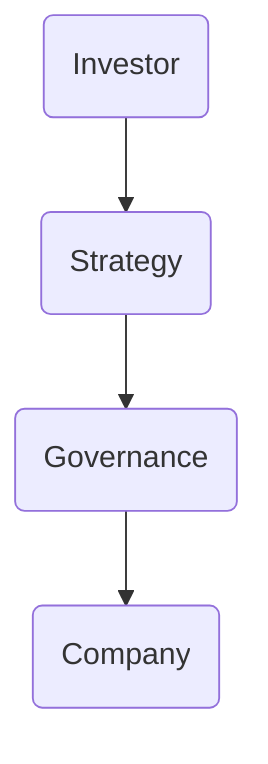
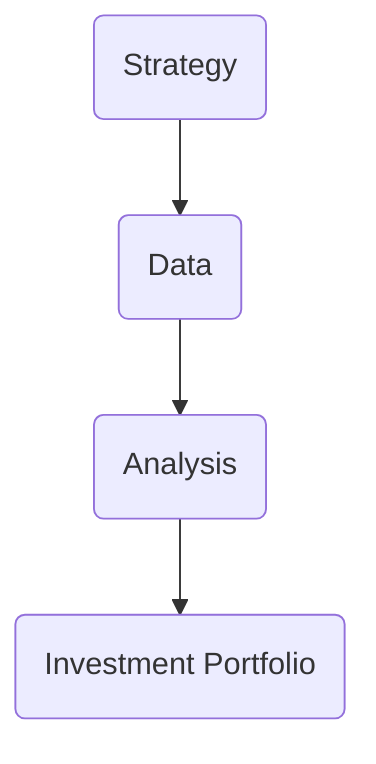
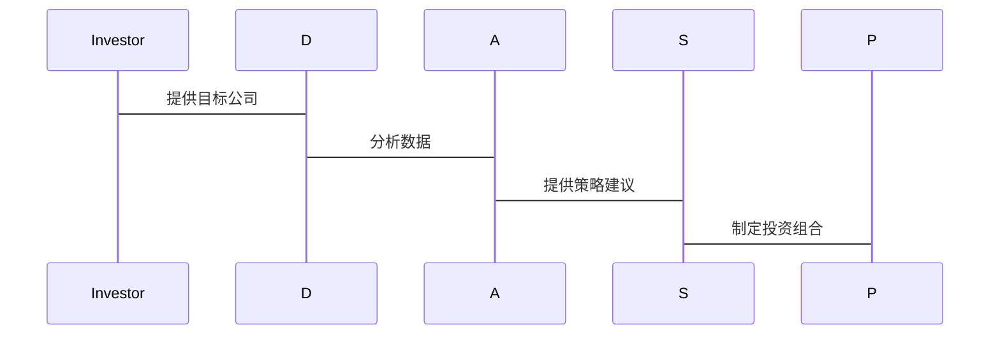

                 


# 大卫·艾伦·科恩的activist投资策略

## 关键词：activist投资策略，股东activism，投资策略，企业治理，大卫·艾伦·科恩

## 摘要：activist投资策略是一种通过积极持有和干预企业治理来实现投资目标的策略，本文将深入探讨该策略的核心概念、算法原理、系统架构及实际应用案例。

---

# 第一部分: 大卫·艾伦·科恩的activist投资策略概述

## 第1章: activist投资策略的背景与概念

### 1.1 activist投资策略的背景

#### 1.1.1 投资者 activism 的起源与发展
activist投资策略起源于20世纪70年代，随着股东 activism 的兴起而逐渐发展。投资者通过持有公司股份，积极参与公司治理，推动管理层改进企业运营、提升股东价值。大卫·艾伦·科恩作为这一领域的代表人物，提出了许多创新的投资策略。

#### 1.1.2 activist投资策略的核心目标
activist投资策略的核心目标是通过积极干预企业治理，优化企业运营效率，提升公司价值，从而为投资者带来超额收益。

#### 1.1.3 activist投资策略与传统投资的区别
- **传统投资策略**：注重长期持有和价值发现，较少干预企业内部管理。
- **activist投资策略**：注重通过股东 activism 影响企业决策，推动短期价值提升。

### 1.2 activist投资策略的问题背景

#### 1.2.1 当前企业治理中的主要问题
- 企业治理不透明
- 管理层决策失误
- 股东权益保护不足

#### 1.2.2 投资者在企业治理中的角色
投资者不仅是资金提供者，也是企业治理的重要参与者。通过activist投资策略，投资者可以更直接地影响企业决策。

#### 1.2.3 activist投资策略的适用场景
- 企业治理不善
- 股价被低估
- 管理层与股东利益不一致

### 1.3 activist投资策略的解决方法

#### 1.3.1 通过股东 activism 改善企业治理
activist投资者通过提名董事、提出议案等方式，推动企业改善治理结构。

#### 1.3.2 activist投资策略的核心要素
- 股权比例：持有足够股份以影响决策
- 治理结构：通过董事会和股东大会干预企业运营
- 投资目标：短期价值提升与长期收益结合

### 1.4 activist投资策略的概念结构

#### 1.4.1 核心概念的组成与关系
activist投资策略涉及的核心概念包括：
- 股东 activism
- 治理结构
- 投资目标
- 风险管理

#### 1.4.2 activist投资策略的属性特征对比
| 属性 | 传统投资策略 | activist投资策略 |
|------|--------------|------------------|
| 投资目标 | 长期价值发现 | 短期价值提升 |
| 干预程度 | 低 | 高 |
| 股权要求 | 低 | 高 |

#### 1.4.3 ER实体关系图架构


---

## 第2章: activist投资策略的核心概念与联系

### 2.1 activist投资策略的原理

#### 2.1.1 股东 activism 的核心机制
通过持有公司股份，activist投资者可以：
- 提名董事
- 提出议案
- 影响管理层决策

#### 2.1.2 activist投资策略的逻辑流程
1. 选择目标公司
2. 获得足够股权
3. 提出治理建议
4. 监督执行

#### 2.1.3 activist投资策略的关键因素
- 股权比例
- 治理结构
- 管理层反应

### 2.2 activist投资策略的属性特征对比

#### 2.2.1 activist投资策略的属性分析
- **风险性**：高风险，但潜在回报高
- **复杂性**：需要复杂的治理干预
- **时间性**：短期干预与长期收益结合

#### 2.2.2 不同投资策略的特征对比
| 策略 | 风险 | 复杂性 | 时间性 |
|------|------|--------|--------|
| 传统 | 低   | 低     | 长     |
| activist | 高 | 高     | 短     |

#### 2.2.3 activist投资策略的优缺点
- **优点**：能够快速提升公司价值
- **缺点**：风险高，可能引发管理层抵触

---

## 第3章: activist投资策略的算法与数学模型

### 3.1 activist投资策略的算法原理

#### 3.1.1 算法的核心思想
通过数学模型评估企业价值，预测市场反应，制定投资策略。

#### 3.1.2 算法的逻辑流程
1. 数据收集：公司基本面、市场数据
2. 模型分析：评估公司价值
3. 策略制定：确定干预措施
4. 风险评估：量化投资风险

### 3.2 数学模型与公式

#### 3.2.1 评估公司价值的数学模型
$$ V = \frac{E}{1 + r} $$
其中，\( E \) 为公司预期收益，\( r \) 为折现率。

#### 3.2.2 市场反应预测的数学模型
$$ P = \alpha + \beta \times R $$
其中，\( R \) 为市场收益，\( \beta \) 为公司股票的贝塔系数。

#### 3.2.3 投资组合优化的数学模型
$$ \text{Maximize } \mu = r_p - \lambda \times \sigma_p $$
其中，\( \mu \) 为组合收益，\( \sigma_p \) 为组合风险，\( \lambda \) 为风险厌恶系数。

---

## 第4章: activist投资策略的系统架构设计

### 4.1 系统功能设计

#### 4.1.1 数据收集模块
- 收集目标公司的基本面数据
- 获取市场数据

#### 4.1.2 数据分析模块
- 评估公司价值
- 预测市场反应

#### 4.1.3 策略制定模块
- 确定干预措施
- 制定投资组合

### 4.2 系统架构设计



### 4.3 系统交互设计



---

## 第5章: activist投资策略的项目实战

### 5.1 项目环境配置

#### 5.1.1 系统环境
- 操作系统：Linux
- 开发工具：Python, Jupyter Notebook
- 数据库：MySQL

### 5.2 核心实现代码

#### 5.2.1 数据分析代码
```python
import pandas as pd
import numpy as np

# 数据预处理
data = pd.read_csv('company_data.csv')
data = data.dropna()
```

#### 5.2.2 模型实现代码
```python
from sklearn import linear_model

# 线性回归模型
model = linear_model.LinearRegression()
model.fit(X, y)
```

### 5.3 代码应用解读

#### 5.3.1 数据分析模块
- 使用Python进行数据清洗和分析
- 应用线性回归模型预测市场反应

#### 5.3.2 投资组合优化模块
- 使用数学模型优化投资组合
- 结合activist策略制定投资计划

### 5.4 实际案例分析

#### 5.4.1 案例背景
选择一家治理不善的公司，通过activist策略推动改善。

#### 5.4.2 数据收集与分析
- 收集公司基本面数据
- 分析公司价值
- 预测市场反应

### 5.5 实战总结与经验分享

#### 5.5.1 实战总结
- activ

