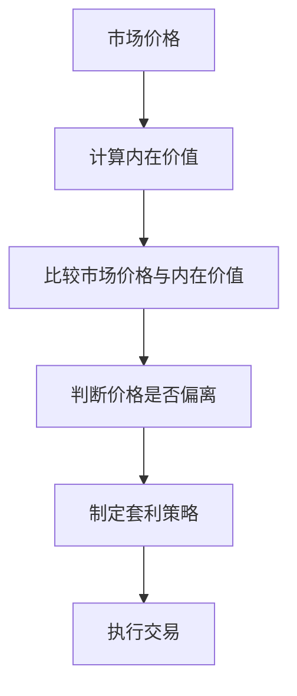

                 

# 《大卫·艾因霍恩的短期价值投资：市场错误定价的套利》

## 关键词：短期价值投资、市场错误定价、套利策略、大卫·艾因霍恩、投资分析

## 摘要：  
大卫·艾因霍恩以其独特的短期价值投资理念闻名，专注于市场错误定价的套利机会。本文深入探讨了大卫·艾因霍恩的投资方法论，分析了如何识别市场错误定价，并通过数学模型和算法详细讲解了套利策略的实施与风险管理。结合实际案例，本文为读者提供了从理论到实践的全面指导，帮助投资者更好地理解和应用短期价值投资策略。

---

# 第1章：短期价值投资概述

## 1.1 大卫·艾因霍恩的投资理念

### 1.1.1 价值投资的定义与核心思想  
价值投资是一种以基本面分析为基础的投资策略，旨在通过识别市场中被低估的资产进行投资，以期在长期实现超额收益。大卫·艾因霍恩将其扩展为短期价值投资，强调在较短的时间内利用市场错误定价的机会进行套利。

### 1.1.2 短期价值投资的内涵与特点  
短期价值投资并非传统意义上的短线交易，而是以价值为导向，关注市场短期价格偏离的套利机会。其特点包括：  
1. **聚焦基本面**：通过深入分析企业的财务状况、行业地位和盈利能力，识别其内在价值。  
2. **关注价格偏离**：当市场价格显著偏离内在价值时，即为套利机会。  
3. **量化分析**：利用数学模型和算法量化价格与价值的偏离程度，制定投资策略。

### 1.1.3 市场错误定价的套利机会  
市场错误定价是套利的核心，通常由市场情绪、信息不对称或短期波动引起。投资者通过识别这些定价错误，可以在市场回归理性时获得收益。

---

# 第2章：市场错误定价的识别方法

## 2.1 基本面分析与财务指标

### 2.1.1 财务报表分析的关键指标  
- **市盈率（P/E）**：市场价格与每股收益的比率，用于衡量市场对公司盈利能力的评估。  
- **市净率（P/B）**：市场价格与每股净资产的比率，用于衡量市场对公司资产价值的评估。  
- **股息率**：股息与股价的比率，用于衡量投资回报的稳定性。  

### 2.1.2 盈利能力、成长性与估值的对比  
通过对比企业的盈利能力、成长性和市场估值，识别其内在价值与市场价格的偏离。

## 2.2 市场情绪与价格偏离度分析

### 2.2.1 市场情绪的周期性波动  
市场情绪受投资者心理影响，呈现周期性波动。当市场情绪过热或过冷时，容易出现价格偏离价值的情况。

### 2.2.2 价格与价值的偏离度计算  
通过量化价格与价值的偏离程度，识别套利机会。常用的偏离度计算公式为：  
$$偏离度 = \frac{市场价格 - 内在价值}{内在价值}$$

## 2.3 套利机会的筛选与评估

### 2.3.1 套利机会的筛选标准  
- 价格显著偏离内在价值。  
- 市场情绪异常（如恐慌或狂热）。  
- 交易流动性充足，便于进出市场。  

### 2.3.2 套利空间的量化评估  
套利空间的量化可以通过比较市场价格与内在价值的差距，结合交易成本和时间因素进行评估。

---

# 第3章：套利策略的数学模型与算法

## 3.1 市场错误定价的量化模型

### 3.1.1 市场价值与市场价格的差异计算  
市场价值可以通过基本面分析确定，市场价格则通过市场数据获取。差异计算公式为：  
$$差异 = 市场价格 - 市场价值$$

### 3.1.2 套利空间的数学公式  
套利空间的计算公式为：  
$$套利空间 = \max(0, 内在价值 - 市场价格)$$

## 3.2 套利策略的算法实现

### 3.2.1 基于均值回归的套利算法  
均值回归算法假设市场价格最终会回归其内在价值。套利策略的核心逻辑如下：

### 3.2.2 基于因子模型的套利策略  
因子模型通过多个因子（如市盈率、市净率等）对资产进行评分，识别低估值资产。

---

# 第4章：套利组合的构建与管理

## 4.1 组合管理的核心原则

### 4.1.1 投资组合的分散化策略  
通过分散化降低风险，避免过度集中于单一资产或行业。

### 4.1.2 仓位分配的数学模型  
仓位分配可以通过以下公式计算：  
$$权重 = \frac{资产的内在价值}{组合总内在价值}$$

## 4.2 套利组合的风险管理

### 4.2.1 风险对冲的策略与方法  
通过股指期货、期权等工具对冲系统性风险。

### 4.2.2 仓位调整的动态优化  
根据市场变化和资产价格波动，动态调整仓位。

---

# 第5章：套利交易的执行与监控

## 5.1 交易执行的步骤与流程

### 5.1.1 交易计划的制定  
制定详细的交易计划，包括交易目标、进出点、仓位分配和风险控制。

### 5.1.2 交易执行的注意事项  
- 确保交易系统稳定运行。  
- 严格执行交易计划，避免情绪化交易。

## 5.2 交易监控与绩效评估

### 5.2.1 交易绩效的评估指标  
- 净收益。  
- 风险调整后收益（如夏普比率）。  

### 5.2.2 交易记录与经验总结  
定期记录交易记录，总结经验教训，优化交易策略。

---

# 第6章：经典套利案例分析

## 6.1 历史套利案例回顾  
通过分析历史案例，总结套利机会的识别方法和策略实施的经验。

## 6.2 大卫·艾因霍恩的经典投资案例  
详细分析大卫·艾因霍恩的具体投资案例，如某公司的套利机会分析。

---

# 第7章：套利策略的实战技巧

## 7.1 市场研究与信息收集的技巧  
- 多渠道获取信息，包括财务报表、行业报告和市场新闻。  
- 利用大数据和量化工具辅助分析。

## 7.2 套利机会的快速识别方法  
- 使用量化模型快速筛选套利机会。  
- 重点关注市场情绪异常的资产。

---

# 结论与展望

## 7.3 投资总结  
大卫·艾因霍恩的短期价值投资策略通过识别市场错误定价的套利机会，为投资者提供了实现超额收益的可能。然而，套利策略的成功依赖于对市场的深刻理解、对数据的精准分析以及严格的风控管理。

## 7.4 展望  
未来，随着技术的进步和数据的丰富，短期价值投资策略将更加依赖于量化分析和人工智能技术。投资者需要不断学习和适应，以抓住新的套利机会。

---

# 最佳实践 tips

1. **保持学习**：市场变化迅速，投资者需要不断学习新知识和新技能。  
2. **严格风控**：套利策略的风险较高，必须严格控制风险。  
3. **结合技术与基本面分析**：技术分析和基本面分析相结合，提高投资决策的准确性。  

---

通过本文的详细分析，读者可以全面理解大卫·艾因霍恩的短期价值投资策略，并将其应用于实际投资中。

