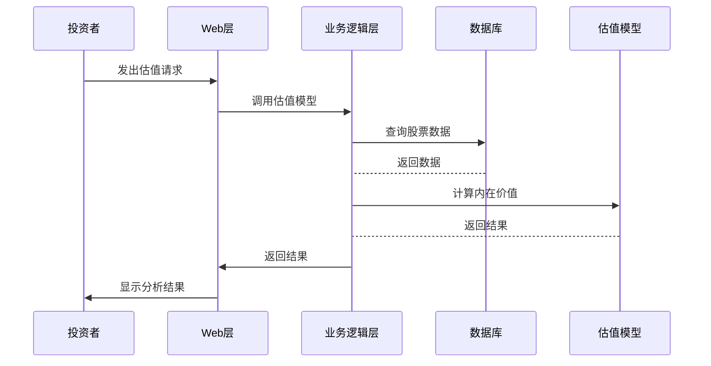

                 


# 大卫德雷曼的价值投资实务

## 关键词：价值投资，大卫·德雷曼，内在价值，基本面分析，风险管理，投资策略，DCF模型

## 摘要：本文系统地介绍大卫·德雷曼的价值投资方法，从基本概念到数学模型，再到实际案例，详细讲解价值投资的理论与实践。文章结合财务报表分析、估值指标、风险评估等多方面内容，提供一套完整的价值投资体系，帮助投资者在实践中应用。

---

# 第一部分: 价值投资的背景与核心理念

## 第1章: 价值投资的定义与背景

### 1.1 价值投资的起源与发展
- **1.1.1 投资学的基本概念**：介绍投资的基本概念，包括股票、债券、基金等，为价值投资打下基础。
- **1.1.2 价值投资的起源与历史发展**：从本杰明·格雷厄姆和大卫·德雷曼开始，讲述价值投资的历史演变。
- **1.1.3 大卫·德雷曼的贡献与影响**：分析德雷曼在价值投资领域的主要贡献及其对投资界的影响。

### 1.2 价值投资的核心理念
- **1.2.1 价值投资的定义**：明确价值投资的定义，强调寻找被市场低估的股票。
- **1.2.2 投资者心态与行为分析**：探讨投资者的心理偏差及其对投资决策的影响。
- **1.2.3 价值投资与市场有效性的关系**：分析价值投资在有效市场和弱有效市场中的表现。

### 1.3 价值投资的适用场景与边界
- **1.3.1 价值投资的适用领域**：讨论价值投资在不同市场环境和经济周期中的适用性。
- **1.3.2 价值投资的边界与限制**：分析价值投资的局限性，如流动性风险和信息不对称。
- **1.3.3 价值投资与其他投资策略的对比**：比较价值投资与成长投资、指数投资等策略的异同。

---

# 第二部分: 价值投资的核心概念与分析框架

## 第2章: 价值投资的分析框架

### 2.1 财务报表分析基础
- **2.1.1 资产负债表分析**：介绍如何通过资产负债表评估公司的财务状况，包括资产、负债和所有者权益。
- **2.1.2 利润表分析**：讲解如何通过利润表评估公司的盈利能力，包括收入、成本和利润。
- **2.1.3 现金流量表分析**：分析现金流量表，了解公司的现金流情况，包括经营活动、投资活动和筹资活动。

### 2.2 基本面分析的核心要素
- **2.2.1 盈利能力分析**：讨论如何通过净利率、ROE等指标评估公司的盈利能力。
- **2.2.2 偿债能力分析**：分析公司的债务情况，包括资产负债率、流动比率等指标。
- **2.2.3 运营效率分析**：探讨公司资产周转率、存货周转率等指标，评估公司的运营效率。

### 2.3 估值方法与指标
- **2.3.1 市盈率（P/E）分析**：介绍市盈率的计算方法及其在估值中的应用。
- **2.3.2 市净率（P/B）分析**：讲解市净率的计算及其适用场景，如银行和房地产公司。
- **2.3.3 现金流折现模型（DCF）**：详细讲解DCF模型，包括自由现金流的计算和折现率的确定。

### 2.4 价值投资的决策模型
- **2.4.1 内在价值计算公式**：展示内在价值的计算公式，并解释每个参数的意义。
- **2.4.2 安全边际的概念与应用**：探讨安全边际的重要性，如何通过安全边际降低投资风险。
- **2.4.3 投资组合的构建与优化**：分析如何构建和优化投资组合，分散风险，提高收益。

---

# 第三部分: 价值投资的数学模型与算法原理

## 第3章: 价值投资的数学模型

### 3.1 内在价值计算模型
- **3.1.1 现金流折现模型（DCF）**：通过公式和流程图展示DCF模型的计算步骤。
- **3.1.2 股权自由现金流模型**：介绍股权自由现金流的计算方法及其在DCF中的应用。
- **3.1.3 市盈率与市净率的对比分析**：通过表格对比P/E和P/B的优缺点，帮助投资者选择合适的估值指标。

### 3.2 估值指标的数学公式
- **3.2.1 市盈率公式**：
  $$ P/E = \frac{Price}{Earnings} $$
- **3.2.2 市净率公式**：
  $$ P/B = \frac{Price}{Book\ Value} $$
- **3.2.3 内在价值公式**：
  $$ Intrinsic\ Value = \sum_{t=1}^{n} \frac{CF_t}{(1+r)^t} $$

### 3.3 价值投资的风险评估模型
- **3.3.1 风险调整后的折现率**：讨论如何调整折现率以反映特定股票的风险。
- **3.3.2 风险溢价的计算方法**：分析风险溢价的确定方法及其对内在价值的影响。
- **3.3.3 风险与收益的平衡点分析**：探讨在不同风险水平下，收益与风险的平衡点。

---

# 第四部分: 价值投资的系统分析与架构设计

## 第4章: 价值投资的系统分析

### 4.1 问题场景介绍
- **4.1.1 投资者面临的挑战**：如信息过载、市场波动等。
- **4.1.2 价值投资的系统化需求**：将价值投资从艺术转化为科学，提高效率和准确性。

### 4.2 系统功能设计
- **4.2.1 领域模型（Mermaid类图）**：
  ```mermaid
  classDiagram
      class 投资者 {
          资金
          风险承受能力
      }
      class 股票 {
          市盈率
          市净率
          自由现金流
      }
      class 估值模型 {
          计算内在价值
          确定安全边际
      }
      class 投资决策 {
          买入/卖出决策
          投资组合优化
      }
      投资者 --> 股票: 分析
      股票 --> 估值模型: 输入数据
      估值模型 --> 投资决策: 输出结果
  ```

### 4.3 系统架构设计
- **4.3.1 架构图（Mermaid架构图）**：
  ```mermaid
  architecture
  Client <---> Web层 <---> 业务逻辑层 <---> 数据库
  ```
  - **Web层**：处理用户请求，展示分析结果。
  - **业务逻辑层**：执行估值模型，计算内在价值。
  - **数据库**：存储股票数据和估值结果。

### 4.4 系统接口设计
- **API接口**：提供RESTful API，供投资者获取实时数据和估值结果。
- **数据接口**：与金融数据供应商接口对接，获取实时财务数据。

### 4.5 系统交互流程图（Mermaid序列图）


---

# 第五部分: 价值投资的项目实战

## 第5章: 价值投资的实战应用

### 5.1 环境安装
- **工具安装**：安装Python、Pandas、NumPy等工具，用于数据处理和分析。
- **数据源**：获取股票数据，如通过Yahoo Finance API或本地数据库。

### 5.2 核心实现源代码
```python
import pandas as pd
import numpy as np

# 示例代码：计算市盈率和市净率
def calculate_valuation(ticker):
    # 获取股票数据
    df = pd.DataFrame({'Price': [100], 'Earnings': [10], 'Book Value': [50]})
    pe_ratio = df.Price[0] / df.Earnings[0]
    pb_ratio = df.Price[0] / df['Book Value'][0]
    print(f"市盈率（P/E）：{pe_ratio}")
    print(f"市净率（P/B）：{pb_ratio}")

calculate_valuation("AAPL")
```

### 5.3 案例分析
- **案例：苹果公司（AAPL）**：通过实际数据计算其市盈率和市净率，分析其内在价值。

### 5.4 项目小结
- **经验总结**：总结在实际操作中遇到的问题和解决方法。
- **常见误区**：提醒投资者避免的错误，如忽略流动性风险或过度依赖单一估值指标。

---

# 第六部分: 价值投资的最佳实践与小结

## 第6章: 最佳实践与小结

### 6.1 投资理念总结
- **长期投资**：强调长期持有优质资产的重要性。
- **风险管理**：讨论如何通过分散投资和设置止损来降低风险。

### 6.2 实战技巧
- **持续学习**：建议投资者不断学习新知识，适应市场变化。
- **定期复盘**：定期检查投资组合，评估表现并调整策略。

### 6.3 注意事项
- **避免情绪化决策**：提醒投资者避免受市场情绪影响，保持理性。
- **关注长期基本面**：强调基本面分析的重要性，避免短期波动干扰。

### 6.4 拓展阅读
- **推荐书籍**：如《价值》、《投资的艺术》等。
- **在线资源**：推荐优质的金融分析网站和工具。

---

通过以上结构，文章系统地介绍了大卫·德雷曼的价值投资方法，从理论到实践，帮助读者全面掌握价值投资的精髓。每个部分都详细展开，结合数学模型、系统架构和实际案例，确保读者能够深入理解和应用这些方法。

