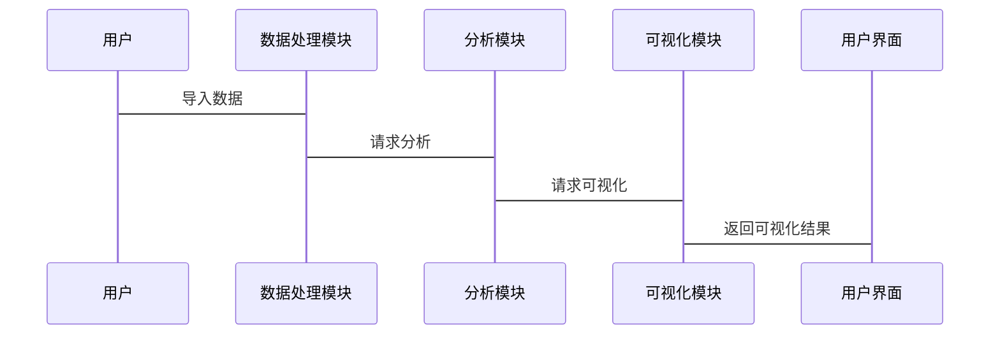

                 


# 大卫德雷曼的资产负债表分析

## 关键词：资产负债表分析、财务比率、趋势分析、系统架构、Python实现、数据可视化

## 摘要：  
本文从大卫德雷曼的资产负债表分析入手，系统地探讨了资产负债表的核心概念、分析方法、系统实现以及实际应用。通过详细的理论分析和实践案例，本文旨在帮助读者深入理解资产负债表的结构与重要性，掌握多种分析方法，并通过系统架构设计与代码实现，将理论应用于实际情境中，最终达到提升财务分析能力的目的。

---

## 第1章: 资产负债表的基本概念与结构

### 1.1 资产负债表的定义与作用

#### 1.1.1 资产负债表的定义  
资产负债表是反映企业在某一特定日期财务状况的报表，主要由资产、负债和所有者权益三部分组成。它是企业财务健康状况的重要指标，也是投资者、债权人和管理层做出决策的重要依据。

#### 1.1.2 资产负债表的作用与重要性  
- 评估企业的财务健康状况，包括偿债能力、营运能力和成长能力。  
- 为投资者和债权人提供重要的财务信息，帮助其做出投资和信贷决策。  
- 作为企业内部管理的重要工具，帮助管理层优化资产结构和负债结构。  

#### 1.1.3 资产负债表的编制与报告要求  
- 资产负债表应按照会计准则进行编制，确保数据的准确性和一致性。  
- 资产负债表应包括企业的全部资产、负债和所有者权益，涵盖流动资产、非流动资产、流动负债、非流动负债等。  

### 1.2 资产负债表的基本结构

#### 1.2.1 资产、负债、所有者权益的定义与分类  
- **资产**：企业拥有的资源，预期能为企业带来经济利益的。  
- **负债**：企业承担的债务，预期会导致经济利益流出的。  
- **所有者权益**：企业资产扣除负债后归所有者所有的部分。  

#### 1.2.2 资产负债表的格式与布局  
- 左侧列出资产项目，右侧列出负债和所有者权益项目。  
- 资产总额应等于负债和所有者权益之和，即“资产=负债+所有者权益”。  

#### 1.2.3 资产负债表的编制原则与方法  
- 按照会计恒等式进行编制，确保平衡关系成立。  
- 资产和负债按流动性分类，资产从高到低分为流动资产和非流动资产，负债从高到低分为流动负债和非流动负债。  

### 1.3 资产负债表的核心要素分析

#### 1.3.1 资产的构成与分类  
- **流动资产**：可以在一年内或一个正常营业周期内变现或耗用的资产，包括现金、应收账款、存货等。  
- **非流动资产**：无法在一年内变现或耗用的资产，包括固定资产、无形资产、长期股权投资等。  

#### 1.3.2 负债的构成与分类  
- **流动负债**：将在一年内或一个正常营业周期内偿还的债务，包括应付账款、短期借款、应交税费等。  
- **非流动负债**：将在一年以上偿还的债务，包括长期借款、应付债券等。  

#### 1.3.3 所有者权益的构成与分类  
- 包括实收资本、资本公积、盈余公积、未分配利润等。  

---

## 第2章: 资产负债表分析的基本方法

### 2.1 财务比率分析

#### 2.1.1 流动比率分析  
流动比率 = 流动资产 / 流动负债  
- 衡量企业短期偿债能力，通常认为2:1是合理的。  

#### 2.1.2 速动比率分析  
速动比率 = (流动资产 - 存货) / 流动负债  
- 去掉存货后的流动资产与流动负债的比率，更能反映企业的短期偿债能力。  

#### 2.1.3 负债比率分析  
负债比率 = 负债总额 / 资产总额  
- 衡量企业整体的偿债压力，越高表示企业的杠杆越高。  

#### 2.1.4 资产回报率分析  
资产回报率 = 净利润 / 平均资产总额  
- 衡量企业资产的使用效率和盈利能力。  

### 2.2 趋势分析

#### 2.2.1 时间序列分析方法  
- 通过比较不同时期的资产负债表数据，分析企业财务状况的变化趋势。  

#### 2.2.2 趋势分析的步骤与应用  
1. 确定分析的时间范围和数据来源。  
2. 计算关键指标的趋势变化。  
3. 识别趋势的正向或反向变化，并分析其原因。  

#### 2.2.3 趋势分析的局限性  
- 数据的时间跨度可能不足，影响趋势的准确性。  
- 外部环境的变化可能对趋势产生干扰。  

### 2.3 比较分析

#### 2.3.1 同行业公司比较分析  
- 通过与同行业公司对比，评估企业的财务表现。  

#### 2.3.2 同一公司不同期间比较分析  
- 分析企业在不同期间的财务状况变化。  

#### 2.3.3 比较分析的注意事项  
- 确保比较的样本具有可比性。  
- 结合行业特点和企业自身情况，避免简单比较。  

---

## 第3章: 资产负债表分析的高级方法

### 3.1 资产负债表的项目质量分析

#### 3.1.1 资产项目质量分析  
- 评估资产的流动性、变现能力及实际价值。  

#### 3.1.2 负债项目质量分析  
- 评估负债的期限、利率和偿付能力。  

#### 3.1.3 所有者权益项目质量分析  
- 分析所有者权益的来源和变化原因。  

### 3.2 资产负债表的结构优化分析

#### 3.2.1 资产负债表结构优化的目标  
- 提高资产使用效率，降低负债风险。  

#### 3.2.2 资产负债表结构优化的策略  
1. 优化资产结构，增加高流动性资产。  
2. 合理控制负债规模，降低高风险负债。  

#### 3.2.3 结构优化的实施步骤与案例  
- 通过具体案例分析，展示结构优化的过程和效果。  

### 3.3 资产负债表的财务预警分析

#### 3.3.1 财务预警分析的定义与作用  
- 通过分析财务数据，预测企业可能面临的财务危机。  

#### 3.3.2 财务预警指标的选取与计算  
- 常用的预警指标包括流动比率、速动比率、资产负债率等。  

#### 3.3.3 财务预警分析的实施步骤与案例  
- 通过具体案例，展示如何利用预警指标预测企业财务风险。  

---

## 第4章: 资产负债表分析的系统架构与实现

### 4.1 系统需求分析

#### 4.1.1 问题场景介绍  
- 如何高效地分析和处理大量资产负债表数据，满足用户的财务分析需求。  

#### 4.1.2 项目介绍  
- 开发一个基于Python的资产负债表分析系统，支持数据导入、分析、可视化和报告生成。  

#### 4.1.3 系统功能需求  
1. 数据导入与预处理。  
2. 财务比率计算与可视化。  
3. 趋势分析与预测。  
4. 比较分析与报告生成。  

### 4.2 系统架构设计

#### 4.2.1 系统功能设计  
- 用户可以通过界面输入或导入资产负债表数据，系统自动计算相关指标并生成可视化报告。  

#### 4.2.2 系统架构设计  


#### 4.2.3 系统接口设计  
- 数据接口：支持CSV、Excel格式的数据导入。  
- 分析接口：提供API，供其他系统调用分析结果。  

#### 4.2.4 系统交互设计  


### 4.3 项目实战

#### 4.3.1 环境安装  
- 安装Python、Pandas、Matplotlib、Seaborn等库。  

#### 4.3.2 系统核心实现源代码  
```python
import pandas as pd
import matplotlib.pyplot as plt

# 导入数据
df = pd.read_csv('balance_sheet.csv')

# 计算流动比率
current_ratio = df['流动资产'].sum() / df['流动负债'].sum()
print(f'流动比率：{current_ratio}')

# 可视化资产结构
plt.figure(figsize=(10, 6))
df['资产'].plot.pie(label='', autopct='%1.1f%%')
plt.title('资产结构')
plt.show()
```

#### 4.3.3 代码应用解读与分析  
- 使用Pandas进行数据分析，利用Matplotlib生成可视化图表，直观展示资产结构和财务比率。  

#### 4.3.4 实际案例分析  
- 以具体企业为例，展示如何通过系统实现资产负债表分析。  

#### 4.3.5 项目小结  
- 通过系统实现，可以提高资产负债表分析的效率和准确性。  

### 4.4 最佳实践 tips

#### 4.4.1 数据可视化技巧  
- 使用颜色和图表类型突出重点数据。  

#### 4.4.2 系统优化建议  
- 优化数据处理模块，提高系统的运行效率。  

#### 4.4.3 注意事项  
- 数据来源应可靠，避免因数据错误导致分析结果偏差。  

#### 4.4.4 拓展阅读  
- 推荐阅读《财务报表分析》、《Python数据可视化》等相关书籍。  

---

## 第5章: 资产负债表分析的总结与展望

### 5.1 本章总结  
- 本文从理论到实践，系统地分析了资产负债表的核心概念、分析方法和系统实现。  

### 5.2 未来展望  
- 随着人工智能和大数据技术的发展，资产负债表分析将更加智能化和自动化。  

---

通过本文的学习，读者可以全面掌握资产负债表的分析方法，并通过实际案例和系统实现，提升自己的财务分析能力。

