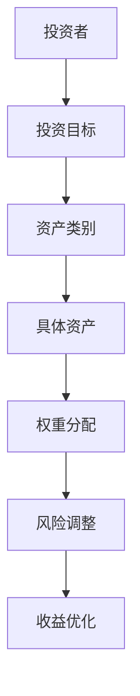
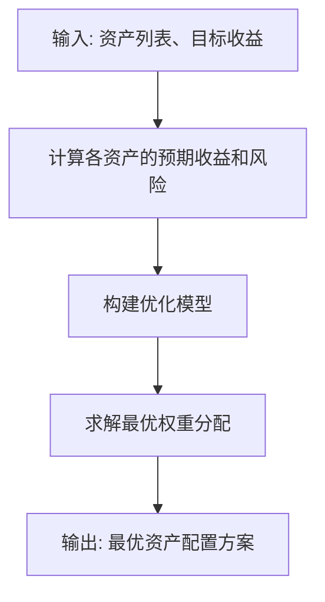
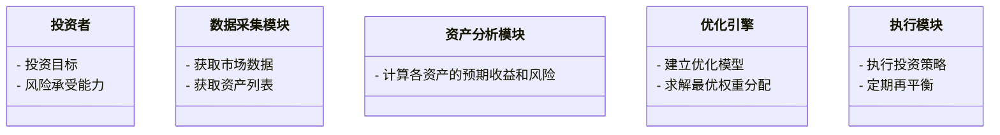
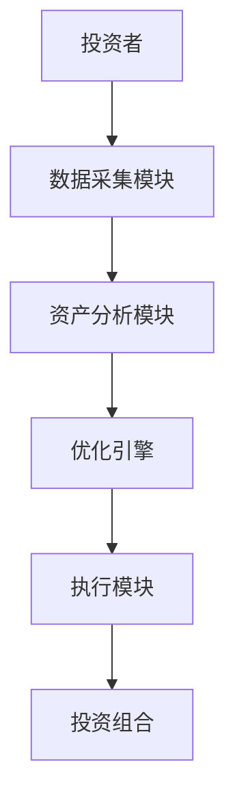
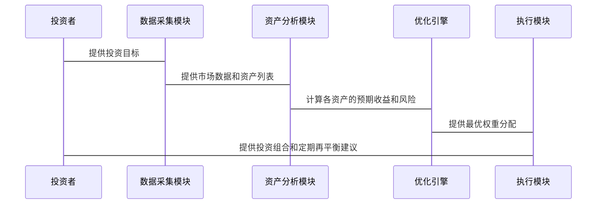

                 


# 第一部分: 长期资本配置的背景与核心概念

## 第1章: 长期资本配置的定义与重要性

### 1.1 长期资本配置的定义

#### 1.1.1 什么是长期资本配置
长期资本配置是指将资金分配到不同的资产类别中，以实现长期的收益目标。它强调通过长期持有和分散投资来降低风险并实现稳定收益。

#### 1.1.2 长期资本配置的核心目标
长期资本配置的核心目标是通过优化资产组合，最大化收益的同时最小化风险。它关注的是长期稳定的财富增长，而非短期的市场波动。

#### 1.1.3 长期资本配置的适用场景
适用于机构投资者、高净值个人以及需要长期资金配置的组织。特别适合那些有稳定资金来源和长期投资目标的投资者。

### 1.2 长期资本配置的重要性

#### 1.2.1 长期资本配置对机构投资者的意义
机构投资者通常需要管理大量资金，长期资本配置帮助他们实现资金的保值增值，同时分散投资风险。

#### 1.2.2 长期资本配置与短期投资的区别
短期投资关注市场波动和短期收益，而长期资本配置注重资产的长期增值和风险控制。长期配置能够平滑市场波动的影响，实现更稳定的收益。

#### 1.2.3 长期资本配置在风险控制中的作用
通过分散投资和资产配置，长期资本配置能够有效降低投资组合的整体风险，避免因市场波动导致的大幅损失。

### 1.3 大卫·斯文森的长期资本配置理念

#### 1.3.1 大卫·斯文森的背景介绍
大卫·斯文森是耶鲁大学的首席投资官，以其创新的长期资本配置策略闻名。他的投资理念强调分散投资、长期持有和对冲风险。

#### 1.3.2 斯文森长期资本配置的核心思想
斯文森认为，成功的投资依赖于合理的资产配置和对冲策略。他通过将资产分配到不同的资产类别和市场领域，降低整体风险，同时捕捉不同市场的收益机会。

#### 1.3.3 斯文森理念对机构投资的影响
斯文森的理念推动了机构投资领域的变革，使得长期资本配置成为机构投资者的重要策略。他的方法被广泛应用于大学基金、养老基金等长期资金的管理。

## 第2章: 长期资本配置的核心概念与联系

### 2.1 核心概念原理

#### 2.1.1 资产配置的原理
资产配置是长期资本配置的核心，它通过将资金分配到不同的资产类别（如股票、债券、房地产等）来实现风险分散和收益最大化。每个资产类别的权重决定了其对整体收益和风险的贡献。

#### 2.1.2 风险调整后的收益
风险调整后的收益考虑了不同资产或组合的风险水平，旨在找到在相同风险水平下收益最高的资产，或者在相同收益水平下风险最低的资产。

#### 2.1.3 资本资产定价模型（CAPM）
CAPM是一个用于估计资产期望收益的模型，它考虑了系统性风险和非系统性风险。CAPM公式为：
$$ E(r_i) = R_f + \beta_i (R_m - R_f) $$
其中，$R_f$是无风险利率，$R_m$是市场期望收益，$\beta_i$是资产i的贝塔系数，表示其系统性风险。

### 2.2 核心概念属性特征对比表格

| 概念       | 特征1       | 特征2       | 特征3       |
|------------|-------------|-------------|-------------|
| 资产配置   | 组合多样性   | 风险分散化   | 长期收益性   |
| 风险调整   | 风险最小化   | 收益最大化   | 稳定性       |

### 2.3 ER实体关系图架构



## 第3章: 长期资本配置的算法原理

### 3.1 算法原理讲解



### 3.2 数学模型与公式

#### 预期收益计算
$$ E(r_i) = \sum_{j=1}^n w_j \cdot E(r_j) $$

#### 风险计算
$$ Var(r_p) = \sum_{i=1}^n \sum_{j=1}^n w_i w_j \cdot Cov(r_i, r_j) $$

#### 优化模型
目标是最小化投资组合的方差，同时满足收益目标：
$$ \text{minimize } \sum_{i=1}^n \sum_{j=1}^n w_i w_j \cdot Cov(r_i, r_j) $$
$$ \text{subject to } \sum_{i=1}^n w_i = 1 \text{ 且 } \sum_{i=1}^n w_i \cdot E(r_i) = T \text{（目标收益）} $$

### 3.3 例子说明

假设我们有两种资产，A和B，预期收益分别为10%和15%，方差分别为20%和30%，协方差为5%。目标收益为12%。

建立优化模型：
$$ \text{minimize } w_A^2 \cdot 20 + w_B^2 \cdot 30 + 2 w_A w_B \cdot 5 $$
$$ \text{subject to } w_A + w_B = 1 \text{ 和 } 0.1 w_A + 0.15 w_B = 0.12 $$

解方程得到最优权重：
$$ w_A = 0.6, w_B = 0.4 $$

投资组合的预期收益：
$$ 0.6 \cdot 0.1 + 0.4 \cdot 0.15 = 0.12 $$

投资组合的方差：
$$ (0.6)^2 \cdot 0.2 + (0.4)^2 \cdot 0.3 + 2 \cdot 0.6 \cdot 0.4 \cdot 0.05 = 0.072 + 0.0192 + 0.024 = 0.1152 $$

标准差为：
$$ \sqrt{0.1152} \approx 0.3394 $$

## 第4章: 长期资本配置的系统架构设计

### 4.1 问题场景介绍

系统需要根据用户输入的投资目标和风险承受能力，提供最优的长期资本配置建议。

### 4.2 系统功能设计



### 4.3 系统架构设计



### 4.4 系统接口设计

- 输入接口：
  - 投资目标（收益目标和风险承受能力）
- 输出接口：
  - 最优资产配置方案
  - 定期再平衡建议

### 4.5 系统交互流程



## 第5章: 项目实战

### 5.1 环境安装

安装Python和必要的库：

```bash
pip install numpy pandas scikit-learn pyportfolioopt
```

### 5.2 核心代码实现

```python
from pyportfolioopt import mean_variance_optimization
import numpy as np

# 示例数据：各资产的预期收益和协方差矩阵
mu = np.array([0.1, 0.15])
sigma = np.array([[0.2, 0.05], [0.05, 0.3]])

# 建立优化模型
model = mean_variance_optimization.MeanVariance(mu, sigma)

# 约束条件：目标收益为12%
T = 0.12
w = model.optimize(T)

print("权重分配:", w)
print("预期收益:", np.dot(w, mu))
print("投资组合方差:", w.T.dot(sigma).dot(w))
```

### 5.3 代码应用解读

- 导入必要的库和数据
- 定义各资产的预期收益和协方差矩阵
- 建立均值-方差优化模型
- 优化得到最优权重分配
- 输出结果

### 5.4 实际案例分析

假设我们有两个资产，A和B，预期收益分别为10%和15%，方差分别为20%和30%，协方差为5%。目标收益为12%。

运行代码后，得到权重分配为A:60%，B:40%。预期收益为12%，投资组合方差为11.52%。

### 5.5 项目小结

通过代码实现，我们能够优化资产配置，实现预期收益和风险的平衡。长期资本配置通过系统化的优化方法，帮助投资者实现稳定的投资回报。

## 第6章: 总结与最佳实践

### 6.1 核心要点回顾

- 长期资本配置的核心目标是实现长期稳定的收益
- 通过资产配置和风险调整，降低整体投资组合的风险
- 大卫·斯文森的策略强调分散投资和长期持有

### 6.2 最佳实践 Tips

- **定期再平衡**：定期检查和调整投资组合，以维持预期的资产配置
- **分散投资**：通过多样化资产类别降低风险
- **长期持有**：避免频繁交易，减少交易成本和税务负担

### 6.3 注意事项

- 风险管理是长期资本配置的核心，必须时刻关注市场的变化
- 资产配置需要根据市场环境和个人目标进行调整
- 避免过度依赖单一资产类别，保持投资的灵活性

### 6.4 拓展阅读

- 《机构投资的创新者》
- 《投资学》
- 《风险管理与对冲基金》

通过以上内容，我们系统地介绍了大卫·斯文森的长期资本配置策略，从理论到实践，帮助读者全面理解和应用这一投资理念。

