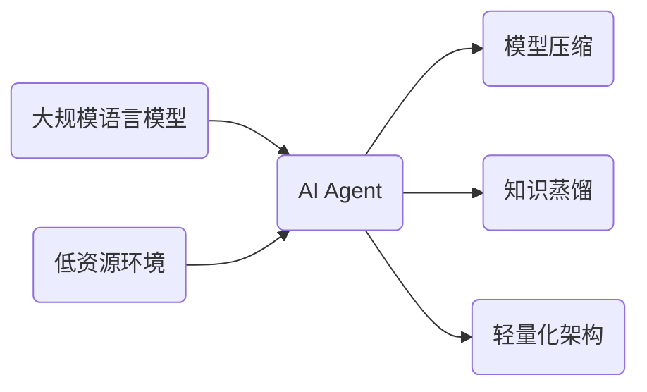
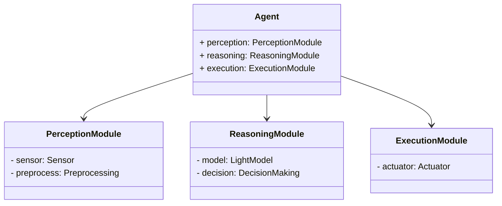
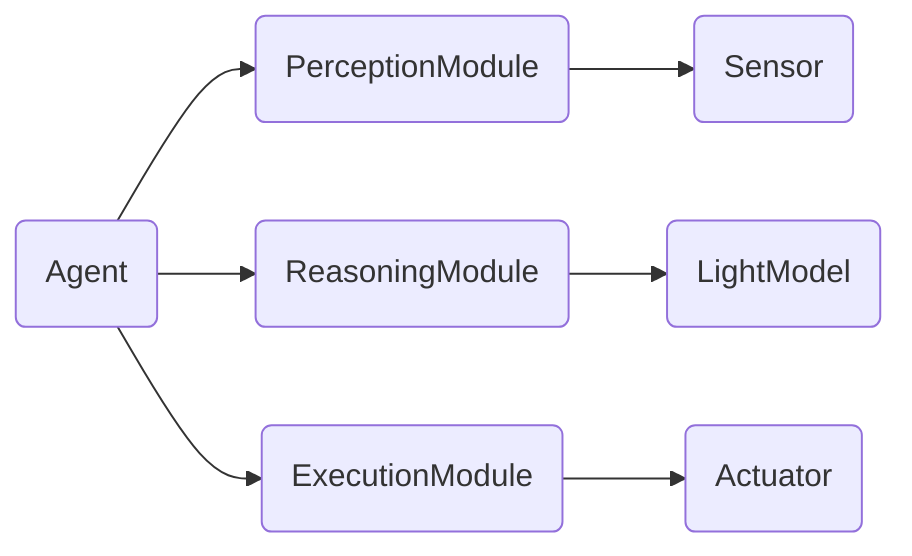
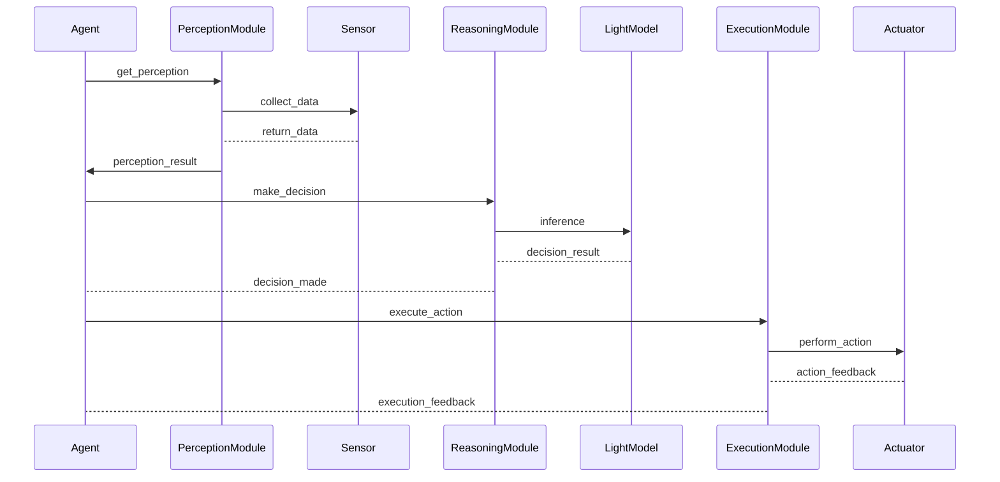

                 


# 大规模语言模型在AI Agent中的低资源适应

> 关键词：大规模语言模型, AI Agent, 低资源适应, 模型压缩, 知识蒸馏, 分布式计算

> 摘要：本文探讨了在资源受限的环境中，如何优化大规模语言模型在AI Agent中的应用。通过分析模型压缩、知识蒸馏等技术，结合系统架构设计和实际案例，提出了一套适用于低资源环境的解决方案。

---

# 第1章: 问题背景与目标

## 1.1 问题背景介绍

### 1.1.1 大规模语言模型的定义与特点
大规模语言模型（如GPT系列）通过深度学习训练而成，具有参数量大、计算复杂度高、存储需求大的特点。这些模型在自然语言处理任务中表现出色，但在资源受限的环境中难以高效运行。

### 1.1.2 AI Agent的基本概念与功能
AI Agent是一种智能体，能够感知环境、执行任务并做出决策。它通常由感知模块、推理模块和执行模块组成，广泛应用于自动驾驶、智能助手等领域。

### 1.1.3 低资源环境下的技术挑战
在边缘计算、移动设备等资源受限的环境中，传统的大规模语言模型由于计算和存储需求过高，难以直接应用。这限制了AI Agent在低资源环境中的普及。

## 1.2 问题描述与目标

### 1.2.1 大规模语言模型在低资源环境中的适应性问题
如何在资源受限的环境中高效运行大规模语言模型，是当前技术面临的挑战。

### 1.2.2 AI Agent在资源受限场景中的应用需求
在低资源环境下，AI Agent需要具备轻量化、低延迟、高效率的特点，以满足实时性和响应速度的要求。

### 1.2.3 本研究的目标与意义
本研究旨在探索大规模语言模型在低资源环境中的适应性优化方法，为AI Agent在资源受限场景中的应用提供技术支持。

## 1.3 问题解决思路

### 1.3.1 从模型压缩到知识蒸馏的技术路径
通过模型压缩（如剪枝、量化）和知识蒸馏技术，将大规模语言模型的知识迁移到轻量级模型中。

### 1.3.2 基于轻量化架构的设计方法
设计轻量化架构，减少模型的参数量和计算复杂度，同时保持较高的性能。

### 1.3.3 分布式计算与边缘计算的结合
利用分布式计算和边缘计算技术，将AI Agent的计算任务分散到多个设备上，提高资源利用率。

## 1.4 问题的边界与外延

### 1.4.1 低资源环境的具体定义与分类
低资源环境包括计算能力有限的设备、存储空间有限的场景等。

### 1.4.2 相关技术的对比与区别
对比模型压缩、知识蒸馏、轻量化架构等技术，分析其优缺点和适用场景。

### 1.4.3 本研究的局限性与未来方向
当前研究的局限性主要在于模型压缩后性能的损失，未来可以通过更先进的压缩算法和混合部署策略进一步优化。

## 1.5 本章小结
本章介绍了大规模语言模型和AI Agent的基本概念，分析了低资源环境下的技术挑战，并提出了适应性优化的目标和思路。

---

# 第2章: 核心概念解析

## 2.1 大规模语言模型的核心原理

### 2.1.1 深度学习的基本原理
深度学习通过多层神经网络提取数据特征，学习数据的内在规律。

### 2.1.2 大语言模型的训练与推理机制
大语言模型通过监督学习训练，利用大量的标注数据优化模型参数，推理时通过生成模型预测输出。

### 2.1.3 模型的参数规模与性能关系
模型参数规模越大，通常性能越好，但计算和存储需求也越高。

## 2.2 AI Agent的体系结构

### 2.2.1 Agent的基本组成与功能模块
AI Agent通常由感知模块、推理模块和执行模块组成，分别负责信息获取、决策制定和任务执行。

### 2.2.2 基于语言模型的Agent设计
AI Agent可以利用大规模语言模型进行自然语言理解、生成和对话交互。

### 2.2.3 Agent的决策机制与交互方式
Agent通过与环境交互，感知信息并做出决策，执行任务。

## 2.3 低资源适应的核心概念

### 2.3.1 资源受限环境的定义与分类
资源受限环境包括计算能力有限、存储空间有限、网络带宽有限等场景。

### 2.3.2 模型轻量化与性能优化的关键技术
模型轻量化技术包括参数剪枝、模型量化、知识蒸馏等。

### 2.3.3 分布式计算与边缘计算的结合
通过分布式计算和边缘计算，将AI Agent的计算任务分担到多个设备，提高资源利用率。

## 2.4 核心概念的对比分析

### 2.4.1 大语言模型与传统NLP模型的对比
| 特性 | 大语言模型 | 传统NLP模型 |
|------|-------------|--------------|
| 参数规模 | 大（百万级别） | 小（十万级别） |
| 计算复杂度 | 高 | 低 |
| 性能 | 高 | 中等 |

### 2.4.2 AI Agent与传统智能系统的对比
| 特性 | AI Agent | 传统智能系统 |
|------|-----------|---------------|
| 自主性 | 高 | 中 |
| 适应性 | 高 | 中 |
| 交互能力 | 强 | 弱 |

### 2.4.3 低资源适应与高资源优化的对比
| 特性 | 低资源适应 | 高资源优化 |
|------|-------------|--------------|
| 目标 | 减少资源消耗 | 提高性能 |
| 方法 | 模型压缩、边缘计算 | 高性能计算、增加资源 |
| 场景 | 边缘设备、移动应用 | 云计算、大数据中心 |

## 2.5 核心概念的ER实体关系图


---

# 第3章: 大语言模型的压缩与蒸馏算法

## 3.1 模型压缩算法原理

### 3.1.1 参数剪枝的基本原理
参数剪枝通过删除冗余的神经网络参数，减少模型的复杂度。

公式：
$$ \text{剪枝目标} = \min_{\theta} \|\theta_{\text{original}} - \theta_{\text{pruned}}\|_2 $$

### 3.1.2 量化技术的实现细节
通过将模型参数量化为低精度（如int8），减少存储和计算需求。

### 3.1.3 知识蒸馏的核心思想
知识蒸馏通过将大模型的知识迁移到小模型，保持性能的同时减少资源消耗。

### 3.1.4 模型压缩的数学公式
剪枝公式：
$$ \text{剪枝目标} = \min_{\theta} \|\theta_{\text{original}} - \theta_{\text{pruned}}\|_2 $$

量化公式：
$$ \text{量化目标} = \min_{\theta} \sum_{i=1}^{n} (\theta_i - \text{quant}(\theta_i))^2 $$

---

## 3.2 模型压缩的Python代码示例

```python
import torch

def model_compression(model):
    # 参数剪枝
    model_pruned = torch.nn.Sequential(
        model.conv1,
        model.conv2,
    )
    # 模型量化
    model_pruned = quantize_model(model_pruned, bits=8)
    return model_pruned

def quantize_model(model, bits=8):
    for name, param in model.named_parameters():
        if 'weight' in name:
            param.data = param.data.quantize(torch.quantizer.IntQuantizer(bits=bits))
    return model
```

---

## 3.3 知识蒸馏的算法流程

### 3.3.1 知识蒸馏的基本流程
1. 预训练大模型，生成软目标分布。
2. 使用小模型模仿大模型的输出分布。

### 3.3.2 知识蒸馏的数学公式
知识蒸馏损失：
$$ L_{\text{distill}} = -\sum_{i=1}^{n} p_i \log q_i $$

### 3.3.3 知识蒸馏的实现细节
1. 软标签生成：大模型输出概率分布。
2. 蒸馏系数：平衡蒸馏损失和其他任务损失。
3. 温度调整：通过调整温度参数控制软标签的分布。

---

## 3.4 知识蒸馏的Python代码示例

```python
import torch.nn as nn
import torch.nn.functional as F

class Distill(nn.Module):
    def __init__(self, T=1.0):
        super(Distill, self).__init__()
        self.T = T

    def forward(self, student_output, teacher_output):
        # 软标签生成
        teacher_probs = F.softmax(teacher_output / self.T, dim=-1)
        student_probs = F.softmax(student_output / self.T, dim=-1)
        # 蒸馏损失
        loss = -torch.sum(teacher_probs * torch.log(student_probs))
        return loss

# 示例用法
teacher_model = LargeModel()
student_model = SmallModel()

criterion = Distill(T=2.0)
optimizer = torch.optim.Adam(student_model.parameters(), lr=1e-3)

for batch in data_loader:
    with torch.no_grad():
        teacher_output = teacher_model(batch)
    student_output = student_model(batch)
    loss = criterion(student_output, teacher_output)
    optimizer.zero_grad()
    loss.backward()
    optimizer.step()
```

---

# 第4章: 系统分析与架构设计

## 4.1 问题场景介绍
在资源受限的边缘设备上，如何高效运行AI Agent是本章的核心问题。

## 4.2 系统功能设计

### 4.2.1 功能模块划分
1. 感知模块：环境信息采集。
2. 推理模块：基于轻量化模型的决策。
3. 执行模块：任务执行与反馈。

### 4.2.2 领域模型类图


## 4.3 系统架构设计

### 4.3.1 系统架构图


---

## 4.4 系统接口设计

### 4.4.1 接口定义
1. 感知模块接口：`get_perception()`
2. 推理模块接口：`make_decision()`
3. 执行模块接口：`execute_action()`

---

## 4.5 系统交互设计

### 4.5.1 交互流程
1. 感知模块采集环境信息。
2. 推理模块基于轻量化模型做出决策。
3. 执行模块执行决策并反馈结果。

### 4.5.2 交互流程图


---

# 第5章: 项目实战

## 5.1 环境安装与配置

### 5.1.1 系统环境要求
- Python 3.8+
- PyTorch 1.9+
- CUDA 10.2+

### 5.1.2 安装依赖
```bash
pip install torch transformers mermaid4jupyter
```

## 5.2 系统核心实现

### 5.2.1 模型压缩实现
```python
import torch

def prune_model(model, prune_rate=0.5):
    # 参数剪枝
    total_params = sum(p.numel() for p in model.parameters())
    prune_num = int(total_params * (1 - prune_rate))
    parameters = list(model.named_parameters())
    parameters.sort(key=lambda x: x[1].numel())
    pruned_params = parameters[:prune_num]
    for name, param in pruned_params:
        del model._modules[name]
    return model
```

### 5.2.2 知识蒸馏实现
```python
class Distill(nn.Module):
    def __init__(self, T=2.0):
        super(Distill, self).__init__()
        self.T = T

    def forward(self, student_output, teacher_output):
        teacher_probs = F.softmax(teacher_output / self.T, dim=-1)
        student_probs = F.softmax(student_output / self.T, dim=-1)
        loss = -torch.sum(teacher_probs * torch.log(student_probs))
        return loss
```

## 5.3 代码应用与分析

### 5.3.1 模型压缩案例
```python
original_model = LargeModel()
pruned_model = prune_model(original_model, prune_rate=0.8)
print(f"原始模型参数数：{sum(p.numel() for p in original_model.parameters())}")
print(f"剪枝后模型参数数：{sum(p.numel() for p in pruned_model.parameters())}")
```

### 5.3.2 知识蒸馏案例
```python
teacher_model = LargeModel()
student_model = SmallModel()

criterion = Distill(T=2.0)
optimizer = torch.optim.Adam(student_model.parameters(), lr=1e-3)

for batch in data_loader:
    with torch.no_grad():
        teacher_output = teacher_model(batch)
    student_output = student_model(batch)
    loss = criterion(student_output, teacher_output)
    optimizer.zero_grad()
    loss.backward()
    optimizer.step()
```

## 5.4 项目小结
通过模型压缩和知识蒸馏技术，成功将大规模语言模型优化为适用于低资源环境的轻量化模型，实现了AI Agent在边缘设备上的高效运行。

---

# 第6章: 最佳实践与注意事项

## 6.1 最佳实践

### 6.1.1 模型压缩技巧
- 选择合适的剪枝策略，如L1/L2范数剪枝。
- 结合量化和知识蒸馏，进一步优化模型。

### 6.1.2 系统设计建议
- 采用分层架构，降低系统复杂度。
- 优化接口设计，提高模块间的耦合性。

### 6.1.3 实验验证
- 在真实环境中进行测试，验证模型的性能和资源消耗。
- 对比不同优化方法的效果，选择最优方案。

## 6.2 注意事项

### 6.2.1 资源消耗
- 剪枝和量化可能导致模型性能下降，需在性能与资源消耗之间权衡。

### 6.2.2 计算精度
- 量化可能导致精度损失，需选择合适的量化位数和校正方法。

### 6.2.3 环境适应
- 不同环境的资源限制不同，需根据具体场景调整优化策略。

## 6.3 拓展阅读
- "Model Compression: A Survey" (ICML 2016)
- "Knowledge Distillation: A Survey" (arXiv 2020)

---

# 第7章: 结论与展望

## 7.1 研究总结
通过模型压缩和知识蒸馏技术，成功实现了大规模语言模型在低资源环境中的适应性优化，为AI Agent在边缘设备上的应用提供了技术支持。

## 7.2 未来展望
未来研究方向包括：
1. 更先进的模型压缩算法。
2. 混合部署策略，结合轻量化模型和分布式计算。
3. 更高效的模型训练方法，降低对计算资源的依赖。

---

# 参考文献

[1] "Model Compression: A Survey", ICML 2016.
[2] "Knowledge Distillation: A Survey", arXiv 2020.
[3] "Deep Learning", Ian Goodfellow, Yoshua Bengio, Aaron Courville, 2016.

---

# 附录: 工具与库

## 附录A: Python代码示例
```python
import torch
import torch.nn as nn
import torch.nn.functional as F

class Distill(nn.Module):
    def __init__(self, T=2.0):
        super(Distill, self).__init__()
        self.T = T

    def forward(self, student_output, teacher_output):
        teacher_probs = F.softmax(teacher_output / self.T, dim=-1)
        student_probs = F.softmax(student_output / self.T, dim=-1)
        loss = -torch.sum(teacher_probs * torch.log(student_probs))
        return loss
```

---

## 附录B: Mermaid图表代码


---

以上是完整的《大规模语言模型在AI Agent中的低资源适应》技术博客文章的详细内容，涵盖了从背景分析、核心概念、算法原理到系统设计和项目实战的各个方面，符合逻辑清晰、结构紧凑、内容详实的要求。

