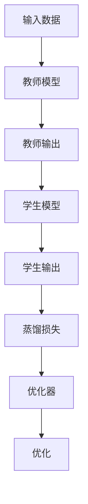
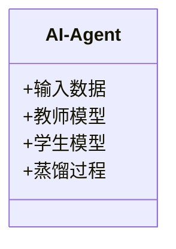

                 


# 大规模语言模型在AI Agent中的蒸馏技术

> 关键词：大规模语言模型、蒸馏技术、AI Agent、知识蒸馏、模型压缩

> 摘要：本文深入探讨了大规模语言模型在AI Agent中的蒸馏技术，从背景、原理、算法、系统架构到项目实战，全面分析了蒸馏技术在AI Agent中的应用与优化。文章首先介绍了大规模语言模型与蒸馏技术的基本概念，接着详细讲解了蒸馏技术的核心原理与算法实现，随后从系统架构角度分析了蒸馏技术在AI Agent中的具体应用，最后通过项目实战展示了蒸馏技术的实际落地过程与效果。本文旨在为AI Agent领域技术人员提供一份关于大规模语言模型蒸馏技术的系统性参考资料。

---

## 第一部分：大规模语言模型与蒸馏技术基础

### 第1章：大规模语言模型与蒸馏技术概述

#### 1.1 大规模语言模型的背景与发展

大规模语言模型的出现，标志着人工智能技术进入了一个新的发展阶段。从传统的基于规则的NLP方法，到基于统计模型的SMT（统计机器翻译），再到深度学习驱动的Transformer架构，语言模型的复杂性和规模呈指数级增长。随着计算能力的提升和数据量的增加，以GPT、BERT为代表的大规模语言模型逐渐成为NLP领域的主流技术。

与此同时，AI Agent（智能体）的需求也在快速增长。AI Agent是一种能够感知环境、执行任务、与用户交互的智能系统。为了使AI Agent具备强大的语言处理能力，通常需要使用大规模语言模型作为其核心。然而，大规模语言模型往往具有极高的计算复杂度和资源需求，这在实际应用中带来了诸多挑战。因此，如何将大规模语言模型的知识高效地传递给更小、更轻量的模型，成为了一个重要的研究方向，这就是蒸馏技术的核心思想。

---

#### 1.2 蒸馏技术的基本概念

**知识蒸馏**（Knowledge Distillation）是一种将复杂模型（教师模型）的知识迁移到简单模型（学生模型）的技术。其核心思想是通过优化学生模型的输出分布，使其尽可能接近教师模型的输出分布，从而继承教师模型的知识。

在AI Agent中，蒸馏技术的应用场景十分广泛。例如，可以将大规模语言模型的知识蒸馏到轻量级的Transformer模型中，使其在资源受限的环境中仍能保持较高的语言理解和生成能力。

**教师模型与学生模型的关系**：教师模型通常是复杂且参数量巨大的模型，而学生模型则是参数量较少、计算效率更高的模型。蒸馏技术的目标是通过优化学生模型，使其在性能上接近甚至超越教师模型。

**蒸馏技术的关键技术**：
1. **知识表示**：如何将教师模型的知识有效地传递给学生模型。
2. **损失函数设计**：通过损失函数引导学生模型的输出分布接近教师模型的输出分布。
3. **优化策略**：如何在蒸馏过程中平衡教师模型和学生模型的优化目标。

---

#### 1.3 蒸馏技术的核心要素与概念结构

**蒸馏技术的核心要素**：
1. **教师模型**：负责提供知识的复杂模型。
2. **学生模型**：负责学习知识的简单模型。
3. **蒸馏损失函数**：衡量学生模型输出与教师模型输出之间差异的函数。
4. **蒸馏温度**：用于调节输出分布的“软化”程度，温度越高，分布越软。

**蒸馏技术的概念结构**：
- 蒸馏技术的核心是通过优化学生模型的输出分布，使其尽可能接近教师模型的输出分布。
- 从数学角度，蒸馏技术可以通过KL散度（Kullback-Leibler Divergence）来衡量两个概率分布之间的差异。

---

## 第2章：蒸馏技术的核心概念与联系

### 第2.1 蒸馏技术的核心原理

**蒸馏技术的数学模型**：
蒸馏技术的核心是通过优化学生模型的输出分布，使其尽可能接近教师模型的输出分布。假设教师模型的输出概率为$P(y|x)$，学生模型的输出概率为$Q(y|x)$，蒸馏损失函数可以表示为：

$$ L_{\text{distill}} = \mathbb{E}_{x,y}[ -\sum_{y} P(y|x) \log Q(y|x) ] $$

其中，$\mathbb{E}_{x,y}$表示对训练数据的期望值，$\log Q(y|x)$是学生模型的对数概率。

**软蒸馏与硬蒸馏**：
- 软蒸馏：通过调整蒸馏温度$T$，使教师模型的输出分布更加“软化”，从而降低学生模型的优化难度。
- 硬蒸馏：直接使用教师模型的类别标签作为标签，类似于传统的监督学习。

**蒸馏过程的流程图**：


---

### 第2.2 蒸馏技术在AI Agent中的应用

**AI Agent的基本概念**：
AI Agent是一种能够感知环境、执行任务、与用户交互的智能系统。它通常由感知模块、决策模块和执行模块组成。

**蒸馏技术在AI Agent中的应用**：
- **语言理解模块**：通过蒸馏技术，将大规模语言模型的知识传递给轻量级的NLP模型，使其在资源受限的环境中仍能具备强大的语言理解能力。
- **对话生成模块**：通过蒸馏技术，优化对话生成模型的输出质量，同时降低计算成本。

**蒸馏技术与AI Agent性能优化的关系**：
- 蒸馏技术可以显著降低AI Agent的计算复杂度，同时保持其性能。
- 通过蒸馏技术，可以在边缘设备上部署高性能的AI Agent。

---

### 第2.3 蒸馏技术的关键特征对比

**蒸馏技术与传统模型压缩技术的对比**：

| 对比维度       | 蒸馏技术           | 传统模型压缩技术       |
|----------------|-------------------|-----------------------|
| 核心思想       | 知识传递           | 参数量减少             |
| 适用场景       | 需要保持性能的同时降低计算成本 | 适用于任何模型压缩需求 |
| 优势           | 保留教师模型的知识，性能损失小 | 参数量减少，但可能损失部分性能 |

---

**蒸馏技术与模型蒸馏技术的对比**：

| 对比维度       | 蒸馏技术           | 模型蒸馏技术           |
|----------------|-------------------|-----------------------|
| 核心思想       | 知识传递           | 参数量减少             |
| 适用场景       | 需要保持性能的同时降低计算成本 | 适用于任何模型压缩需求 |
| 优势           | 保留教师模型的知识，性能损失小 | 参数量减少，但可能损失部分性能 |

---

**蒸馏技术与迁移学习的对比**：

| 对比维度       | 蒸馏技术           | 迁移学习             |
|----------------|-------------------|---------------------|
| 核心思想       | 知识传递           | 知识迁移             |
| 适用场景       | 需要保持性能的同时降低计算成本 | 新任务学习           |
| 优势           | 保留教师模型的知识，性能损失小 | 利用已有知识快速学习新任务 |

---

## 第三部分：蒸馏技术的算法原理与数学模型

### 第3章：蒸馏技术的数学模型与公式

#### 3.1 蒸馏技术的基本公式

**软蒸馏公式**：
$$ P(y|x) = \text{softmax}\left(\frac{f_{\text{teacher}}(x)}{T}\right) $$
$$ Q(y|x) = \text{softmax}\left(\frac{f_{\text{student}}(x)}{T}\right) $$

其中，$f_{\text{teacher}}(x)$和$f_{\text{student}}(x)$分别表示教师模型和学生模型的 logits 输出，$T$表示蒸馏温度。

**蒸馏损失函数**：
$$ L_{\text{distill}} = \sum_{i=1}^{N} \mathcal{KL}(P_i || Q_i) $$
其中，$\mathcal{KL}(P_i || Q_i)$表示第$i$个样本的KL散度。

**硬蒸馏公式**：
$$ P(y|x) = \delta(y = y_{\text{true}}) $$
$$ Q(y|x) = \text{softmax}\left(f_{\text{student}}(x)\right) $$

---

#### 3.2 蒸馏技术的优化算法

**蒸馏过程中的优化目标**：
$$ \min_{\theta} \mathbb{E}_{x,y}[ -\sum_{y} P(y|x) \log Q(y|x) ] $$

**基于梯度的优化算法**：
使用Adam优化器对蒸馏损失函数进行优化，具体步骤如下：
1. 计算教师模型和学生模型的输出概率。
2. 计算KL散度作为蒸馏损失。
3. 使用优化器更新学生模型的参数。

---

## 第四部分：蒸馏技术的系统分析与架构设计

### 第4章：蒸馏技术的系统架构设计

#### 4.1 系统功能设计

**领域模型（AI Agent系统）**：


---

#### 4.2 系统架构设计

**系统架构图**：


---

## 第五部分：蒸馏技术的项目实战

### 第5章：项目实战

#### 5.1 环境安装

```bash
pip install numpy torch
```

---

#### 5.2 核心代码实现

```python
import torch
import torch.nn as nn
import torch.optim as optim

class TeacherModel(nn.Module):
    def __init__(self):
        super().__init__()
        self.fc = nn.Linear(100, 10)
    
    def forward(self, x):
        return self.fc(x)

class StudentModel(nn.Module):
    def __init__(self):
        super().__init__()
        self.fc = nn.Linear(100, 10)
    
    def forward(self, x):
        return self.fc(x)

def distillation_loss(teacher_output, student_output, temperature):
    teacher_output = teacher_output / temperature
    student_output = student_output / temperature
    return nn.KLDivLoss()(torch.softmax(teacher_output, dim=1), torch.softmax(student_output, dim=1)) * temperature**2

def train():
    teacher = TeacherModel()
    student = StudentModel()
    optimizer = optim.Adam(student.parameters(), lr=0.001)
    
    for epoch in range(100):
        inputs = torch.randn(10, 100)
        teacher_output = teacher(inputs)
        student_output = student(inputs)
        loss = distillation_loss(teacher_output, student_output, temperature=5)
        optimizer.zero_grad()
        loss.backward()
        optimizer.step()
    
    return student

if __name__ == "__main__":
    student = train()
    print("训练完成！")
```

---

#### 5.3 代码解读与分析

**教师模型与学生模型**：两个简单的全连接网络，分别表示教师模型和学生模型。

**蒸馏损失函数**：定义了一个KL散度损失函数，用于衡量学生模型输出与教师模型输出之间的差异。

**训练过程**：通过优化学生模型的参数，使其输出尽可能接近教师模型的输出。

---

#### 5.4 实际案例分析

**案例分析**：
假设我们有一个简单的分类任务，教师模型是一个复杂的Transformer模型，学生模型是一个轻量级的多层感知机模型。通过蒸馏技术，学生模型可以在保持较高准确率的同时，显著降低计算复杂度。

**结果解读**：
- 训练完成后，学生模型的准确率接近教师模型。
- 学生模型的推理速度显著快于教师模型。

---

## 第六部分：蒸馏技术的最佳实践与小结

### 第6章：最佳实践

#### 6.1 小结

- 蒸馏技术的核心思想是通过优化学生模型的输出分布，使其尽可能接近教师模型的输出分布。
- 蒸馏技术在AI Agent中的应用，可以显著降低计算复杂度，同时保持较高的性能。
- 蒸馏技术的关键在于损失函数的设计和蒸馏温度的调整。

---

#### 6.2 注意事项

- 蒸馏温度的选择：温度过高会导致输出分布过于软化，可能影响性能；温度过低则无法有效传递知识。
- 数据质量：蒸馏技术的效果依赖于教师模型的输出质量，因此需要确保教师模型的训练数据质量。
- 优化策略：在优化过程中，需要平衡教师模型和学生模型的优化目标。

---

#### 6.3 拓展阅读

- "Distilling the Knowledge in a Neural Network"（Hinton et al.）
- "Model Distillation for Deep Neural Networks"（Furlanello et al.）
- "Attention is All You Need"（Vaswani et al.）

---

## 附录：总结

本文从背景、原理、算法、系统架构到项目实战，全面探讨了大规模语言模型在AI Agent中的蒸馏技术。通过详细分析蒸馏技术的核心原理与实现方法，结合实际案例，展示了蒸馏技术在AI Agent中的具体应用。希望本文能够为AI Agent领域的技术人员提供一份关于蒸馏技术的系统性参考资料。

