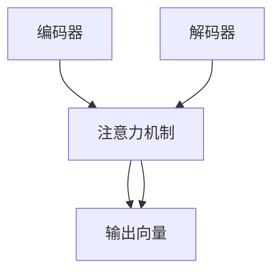

                 

# 大语言模型LLM的发展历程与应用前景

## 关键词：大语言模型、LLM、人工智能、自然语言处理、机器学习

## 摘要：大语言模型（Large Language Models, LLMs）是近年来人工智能领域的重要突破，基于Transformer架构，通过自监督学习训练而成，能够理解和生成人类语言。本文将从发展历程、核心原理、数学模型、系统架构、应用案例、未来趋势和最佳实践等方面，详细探讨大语言模型的发展与应用前景。

---

## 第1章 大语言模型的发展历程

### 1.1 大语言模型的背景与定义

大语言模型是一种基于深度学习的人工智能模型，能够理解和生成人类语言。其核心目标是通过大量数据训练，使模型能够像人类一样理解和生成文本。

### 1.2 大语言模型的发展历程

- **早期阶段**：2010年代初，基于循环神经网络（RNN）的语言模型开始出现，但存在训练速度慢、难以捕捉长距离依赖等问题。
- **Transformer的崛起**：2017年，论文《Attention Is All You Need》提出了Transformer架构，彻底改变了语言模型的训练方式。
- **大语言模型的崛起**：2018年，Google推出BERT，2019年，OpenAI推出GPT-2和GPT-3，标志着大语言模型进入快速发展阶段。

---

## 第2章 大语言模型的核心原理

### 2.1 Transformer架构

#### 2.1.1 编码器-解码器结构

- **编码器**：将输入文本转换为上下文向量。
- **解码器**：根据编码器输出生成目标文本。

#### 2.1.2 注意力机制

- **自注意力机制**：模型能够关注输入中的每个位置，计算其对其他位置的注意力权重。

### 2.2 训练方法

#### 2.2.1 自监督学习

模型通过预测下一个词来训练，使用交叉熵损失函数优化模型。

$$ \text{损失函数} = -\frac{1}{N} \sum_{i=1}^{N} \log P(y_i | x_1, ..., x_i) $$

---

## 第3章 大语言模型的数学模型

### 3.1 注意力机制的数学公式

- **缩放点积注意力**：

$$ \text{Attention}(Q, K, V) = \text{softmax}\left( \frac{QK^T}{\sqrt{d_k}} \right)V $$

其中，$Q$是查询向量，$K$是键向量，$V$是值向量，$d_k$是键的维度。

---

## 第4章 系统架构与设计

### 4.1 系统架构设计

#### 4.1.1 分层架构

- **数据预处理层**：处理输入数据，生成训练样本。
- **模型训练层**：使用分布式计算框架（如TensorFlow、PyTorch）训练模型。
- **服务部署层**：将训练好的模型部署为API服务，供其他系统调用。

### 4.2 接口设计

- **RESTful API**：提供标准的HTTP接口，方便客户端调用。

---

## 第5章 应用案例分析

### 5.1 自然语言处理

#### 5.1.1 文本分类

- **任务描述**：将文本分类为不同类别（如情感分析）。
- **案例**：使用大语言模型对社交媒体上的评论进行情感分析。

---

## 第6章 未来趋势与挑战

### 6.1 技术进步

- **模型轻量化**：减少模型参数，提高推理速度。
- **多模态发展**：结合图像、语音等多种数据源。

### 6.2 伦理与安全

- **问题**：生成虚假信息、滥用等问题。
- **解决方案**：制定使用规范，开发内容审核工具。

---

## 第7章 最佳实践

### 7.1 数据质量

- **建议**：确保训练数据的多样性和代表性，避免模型偏见。

### 7.2 模型微调

- **建议**：根据具体任务对模型进行微调，提升任务相关性。

### 7.3 可解释性

- **建议**：研究模型的决策过程，提高透明度。

---

## 第8章 小结与展望

大语言模型的发展前景广阔，但在应用中需要关注技术挑战和伦理问题。未来，随着技术进步和应用场景的扩展，大语言模型将在更多领域发挥重要作用。

---

以上是《大语言模型LLM的发展历程与应用前景》的完整目录和内容概览，您可以根据需要进一步扩展每个部分的具体内容。

