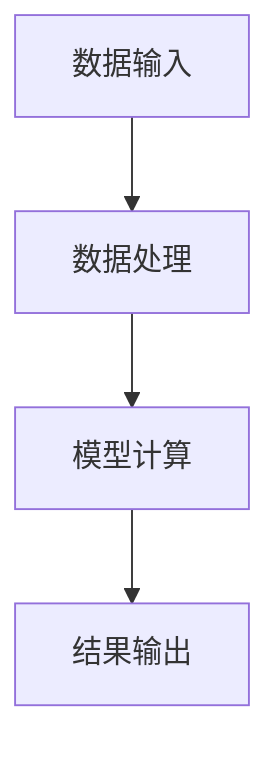
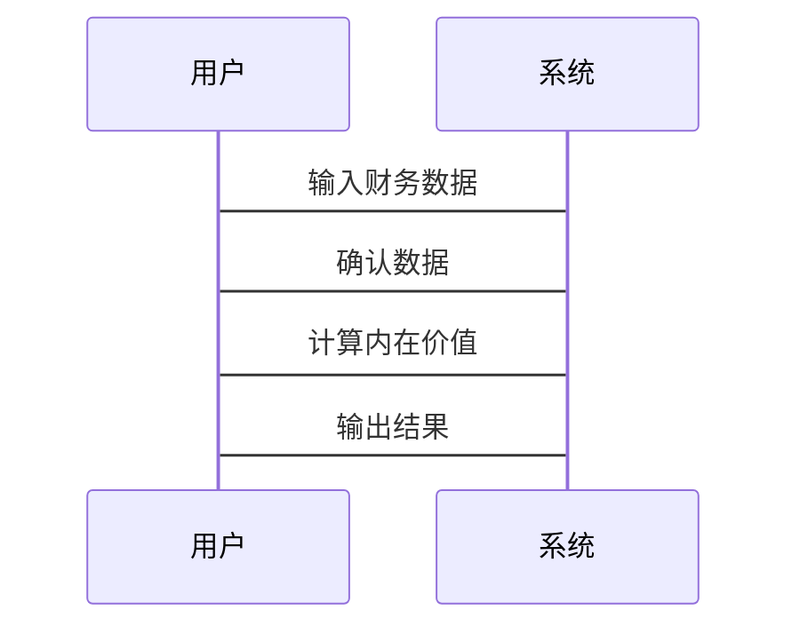
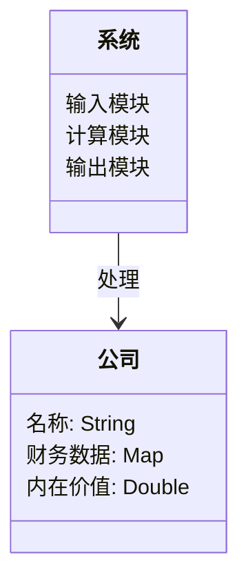

                 


# 如何计算一家公司的内在价值

**关键词**：公司内在价值、现金流折现法、相对估值法、资产重置法、财务分析、企业估值

**摘要**：  
计算一家公司的内在价值是投资决策中的核心问题之一。本文通过系统的分析和方法，深入探讨了如何准确计算公司的内在价值。从现金流折现法（DCF）到相对估值法，再到资产重置法，本文结合理论与实践，详细讲解了每种方法的原理、步骤和应用场景。同时，通过实际案例分析，帮助读者更好地理解和掌握这些方法的实际应用。

---

# 第一章：公司内在价值概述

## 1.1 内在价值的核心概念

### 1.1.1 内在价值的定义  
内在价值是指一家公司在其持续经营和合理管理下，能够创造的所有未来现金流的现值。它是企业的真实价值，与市场波动和外部环境无关。

### 1.1.2 内在价值的重要性  
- 内在价值是投资决策的核心依据。  
- 它帮助投资者识别被低估或高估的公司。  
- 内在价值是评估公司长期发展潜力的关键指标。

### 1.1.3 内在价值与财务分析的关系  
内在价值的计算依赖于对财务报表的深入分析，包括收入、利润、现金流和资产状况等。

---

## 1.2 内在价值的计算背景

### 1.2.1 企业估值的基本问题  
- 企业的价值取决于其未来现金流的现值。  
- 市场价格受短期因素影响，但内在价值反映企业的长期价值。  

### 1.2.2 内在价值在投资决策中的作用  
- 识别投资机会。  
- 确定合理买入价格。  
- 评估投资风险。  

### 1.2.3 内在价值计算的边界与外延  
- 内在价值计算需要假设企业的持续经营。  
- 企业的竞争地位和管理能力会影响内在价值。

---

## 1.3 内在价值的核心要素

### 1.3.1 收益能力  
- 收益能力是企业创造现金流的能力。  
- 包括净利润率、ROE等指标。  

### 1.3.2 资产质量  
- 资产质量影响企业的盈利能力和抗风险能力。  
- 包括固定资产、无形资产和流动资产等。

### 1.3.3 财务健康性  
- 财务健康性是企业能否持续经营的关键。  
- 包括资产负债率、流动比率等指标。

### 1.3.4 市场地位  
- 市场地位决定了企业的定价权和竞争优势。  
- 包括市场份额、品牌影响力等。

---

## 1.4 本章小结  
本章介绍了内在价值的定义、重要性及其核心要素，为后续的计算方法奠定了基础。

---

# 第二章：现金流折现法（DCF）

## 2.1 现金流折现法的基本原理

### 2.1.1 自由现金流的定义  
自由现金流（FCF）是企业在扣除所有支出后的剩余现金流，用于偿还债务和股东回报。

$$ \text{FCF} = \text{净利润} + \text{非现金费用} - \text{资本支出} $$

### 2.1.2 折现率的计算方法  
折现率（r）是投资者要求的回报率，通常包括无风险利率和风险溢价。

$$ r = \text{无风险利率} + \text{风险溢价} $$

### 2.1.3 终值的计算公式  
终值（TV）是未来现金流按折现率计算的现值。

$$ TV = \frac{\text{CF}_{n+1}}{(1 + r)^n} $$

---

## 2.2 DCF模型的步骤与应用

### 2.2.1 项目介绍  
以某公司为例，计算其未来五年的自由现金流和终值。

### 2.2.2 系统功能设计  
- 数据输入模块：收集财务数据。  
- 计算模块：计算自由现金流和折现率。  
- 折现模块：计算未来现金流的现值。  
- 输出模块：显示终值和内在价值。

### 2.2.3 系统架构设计  



### 2.2.4 系统交互设计  



---

## 2.3 现金流折现法的数学模型  

### 2.3.1 自由现金流公式  
$$ FCF = \text{净利润} + \text{非现金费用} - \text{资本支出} $$

### 2.3.2 折现率公式  
$$ r = \text{无风险利率} + \text{风险溢价} $$

### 2.3.3 终值公式  
$$ TV = \frac{CF_{n+1}}{(1 + r)^n} $$

---

## 2.4 现金流折现法的案例分析  

### 2.4.1 某公司DCF模型的应用  
以某公司为例，计算其未来五年的自由现金流和终值。

### 2.4.2 案例结果分析与解读  
通过计算得出公司的内在价值，并与市场价格进行比较，判断其是否被低估或高估。

---

## 2.5 本章小结  
本章详细介绍了现金流折现法的原理、步骤和应用，为后续的相对估值法和资产重置法奠定了基础。

---

# 第三章：相对估值法

## 3.1 相对估值法的原理

### 3.1.1 市盈率法  
市盈率（P/E）是市场价格与每股收益的比率。

$$ \text{P/E} = \frac{\text{市场价格}}{\text{每股收益}} $$

### 3.1.2 市净率法  
市净率（P/B）是市场价格与每股净资产的比率。

$$ \text{P/B} = \frac{\text{市场价格}}{\text{每股净资产}} $$

### 3.1.3 市销率法  
市销率（P/S）是市场价格与每股收入的比率。

$$ \text{P/S} = \frac{\text{市场价格}}{\text{每股收入}} $$

---

## 3.2 相对估值法的优缺点

### 3.2.1 优点  
- 简单易懂，计算速度快。  
- 可用于行业横向比较。

### 3.2.2 缺点  
- 受行业和公司规模的影响较大。  
- 无法反映公司的未来现金流。

---

## 3.3 相对估值法的案例分析  

### 3.3.1 行业横向比较  
以科技行业为例，比较不同公司的P/E和P/B比率。

### 3.3.2 估值结果与市场价格的比较  
判断公司是否被低估或高估。

---

## 3.4 本章小结  
本章介绍了相对估值法的原理和应用，展示了其在实际中的优缺点。

---

# 第四章：资产重置法

## 4.1 资产重置法的原理

### 4.1.1 重置成本法  
重置成本法是将公司所有资产按当前市场价重新购买所需的成本之和。

### 4.1.2 经济价值法  
经济价值法是将公司资产的公允价值相加，减去负债。

---

## 4.2 资产重置法的应用

### 4.2.1 企业清算情景下的应用  
假设公司破产清算，计算其资产的重置成本。

### 4.2.2 企业重组情景下的应用  
假设公司进行资产重组，计算其经济价值。

---

## 4.3 本章小结  
本章介绍了资产重置法的原理和应用，展示了其在企业清算和重组中的重要性。

---

# 第五章：系统分析与架构设计

## 5.1 系统功能设计

### 5.1.1 领域模型Mermaid类图  



### 5.1.2 系统架构设计  


### 5.1.3 系统交互设计  


---

## 5.2 系统实现

### 5.2.1 环境安装  
- 安装Python和必要的库（如Pandas、NumPy）。  
- 安装Mermaid工具。

### 5.2.2 核心实现代码  

```python
def calculate_intrinsic_value(fcf, discount_rate):
    # 计算终值
    tv = fcf / (1 + discount_rate)
    # 计算内在价值
    iv = tv / (1 + discount_rate)
    return iv
```

---

## 5.3 项目实战

### 5.3.1 案例分析  
以某科技公司为例，计算其内在价值。

### 5.3.2 实际应用  
结合实际数据，计算公司内在价值，并与市场价格进行比较。

---

## 5.4 本章小结  
本章详细介绍了系统分析与架构设计，展示了如何将内在价值计算方法应用于实际项目。

---

# 第六章：总结与展望

## 6.1 本章小结  
总结了公司内在价值的计算方法，包括现金流折现法、相对估值法和资产重置法。

## 6.2 未来研究方向  
- 研究人工智能在内在价值计算中的应用。  
- 探讨更多估值方法的结合与优化。

---

# 参考文献  
- Graham, B. (1974). *The Intelligent Investor*.  
- Fama, E. F. (1970). *Efficient Capital Markets: A Review of Theory and Practice*.  

---

通过以上目录，我们可以系统地学习如何计算一家公司的内在价值，从基础概念到实际应用，全面掌握这一重要技能。

