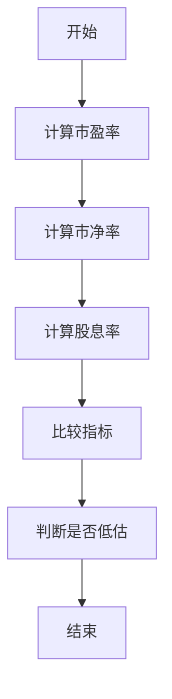
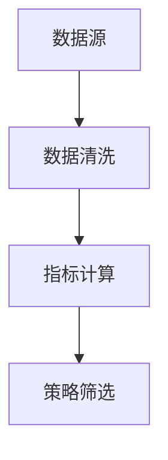
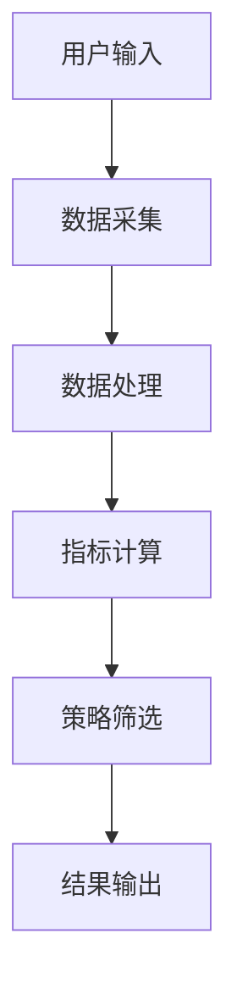

                 

# 如何识别被低估的股票：格雷厄姆的筛选方法

## 关键词：低估股票，格雷厄姆，价值投资，选股策略，投资分析

## 摘要：  
本文将详细介绍格雷厄姆的选股方法，通过系统化的筛选标准和数学模型，帮助投资者识别市场中的低估股票。文章从格雷厄姆的价值投资理念出发，逐步分析其筛选方法的核心指标和流程，结合实际案例，验证方法的有效性，最后总结投资中的注意事项和风险管理策略。

---

# 第一部分: 格雷厄姆投资理念与低估股票筛选基础

## 第1章: 格雷厄姆价值投资概述

### 1.1 格雷厄姆投资理念的核心思想

#### 1.1.1 价值投资的定义与核心原则  
价值投资是一种以基本面分析为基础的投资策略，旨在通过分析公司的财务状况、行业地位和未来前景，找到市场价格低于其内在价值的股票。格雷厄姆提出的核心原则是“安全边际”，即买入价格低于内在价值的股票，以确保投资的安全性。

#### 1.1.2 安全边际的概念与重要性  
安全边际是指股票的市场价格与其内在价值之间的差距。当市场价格远低于内在价值时，股票具有较高的安全边际，投资者的风险较低，回报潜力较大。格雷厄姆认为，安全边际是价值投资的核心，是抵御市场波动的重要保障。

#### 1.1.3 价值投资与成长投资的区别  
价值投资与成长投资的主要区别在于，价值投资注重低估值和安全边际，而成长投资注重高增长潜力。格雷厄姆的价值投资策略更适合稳健型投资者，而成长投资则适合风险承受能力较高的投资者。

---

### 1.2 低估股票的定义与特征

#### 1.2.1 什么是低估股票  
低估股票是指市场价格低于其内在价值的股票。这类股票通常具有较低的市盈率（P/E）和市净率（P/B），或者股息率较高，但市场价格未充分反映其内在价值。

#### 1.2.2 低估股票的三大特征  
1. **低市盈率**：市盈率低于行业平均水平或历史平均水平。  
2. **低市净率**：市净率低于行业平均水平或历史平均水平。  
3. **高股息率**：股息率高于行业平均水平或历史平均水平。

#### 1.2.3 低估股票与市场周期的关系  
低估股票的出现通常与市场周期有关。在市场低迷期，许多优质股票可能因为市场情绪而被低估，而在市场繁荣期，股票价格可能被高估。因此，投资者需要结合市场周期和公司基本面进行综合判断。

---

### 1.3 格雷厄姆选股的基本原则

#### 1.3.1 选股的核心标准  
1. **低市盈率**：市盈率低于行业平均水平或历史平均水平。  
2. **低市净率**：市净率低于行业平均水平或历史平均水平。  
3. **高股息率**：股息率高于行业平均水平或历史平均水平。  

#### 1.3.2 股票安全性的评估方法  
格雷厄姆提出，股票的安全性可以通过以下指标进行评估：  
1. **市盈率**：市盈率低于15倍的股票具有较高的安全边际。  
2. **市净率**：市净率低于2倍的股票具有较高的安全边际。  
3. **股息率**：股息率高于5%的股票具有较高的安全边际。  

#### 1.3.3 估值与市场的矛盾点  
格雷厄姆强调，市场价格与内在价值之间的矛盾是投资机会的来源。当市场价格远低于内在价值时，股票具有较高的投资价值。

---

## 第2章: 格雷厄姆筛选方法的核心指标

### 2.1 格雷厄姆选股的三大核心指标

#### 2.1.1 市盈率（P/E）的计算与应用  
市盈率 = 股票价格 / 每股收益（EPS）  
市盈率反映了市场对公司未来盈利能力的预期。通常，市盈率低于行业平均水平的股票具有较高的投资价值。

#### 2.1.2 市净率（P/B）的计算与应用  
市净率 = 股票价格 / 每股净资产（BPS）  
市净率反映了市场对公司资产价值的评估。通常，市净率低于行业平均水平的股票具有较高的投资价值。

#### 2.1.3 股息率的计算与应用  
股息率 = 每股股息（Dividend） / 股票价格  
股息率反映了公司向股东分配利润的能力。通常，股息率高于行业平均水平的股票具有较高的投资价值。

---

### 2.2 格雷厄姆筛选方法的数学模型

#### 2.2.1 市盈率与市净率的对比分析  
市盈率和市净率都是衡量股票价值的重要指标。市盈率适用于盈利能力较强的公司，而市净率适用于资产-heavy的公司。在实际投资中，投资者可以根据公司所处行业和商业模式选择合适的指标。

#### 2.2.2 股票内在价值的计算公式  
$$ V = \frac{E}{P} $$  
其中，$V$ 为股票的内在价值，$E$ 为公司的净利润，$P$ 为市盈率。  
格雷厄姆认为，内在价值是股票的合理价格，当市场价格低于内在价值时，股票具有投资价值。

#### 2.2.3 股票安全边际的计算公式  
$$ \text{安全边际} = \text{内在价值} - \text{市场价格} $$  
当安全边际为正时，股票具有较高的投资价值。

---

### 2.3 格雷厄姆筛选方法的流程图

---

## 第3章: 格雷厄姆筛选方法的系统架构

### 3.1 系统功能设计

#### 3.1.1 数据采集模块  
数据采集模块负责收集股票的财务数据，包括净利润、每股收益、每股净资产和股息等。

#### 3.1.2 指标计算模块  
指标计算模块负责计算市盈率、市净率和股息率等核心指标。

#### 3.1.3 筛选策略模块  
筛选策略模块负责根据格雷厄姆的筛选标准，筛选出符合条件的低估股票。

---

### 3.2 系统架构设计

---

### 3.3 系统接口设计

#### 3.3.1 数据接口  
数据接口负责与数据源（如金融数据库）对接，获取股票的财务数据。

#### 3.3.2 筛选接口  
筛选接口负责根据格雷厄姆的筛选标准，筛选出符合条件的股票。

---

### 3.4 系统交互流程图

---

# 第四部分: 格雷厄姆筛选方法的实际操作步骤

## 第4章: 格雷厄姆筛选方法的实际操作步骤

### 4.1 数据收集与处理

#### 4.1.1 数据来源  
数据来源包括金融数据库、公司财报和新闻报道等。

#### 4.1.2 数据清洗  
数据清洗包括去除无效数据、处理缺失值和异常值。

---

### 4.2 筛选策略与实施

#### 4.2.1 筛选标准  
1. 市盈率低于行业平均水平。  
2. 市净率低于行业平均水平。  
3. 股息率高于行业平均水平。  

#### 4.2.2 筛选流程  
1. 数据清洗。  
2. 计算市盈率、市净率和股息率。  
3. 筛选出符合条件的股票。  

---

### 4.3 案例分析与解读

#### 4.3.1 案例分析  
假设我们有以下两只股票：  

| 股票代码 | 市盈率 | 市净率 | 股息率 |
|----------|--------|--------|--------|
| A        | 10     | 1.5     | 5%      |
| B        | 20     | 2.0     | 3%      |

假设行业平均水平的市盈率为15，市净率为2.0，股息率为4%。  

根据格雷厄姆的筛选标准，股票A符合以下条件：  
- 市盈率低于行业平均水平（10 < 15）。  
- 市净率低于行业平均水平（1.5 < 2.0）。  
- 股息率高于行业平均水平（5% > 4%）。  

因此，股票A是一只低估股票。

---

## 第5章: 格雷厄姆筛选方法的风险管理与心理因素

### 5.1 投资中的风险管理

#### 5.1.1 市场风险  
市场风险是由于市场波动导致的股票价格波动。投资者可以通过分散投资和长期持有来降低市场风险。

#### 5.1.2 选股错误  
选股错误是由于筛选标准不够严格或数据误差导致的。投资者可以通过严格遵守筛选标准和定期复盘来降低选股错误的风险。

---

### 5.2 投资中的心理因素

#### 5.2.1 恐慌与贪婪  
投资者在市场低迷时容易恐慌，而在市场繁荣时容易贪婪。格雷厄姆强调，投资者需要保持冷静，避免被市场情绪左右。

#### 5.2.2 焦虑与耐心  
投资需要长期耐心，投资者需要避免短期波动的干扰，坚持价值投资的理念。

---

## 第6章: 格雷厄姆筛选方法的总结与展望

### 6.1 总结

格雷厄姆的筛选方法是一种简单有效的价值投资策略，通过筛选低市盈率、低市净率和高股息率的股票，投资者可以找到被低估的股票，实现长期投资回报。

---

### 6.2 展望

随着市场的发展和技术的进步，格雷厄姆的筛选方法将不断优化和创新。未来，投资者可以通过大数据和人工智能技术，进一步提高筛选效率和准确性，实现更加精准的投资。

---

### 最佳实践 tips

1. **坚持价值投资理念**：格雷厄姆的价值投资理念是长期投资的基础。  
2. **严格遵守筛选标准**：投资者需要严格遵守格雷厄姆的筛选标准，避免选股错误。  
3. **保持长期投资心态**：投资需要耐心和纪律，避免短期波动的干扰。  

---

### 小结

格雷厄姆的筛选方法是一种简单有效的投资策略，通过低市盈率、低市净率和高股息率的筛选标准，投资者可以找到被低估的股票，实现长期投资回报。

---

### 注意事项

1. **数据准确性**：投资者需要确保数据的准确性和完整性。  
2. **市场变化**：市场情况随时变化，投资者需要定期复盘和调整投资策略。  
3. **风险管理**：投资者需要重视风险管理，避免过度集中投资。

---

### 拓展阅读

1. 《格雷厄姆投资经典》  
2. 《价值投资实战指南》  
3. 《股票投资的数学分析》  

---

通过以上步骤，投资者可以系统地应用格雷厄姆的筛选方法，识别被低估的股票，实现长期稳健的投资回报。

