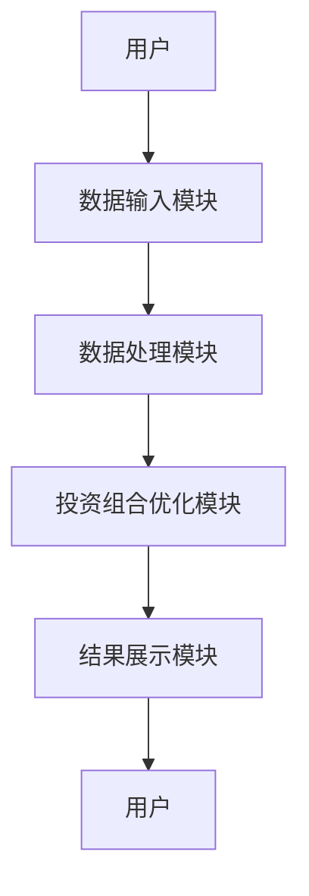

                 


# 《威廉·伯恩斯坦的高效投资组合理论》

> **关键词**：威廉·伯恩斯坦、投资组合理论、风险调整回报、分散化投资、投资组合优化、现代投资组合理论、伯恩斯坦理论

> **摘要**：本文系统地介绍威廉·伯恩斯坦的高效投资组合理论，从其理论背景、核心概念、数学模型到实际应用，全面解析其在投资组合优化和风险管理中的重要作用。通过案例分析和代码实现，深入探讨伯恩斯坦理论在实际投资中的应用价值。

---

## 第1章：投资组合理论的背景与发展

### 1.1 投资组合理论的起源与演变

#### 1.1.1 马科维茨现代投资组合理论的提出

现代投资组合理论（MPT）由哈里·马科维茨于1952年提出，奠定了投资组合理论的基础。马科维茨提出，投资者可以通过分散投资来降低风险，即通过投资于多样化的资产来降低特定资产的风险。这种分散化的效果使得投资组合的整体风险低于单一资产的风险。

马科维茨的理论引入了均值-方差模型，通过优化投资组合的期望收益和风险，找到最优的投资组合。这种方法为后续的投资组合理论发展提供了理论基础。

#### 1.1.2 从马科维茨到伯恩斯坦的理论发展

随着金融市场的不断发展，投资组合理论也在不断进化。威廉·伯恩斯坦在马科维茨的基础上，进一步发展了投资组合理论，特别是在实际应用中如何平衡风险和收益，以及如何在不同市场条件下调整投资组合。

伯恩斯坦强调了长期投资的重要性，并提出了基于风险调整的回报模型，这使得投资组合的优化更加注重风险控制和收益最大化。

#### 1.1.3 当代投资组合理论的现状与趋势

当前，投资组合理论已经从单纯的资产配置扩展到包括风险管理、动态调整和实时监控等多个方面。随着金融工具的多样化和复杂化，投资组合理论也在不断吸收新的研究成果，如行为金融学、大数据分析等。

现代投资组合理论的发展趋势是更加注重实际应用，结合市场动态和投资者行为，提供更加个性化的投资解决方案。

### 1.2 伯恩斯坦投资组合理论的核心思想

#### 1.2.1 伯恩斯坦投资组合理论的基本框架

伯恩斯坦的投资组合理论强调长期投资和分散化。他提出，投资者应该根据自身的风险承受能力和投资目标，构建一个最优的投资组合，并定期进行调整以应对市场变化。

伯恩斯坦认为，投资组合的优化不仅仅是数学问题，更是实践问题。他提出了基于风险调整的回报模型，通过最大化风险调整后的收益来优化投资组合。

#### 1.2.2 风险与收益的平衡之道

伯恩斯坦强调了风险控制的重要性。他认为，投资组合的优化应该在风险和收益之间找到平衡点，而不是一味追求高收益。通过分散化投资和合理的资产配置，投资者可以在承受一定风险的前提下，获得最大的收益。

#### 1.2.3 伯恩斯坦理论在实际投资中的应用

伯恩斯坦的理论在实际投资中得到了广泛应用。他提出的基于风险调整的回报模型，帮助投资者在不同市场条件下调整投资组合，以实现长期稳定的收益。

### 1.3 投资组合优化的数学基础

#### 1.3.1 投资组合的期望收益与风险

投资组合的期望收益是各资产期望收益的加权平均，而风险则通过方差来衡量。马科维茨的均值-方差模型为投资组合优化提供了基础框架。

#### 1.3.2 方差与协方差的计算

方差衡量了资产收益的波动性，协方差则衡量了资产之间的相关性。通过计算资产之间的协方差矩阵，可以更好地理解投资组合的风险来源。

#### 1.3.3 投资组合的有效前沿

有效前沿是指在给定风险水平下，能够提供最高期望收益的投资组合的集合。投资者可以通过选择位于有效前沿上的投资组合，实现收益与风险的最佳匹配。

---

## 第2章：伯恩斯坦投资组合理论的核心概念

### 2.1 投资组合优化的数学模型

#### 2.1.1 均值-方差优化模型

马科维茨的均值-方差模型是投资组合优化的基础。其数学表达如下：

$$
\min_w \sigma^2(w) = w^T \Sigma w
$$

其中，\( w \) 是投资组合的权重向量，\( \Sigma \) 是资产收益的协方差矩阵。

约束条件为：

$$
\mu^T w = \mu_p, \quad \sum_{i=1}^n w_i = 1
$$

其中，\( \mu \) 是资产的期望收益向量，\( \mu_p \) 是目标期望收益。

#### 2.1.2 带有风险约束的优化模型

在伯恩斯坦的理论中，风险约束是优化过程中的重要考虑因素。带有风险约束的优化模型可以表示为：

$$
\min_w \sigma^2(w) \quad \text{ s.t. } \quad \mu^T w \geq \mu_p, \quad \sum_{i=1}^n w_i = 1
$$

#### 2.1.3 多目标优化模型

伯恩斯坦的理论还考虑了多个目标的优化，如最大化收益、最小化风险等。多目标优化可以通过加权法或 Pareto 优化方法实现。

---

### 2.2 投资组合的有效前沿与风险调整回报

#### 2.2.1 有效前沿的定义与计算

有效前沿是指在给定风险水平下，能够提供最高期望收益的投资组合的集合。计算有效前沿需要通过优化模型求解不同风险水平下的最优收益。

#### 2.2.2 风险调整回报的衡量方法

风险调整回报是衡量投资组合收益的重要指标，常用的指标包括夏普比率和特雷纳比率。

夏普比率的公式为：

$$
\text{夏普比率} = \frac{E(r_p) - r_f}{\sigma_p}
$$

其中，\( E(r_p) \) 是投资组合的期望收益，\( r_f \) 是无风险利率，\( \sigma_p \) 是投资组合的风险（标准差）。

#### 2.2.3 有效前沿在实际投资中的应用

投资者可以通过选择位于有效前沿上的投资组合，实现收益与风险的最佳匹配。在实际应用中，有效前沿可以帮助投资者在不同市场条件下调整投资组合，以应对市场波动。

---

### 2.3 投资组合的分散化与风险控制

#### 2.3.1 分散化投资的基本原理

分散化投资通过投资于不同资产或资产类别，降低投资组合的整体风险。分散化的效果取决于资产之间的相关性和各资产的方差。

#### 2.3.2 风险的度量与控制

伯恩斯坦的理论中，风险的度量是通过方差和协方差矩阵来实现的。通过控制投资组合的方差，可以有效降低投资风险。

#### 2.3.3 伯恩斯坦理论中的分散化策略

伯恩斯坦建议投资者通过广泛分散化投资，降低特定资产的风险，并通过长期持有和定期调整，应对市场变化。

---

## 第3章：伯恩斯坦投资组合理论的数学模型与算法

### 3.1 投资组合优化的数学公式

#### 3.1.1 均值-方差模型的数学表达

$$
\min_w \sigma^2(w) = w^T \Sigma w
$$

约束条件：

$$
\mu^T w = \mu_p, \quad \sum_{i=1}^n w_i = 1
$$

#### 3.1.2 带有风险约束的优化模型

$$
\min_w \sigma^2(w) \quad \text{ s.t. } \quad \mu^T w \geq \mu_p, \quad \sum_{i=1}^n w_i = 1
$$

### 3.2 投资组合优化的算法实现

#### 3.2.1 使用拉格朗日乘数法求解优化问题

拉格朗日乘数法是一种常用的优化方法，可以通过引入拉格朗日乘数将约束条件转化为无约束优化问题。

#### 3.2.2 现代投资组合理论的数值解法

数值解法如梯度下降法和牛顿法常用于求解投资组合优化问题，特别是在高维情况下。

#### 3.2.3 伯恩斯坦理论中的优化策略

伯恩斯坦的理论结合了数学模型和实际投资策略，强调在实际操作中考虑市场动态和投资者行为。

---

## 第4章：投资组合管理系统的设计与实现

### 4.1 系统架构设计

#### 4.1.1 系统功能模块划分

- 数据输入与处理模块
- 投资组合优化模块
- 结果展示与分析模块

#### 4.1.2 系统架构的Mermaid图表示



### 4.2 系统接口设计

#### 4.2.1 用户界面设计

用户可以通过图形界面输入数据并查看优化结果。

#### 4.2.2 API接口设计

API接口允许其他系统与投资组合管理系统进行交互，如数据输入和结果输出。

### 4.3 系统交互流程

#### 4.3.1 用户登录与数据输入

用户登录系统后，输入相关数据，如资产收益和风险数据。

#### 4.3.2 投资组合优化计算

系统根据输入数据进行投资组合优化，生成优化结果。

#### 4.3.3 结果展示与风险分析

优化结果通过图表和表格形式展示，用户可以进行风险分析和调整。

---

## 第5章：项目实战与代码实现

### 5.1 环境安装与配置

#### 5.1.1 Python环境的搭建

安装Python和必要的库，如numpy、pandas、matplotlib。

#### 5.1.2 必要库的安装

使用pip安装必要的库：

```bash
pip install numpy pandas matplotlib
```

### 5.2 核心代码实现

#### 5.2.1 投资组合优化的数学模型实现

使用numpy和scipy进行优化计算。

```python
import numpy as np
from scipy.optimize import minimize

def portfoliooptimize(returns, cov_matrix, target_return):
    n = len(returns)
    # 定义目标函数
    def objective(weights):
        return np.dot(weights.T, np.dot(cov_matrix, weights))
    # 定义约束条件
    constraints = [
        ('sum', weights, 1),
        ('return', weights, target_return)
    ]
    # 使用最小二乘法求解
    result = minimize(objective, np.array([1/n]*n), constraints)
    return result.x
```

#### 5.2.2 伯恩斯坦理论的应用代码

结合伯恩斯坦理论，实现风险调整后的投资组合优化。

```python
def bernstein_portfolio(returns, cov_matrix, target_return, risk_free_rate):
    n = len(returns)
    # 计算夏普比率
    def sharpe_ratio(weights):
        return (np.dot(weights.T, returns) - risk_free_rate) / np.sqrt(np.dot(weights.T, np.dot(cov_matrix, weights)))
    # 最大化夏普比率
    result = minimize(lambda w: -sharpe_ratio(w), np.array([1/n]*n))
    return result.x
```

### 5.3 实际案例分析

#### 5.3.1 数据收集与预处理

收集历史收益数据并进行预处理，计算协方差矩阵。

#### 5.3.2 投资组合优化的计算与结果分析

使用上述代码进行优化计算，并分析结果。

#### 5.3.3 结果可视化与风险评估

通过图表展示优化结果，并进行风险评估。

---

## 第6章：最佳实践与小结

### 6.1 投资组合管理中的注意事项

- 定期调整投资组合以应对市场变化。
- 合理分散投资以降低风险。
- 结合市场动态和投资者行为进行优化。

### 6.2 小结

本文系统地介绍了威廉·伯恩斯坦的高效投资组合理论，从理论基础到实际应用，详细讲解了投资组合优化的核心概念和算法实现。通过案例分析和代码实现，展示了伯恩斯坦理论在实际投资中的应用价值。

### 6.3 注意事项

- 投资组合优化需要考虑市场动态和投资者行为。
- 优化结果需要结合实际情况进行调整。
- 风险控制是投资组合管理的核心。

### 6.4 拓展阅读

推荐进一步阅读威廉·伯恩斯坦的著作《投资最重要的事情》和相关投资组合理论的研究论文。

---

通过以上章节的详细讲解，读者可以全面理解威廉·伯恩斯坦的高效投资组合理论，并能够在实际投资中应用这些理论和方法。

