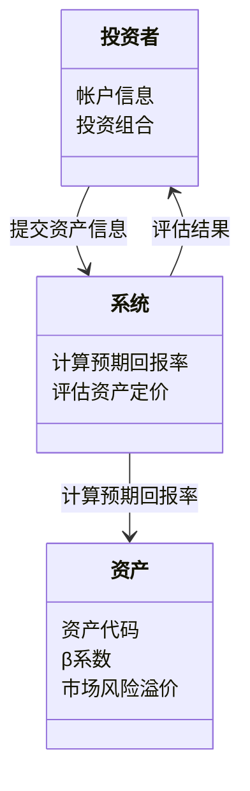
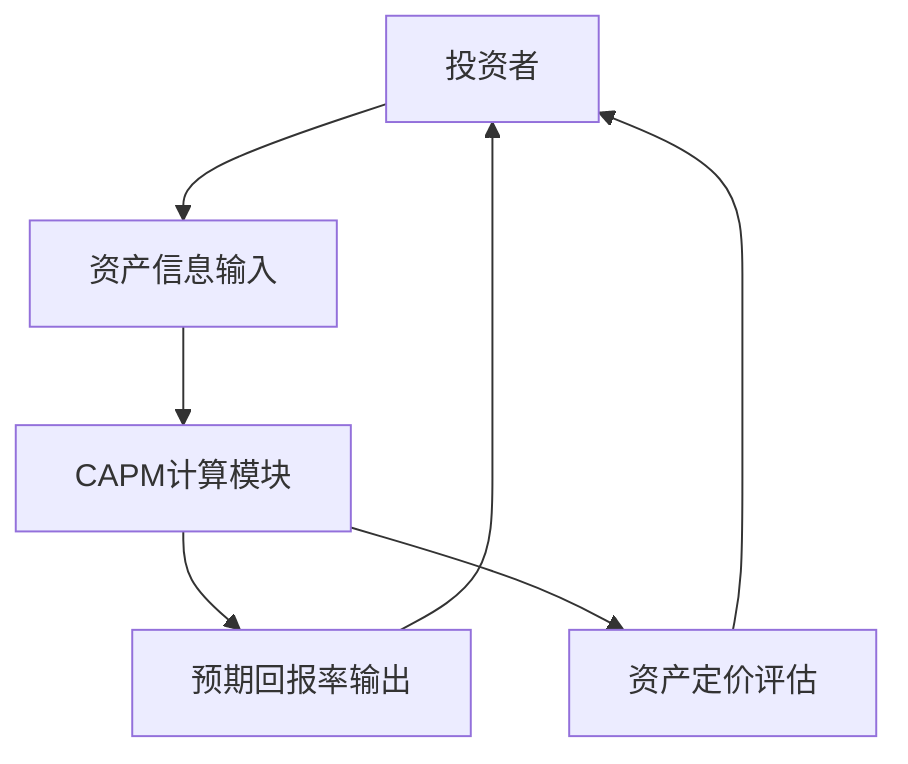
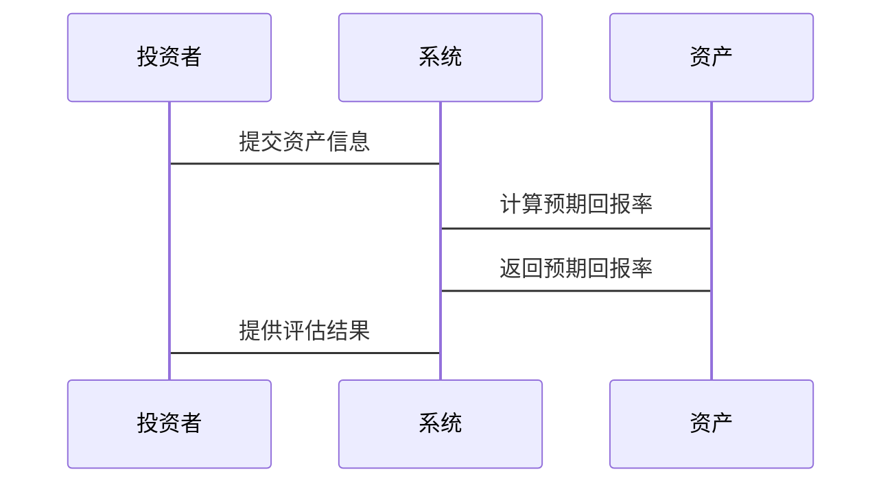

                 


# 威廉·夏普的资本资产定价模型(CAPM)在价值投资中的应用

> **关键词**：价值投资、CAPM、威廉·夏普、资产定价、投资分析

> **摘要**：威廉·夏普提出的资本资产定价模型（CAPM）是金融学中最重要的成果之一，它提供了一种估计证券期望收益的框架，考虑了系统性风险和非系统性风险。本文将详细探讨CAPM的基本原理、其在价值投资中的具体应用，以及如何通过系统架构设计和项目实战来优化投资决策。文章结构清晰，从理论到实践，帮助读者全面理解CAPM的价值和应用方法。

---

## 第1章: 资本资产定价模型(CAPM)的基础知识

### 1.1 CAPM的定义与背景

#### 1.1.1 什么是资本资产定价模型
资本资产定价模型（CAPM）是金融学中用于估计证券期望收益的重要模型。它通过分析系统性风险和非系统性风险，帮助投资者确定资产的合理定价。

#### 1.1.2 CAPM的发展历史
CAPM由威廉·夏普在1964年提出，是现代金融理论的基石之一。它基于有效市场假说，假设市场参与者能够以无风险利率借入资金，并且市场风险可以分散。

#### 1.1.3 CAPM在金融学中的地位
CAPM不仅是资产定价的基础，还被广泛应用于投资组合管理、风险评估和资本预算等领域。

### 1.2 CAPM的基本假设

#### 1.2.1 投资者如何分散风险
CAPM假设投资者可以通过分散投资消除非系统性风险，仅承担系统性风险。因此，投资者的风险偏好可以通过对系统性风险的承担来衡量。

#### 1.2.2 市场风险与非市场风险
系统性风险（市场风险）影响整个市场，而非系统性风险（特定风险）影响单个资产。CAPM只考虑系统性风险。

#### 1.2.3 无风险利率与市场风险溢价
无风险利率是CAPM中的基准利率，市场风险溢价是市场对系统性风险的补偿。

### 1.3 CAPM与价值投资的关系

#### 1.3.1 价值投资的核心理念
价值投资强调寻找市场价格低于内在价值的资产，通过分析基本面因素来确定其真实价值。

#### 1.3.2 CAPM如何应用于价值投资
CAPM帮助投资者计算资产的预期回报，确定其市场价格是否被低估或高估。如果预期回报低于市场回报，资产可能被高估；反之，则可能被低估。

#### 1.3.3 CAPM在投资决策中的作用
CAPM为价值投资者提供了评估资产定价的工具，帮助他们在市场中发现被低估的投资机会。

### 1.4 本章小结

#### 1.4.1 CAPM的基本框架
CAPM通过分析系统性风险，帮助投资者确定资产的合理定价。

#### 1.4.2 CAPM与价值投资的结合点
CAPM为价值投资提供了量化工具，帮助投资者识别被低估的资产。

#### 1.4.3 本书的主要内容概述
本书将从理论到实践，详细探讨CAPM在价值投资中的应用，包括公式推导、案例分析和系统设计。

---

## 第2章: CAPM的核心公式与变量

### 2.1 CAPM的数学公式

#### 2.1.1 CAPM公式的详细推导
$$ E(r_i) = r_f + \beta_i (E(r_m) - r_f) $$
其中：
- \( E(r_i) \)：资产i的预期收益率
- \( r_f \)：无风险利率
- \( \beta_i \)：资产i的β系数
- \( E(r_m) \)：市场预期收益率

#### 2.1.2 公式中的关键变量
- 无风险利率：通常用国债收益率表示。
- 市场风险溢价：市场预期回报率减去无风险利率。
- β系数：衡量资产的系统性风险，β=1表示与市场同步波动。

#### 2.1.3 公式的适用条件
CAPM假设市场是有效的，且投资者可以无摩擦地进行交易。

### 2.2 CAPM中的关键变量分析

#### 2.2.1 无风险利率的确定
无风险利率是CAPM的核心变量，常用短期国债收益率表示。

#### 2.2.2 市场风险溢价的计算
市场风险溢价 = 市场预期回报率 - 无风险利率。

#### 2.2.3 β系数的含义与计算
β系数衡量资产相对于市场的波动性，通过回归分析计算。

### 2.3 CAPM公式的实际应用

#### 2.3.1 如何计算股票的预期回报
假设市场预期回报率为10%，无风险利率为2%，市场风险溢价为8%。对于β=1的股票，其预期回报率为：
$$ E(r_i) = 2\% + 1 \times 8\% = 10\% $$

#### 2.3.2 如何评估资产的定价是否合理
如果资产的预期回报率低于市场回报率，可能被高估；反之，则可能被低估。

#### 2.3.3 CAPM在投资组合中的应用
通过CAPM，投资者可以确定每个资产的预期回报率，优化投资组合配置。

### 2.4 本章小结

#### 2.4.1 CAPM公式的结构
CAPM通过β系数和市场风险溢价，帮助投资者估计资产的预期回报率。

#### 2.4.2 各变量的含义与计算
无风险利率、市场风险溢价和β系数是CAPM的关键变量，需准确估计和计算。

#### 2.4.3 公式在投资分析中的应用
CAPM不仅用于单个资产分析，还可用于投资组合的风险调整回报评估。

---

## 第3章: CAPM在价值投资中的应用

### 3.1 价值投资的核心理念与CAPM的结合

#### 3.1.1 价值投资的基本原理
价值投资者寻找市场价格低于内在价值的资产，通过长期持有实现收益。

#### 3.1.2 CAPM如何帮助识别被低估资产
通过计算资产的预期回报率，与市场回报率对比，确定其是否被低估。

#### 3.1.3 CAPM与内在价值评估
CAPM提供了一种量化工具，帮助投资者计算资产的内在价值。

### 3.2 CAPM在内在价值评估中的应用

#### 3.2.1 内在价值的定义
内在价值是基于资产基本面因素计算的合理价值。

#### 3.2.2 使用CAPM计算内在价值
通过CAPM计算资产的预期回报率，再结合现金流折现法（DCF）评估其内在价值。

#### 3.2.3 案例分析：计算某股票的内在价值
假设某股票的β=1.2，无风险利率=3%，市场风险溢价=6%，预期现金流为$100，折现率=预期回报率=3%+1.2×6%=10.2%。则内在价值约为$100 / 0.102 ≈ $980.39。

### 3.3 CAPM在风险调整回报分析中的应用

#### 3.3.1 风险调整回报的定义
风险调整回报是指在考虑系统性风险后的预期回报。

#### 3.3.2 使用CAPM计算风险调整回报
将CAPM计算的预期回报率与市场回报率对比，评估资产的风险调整回报。

#### 3.3.3 案例分析：风险调整回报对比
如果市场预期回报率为10%，某资产的预期回报率为12%，则该资产的风险调整回报为正，可能被低估。

### 3.4 本章小结

#### 3.4.1 CAPM在价值投资中的作用
CAPM为价值投资者提供了量化工具，帮助识别被低估的资产。

#### 3.4.2 内在价值评估与CAPM的结合
CAPM通过计算预期回报率，帮助投资者确定资产的内在价值。

#### 3.4.3 风险调整回报分析的重要性
通过CAPM分析风险调整回报，投资者可以做出更明智的投资决策。

---

## 第4章: CAPM与其他定价模型的比较

### 4.1 其他资产定价模型概述

#### 4.1.1 马科维茨的均值-方差模型
马科维茨模型关注投资组合的最优配置，但未直接解决资产定价问题。

#### 4.1.2APT模型
APT模型基于因素模型定价资产，不要求市场有效。

#### 4.1.3 三因子模型
三因子模型扩展了CAPM，考虑市值、书值等其他因素。

### 4.2 CAPM的优势与局限性

#### 4.2.1 CAPM的优势
- 简单易懂，易于计算。
- 考虑了系统性风险，提供了风险调整回报框架。

#### 4.2.2 CAPM的局限性
- 忽略非系统性风险。
- 假设市场有效，实际市场可能存在摩擦。

### 4.3 CAPM与其他模型的比较

#### 4.3.1 CAPM与APT模型的比较
CAPM基于市场有效假设，而APT模型不依赖市场有效性。

#### 4.3.2 CAPM与三因子模型的比较
三因子模型扩展了CAPM，考虑更多因素，但增加了复杂性。

### 4.4 本章小结

#### 4.4.1 CAPM的基本优势
CAPM简单直观，是资产定价的基础模型。

#### 4.4.2 CAPM的局限性
CAPM的假设在现实中可能不成立，因此在实际应用中需谨慎。

#### 4.4.3 与其他模型的比较
CAPM与其他模型各有优劣，投资者应根据具体情况选择合适模型。

---

## 第5章: CAPM的数学模型与公式

### 5.1 CAPM公式的数学推导

#### 5.1.1 推导过程
基于有效市场假说和投资者风险偏好，推导出CAPM公式。

#### 5.1.2 公式的变量与关系
通过回归分析，确定β系数和市场风险溢价。

#### 5.1.3 公式在投资组合中的应用
通过CAPM计算投资组合的预期回报率，优化资产配置。

### 5.2 CAPM公式的实际案例分析

#### 5.2.1 案例1：计算股票的预期回报率
假设无风险利率=2%，市场风险溢价=5%，β=1.5，则预期回报率为2%+1.5×5%=9.5%。

#### 5.2.2 案例2：评估资产的定价是否合理
如果市场预期回报率为8%，某资产的预期回报率为10%，则该资产可能被低估。

### 5.3 CAPM公式的代码实现

#### 5.3.1 Python代码实现
```python
def capm_expected_return(rf, beta, market_risk_premium):
    return rf + beta * market_risk_premium

rf = 0.02
beta = 1.2
market_risk_premium = 0.06
expected_return = capm_expected_return(rf, beta, market_risk_premium)
print(f"Expected return: {expected_return*100}%")
```

#### 5.3.2 代码结果分析
运行上述代码，预期回报率为：
$$ 2\% + 1.2 \times 6\% = 9.2\% $$

### 5.4 本章小结

#### 5.4.1 CAPM公式的数学推导
CAPM公式基于有效市场假说和投资者风险偏好推导得出。

#### 5.4.2 公式在实际中的应用
通过案例分析和代码实现，展示了CAPM的实际应用方法。

#### 5.4.3 代码实现的意义
代码帮助投资者快速计算资产的预期回报率，优化投资决策。

---

## 第6章: 系统分析与架构设计

### 6.1 系统分析

#### 6.1.1 问题场景介绍
投资者需要通过CAPM分析资产的预期回报率，优化投资组合。

#### 6.1.2 项目介绍
开发一个基于CAPM的投资分析系统，帮助投资者评估资产的定价。

### 6.2 系统功能设计

#### 6.2.1 领域模型设计
使用Mermaid绘制类图，展示系统中的关键类及其关系。



### 6.3 系统架构设计

#### 6.3.1 系统架构图
使用Mermaid绘制系统架构图，展示各模块之间的关系。



### 6.4 系统接口设计

#### 6.4.1 系统接口设计
- 输入接口：接收资产信息，如β系数、市场风险溢价。
- 输出接口：提供预期回报率和资产定价评估结果。

#### 6.4.2 系统交互设计
使用Mermaid绘制交互序列图，展示系统如何处理用户请求。



### 6.5 本章小结

#### 6.5.1 系统分析的意义
通过系统分析，明确了CAPM在投资分析中的应用流程。

#### 6.5.2 系统架构设计
系统架构图展示了各模块之间的关系，为后续开发提供了指导。

#### 6.5.3 系统接口设计
清晰的接口设计确保了系统的可扩展性和可维护性。

---

## 第7章: 项目实战与经验总结

### 7.1 项目实战

#### 7.1.1 环境安装
安装必要的Python库，如NumPy和Pandas。

#### 7.1.2 系统核心实现

##### 7.1.2.1 Python代码实现
```python
import numpy as np

def calculate_beta(returns资产, returns市场):
    cov = np.cov(returns资产, returns市场的行, bias=True)
    var = np.var(returns市场的行)
    beta = cov / var
    return beta

资产收益 = np.array([...])  # 填入资产的收益数据
市场收益 = np.array([...])  # 填入市场的收益数据
beta = calculate_beta(资产收益, 市场收益)
```

##### 7.1.2.2 计算预期回报率
使用CAPM公式计算预期回报率。

##### 7.1.2.3 评估资产定价
将计算出的预期回报率与市场实际回报率对比，评估资产是否被低估或高估。

#### 7.1.2.4 数据可视化
使用Matplotlib绘制资产收益与市场收益的散点图，展示β系数的影响。

##### 7.1.2.5 代码实现
```python
import matplotlib.pyplot as plt

plt.scatter(市场收益, 资产收益)
plt.xlabel('市场收益')
plt.ylabel('资产收益')
plt.title('资产收益与市场收益散点图')
plt.show()
```

### 7.2 项目小结

#### 7.2.1 项目成果
通过项目实战，掌握了CAPM在实际投资分析中的应用方法。

#### 7.2.2 经验总结
- 数据质量影响结果，需确保数据准确。
- 系统架构设计至关重要，确保系统的可扩展性和可维护性。

### 7.3 最佳实践

#### 7.3.1 小结
CAPM在价值投资中的应用需要结合实际数据和市场环境。

#### 7.3.2 注意事项
- 确保输入数据的准确性。
- 定期更新市场参数，如无风险利率和市场风险溢价。

#### 7.3.3 拓展阅读
建议阅读威廉·夏普的原始论文，深入了解CAPM的理论基础。

### 7.4 本章小结

#### 7.4.1 项目实战的意义
通过实际操作，读者能够更好地理解CAPM的应用方法。

#### 7.4.2 系统设计的重要性
良好的系统设计是项目成功的关键。

#### 7.4.3 未来发展方向
结合大数据和机器学习，进一步优化CAPM模型。

---

## 第8章: 最佳实践与总结

### 8.1 小结

#### 8.1.1 CAPM的核心理念
CAPM通过分析系统性风险，帮助投资者确定资产的合理定价。

#### 8.1.2 价值投资与CAPM的结合
CAPM为价值投资者提供了量化工具，帮助识别被低估的资产。

### 8.2 注意事项

#### 8.2.1 数据质量的重要性
数据的准确性和完整性直接影响分析结果。

#### 8.2.2 模型的局限性
CAPM的假设在实际中可能不成立，需谨慎应用。

### 8.3 拓展阅读

#### 8.3.1 推荐书籍
- 《投资学》（Introdução à Investimentologia） - 威廉·夏普
- 《价值投资：从入门到精通》 - 乔尔·蒂施勒

#### 8.3.2 相关论文
- William F. Sharpe, "The Dynamic Behavior of Capital Asset Prices," 1964.

### 8.4 本章小结

#### 8.4.1 CAPM的价值
CAPM是金融学中的基础工具，帮助投资者进行理性决策。

#### 8.4.2 价值投资的核心理念
价值投资强调长期视角，寻找市场价格低于内在价值的资产。

#### 8.4.3 未来展望
随着技术进步，CAPM的应用将更加广泛和深入，与其他模型结合，提供更精准的投资分析工具。

---

## 附录: 参考文献

1. William F. Sharpe. "The Dynamic Behavior of Capital Asset Prices." 1964.
2. Richard A. Brealey, Stewart C. Myers, Franklin V. Allen. "Principles of Corporate Finance." 2020.
3. John C. Hull. "Risk Management and Financial Institutions." 2021.

---

通过以上详细的内容结构，您可以撰写一篇完整且深入的技术博客文章，详细探讨威廉·夏普的资本资产定价模型(CAPM)在价值投资中的应用。每个章节都包含了丰富的理论知识和实际案例，帮助读者全面理解CAPM的核心原理及其在实际投资中的应用方法。

