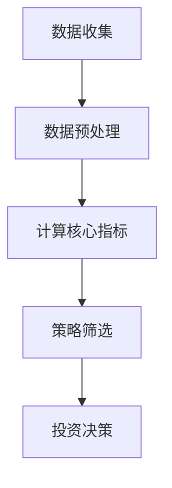
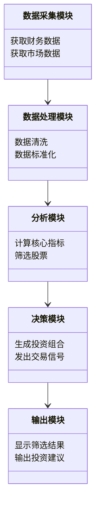
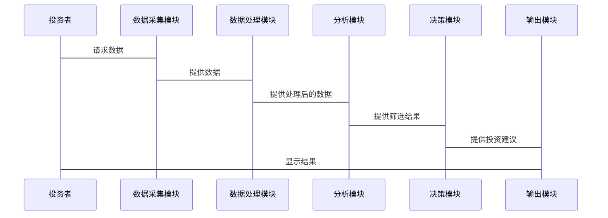

                 


# 威廉·奥尼尔的成长价值投资：CANSLIM策略的应用

## 关键词：CANSLIM策略，威廉·奥尼尔，成长价值投资，投资分析，股票筛选

## 摘要：  
CANSLIM策略是威廉·奥尼尔提出的一种基于成长价值投资的股票筛选方法，通过分析公司的基本面和市场情绪，帮助投资者识别出具有长期增长潜力的优质股票。本文将从CANSLIM策略的核心要素、算法原理、系统架构、项目实战等多个方面详细分析该策略的应用，为投资者提供实用的指导。

---

# 第一部分：CANSLIM策略的核心要素与原理

## 第1章：CANSLIM策略的核心要素

### 1.1 CANSLIM策略的定义与目标  
CANSLIM策略是一种基于成长价值投资的股票筛选方法，旨在通过分析公司的基本面和市场情绪，筛选出具有长期增长潜力的优质股票。该策略的核心目标是帮助投资者在市场中找到那些具备竞争优势、盈利能力和成长性的公司，并结合合理的估值水平和市场情绪进行投资决策。

### 1.2 CANSLIM策略的七个核心要素  
CANSLIM策略由七个字母组成，每个字母代表一个关键的投资要素：

- **C（Current Assets）：** 流动资产状况，反映了公司的短期偿债能力和运营效率。
- **A（Annual Earnings Per Share Growth）：** 每股收益的年增长率，衡量公司的盈利能力。
- **N（Net Earnings）：** 净利润，反映公司整体的盈利能力。
- **S（Sales Growth）：** 收入增长率，衡量公司的市场拓展能力和业务增长潜力。
- **L（Liabilities）：** 负债水平，评估公司的财务健康状况。
- **I（Interest and Dividends）：** 利息和股息支付情况，反映公司的财务稳定性。
- **M（Market Momentum）：** 市场动量，通过股价走势和交易量判断市场情绪。

### 1.3 CANSLIM策略的核心要素联系  
CANSLIM策略的各个要素相互关联，共同构成了一个完整的投资分析框架。以下是这些要素的联系和作用：

- **流动资产（C）：** 流动资产越多，公司应对短期债务的能力越强，财务风险越低。
- **每股收益增长率（A）：** 高增长的每股收益表明公司具有较强的盈利能力和发展潜力。
- **净利润（N）：** 净利润是公司整体盈利能力的直接体现，是衡量公司基本面的重要指标。
- **收入增长率（S）：** 收入增长反映了公司市场拓展能力和业务扩展能力。
- **负债水平（L）：** 适度的负债可以增加杠杆效应，但过高的负债会增加财务风险。
- **利息和股息（I）：** 适当的利息支付和股息分红可以提升投资者信心和市场关注度。
- **市场动量（M）：** 市场动量反映了股价走势和交易量的变化，是判断市场情绪的重要指标。

---

## 第2章：CANSLIM策略的算法原理与实现

### 2.1 CANSLIM策略的算法流程  
CANSLIM策略的实现需要按照以下步骤进行：

1. **数据收集：** 收集目标公司的财务数据和市场数据，包括流动资产、每股收益增长率、净利润、收入增长率、负债水平、利息和股息支付情况，以及股价走势和交易量等。
2. **数据预处理：** 对收集到的数据进行清洗和标准化处理，确保数据的准确性和一致性。
3. **核心指标计算：** 根据CANSLIM的七个要素，计算相应的指标，并评估每个指标是否符合筛选标准。
4. **策略筛选：** 根据预设的筛选条件，筛选出符合条件的股票，并进行排序和优先级评估。
5. **投资决策：** 根据筛选结果和市场动量，制定投资组合和交易策略。

### 2.2 CANSLIM策略的数学模型  
以下是CANSLIM策略中部分核心指标的数学表达式：

- **每股收益增长率（A）：**  
  $$ \text{每股收益增长率} = \frac{\text{本期每股收益} - \text{上期每股收益}}{\text{上期每股收益}} \times 100\% $$

- **收入增长率（S）：**  
  $$ \text{收入增长率} = \frac{\text{本期收入} - \text{上期收入}}{\text{上期收入}} \times 100\% $$

- **净利润（N）：**  
  $$ \text{净利润} = \text{收入} - \text{成本} - \text{费用} - \text{税费} $$

- **流动资产（C）：**  
  $$ \text{流动资产} = \text{现金} + \text{应收账款} + \text{存货} + \text{其他流动资产} $$

### 2.3 CANSLIM策略的流程图  
以下是CANSLIM策略的实现流程图：



---

## 第3章：CANSLIM策略的系统架构与设计

### 3.1 系统架构设计  
CANSLIM策略的投资系统架构可以分为以下几个模块：

1. **数据采集模块：** 负责从数据库或金融市场API获取股票的财务数据和市场数据。
2. **数据处理模块：** 对获取的数据进行清洗、标准化和特征提取。
3. **分析模块：** 根据CANSLIM策略的核心要素，计算各项指标并筛选符合条件的股票。
4. **决策模块：** 根据筛选结果和市场动量，生成投资组合和交易信号。
5. **输出模块：** 将筛选结果和投资建议输出给投资者。

### 3.2 系统功能设计  
以下是系统功能的类图：



### 3.3 系统交互设计  
以下是系统交互的序列图：



---

## 第4章：CANSLIM策略的项目实战

### 4.1 项目环境安装  
为了实现CANSLIM策略，我们需要安装以下工具和库：

- **Python：** 用于编程和数据分析。
- **Pandas：** 用于数据处理和分析。
- **NumPy：** 用于数学计算。
- **Matplotlib：** 用于数据可视化。
- **Yahoo Finance API：** 用于获取市场数据。

### 4.2 核心代码实现  
以下是实现CANSLIM策略的部分核心代码示例：

```python
import pandas as pd
import numpy as np
import yfinance as yf

# 下载数据
def get_data(tickers):
    data = yf.download(tickers, start='2020-01-01', end='2023-12-31')
    return data

# 计算每股收益增长率
def calculate_eps_growth(data):
    eps = data['EPS'].dropna()
    eps_growth = ((eps - eps.shift(1)) / eps.shift(1)).fillna(0)
    return eps_growth

# 计算收入增长率
def calculate_revenue_growth(data):
    revenue = data['Revenue'].dropna()
    revenue_growth = ((revenue - revenue.shift(1)) / revenue.shift(1)).fillna(0)
    return revenue_growth

# 筛选符合条件的股票
def screen_stocks(data):
    criteria = (
        (data['Current Assets'] > 0) &
        (data['EPS Growth'].rolling(3).mean() > 0.1) &
        (data['Net Profit'] > 0) &
        (data['Revenue Growth'].rolling(3).mean() > 0.1) &
        (data['Liabilities'] < 0.5 * data['Total Assets']) &
        (data['Interest and Dividends'] < 0.1 * data['Net Profit']) &
        (data['Market Momentum'] > 0)
    )
    return data[criteria]

# 示例运行
tickers = ['AAPL', 'MSFT', 'GOOGL']
data = get_data(tickers)
eps_growth = calculate_eps_growth(data)
revenue_growth = calculate_revenue_growth(data)
screened_stocks = screen_stocks(data)
print(screened_stocks)
```

### 4.3 实际案例分析  
以苹果公司（AAPL）为例，我们可以通过CANSLIM策略分析其是否符合筛选条件：

- **流动资产（C）：** 苹果的流动资产充足，具备较强的短期偿债能力。
- **每股收益增长率（A）：** 苹果的每股收益在过去几年中保持稳定增长。
- **净利润（N）：** 苹果的净利润较高，盈利能力强。
- **收入增长率（S）：** 苹果的收入在过去几年中持续增长。
- **负债水平（L）：** 苹果的负债水平相对较低，财务风险较小。
- **利息和股息（I）：** 苹果支付适当的股息，回馈股东。
- **市场动量（M）：** 苹果的股价走势稳健，市场关注度高。

基于以上分析，苹果符合CANSLIM策略的筛选条件，可以被视为长期投资的标的。

---

## 第5章：CANSLIM策略的最佳实践与注意事项

### 5.1 最佳实践  
1. **持续学习与更新：** 投资市场不断变化，需要持续关注市场动态和公司基本面。
2. **风险控制：** 在实际投资中，应结合风险控制策略，如分散投资、止损设置等。
3. **数据质量：** 确保数据的准确性和完整性，避免因数据错误导致的决策失误。
4. **技术与人工结合：** 结合技术分析和基本面分析，制定更加全面的投资策略。

### 5.2 小结  
CANSLIM策略通过分析公司的基本面和市场情绪，帮助投资者筛选出具有长期增长潜力的优质股票。然而，投资市场具有不确定性，投资者需要结合实际情况，灵活调整策略，并注意风险控制。

---

## 第6章：总结与展望

### 6.1 总结  
CANSLIM策略作为一种基于成长价值投资的股票筛选方法，通过分析公司的基本面和市场情绪，为投资者提供了一种系统化、科学化的投资决策工具。本文详细讲解了CANSLIM策略的核心要素、算法原理、系统架构和项目实战，并通过实际案例分析展示了其应用价值。

### 6.2 展望  
未来，随着人工智能和大数据技术的不断发展，CANSLIM策略可以通过更加智能化的方式实现，例如利用机器学习算法优化筛选模型，或者通过量化交易系统自动执行投资策略。此外，投资者还可以结合其他投资策略，如技术分析和风险对冲，构建更加多元化和高效的投资组合。

---

通过本文的分析，读者可以更好地理解CANSLIM策略的核心思想和应用方法，并能够在实际投资中灵活运用这一策略，提高投资决策的科学性和有效性。

