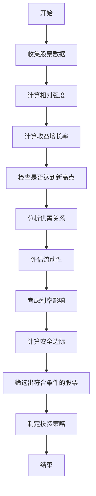

                 

# 威廉·欧奈尔的CANSLIM投资系统

## 关键词：
- 威廉·欧奈尔
- CANSLIM
- 投资系统
- 选股标准
- 相对强度
- 股票投资
- 资金管理

## 摘要：
威廉·欧奈尔的CANSLIM投资系统是一种基于基本面和技术分析的股票投资策略，通过七个选股标准（C、A、N、S、L、I、M）帮助投资者筛选出具有成长性和强大资金流支持的优质股票。本文详细解析了CANSLIM的核心概念、数学模型、系统架构设计以及实际应用案例，帮助投资者掌握这一高效的投资方法。

---

# 目录大纲

## 第一部分: 威廉·欧奈尔CANSLIM投资系统概述

### 第1章: CANSLIM投资系统的背景与核心概念

#### 1.1 投资市场的现状与挑战
- 1.1.1 当前投资市场的复杂性
- 1.1.2 投资者面临的常见问题
- 1.1.3 CANSLIM投资系统的提出背景

#### 1.2 CANSLIM投资系统的定义与特点
- 1.2.1 CANSLIM的定义
- 1.2.2 CANSLIM的核心特点
- 1.2.3 CANSLIM与传统投资方法的区别

#### 1.3 CANSLIM投资系统的理论基础
- 1.3.1 基本面分析的重要性
- 1.3.2 技术分析的作用
- 1.3.3 资金流与市场情绪的影响

### 第2章: CANSLIM投资系统的选股标准

#### 2.1 C - Current Resistance（相对强度）
- 2.1.1 相对强度的概念
- 2.1.2 如何计算相对强度
- 2.1.3 相对强度在选股中的应用

#### 2.2 A - Annual Earnings Growth（年度收益增长率）
- 2.2.1 年度收益增长率的定义
- 2.2.2 如何评估收益增长率
- 2.2.3 收益增长与股价的关系

#### 2.3 N - New Highs（新高点）
- 2.3.1 新高点的定义
- 2.3.2 如何识别新高点
- 2.3.3 新高点在投资决策中的作用

#### 2.4 S - Supply and Demand（供需关系）
- 2.4.1 供需关系的基本原理
- 2.4.2 如何分析供需关系
- 2.4.3 供需与股价波动的关系

#### 2.5 L - Liquidity（流动性）
- 2.5.1 流动性的定义
- 2.5.2 如何评估流动性
- 2.5.3 流动性对投资的影响

#### 2.6 I - Interest（利率）
- 2.6.1 利率的影响
- 2.6.2 如何分析利率对投资的影响
- 2.6.3 利率与股价的关系

#### 2.7 M - Margin of Safety（安全边际）
- 2.7.1 安全边际的概念
- 2.7.2 如何计算安全边际
- 2.7.3 安全边际在投资中的作用

### 第3章: CANSLIM投资系统的数学模型与公式

#### 3.1 相对强度指数的计算
- 3.1.1 相对强度指数的公式
  $$ 相对强度指数 = \frac{当前股价}{历史最高股价} $$

#### 3.2 收益增长率的计算
- 3.2.1 年收益增长率的公式
  $$ 收益增长率 = \frac{当前收益 - 上年收益}{上年收益} \times 100\% $$

#### 3.3 安全边际的计算
- 3.3.1 安全边际的公式
  $$ 安全边际 = \frac{当前股价}{内在价值} $$

### 第4章: CANSLIM投资系统的系统架构设计

#### 4.1 系统功能设计
- 4.1.1 数据收集模块
- 4.1.2 数据分析模块
- 4.1.3 投资决策模块

#### 4.2 系统架构图
- 使用Mermaid绘制系统架构图，展示各模块之间的关系和数据流。

### 第5章: 项目实战

#### 5.1 环境安装
- 安装必要的工具和库，如Python、Pandas、Matplotlib等。

#### 5.2 核心实现源代码
- 提供实现CANSLIM筛选标准的Python代码，包括数据处理、计算相对强度、筛选股票等。

#### 5.3 实际案例分析
- 选择具体股票，应用CANSLIM标准进行分析，展示如何筛选出符合条件的股票并制定投资策略。

### 第6章: 总结与扩展阅读

#### 6.1 总结
- 总结CANSLIM投资系统的要点，强调其优势和适用场景。

#### 6.2 最佳实践 tips
- 提供实际操作中的建议和注意事项。

#### 6.3 拓展阅读
- 推荐相关书籍、论文和资源，供读者深入学习。

---

## 附录：CANSLIM投资系统筛选流程示意图（Mermaid图）

---

## 章节详细内容（示例）：

### 第3章: CANSLIM投资系统的数学模型与公式

#### 3.1 相对强度指数的计算

相对强度是CANSLIM系统中的重要指标，用于衡量一只股票相对于市场或同行业其他股票的表现。相对强度指数的计算公式如下：

$$ 相对强度指数 = \frac{当前股价}{历史最高股价} $$

其中，历史最高股价是指该股票在一定时期内达到的最高价格。相对强度指数越接近1，表示该股票的表现越接近其历史最高水平，通常被视为一个强劲的信号。

#### 3.2 收益增长率的计算

收益增长率是衡量公司盈利能力的重要指标。通过比较当前收益与上一期收益，可以评估公司的成长性。收益增长率的计算公式为：

$$ 收益增长率 = \frac{当前收益 - 上年收益}{上年收益} \times 100\% $$

一个稳定的收益增长率通常表明公司具有持续的盈利能力，是选股时的重要参考。

#### 3.3 安全边际的计算

安全边际是投资中用于降低风险的重要概念，它反映了股票当前价格与其内在价值之间的差距。安全边际的计算公式为：

$$ 安全边际 = \frac{当前股价}{内在价值} $$

内在价值是根据公司基本面因素（如收益、现金流等）计算出的理论价值。安全边际越高，投资的风险越小，潜在的收益越大。

---

通过以上目录结构和内容安排，读者可以系统地学习和应用威廉·欧奈尔的CANSLIM投资系统，从理论到实践，逐步掌握这一高效的投资策略。

