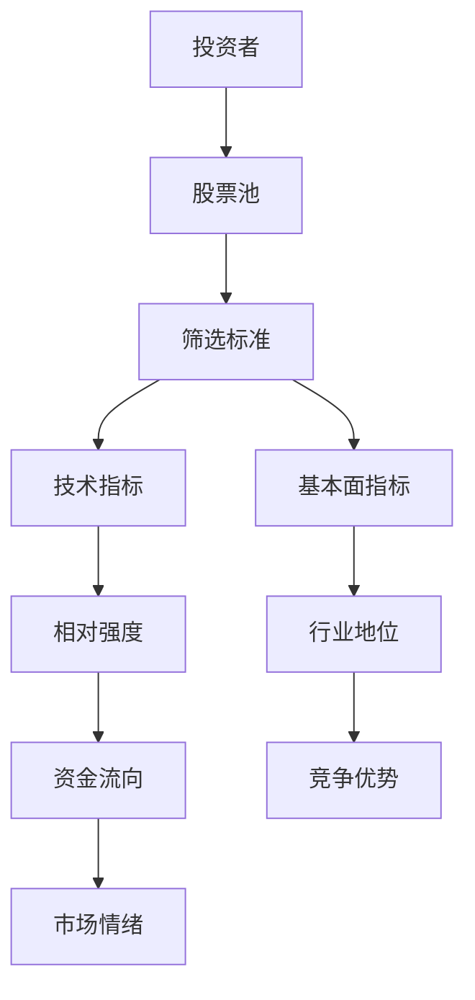
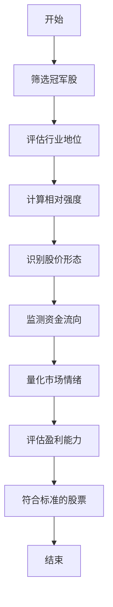
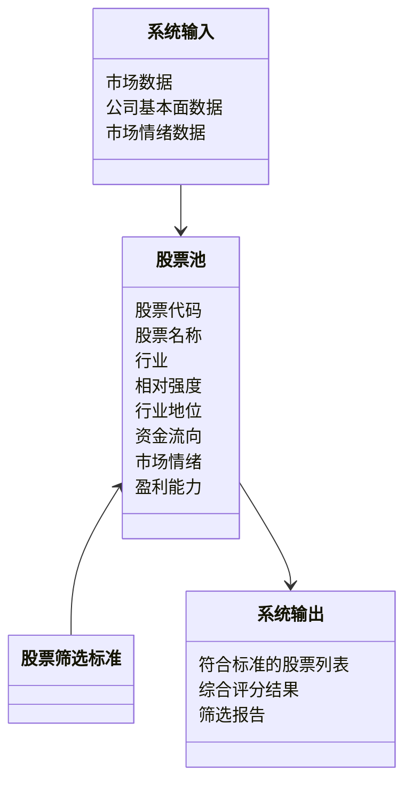
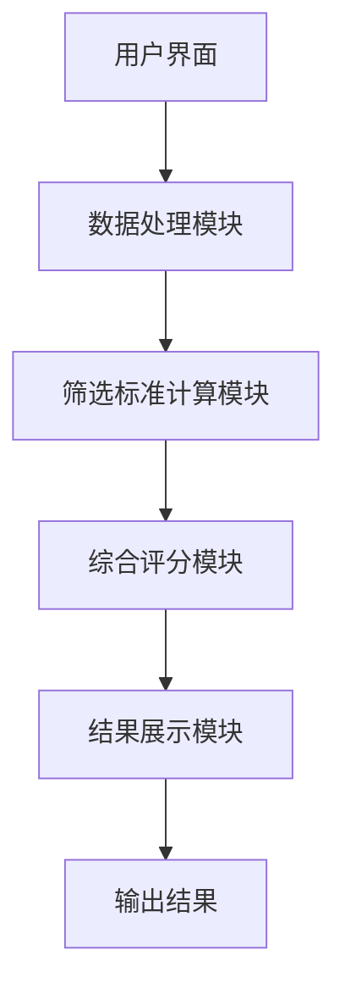
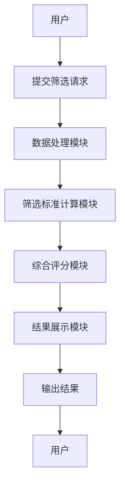

                 


# 威廉·欧奈尔的CANSLIM选股系统

> 关键词：CANSLIM选股系统，威廉·欧奈尔，股票筛选，技术分析，基本面分析，投资策略

> 摘要：本文深入分析威廉·欧奈尔提出的CANSLIM选股系统，从其背景、核心概念、算法原理、数学模型、系统架构到项目实战，系统地阐述了该选股系统的各个方面。通过详细的分析和实例，展示了CANSLIM系统在实际投资中的应用价值和优势。

---

# 第一部分: 威廉·欧奈尔CANSLIM选股系统的背景与核心概念

# 第1章: 威廉·欧奈尔CANSLIM选股系统的背景介绍

## 1.1 CANSLIM选股系统的起源与演变
### 1.1.1 传统选股方法的局限性
- 基于直觉和经验的传统选股方法的不足
- 技术分析和基本面分析的局限性
- 投资者在选股过程中的常见错误

### 1.1.2 威廉·欧奈尔的选股理念
- 威廉·欧奈尔的生平简介
- 欧奈尔的投资哲学：买强不买弱
- 长期投资与短期交易的平衡

### 1.1.3 CANSLIM选股系统的演变历程
- CANSLIM系统的发展历程
- 不同时期的选股策略调整
- 系统的不断完善与优化

## 1.2 CANSLIM选股系统的核心思想
### 1.2.1 基于技术分析与基本面分析的结合
- 技术分析的重要性
- 基本面分析的必要性
- 两者的结合与互补

### 1.2.2 股市周期理论与资金管理的重要性
- 股市周期的定义与阶段划分
- 资金管理在投资中的作用
- 如何在不同市场周期中应用CANSLIM系统

### 1.2.3 筛选优质股票的核心逻辑
- 优质股票的定义
- CANSLIM系统的核心逻辑
- 投资者如何通过系统筛选出优质股票

## 1.3 CANSLIM选股系统的优势与应用场景
### 1.3.1 系统化选股的优势
- 系统化选股的优势
- 提高选股效率
- 减少人为情绪干扰

### 1.3.2 CANSLIM在不同市场环境中的应用
- 牛市、熊市、震荡市中的应用策略
- 如何根据市场环境调整筛选标准
- 系统在不同市场中的表现

### 1.3.3 适合的投资者类型与风险偏好
- 适合不同类型投资者
- 投资者风险偏好的匹配
- 系统的适用性和灵活性

## 1.4 本章小结
### 1.4.1 CANSLIM选股系统的背景总结
- 从传统选股方法的局限性到CANSLIM系统的提出
- 系统的核心思想和优势

### 1.4.2 系统的核心思想与应用场景
- 系统在不同市场环境和投资者中的应用

---

# 第2章: CANSLIM选股系统的核心概念与联系

## 2.1 CANSLIM选股系统的概念结构
### 2.1.1 核心概念的定义与组成
- CANSLIM系统的组成
- 每个字母的含义
- 系统的模块化结构

### 2.1.2 系统的核心要素与功能模块
- 各个筛选标准的具体内容
- 系统功能模块的划分
- 模块之间的交互关系

### 2.1.3 系统的边界与外延
- 系统的输入与输出
- 系统与外部环境的交互
- 系统的适用范围和限制

## 2.2 核心概念的属性特征对比
### 2.2.1 不同选股方法的对比分析
- 技术分析与基本面分析的对比
- 其他选股方法的对比
- CANSLIM系统的独特性

### 2.2.2 CANSLIM系统与其他技术分析方法的对比
- 技术分析方法的多样性
- 系统的独特之处
- 系统的优势与劣势

### 2.2.3 系统核心指标的特征分析
- 各个筛选指标的特征
- 指标的相互关系
- 指标对系统整体的影响

## 2.3 CANSLIM选股系统的ER实体关系图


## 2.4 本章小结
### 2.4.1 核心概念的结构化分析
- 系统的组成与功能模块
- 各个核心概念的定义与特征

### 2.4.2 系统概念的对比与联系
- 系统与其他选股方法的对比
- 系统核心概念之间的联系

---

# 第3章: CANSLIM选股系统的算法原理

## 3.1 CANSLIM选股系统的筛选标准
### 3.1.1 C: 冠军股的定义与筛选
- 冠军股的定义
- 冠军股的筛选标准
- 筛选过程中的注意事项

### 3.1.2 A: 行业地位的评估方法
- 行业地位的定义
- 行业地位的评估指标
- 如何通过行业地位筛选股票

### 3.1.3 N: 相对强度的计算公式
- 相对强度的定义
- 相对强度的计算方法
- 相对强度的评价标准

### 3.1.4 S: 股价形态的识别方法
- 股价形态的定义
- 常见的股价形态类型
- 如何识别强势股价形态

### 3.1.5 L: 资金流向的监测技术
- 资金流向的定义
- 资金流向的监测方法
- 资金流向对选股的影响

### 3.1.6 I: 市场情绪的量化指标
- 市场情绪的定义
- 市场情绪的量化方法
- 市场情绪对选股策略的影响

### 3.1.7 M: 盈利能力的评估标准
- 盈利能力的定义
- 盈利能力的评估指标
- 如何通过盈利能力筛选股票

## 3.2 CANSLIM选股系统的筛选流程


## 3.3 筛选标准的数学模型
### 3.3.1 相对强度的计算公式
$$相对强度 = \frac{股票涨幅}{市场指数涨幅}$$

### 3.3.2 行业地位的评估模型
$$行业地位 = \frac{公司市值}{行业平均市值} \times 100$$

### 3.3.3 资金流向的监测方法
$$资金流向 = \sum_{i=1}^{n} (收盘价_i - 开盘价_i) \times 成交量_i$$

---

# 第4章: CANSLIM选股系统的数学模型与实现

## 4.1 系统的数学模型
### 4.1.1 筛选标准的量化模型
- 各个筛选标准的数学表达
- 模型的参数设定
- 模型的优化与调整

### 4.1.2 系统的综合评分模型
$$综合评分 = \sum_{i=1}^{n} w_i \times s_i$$
其中，$w_i$ 是第i个筛选标准的权重，$s_i$ 是第i个筛选标准的评分。

## 4.2 系统的实现步骤
### 4.2.1 数据获取与预处理
- 数据来源
- 数据清洗与转换
- 数据的存储与管理

### 4.2.2 筛选标准的计算与评估
- 各个筛选标准的计算过程
- 筛选标准的评估与排序
- 符合标准的股票筛选结果

### 4.2.3 系统的综合评分与排序
- 综合评分的计算
- 股票的综合排序
- 最终结果的输出

---

# 第5章: 基于CANSLIM系统的选股系统架构设计

## 5.1 系统应用场景
### 5.1.1 股票筛选的业务场景
- 股票筛选的需求分析
- 系统的应用场景
- 用户角色与权限管理

### 5.1.2 系统的功能需求
- 数据采集与处理
- 筛选标准的计算与评估
- 综合评分与排序
- 结果展示与输出

## 5.2 系统的功能设计
### 5.2.1 领域模型


### 5.2.2 系统架构设计


## 5.3 系统接口设计
### 5.3.1 系统输入接口
- 数据接口：市场数据接口、公司基本面数据接口、市场情绪数据接口
- 输入格式与数据类型

### 5.3.2 系统输出接口
- 符合标准的股票列表接口
- 综合评分结果接口
- 筛选报告接口

## 5.4 系统交互流程图


---

# 第6章: 项目实战——基于CANSLIM系统的选股系统实现

## 6.1 项目环境安装与配置
### 6.1.1 系统环境要求
- 操作系统要求
- 软件安装：Python、Jupyter Notebook、Pandas、NumPy、Matplotlib

### 6.1.2 数据源配置
- 数据接口的获取
- 数据源的选择与配置

## 6.2 系统核心实现
### 6.2.1 数据预处理代码
```python
import pandas as pd
import numpy as np

# 读取数据
data = pd.read_csv('stock_data.csv')

# 数据清洗
data.dropna()
data = data[~data['相对强度'].isin([0])]
data = data[~data['行业地位'].isin([0])]
```

### 6.2.2 筛选标准计算代码
```python
# 相对强度计算
data['相对强度'] = data['股票涨幅'] / data['市场指数涨幅']

# 行业地位评估
data['行业地位'] = (data['公司市值'] / data['行业平均市值']) * 100
```

### 6.2.3 综合评分计算代码
```python
# 综合评分计算
weights = [0.3, 0.2, 0.1, 0.2, 0.1, 0.1]  # 各个筛选标准的权重
data['综合评分'] = sum(w * data[col] for w, col in zip(weights, ['相对强度', '行业地位', '资金流向', '股价形态', '市场情绪', '盈利能力']))
```

## 6.3 实际案例分析
### 6.3.1 案例背景
- 案例目标：筛选出符合CANSLIM标准的优质股票
- 数据来源：某时间段的市场数据

### 6.3.2 筛选过程
1. 数据获取与预处理
2. 计算相对强度
3. 评估行业地位
4. 监测资金流向
5. 识别股价形态
6. 量化市场情绪
7. 评估盈利能力
8. 综合评分计算
9. 输出符合标准的股票列表

### 6.3.3 案例分析与解读
- 符合标准的股票列表
- 综合评分结果
- 筛选报告的解读

## 6.4 项目总结
### 6.4.1 项目实现的关键点
- 数据预处理的准确性
- 筛选标准的计算与评估
- 综合评分的计算与排序

### 6.4.2 系统的优势与改进空间
- 系统的优势
- 系统的局限性
- 进一步的优化方向

---

# 第7章: 基于CANSLIM系统的选股系统最佳实践

## 7.1 系统应用中的注意事项
### 7.1.1 数据的准确性和及时性
- 数据源的选择
- 数据更新的频率
- 数据清洗的重要性

### 7.1.2 系统的灵活性与可扩展性
- 系统的模块化设计
- 筛选标准的可调整性
- 系统的适用范围

## 7.2 系统的优化与调整
### 7.2.1 筛选标准的优化
- 权重的调整
- 筛选阈值的优化
- 筛选标准的动态调整

### 7.2.2 系统性能的优化
- 数据处理效率的提升
- 系统运行速度的优化
- 系统资源的优化配置

## 7.3 系统的应用案例与经验总结
### 7.3.1 成功案例分享
- 成功应用CANSLIM系统的案例
- 筛选结果与实际表现的对比

### 7.3.2 经验总结与教训
- 应用中的经验和教训
- 系统改进的方向
- 投资者需要注意的事项

---

# 第8章: 本书总结与展望

## 8.1 本书的核心内容回顾
- CANSLIM选股系统的背景与核心概念
- 系统的算法原理与数学模型
- 系统的架构设计与实现
- 项目实战与最佳实践

## 8.2 本书的总结
- 通过系统的分析与实践，深入理解CANSLIM选股系统的核心思想
- 系统在实际投资中的应用价值和优势
- 投资者如何通过系统筛选出优质股票

## 8.3 对未来的展望
- CANSLIM系统的发展趋势
- 技术进步对选股系统的影响
- 系统在更多应用场景中的潜力

---

# 关键词索引

- CANSLIM选股系统
- 威廉·欧奈尔
- 股票筛选
- 技术分析
- 基本面分析
- 投资策略

---

通过以上目录大纲，您可以按照每个章节的内容逐步深入理解威廉·欧奈尔的CANSLIM选股系统，并在实际投资中灵活应用。

