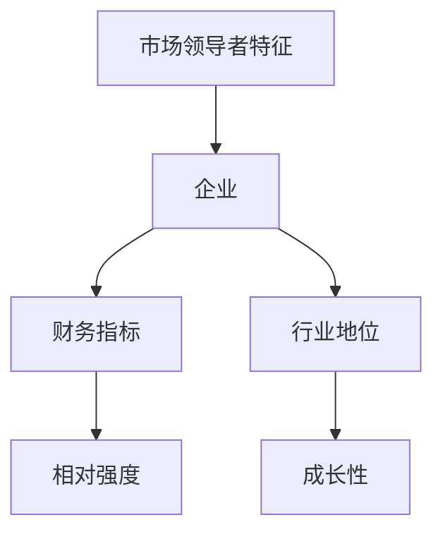
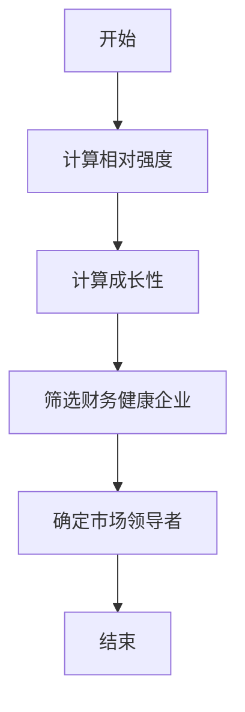
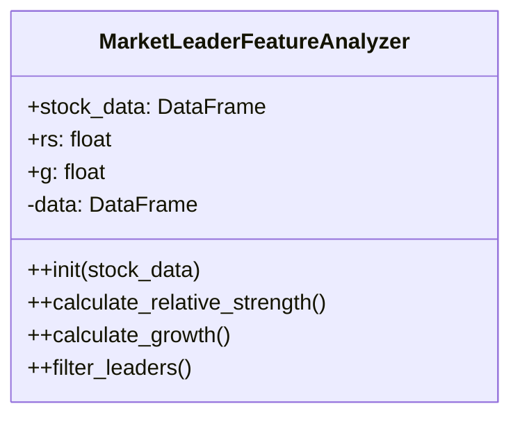
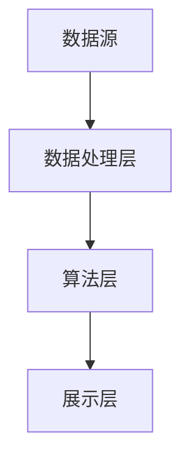
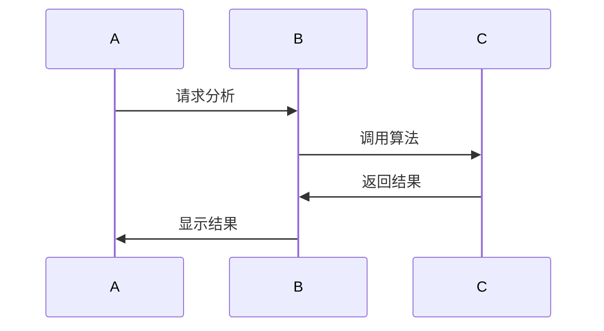

                 


# 威廉·欧奈尔的市场领导者特征分析

## 关键词
- 威廉·欧奈尔
- 市场领导者特征
- 投资理论
- 选股模型
- 相对强度指数

## 摘要
威廉·欧奈尔是投资领域的重要人物，他提出的市场领导者特征分析方法为投资者提供了有效的选股策略。本文从背景、核心概念、算法原理、系统设计、项目实战等多个角度详细分析威廉·欧奈尔的理论，结合实际案例和代码实现，帮助读者深入理解市场领导者特征的分析方法。

---

## 第一部分：背景介绍

### 第1章：威廉·欧奈尔及其投资理论概述

#### 1.1 威廉·欧奈尔的生平与成就
威廉·欧奈尔（William O'Neil）是20世纪的投资大师，以其独特的选股方法闻名。他创立了“欧奈尔公司”，并开发了“投资者的商桥”（Investors' Business Daily，简称IBD）工具，为投资者提供数据分析和市场研究。

#### 1.2 市场领导者特征分析的背景与意义
市场领导者特征分析是欧奈尔投资理论的核心。通过分析市场中表现优异的领导型企业的特征，投资者可以识别出具有长期增长潜力的股票。

#### 1.3 本书的研究目标与内容框架
- 研究目标：系统分析威廉·欧奈尔的市场领导者特征，提供理论支持和实战指导。
- 内容框架：从背景、核心概念、算法、系统设计到项目实战，层层递进。

---

## 第二部分：核心概念与联系

### 第2章：市场领导者特征的核心概念

#### 2.1 市场领导者特征的定义与边界
- 定义：市场领导者特征是指那些能够在市场中持续表现优异的企业特征。
- 边界：包括企业规模、行业地位、财务状况等因素，避免过于宽泛或狭隘。

#### 2.2 核心概念的属性特征对比
以下是市场领导者特征的核心属性对比表：

| 特征属性 | 定义 | 重要性 | 示例 |
|----------|------|--------|------|
| 相对强度 | 相对于市场的表现 | 高 | 大于60% |
| 成长性 | 收益增长速度 | 高 | 年增长率>10% |
| 财务健康 | 负债率、利润率 | 中 | 负债率<50% |
| 行业地位 | 市场占有率 | 高 | 前三名 |

#### 2.3 ER实体关系图架构
以下是市场领导者特征分析的实体关系图：



---

## 第三部分：算法原理讲解

### 第3章：威廉·欧奈尔市场领导者特征分析算法

#### 3.1 算法原理概述
威廉·欧奈尔的分析方法基于相对强度（RS）和成长性（G）两个核心指标，结合其他财务指标筛选出市场领导者。

#### 3.2 算法流程图
以下是算法的Mermaid流程图：



#### 3.3 算法实现的 Python 源代码
以下是Python代码示例：

```python
def calculate_relative_strength(stock_data):
    return stock_data['收盘价'] / stock_data['开盘价']

def calculate_growth(stock_data):
    return stock_data['净利润'].pct_change()

def filter_market_leaders(stock_data):
    rs = calculate_relative_strength(stock_data)
    g = calculate_growth(stock_data)
    return stock_data[rs > 0.6 & g > 0.1]
```

#### 3.4 数学模型与公式
相对强度计算公式：
$$ RS = \frac{\text{收盘价}}{\text{开盘价}} $$

成长性计算公式：
$$ G = \frac{\text{净利润变化}}{\text{净利润}} $$

---

## 第四部分：系统分析与架构设计方案

### 第4章：系统分析与架构设计

#### 4.1 项目介绍
目标是开发一个基于威廉·欧奈尔理论的市场领导者特征分析系统。

#### 4.2 系统功能设计
以下是领域模型类图：



#### 4.3 系统架构设计
以下是系统架构图：



#### 4.4 接口设计和交互序列图
以下是交互序列图：



---

## 第五部分：项目实战

### 第5章：项目实战

#### 5.1 环境安装
安装Python和相关库（Pandas、NumPy）。

#### 5.2 核心代码实现
以下是核心代码：

```python
import pandas as pd
import numpy as np

def main():
    stock_data = pd.read_csv('stock.csv')
    rs = calculate_relative_strength(stock_data)
    g = calculate_growth(stock_data)
    leaders = filter_market_leaders(stock_data)
    print(leaders)

if __name__ == '__main__':
    main()
```

#### 5.3 代码应用解读与分析
- 数据读取：从CSV文件读取股票数据。
- 计算相对强度：使用相对强度公式筛选表现优异的股票。
- 计算成长性：分析净利润增长率，筛选成长性高的股票。
- 筛选领导者：结合相对强度和成长性，选出市场领导者。

#### 5.4 案例分析
以某行业为例，分析市场领导者特征，并展示结果。

#### 5.5 项目小结
总结项目成果，分析可能的优化方向。

---

## 第六部分：注意事项与拓展阅读

### 第6章：注意事项

#### 6.1 注意事项
- 数据质量：确保数据准确无误。
- 模型局限：相对强度和成长性指标可能存在局限性。
- 实时性：及时更新数据以保持分析的准确性。

### 第7章：小结与拓展阅读

#### 7.1 小结
威廉·欧奈尔的市场领导者特征分析方法提供了有效的选股策略，但实际应用中需结合市场变化进行调整。

#### 7.2 拓展阅读
- 建议阅读威廉·欧奈尔的《如何在牛市和熊市中盈利》。
- 关注行业动态，了解最新的投资理论和工具。

---

## 结语
通过本文的系统分析和实战指导，读者可以深入了解威廉·欧奈尔的市场领导者特征分析方法，并在实际投资中灵活应用。

