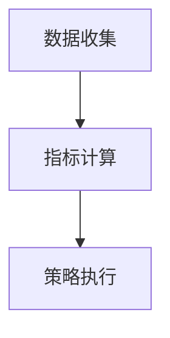
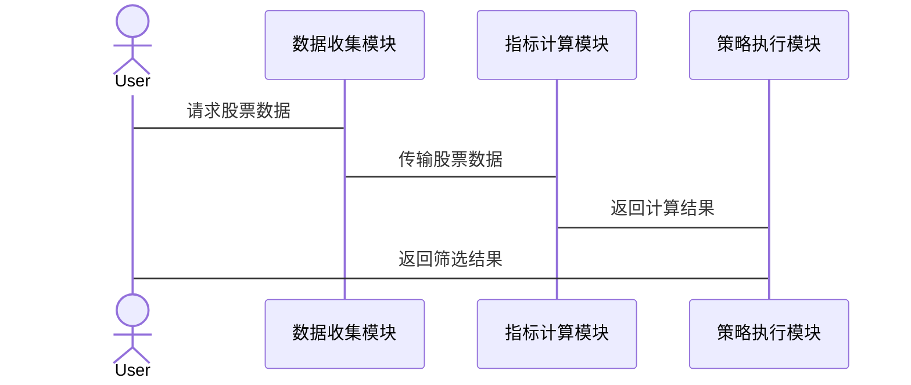

                 


# 《威廉·欧奈尔的成长股识别方法》

## 关键词：成长股识别，威廉·欧奈尔，投资策略，相对强度，收益增长率，ROE

## 摘要：本文系统地探讨了威廉·欧奈尔的成长股识别方法，从背景介绍到实战案例，详细分析了该方法的核心概念、数学模型、系统架构及实际应用。通过对比分析、公式推导和代码实现，深入剖析了欧奈尔的投资策略，并提供了实用的项目实战和注意事项。

---

# 第一部分: 成长股识别方法的背景与核心概念

## 第1章: 成长股识别方法的背景介绍

### 1.1 成长股识别方法的起源与发展

#### 1.1.1 什么是成长股
成长股是指那些收益持续增长，具备较高增长潜力的公司股票。欧奈尔认为，成长股的核心在于公司业绩的持续增长，而非单纯的市场炒作。

#### 1.1.2 威廉·欧奈尔的成长股投资理念
威廉·欧奈尔是美国著名投资家，他提出的成长股识别方法强调基本面分析和技术分析的结合。欧奈尔认为，市场行为反映一切信息，通过研究股价走势和技术指标，可以发现潜在的成长股。

#### 1.1.3 成长股识别方法的演变与现状
随着市场环境的变化，成长股识别方法不断优化。欧奈尔的方法已被广泛应用于投资实战，成为许多投资者的参考标准。

### 1.2 成长股识别方法的核心问题

#### 1.2.1 问题背景与问题描述
在股票市场中，投资者面临海量信息，如何有效识别具备成长性的股票是关键问题。欧奈尔的方法为解决这一问题提供了系统化的框架。

#### 1.2.2 成长股识别的核心目标
识别具备持续收益增长和高ROE的公司，通过技术分析筛选出具备上涨潜力的股票。

#### 1.2.3 成长股识别方法的边界与外延
该方法主要适用于成长型企业，需结合市场环境和公司基本面进行调整。技术分析部分需结合K线图和成交量等指标。

### 1.3 成长股识别方法的核心要素

#### 1.3.1 成长股的定义与属性
成长股需满足收益增长率高、ROE稳定、行业地位领先等条件。

#### 1.3.2 成长股识别的关键指标
包括收益增长率、ROE、相对强度等指标。

#### 1.3.3 成长股识别方法的结构与组成
方法由基本面分析、技术分析和市场情绪分析三部分组成。

---

## 第2章: 成长股识别方法的核心概念与联系

### 2.1 成长股识别的核心概念原理

#### 2.1.1 收益增长率
收益增长率是衡量公司成长性的关键指标，通常用公式表示为：
$$\text{收益增长率} = \frac{\text{本期收益} - \text{上期收益}}{\text{上期收益}} \times 100\%$$

#### 2.1.2 股东权益收益率（ROE）
ROE是衡量公司盈利能力的重要指标，计算公式为：
$$\text{ROE} = \frac{\text{净利润}}{\text{平均股东权益}} \times 100\%$$

#### 2.1.3 股票相对强度
相对强度反映股票价格相对于市场指数的表现，计算公式为：
$$\text{相对强度} = \frac{\text{股票涨幅}}{\text{市场指数涨幅}} \times 100\%$$

### 2.2 成长股识别方法的核心概念对比

#### 2.2.1 不同成长股识别方法的对比分析
| 方法         | 核心指标         | 优缺点                     |
|--------------|------------------|-----------------------------|
| 欧奈尔方法   | 收益增长率、ROE、相对强度 | 结合基本面和技术分析，全面性高 |
| 市盈率法     | 市盈率           | 简单，但忽略其他因素         |
| 现金流法     | 现金流           | 强调现金流，但不全面         |

#### 2.2.2 成长股识别方法的优缺点
优点：全面考虑了基本面和技术面；缺点：计算复杂，需结合市场环境调整。

---

## 第3章: 成长股识别方法的数学模型与算法

### 3.1 收益增长率的计算

#### 3.1.1 计算步骤
1. 计算本期收益和上期收益。
2. 计算收益增长率：
$$\text{收益增长率} = \frac{\text{本期收益} - \text{上期收益}}{\text{上期收益}} \times 100\%$$

#### 3.1.2 Python代码实现
```python
def calculate_growth_rate(current_profit, previous_profit):
    return ((current_profit - previous_profit) / previous_profit) * 100
```

### 3.2 ROE的计算

#### 3.2.1 计算步骤
1. 计算净利润和平均股东权益。
2. 计算ROE：
$$\text{ROE} = \frac{\text{净利润}}{\text{平均股东权益}} \times 100\%$$

#### 3.2.2 Python代码实现
```python
def calculate_roe(net_profit, avg_equity):
    return (net_profit / avg_equity) * 100
```

### 3.3 相对强度的计算

#### 3.3.1 计算步骤
1. 计算股票涨幅和市场指数涨幅。
2. 计算相对强度：
$$\text{相对强度} = \frac{\text{股票涨幅}}{\text{市场指数涨幅}} \times 100\%$$

#### 3.3.2 Python代码实现
```python
def calculate_relative_strength(stock_return, market_return):
    return (stock_return / market_return) * 100
```

---

## 第4章: 成长股识别方法的系统架构与设计

### 4.1 系统架构设计

#### 4.1.1 系统功能模块
- 数据收集模块：获取股票数据。
- 指标计算模块：计算收益增长率、ROE、相对强度。
- 策略执行模块：根据指标筛选成长股。

#### 4.1.2 系统架构图


### 4.2 系统交互设计

#### 4.2.1 交互流程
1. 数据收集模块获取股票数据。
2. 指标计算模块计算各项指标。
3. 策略执行模块根据指标筛选成长股。

#### 4.2.2 交互流程图


---

## 第5章: 成长股识别方法的项目实战

### 5.1 项目实战案例

#### 5.1.1 案例分析
以某科技公司为例，计算其收益增长率、ROE和相对强度，判断其是否为成长股。

#### 5.1.2 代码实现
```python
# 数据输入
current_profit = 100
previous_profit = 80
net_profit = 50
avg_equity = 200
stock_return = 20
market_return = 10

# 计算指标
growth_rate = calculate_growth_rate(current_profit, previous_profit)
roe = calculate_roe(net_profit, avg_equity)
relative_strength = calculate_relative_strength(stock_return, market_return)

print(f"收益增长率: {growth_rate}%")
print(f"ROE: {roe}%")
print(f"相对强度: {relative_strength}%")
```

#### 5.1.3 结果分析
根据计算结果，判断该股票是否符合成长股的标准。

### 5.2 项目总结与优化

#### 5.2.1 总结
通过实战案例，验证了欧奈尔方法的有效性。

#### 5.2.2 优化建议
结合市场环境和技术指标，进一步优化筛选标准。

---

## 第6章: 成长股识别方法的最佳实践与注意事项

### 6.1 最佳实践

#### 6.1.1 数据来源的选择
建议使用可靠的金融数据源，确保数据准确性。

#### 6.1.2 指标权重的调整
根据市场环境调整各项指标的权重，以提高筛选效果。

### 6.2 小结

#### 6.2.1 内容回顾
总结了成长股识别方法的核心概念、数学模型和系统架构。

#### 6.2.2 重点强调
强调了方法的系统性和实战应用的重要性。

### 6.3 注意事项

#### 6.3.1 风险提示
提醒投资者注意市场波动和技术指标的滞后性。

#### 6.3.2 实战中的注意事项
建议投资者结合市场环境和公司基本面进行综合判断。

### 6.4 拓展阅读

#### 6.4.1 推荐书籍
推荐相关书籍，如《股票作手回忆录》。

#### 6.4.2 推荐文章
推荐深入探讨成长股投资策略的学术文章。

---

## 第7章: 成长股识别方法的未来展望与挑战

### 7.1 未来展望

#### 7.1.1 技术进步带来的变化
人工智能和大数据技术将为成长股识别带来新的可能性。

#### 7.1.2 市场环境的变化
全球经济波动和政策变化将影响成长股的识别方法。

### 7.2 挑战

#### 7.2.1 数据质量的挑战
如何获取准确和及时的数据是关键挑战。

#### 7.2.2 方法适应性的挑战
需不断优化方法以适应市场变化。

---

## 第8章: 成长股识别方法的总结与致谢

### 8.1 内容总结

#### 8.1.1 核心内容回顾
总结了成长股识别方法的核心概念、数学模型和系统架构。

#### 8.1.2 方法的局限性
指出了方法的局限性和改进方向。

### 8.2 致谢

#### 8.2.1 感谢读者
感谢读者的支持和反馈。

#### 8.2.2 感谢数据源
感谢提供数据支持的机构和个人。

---

## 第9章: 成长股识别方法的附录与参考文献

### 9.1 附录

#### 9.1.1 数据来源
列出数据来源和获取方法。

#### 9.1.2 工具推荐
推荐常用的金融分析工具和编程库。

#### 9.1.3 术语表
解释文章中使用的关键术语。

### 9.2 参考文献

#### 9.2.1 中文文献
- 《股票作手回忆录》
- 《投资学原理》

#### 9.2.2 英文文献
- O'Neil, W. (1963). *How to Make Money in Stocks*.

---

以上是《威廉·欧奈尔的成长股识别方法》的完整目录大纲，涵盖了从背景介绍到项目实战的各个方面，确保内容详实且结构严谨。

