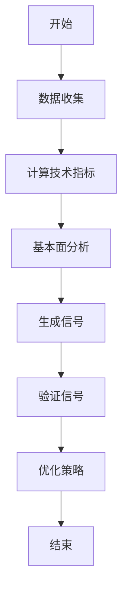
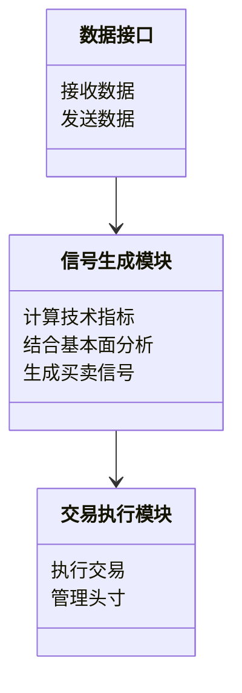
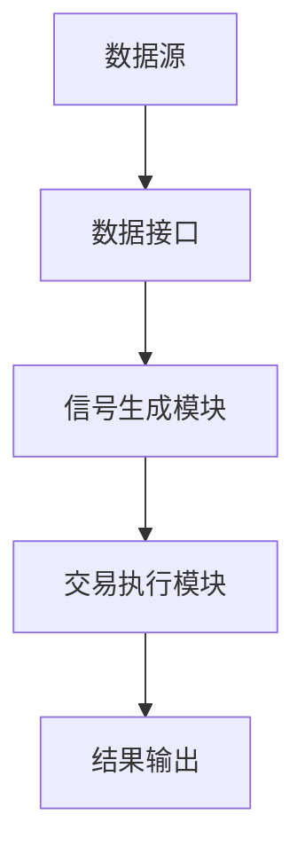

                 


# 威廉·欧奈尔的技术面与基本面结合策略

## 关键词：技术分析，基本面分析，威廉·欧奈尔，投资策略，Python实现，数学模型

## 摘要：威廉·欧奈尔的技术面与基本面结合策略是一种将技术分析和基本面分析相结合的投资方法。本文详细解析了该策略的核心概念、算法实现、数学模型、系统架构及项目实战，帮助读者全面理解并掌握这一投资策略。

---

## 第一部分：背景与基础

### 第1章：技术分析与基本面分析概述

#### 1.1 技术分析的基础概念
- **技术分析的定义与核心思想**：通过分析历史价格数据，预测未来价格走势。
- **技术分析的主要工具与指标**：K线图、均线、RSI、MACD等。
- **技术分析在投资中的应用**：帮助投资者识别趋势和潜在买卖信号。

#### 1.2 基本面分析的核心要素
- **基本面分析的定义与方法**：通过分析公司的财务状况、行业地位和宏观经济环境来评估其价值。
- **财务报表分析**：利润表、资产负债表、现金流量表的关键指标解读。
- **行业分析与宏观经济因素**：行业趋势、经济周期对投资决策的影响。

#### 1.3 技术面与基本面分析的优缺点对比
- **技术分析的优点与局限性**：快速决策，但可能忽视基本面因素。
- **基本面分析的优点与局限性**：考虑公司内在价值，但分析复杂且耗时。
- **结合两者的必要性**：利用技术信号优化买卖时机，通过基本面分析筛选优质标的。

---

## 第二部分：威廉·欧奈尔策略的核心原理

### 第2章：威廉·欧奈尔策略的基本框架

#### 2.1 技术面与基本面结合的策略概述
- **策略的定义与目标**：通过技术指标筛选交易信号，结合基本面分析选择优质标的。
- **策略的适用场景与限制**：适用于股票等金融资产，需结合具体市场环境调整。

#### 2.2 策略的关键指标与信号
- **相对强度（RSI）**：衡量资产价格的超买或超卖状态。
- **累积收益（Total Returns）**：评估资产的长期收益能力。
- **其他辅助指标**：如MACD、成交量等，用于增强信号的准确性。

#### 2.3 策略的执行步骤
- **数据收集与预处理**：获取历史价格数据和财务报表数据，处理缺失值和异常值。
- **指标计算与信号生成**：计算RSI、MACD等指标，结合基本面因素生成买卖信号。
- **信号验证与策略优化**：通过回测验证信号的有效性，调整参数优化策略表现。

---

## 第三部分：策略的算法实现与数学模型

### 第3章：威廉·欧奈尔策略的算法流程

#### 3.1 算法流程图


#### 3.2 算法实现的Python代码
```python
import pandas as pd
import numpy as np
import matplotlib.pyplot as plt

# 示例数据：假设data是包含收盘价的DataFrame
data = pd.read_csv('stock_data.csv')

# 计算RSI指标
def calculate_rsi(data, period=14):
    delta = data['Close'].diff(1)
    up = delta.where(delta > 0, 0)
    down = delta.where(delta < 0, 0)
    rs = up.rolling(period).mean() / down.rolling(period).mean()
    rsi = 100 - (100 - rs.rolling(period).mean())
    return rsi

data['RSI'] = calculate_rsi(data)

# 计算MACD指标
def calculate_macd(data, short_period=12, long_period=26, signal_period=9):
    ema_short = data['Close'].ewm(span=short_period, adjust=False).mean()
    ema_long = data['Close'].ewm(span=long_period, adjust=False).mean()
    macd = ema_short - ema_long
    macd_signal = macd.ewm(span=signal_period, adjust=False).mean()
    macd_diff = macd - macd_signal
    return macd_diff

data['MACD'] = calculate_macd(data)

# 生成信号
data['Signal'] = 0
data['Signal'] = data.apply(lambda row: 1 if row['RSI'] > 70 and row['MACD'] > 0 else 0, axis=1)
```

#### 3.3 算法的数学模型
- **RSI公式**：
  $$ RSI = 100 - \frac{100 - \frac{RS}{n}}{} $$
  其中，RS为相对强度，n为计算周期。
- **MACD公式**：
  $$ MACD = EMA_{short} - EMA_{long} $$
  $$ MACD\_signal = EMA_{signal}(MACD) $$
  $$ MACD\_diff = MACD - MACD\_signal $$

---

## 第四部分：系统架构设计

### 第4章：威廉·欧奈尔策略的系统架构

#### 4.1 系统功能设计


#### 4.2 系统架构设计


---

## 第五部分：项目实战

### 第5章：威廉·欧奈尔策略的实战应用

#### 5.1 项目环境安装
- 安装必要的Python库：`pandas`, `numpy`, `matplotlib`, `backtrader`

#### 5.2 核心代码实现
```python
import backtrader as bt

class WilliamOmanStrategy(bt.Strategy):
    def __init__(self):
        self.rsi = bt.indicators.RSI(self.data, period=14)
        self.macd = bt.indicators.MACD(self.data)

    def next(self):
        if self.rsi > 70 and self.macd.macd > 0:
            self.buy()
        elif self.rsi < 30 and self.macd.macd < 0:
            self.sell()

# 初始化 cerebro
cerebro = bt.Cerebro()
cerebro.addstrategy(WilliamOmanStrategy)
data = bt.feeds.YahooFinanceData(dataname='AAPL', fromdate='2020-01-01', todate='2023-12-31')
cerebro.adddata(data)
cerebro.run()
```

#### 5.3 项目分析与优化
- **回测结果分析**：通过回测检验策略的有效性。
- **参数优化**：调整RSI和MACD的周期参数，寻找最佳组合。

---

## 第六部分：最佳实践

### 第6章：策略应用的最佳实践

#### 6.1 小结与总结
- 威廉·欧奈尔策略的优势在于结合了技术面和基本面分析，能够帮助投资者更好地捕捉市场机会。
- 在实际应用中，需根据市场环境和资产特性调整策略参数。

#### 6.2 注意事项
- 风险管理：合理控制仓位，设置止损和止盈。
- 数据质量：确保数据来源可靠，避免因数据错误导致决策失误。
- 策略优化：定期评估策略表现，及时调整。

#### 6.3 拓展阅读
- 推荐书籍：《击败华尔街》、《投资心理学》。
- 在线资源：QuantInstinct blog, Quantitative Research.

---

## 结语
通过本文的详细讲解，读者可以全面了解威廉·欧奈尔的技术面与基本面结合策略，并能够在实际投资中应用这些知识。希望本文能为投资者提供有价值的参考，帮助他们在复杂多变的市场中做出更明智的投资决策。

