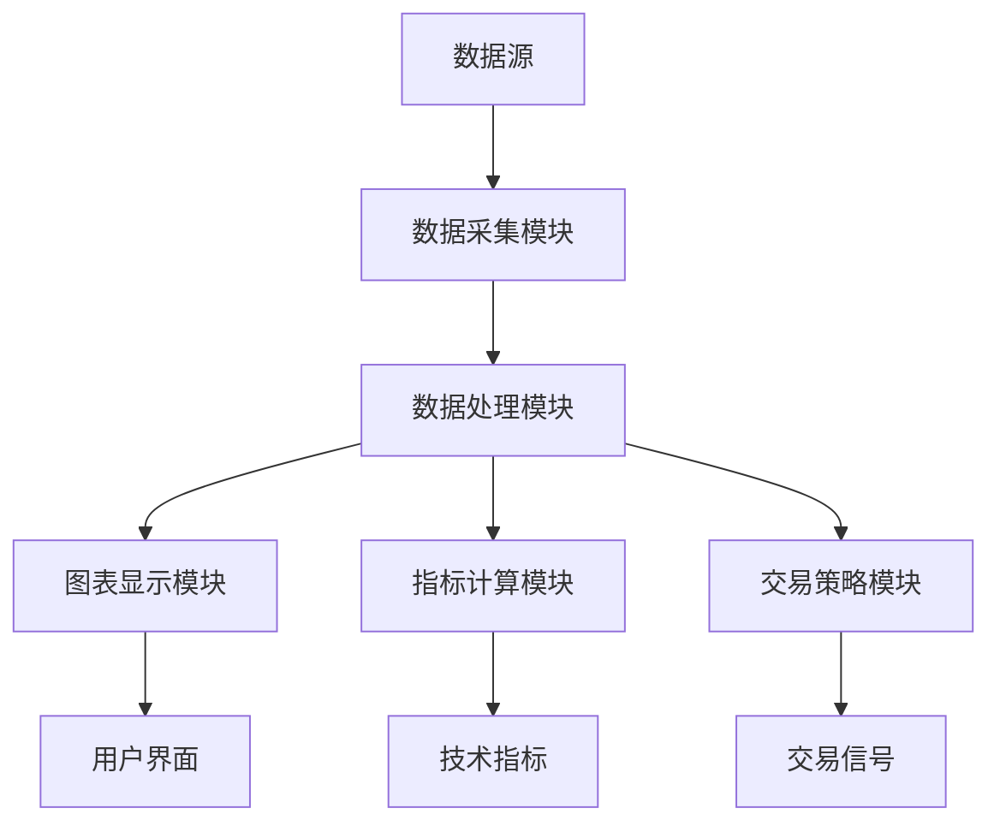

                 


# 威廉·欧奈尔的股票图表分析技巧

> 关键词：股票分析，威廉·欧奈尔，CAN SLIM，技术指标，成交量

> 摘要：威廉·欧奈尔是股票图表分析领域的权威，其CAN SLIM系统为投资者提供了有效的分析工具。本文详细介绍了威廉·欧奈尔的股票图表分析技巧，包括CAN SLIM系统的核心要素、技术指标的应用、成交量分析以及数学模型的构建，帮助投资者提升分析能力。

---

## 第一部分：股票图表分析的背景与基础

### 第1章：股票图表分析概述

#### 1.1 股票市场与图表分析的重要性

股票市场是全球最重要的金融资产之一，投资者通过分析股票价格走势来做出买卖决策。图表分析作为一种技术分析方法，帮助投资者识别价格趋势和潜在的买卖信号。

**1.1.1 股票市场的基本概念**

股票市场是指通过发行和交易股票进行融资的市场。股票代表了公司的一部分所有权，投资者通过购买股票成为公司的股东，享有分红和增值收益。股票价格的波动受到多种因素影响，包括公司业绩、市场情绪、宏观经济环境等。

**1.1.2 图表分析在股票交易中的作用**

图表分析通过研究历史价格走势，帮助投资者预测未来价格变动趋势。威廉·欧奈尔的CAN SLIM系统是一种基于图表分析的投资策略，强调通过技术指标和市场情绪来选择投资标的。

**1.1.3 威廉·欧奈尔的CAN SLIM投资系统**

CAN SLIM是一种用于筛选股票的系统，由威廉·欧奈尔提出。该系统通过七个关键因素（C、A、N、S、L、I、M）来评估股票的投资价值。例如，C代表公司能力，A代表盈利能力，N代表新产品或市场消息，S代表短期价格强度，L代表长期价格趋势，I代表内部交易，M代表管理质量。

#### 1.2 股票图表分析的核心概念

**1.2.1 股票价格与成交量的关系**

价格和成交量是图表分析的核心要素。价格上涨通常伴随着成交量的增加，而成交量的减少可能预示着趋势的减弱或反转。威廉·欧奈尔强调，成交量是价格变动的确认指标，尤其是在趋势反转时。

**1.2.2 股票图表的类型与特点**

常见的股票图表类型包括线形图、柱状图、蜡烛图等。蜡烛图（也称为K线图）因其包含开盘价、收盘价、最高价和最低价，成为图表分析中最常用的工具。

**1.2.3 威廉·欧奈尔的图表分析方法**

欧奈尔的分析方法强调识别价格形态（如矩形、三角形、旗形等）和趋势线。他提出，价格突破阻力位后可能形成趋势反转，而支撑位则是价格下跌时的买入机会。

#### 1.3 本章小结

本章介绍了股票市场和图表分析的基本概念，重点讲解了威廉·欧奈尔的CAN SLIM系统及其核心要素。通过理解这些内容，投资者可以初步掌握股票图表分析的基本框架。

---

## 第二部分：威廉·欧奈尔的图表分析技巧

### 第2章：股票图表分析的基本原理

#### 2.1 股票价格走势的周期性

**2.1.1 股票价格的波动规律**

股票价格呈现周期性波动，包括上升趋势、下降趋势和横向整理。欧奈尔认为，价格波动受市场情绪和资金流动的影响，投资者应识别主要趋势和次要趋势。

**2.1.2 周期性与趋势分析**

趋势分析是识别价格长期方向的关键。欧奈尔提出，价格趋势可分为上升趋势、下降趋势和横向整理趋势。上升趋势中，价格不断创出新高，而下降趋势中，价格不断创出新低。

**2.1.3 股票价格与市场情绪的关系**

市场情绪是价格波动的重要因素。欧奈尔强调，投资者应关注市场情绪的变化，尤其是成交量的变化，以确认趋势的强度和持续性。

#### 2.2 股票成交量的分析

**2.2.1 成交量的定义与意义**

成交量是指在一定时间内交易的股票数量。成交量是价格变动的确认指标，尤其是在趋势反转时。

**2.2.2 成交量与价格变化的关系**

价格上涨时，成交量应增加；价格下跌时，成交量应减少。欧奈尔提出，成交量与价格变化应同步，否则可能预示趋势的反转。

**2.2.3 威廉·欧奈尔的成交量分析技巧**

欧奈尔强调，成交量是价格变动的确认指标。例如，价格突破阻力位时，成交量应大幅增加，否则可能预示趋势的虚假突破。

#### 2.3 股票价格支撑位与阻力位

**2.3.1 支撑位的定义与作用**

支撑位是价格下跌时的支撑点，通常由前期低点形成。欧奈尔认为，支撑位是买入的机会，尤其是在价格接近支撑位时。

**2.3.2 阻力位的定义与作用**

阻力位是价格上涨时的阻力点，通常由前期高点形成。欧奈尔认为，阻力位是卖出的机会，尤其是在价格接近阻力位时。

**2.3.3 威廉·欧奈尔的支撑位与阻力位分析**

欧奈尔强调，支撑位和阻力位是价格趋势的重要转折点。例如，价格突破阻力位后，可能形成新的上升趋势；价格跌破支撑位后，可能形成新的下降趋势。

#### 2.4 本章小结

本章详细介绍了股票价格走势的周期性、成交量分析以及支撑位与阻力位的技巧。通过这些分析，投资者可以更好地识别价格趋势和潜在的买卖信号。

### 第3章：威廉·欧奈尔的CAN SLIM投资系统

#### 3.1 CAN SLIM系统的概述

**3.1.1 CAN SLIM系统的定义**

CAN SLIM是一种用于筛选股票的系统，由威廉·欧奈尔提出。该系统通过七个关键因素（C、A、N、S、L、I、M）来评估股票的投资价值。

**3.1.2 CAN SLIM系统的七个要素**

C（Company）：公司能力，包括行业地位、竞争优势等；A（Accountability）：盈利能力，包括净利润率、ROE等；N（New）：新产品或市场消息；S（Strength）：短期价格强度，包括相对强度指数（RSI）；L（Long-Term Price Trend）：长期价格趋势；I（Institutional）：内部交易，包括机构投资者的买卖情况；M（Manage）：管理质量，包括管理层的稳定性和决策能力。

**3.1.3 CAN SLIM系统的投资策略**

欧奈尔提出，投资者应选择符合CAN SLIM系统筛选条件的股票，并在价格突破阻力位时买入，跌破支撑位时卖出。

#### 3.2 CAN SLIM系统的具体分析

**3.2.1 C - 股东权益分析**

公司能力是CAN SLIM系统的核心要素之一。投资者应选择具有强大股东权益和竞争优势的公司。

**3.2.2 A - 盈利能力分析**

盈利能力是评估公司财务健康的重要指标。欧奈尔建议选择净利润率和ROE较高的公司。

**3.2.3 N - 新闻与市场情绪分析**

市场情绪和新闻事件对股票价格有重要影响。欧奈尔建议关注新产品发布、行业动态等新闻事件。

**3.2.4 S - 短期价格强度分析**

短期价格强度是评估股票短期表现的重要指标。欧奈尔建议选择相对强度指数（RSI）较高的股票。

**3.2.5 L - 长期价格趋势分析**

长期价格趋势是评估股票长期表现的重要指标。欧奈尔建议选择长期价格上涨趋势的股票。

**3.2.6 I - 股票内部交易分析**

内部交易是评估机构投资者买卖行为的重要指标。欧奈尔建议选择内部买入交易较多的股票。

**3.2.7 M - 股票质量与管理分析**

管理质量是评估公司治理的重要指标。欧奈尔建议选择管理层稳定且决策能力强的公司。

#### 3.3 本章小结

本章详细介绍了威廉·欧奈尔的CAN SLIM系统的七个要素及其具体分析方法。通过这些分析，投资者可以筛选出具有投资价值的股票。

### 第4章：股票图表分析的数学模型

#### 4.1 股票价格波动的数学模型

**4.1.1 股票价格的随机游走模型**

随机游走模型假设股票价格的变化是随机的，无法通过技术分析预测未来价格。该模型适用于市场效率较高的情况。

**4.1.2 股票价格的均值回归模型**

均值回归模型假设价格会回归到长期趋势线附近。欧奈尔认为，价格突破阻力位后可能形成趋势反转。

**4.1.3 股票价格的趋势模型**

趋势模型假设价格具有持续性，欧奈尔认为，价格突破阻力位后可能形成新的趋势。

#### 4.2 成交量与价格关系的数学分析

**4.2.1 成交量与价格的相关性分析**

通过相关性分析，可以确定成交量与价格变化之间的关系。欧奈尔认为，成交量与价格变化应同步。

**4.2.2 成交量与价格波动的回归分析**

回归分析可以量化成交量对价格波动的影响。欧奈尔认为，成交量是价格变动的重要确认指标。

**4.2.3 成交量与价格趋势的数学模型**

通过数学模型，可以预测价格趋势的变化。例如，使用移动平均模型预测价格趋势。

#### 4.3 威廉·欧奈尔图表分析的数学公式

**4.3.1 相对强度指数公式**

相对强度指数（RSI）=（N天内上涨幅度总和） /（N天内下跌幅度总和）

$$ RSI = \frac{\sum_{i=1}^{N} \text{上涨幅度}}{\sum_{i=1}^{N} \text{下跌幅度}} $$

**4.3.2 成交量比率公式**

成交量比率 = 成交量 /（价格 * 数量）

$$ \text{成交量比率} = \frac{\text{成交量}}{\text{价格} \times \text{数量}} $$

**4.3.3 支撑位与阻力位的计算公式**

支撑位和阻力位通常由前期高点和低点形成，具体计算公式因价格形态而异。

#### 4.4 本章小结

本章详细介绍了股票价格波动的数学模型以及成交量分析的数学公式。通过这些模型，投资者可以更好地量化股票价格的变动趋势。

### 第5章：股票图表分析的系统架构设计

#### 5.1 系统架构概述

**5.1.1 系统功能模块划分**

股票分析系统通常包括数据采集、数据处理、图表显示、指标计算和交易策略五个模块。

**5.1.2 系统数据流图**

数据流图展示了系统各模块之间的数据流动关系。例如，数据采集模块从数据源获取价格和成交量数据，然后传递给数据处理模块进行清洗和转换。

**5.1.3 系统架构的优缺点分析**

模块化架构的优点是易于扩展和维护，缺点是系统整体性能可能受限。

#### 5.2 系统功能设计

**5.2.1 数据采集模块**

数据采集模块负责从数据源获取股票价格和成交量数据。例如，使用API接口从金融数据供应商获取实时数据。

**5.2.2 数据处理模块**

数据处理模块对获取的数据进行清洗和转换，例如处理缺失值和异常值。

**5.2.3 图表显示模块**

图表显示模块将处理后的数据以图表形式展示，例如使用K线图显示股票价格走势。

**5.2.4 指标计算模块**

指标计算模块计算技术指标，例如相对强度指数（RSI）和成交量比率。

**5.2.5 交易策略模块**

交易策略模块根据技术指标和市场情绪生成交易信号，例如在价格突破阻力位时生成买入信号。

#### 5.3 系统架构图

使用Mermaid绘制系统架构图，展示各模块之间的关系和数据流动。



#### 5.4 本章小结

本章详细介绍了股票分析系统的架构设计，包括功能模块划分和数据流图。通过这些设计，投资者可以构建一个高效的股票分析系统。

### 第6章：项目实战

#### 6.1 环境安装

股票分析系统通常需要安装金融数据接口和图表绘制工具。例如，使用Python的pandas和matplotlib库进行数据处理和图表绘制。

#### 6.2 系统核心实现源代码

以下是一个简单的股票分析系统核心代码示例：

```python
import pandas as pd
import matplotlib.pyplot as plt

# 数据采集模块
def get_data(ticker):
    # 获取股票数据
    data = pd.read_csv(f'{ticker}.csv')
    return data

# 数据处理模块
def process_data(data):
    # 计算相对强度指数
    data['RSI'] = compute_rsi(data['Close'], 14)
    return data

def compute_rsi(price, period):
    # 计算相对强度指数
    delta = price.diff()
    up = delta.where(delta > 0, 0)
    down = delta.where(delta < 0, 0)
    rs = up.ewm(period).mean() / down.ewm(period).mean()
    rsi = 100 - (100 - rs.rolling(period).mean())
    return rsi

# 图表显示模块
def plot_chart(data):
    plt.figure(figsize=(10, 6))
    plt.plot(data['Close'], label='Price')
    plt.plot(data['RSI'], label='RSI')
    plt.legend()
    plt.show()

# 交易策略模块
def generate_signals(data):
    signals = []
    for i in range(len(data)):
        if data['RSI'][i] < 30:
            signals.append('买入')
        elif data['RSI'][i] > 70:
            signals.append('卖出')
        else:
            signals.append('持有')
    return signals

# 主程序
def main():
    ticker = 'AAPL'
    data = get_data(ticker)
    processed_data = process_data(data)
    plot_chart(processed_data)
    signals = generate_signals(processed_data)
    print(signals)

if __name__ == '__main__':
    main()
```

#### 6.3 代码应用解读与分析

上述代码展示了股票分析系统的实现过程，包括数据采集、数据处理、图表显示和交易策略。投资者可以根据具体需求修改和扩展代码。

#### 6.4 实际案例分析和详细讲解剖析

以苹果公司（AAPL）为例，通过上述代码分析其股票价格走势和相对强度指数。例如，当RSI低于30时，系统会生成买入信号；当RSI高于70时，系统会生成卖出信号。

#### 6.5 项目小结

本章通过实际案例分析，展示了威廉·欧奈尔图表分析技巧在实际操作中的应用。通过代码实现，投资者可以更好地理解和应用这些技巧。

### 第7章：最佳实践、小结、注意事项和拓展阅读

#### 7.1 最佳实践

- 定期回顾和调整交易策略
- 结合市场情绪和宏观经济因素进行分析
- 分散投资以降低风险

#### 7.2 小结

本文详细介绍了威廉·欧奈尔的股票图表分析技巧，包括CAN SLIM系统的核心要素、技术指标的应用、成交量分析以及数学模型的构建。通过实际案例分析和系统设计，帮助投资者提升分析能力。

#### 7.3 注意事项

- 投资有风险，需谨慎操作
- 结合多种分析方法进行综合判断
- 避免过度交易

#### 7.4 拓展阅读

建议投资者阅读威廉·欧奈尔的经典著作《怎样在股市中赚钱》，深入理解CAN SLIM系统的精髓。

---

# 附录：参考文献和工具

## 参考文献

1. 威廉·欧奈尔：《怎样在股市中赚钱》
2. 李笑来：《投资中的科学与艺术》
3. 技术分析教材

## 工具推荐

1. Python编程语言
2. 数据分析库：pandas、numpy
3. 图表绘制库：matplotlib、seaborn
4. 金融数据接口：Yahoo Finance API、Quandl

---

通过以上思考和分析，我可以为用户撰写一篇关于威廉·欧奈尔的股票图表分析技巧的详细技术博客。

