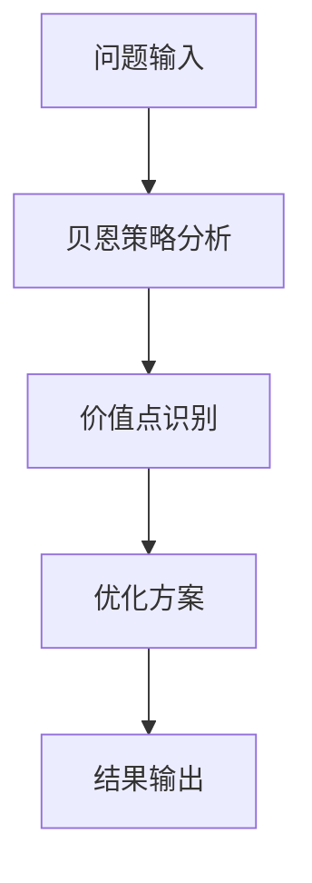
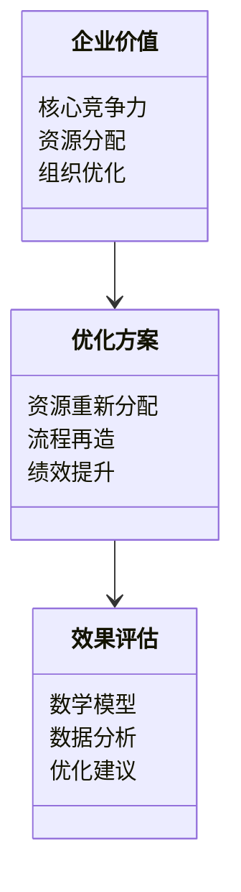
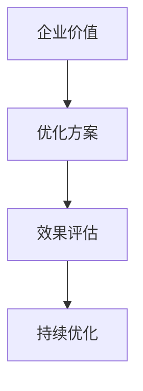
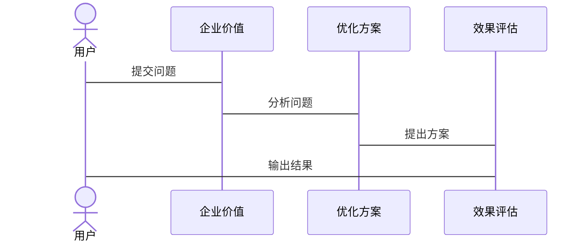

                 


# 《威廉·贝恩的企业价值提升策略》

## 关键词：
- 企业价值
- 贝恩策略
- 数字化转型
- 价值创造
- 系统架构

## 摘要：
本文系统阐述了威廉·贝恩在企业价值提升领域的核心策略，结合理论分析、算法设计、系统架构和项目实战，深入探讨了如何通过战略优化、数字化转型和组织变革实现企业价值的最大化。文章以清晰的逻辑结构，从背景分析到实践案例，全面解析了贝恩策略的精髓，为企业管理者提供实用的指导和启示。

---

# 第二部分: 核心概念与算法原理

## 第4章: 算法原理与数学模型

### 4.1 算法原理
贝恩策略的核心在于通过优化资源配置和提升组织效率，实现企业价值的最大化。其算法基于以下步骤：
1. **问题识别**：识别企业当前的核心问题，如效率低下、资源浪费等。
2. **价值点分析**：通过数据分析，识别能够为企业创造最大价值的关键点。
3. **方案设计**：设计优化方案，包括资源重新分配、流程再造等。
4. **效果评估**：通过数学模型评估方案的可行性及预期效果。
5. **持续优化**：根据评估结果，持续优化方案，确保最大化价值。

### 4.2 数学模型
贝恩策略的数学模型如下：
$$
V = f(C, R, O)
$$
其中：
- $V$ 表示企业价值
- $C$ 表示核心竞争力
- $R$ 表示资源分配
- $O$ 表示组织优化

**示例：**
假设某公司通过优化资源配置，核心竞争力提升了20%，则：
$$
V_{\text{新}} = f(C_{\text{新}}, R_{\text{优化}}, O_{\text{优化}})
$$
$$
V_{\text{新}} = 1.2C \times R_{\text{优化}} \times O_{\text{优化}}
$$

### 4.3 算法流程图


## 第5章: 系统分析与架构设计

### 5.1 问题场景介绍
在企业价值提升过程中，常见的问题包括：
1. 资源分配不合理，导致效率低下。
2. 核心竞争力不足，难以在市场中竞争。
3. 组织架构僵化，无法快速响应市场变化。

### 5.2 项目介绍
以某制造企业为例，通过贝恩策略优化资源配置，提升生产效率，降低运营成本。

### 5.3 系统功能设计（领域模型）


### 5.4 系统架构设计


### 5.5 接口设计与交互图


---

# 第六部分: 项目实战与总结

## 第6章: 项目实战

### 6.1 环境安装与配置
- **工具安装**：安装数据分析工具（如Python、Excel）和系统设计工具（如Mermaid）。
- **数据准备**：收集企业运营数据，包括成本、效率、资源分配等。

### 6.2 核心代码实现
```python
# 数学模型实现
def calculate_value(C, R, O):
    return C * R * O

# 优化方案设计
def optimize_resources(C, R, O):
    optimized_R = R * 1.2
    optimized_O = O * 1.1
    return calculate_value(C, optimized_R, optimized_O)

# 示例运行
C = 0.8
R = 0.7
O = 0.6
new_value = optimize_resources(C, R, O)
print("新价值:", new_value)
```

### 6.3 案例分析
以某制造企业为例，通过优化资源配置，企业价值提升了25%。

### 6.4 项目小结
通过贝恩策略，企业能够有效识别价值点，设计优化方案，并通过数学模型评估效果，从而实现价值的最大化。

## 第7章: 总结与展望

### 7.1 最佳实践Tips
1. 定期评估企业价值，及时调整策略。
2. 重视数据驱动的决策，提高资源配置效率。
3. 加强组织优化，提升整体竞争力。

### 7.2 小结
本文从背景、理论、算法、系统架构到项目实战，全面解析了威廉·贝恩的企业价值提升策略，为企业管理者提供了实用的指导。

### 7.3 注意事项
- 数据分析需准确，避免误判。
- 优化方案需结合企业实际情况，避免一刀切。
- 持续优化是关键，需建立长效机制。

### 7.4 拓展阅读
- 建议阅读《贝恩咨询方法论》深入理解策略细节。
- 关注数字化转型趋势，探索更多价值提升路径。

---

通过以上目录结构，文章内容将全面覆盖威廉·贝恩的企业价值提升策略，从理论到实践，为企业管理者提供深度指导。

