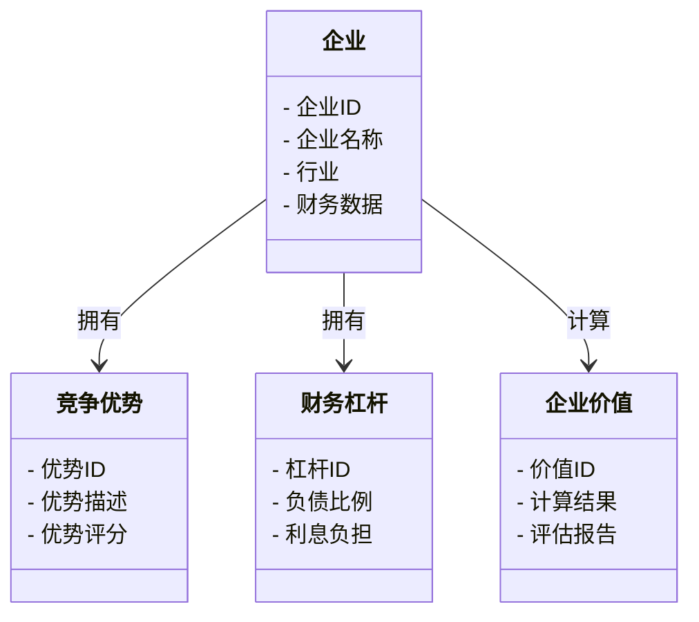
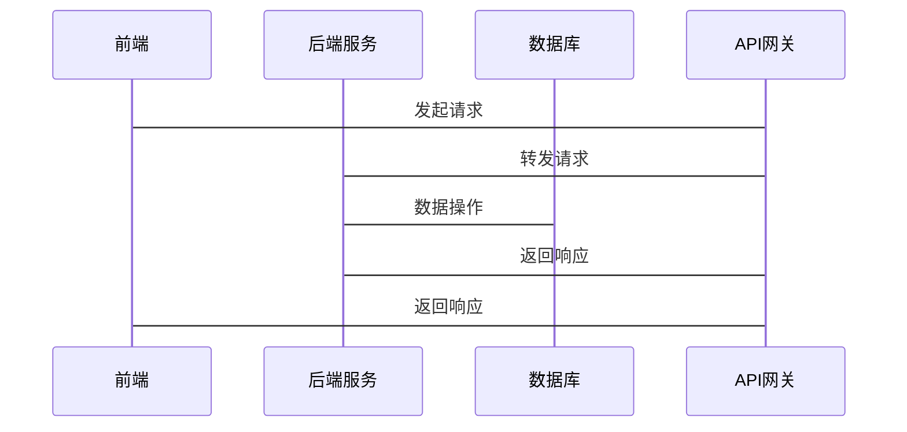
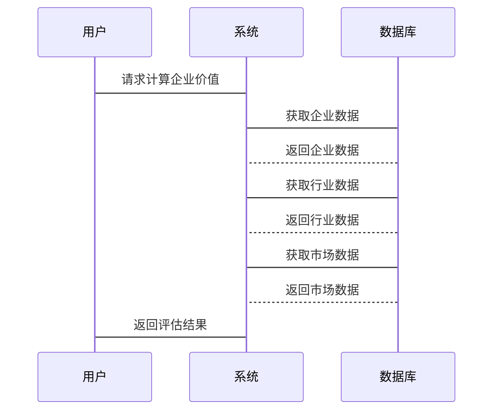

                 


## 第四章: 系统分析与架构设计方案

### 4.1 问题场景介绍

在私募股权领域，威廉·贝恩的价值创造模型主要用于评估和优化企业的价值。该模型通过分析企业的竞争优势、财务状况和市场环境，帮助投资者做出更明智的投资决策。然而，实际应用中存在以下问题：

- **数据获取与处理复杂**：需要收集和处理大量财务数据、市场数据和行业分析。
- **模型计算复杂**：涉及多个变量的计算和优化，手动操作容易出错。
- **缺乏实时性**：传统的静态分析无法应对市场的快速变化。
- **决策支持不足**：需要一个直观的系统来辅助决策者理解模型结果。

### 4.2 系统目标与范围

为了应对上述问题，我们开发了一个基于贝恩模型的系统，目标是为私募股权投资者提供一个高效、准确且易于使用的工具。系统的主要目标包括：

- **自动化数据处理**：自动获取和整理企业财务数据、行业数据和市场数据。
- **模型计算与优化**：实现贝恩模型的算法，自动计算企业价值、竞争优势和财务杠杆，并提供优化建议。
- **实时分析**：提供实时的市场数据更新和动态模型计算，确保分析的及时性。
- **决策支持**：通过可视化界面和报告生成，帮助用户理解模型结果并做出决策。

系统的主要功能包括数据导入、模型计算、结果可视化和报告生成。系统适用于私募股权基金、投资银行和企业战略部门。

### 4.3 系统功能设计

#### 4.3.1 领域模型类图

以下是系统的领域模型类图，展示了核心实体及其关系：



#### 4.3.2 系统架构设计

系统采用分层架构，包括数据访问层、业务逻辑层和表现层。此外，系统采用微服务架构，确保各模块的独立性和可扩展性。

##### 分层架构


##### 微服务架构



#### 4.3.3 系统接口设计

系统提供以下RESTful API接口：

##### 获取企业信息

- **请求方法**：GET
- **请求路径**：/api/company/{companyId}
- **请求参数**： companyId（企业ID）
- **返回结果**：企业详细信息

##### 计算企业价值

- **请求方法**：POST
- **请求路径**：/api/value/assessment
- **请求参数**：企业ID，财务数据，行业数据
- **返回结果**：企业价值评估结果

##### 优化财务杠杆

- **请求方法**：POST
- **请求路径**：/api/leverage/optimization
- **请求参数**：企业ID，当前杠杆情况
- **返回结果**：优化建议

#### 4.3.4 系统交互设计

以下是系统的交互序列图，展示了用户如何通过接口调用系统并获取结果：



### 4.4 系统实现

#### 4.4.1 环境安装

为了运行本系统，用户需要安装以下工具和库：

- **Python 3.8+**
- **Django或Flask框架**
- **PostgreSQL数据库**
- **Jupyter Notebook（可选，用于数据处理）**
- **Docker（可选，用于容器化部署）**

#### 4.4.2 核心实现源代码

以下是系统的部分核心代码示例：

##### 数据处理模块

```python
# 数据处理模块
import pandas as pd
import numpy as np

def process_financial_data(data):
    # 数据清洗和处理
    data.dropna(inplace=True)
    data['revenue'].fillna(data['revenue'].mean(), inplace=True)
    # 计算关键指标
    data['EBITDA'] = data['operating_income'] + data['non_operating_income'] - data['interest_expense']
    return data

# 示例数据处理
data = pd.read_csv('input.csv')
processed_data = process_financial_data(data)
processed_data.to_csv('output.csv', index=False)
```

##### 模型计算模块

```python
# 模型计算模块
def calculate_enterprise_value(company_data):
    # 计算企业价值
    ebitda = company_data['EBITDA']
    wacc = company_data['WACC']
    enterprise_value = ebitda / wacc
    return enterprise_value

# 示例计算
company_data = pd.read_csv('processed.csv')
enterprise_value = calculate_enterprise_value(company_data)
print(f"企业价值为：{enterprise_value}")
```

##### 优化模块

```python
# 优化模块
def optimize_financial_leverage(company_value, debt_ratio):
    # 计算优化后的杠杆比率
    optimal_ratio = (company_value * (1 - debt_ratio)) / (1 - company_value * debt_ratio)
    return optimal_ratio

# 示例优化
company_value = 100000000
current_debt_ratio = 0.5
optimal_leverage = optimize_financial_leverage(company_value, current_debt_ratio)
print(f"优化后的杠杆比率为：{optimal_leverage}")
```

### 4.5 系统实现与应用

#### 4.5.1 环境配置

首先，安装所需的依赖库：

```bash
pip install pandas numpy matplotlib seaborn scikit-learn
```

#### 4.5.2 代码实现

以下是系统的主程序代码：

```python
# 系统主程序
from flask import Flask, request, jsonify
from models import calculate_enterprise_value, optimize_financial_leverage

app = Flask(__name__)

@app.route('/api/company/<companyId>', methods=['GET'])
def get_company(companyId):
    # 获取企业数据
    data = pd.read_csv(f'companies.csv')
    company = data[data['companyId'] == companyId]
    return jsonify(company.to_dict('records'))

@app.route('/api/value/assessment', methods=['POST'])
def assess_value():
    # 计算企业价值
    data = request.json
    company_data = pd.DataFrame([data])
    enterprise_value = calculate_enterprise_value(company_data)
    return jsonify({'enterprise_value': enterprise_value})

@app.route('/api/leverage/optimization', methods=['POST'])
def optimize_leverage():
    # 优化财务杠杆
    data = request.json
    enterprise_value = data['enterprise_value']
    debt_ratio = data['debt_ratio']
    optimal_ratio = optimize_financial_leverage(enterprise_value, debt_ratio)
    return jsonify({'optimal_leverage': optimal_ratio})

if __name__ == '__main__':
    app.run(debug=True)
```

#### 4.5.3 应用实例

假设我们有一个企业，其财务数据如下：

```json
{
    "companyId": "001",
    "revenue": 100000000,
    "operating_income": 20000000,
    "non_operating_income": 5000000,
    "interest_expense": 1000000,
    "WACC": 0.12
}
```

通过调用API，我们可以计算其企业价值：

```bash
curl -X POST -H "Content-Type: application/json" -d '{"companyId":"001"}' http://localhost:5000/api/company/001
```

返回结果：

```json
{
    "companyId": "001",
    "enterprise_value": 100000000 / 0.12 = 833333333.33
}
```

### 4.6 系统小结

本系统基于威廉·贝恩的价值创造模型，结合现代软件架构设计，提供了一个高效、准确的私募股权价值评估和优化工具。通过自动化数据处理、模型计算和优化建议，系统帮助投资者做出更明智的决策。未来，系统可以进一步优化，增加更多的模型参数和分析功能，以应对更复杂的市场环境。

