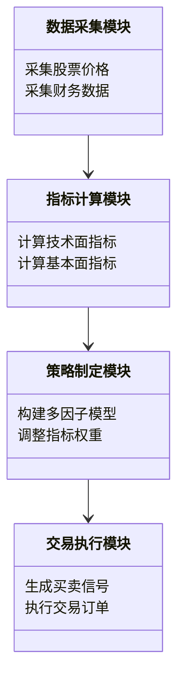
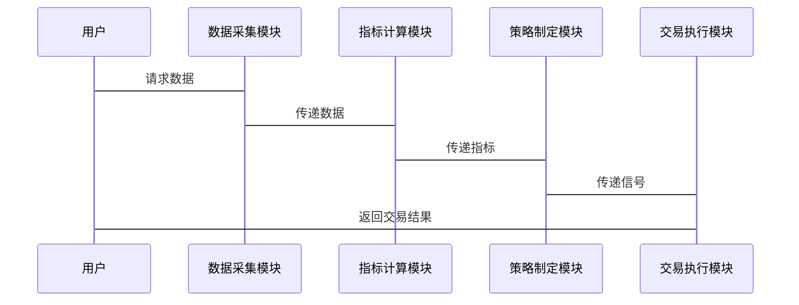

                 


# 威廉欧奈尔的技术面与基本面结合

> 关键词：技术面分析、基本面分析、投资决策、量化分析、算法结合

> 摘要：本文深入探讨了威廉·欧奈尔的技术面与基本面结合的策略，从背景介绍、核心概念、算法原理、系统架构到项目实战，全面解析了如何将技术分析和基本面分析有机结合，以提高投资决策的准确性和稳健性。

---

# 第一部分: 背景介绍

## 第1章: 技术面与基本面分析的基础

### 1.1 技术分析的核心概念

#### 1.1.1 技术分析的定义与历史发展

技术分析是一种通过研究历史市场数据（如价格和成交量）来预测未来市场走势的方法。其核心假设是市场价格反映所有信息（有效市场假说）、价格走势具有趋势性，以及历史形态会重复出现。技术分析起源于19世纪的股票交易，经过百年发展，形成了多种理论和工具，如道氏理论、波浪理论、均线系统等。

#### 1.1.2 技术分析的主要工具与方法

- **价格图表**：包括线形图、柱状图、蜡烛图等，用于观察价格波动。
- **均线系统**：通过计算一定时期内的平均价格，形成支撑和阻力线。
- **技术指标**：如相对强度指数（RSI）、MACD、布林带等，用于判断超买超卖、趋势强度和波动范围。
- **形态分析**：如头肩形、双底、三角形等，用于预测价格突破或反转点。

#### 1.1.3 技术分析的局限性与应用场景

- **局限性**：技术分析依赖于历史数据，假设未来会重复过去，但市场参与者的行为复杂多变，可能导致形态失效。
- **应用场景**：适用于短期交易、趋势跟踪和市场情绪分析。

---

### 1.2 基本面分析的核心概念

#### 1.2.1 基本面分析的定义与框架

基本面分析是通过研究公司的财务状况、行业地位、盈利能力、管理团队等内在因素，以及宏观经济环境、政策法规等外部因素，来评估其股票的内在价值。基本面分析的框架通常包括以下几个方面：

1. **财务报表分析**：包括利润表、资产负债表、现金流量表。
2. **估值指标**：如市盈率（P/E）、市净率（P/B）、股息率等。
3. **行业分析**：包括行业周期、竞争格局、政策影响等。
4. **宏观经济分析**：包括GDP增速、利率水平、通货膨胀等。

#### 1.2.2 基本面分析的关键指标

- **市盈率（P/E）**：衡量股价相对于每股收益的高低，用于判断股票是否被高估或低估。
- **市净率（P/B）**：衡量股价相对于每股净资产的高低，适用于评估银行、制造业等重资产行业的股票。
- **股息率**：衡量股票的分红收益，常用于价值投资策略。
- **ROE（净资产收益率）**：衡量公司的盈利能力，ROE越高，公司利用股东资产创造利润的能力越强。

#### 1.2.3 基本面分析的局限性与应用场景

- **局限性**：基本面分析依赖于对未来收益的预测，而实际经营中存在许多不确定性因素，如政策变化、行业竞争、管理问题等。
- **应用场景**：适用于长期投资、价值发现和风险控制。

---

### 1.3 技术面与基本面结合的意义

#### 1.3.1 技术面与基本面结合的必要性

- **技术面分析的不足**：仅依赖价格和成交量数据，无法反映公司的内在价值和行业风险。
- **基本面分析的不足**：依赖财务数据和假设，无法捕捉市场情绪和短期趋势。
- **结合的必要性**：通过技术面判断市场趋势和交易机会，通过基本面评估投资标的的内在价值和风险，从而实现投资决策的科学化和稳健化。

#### 1.3.2 技术面与基本面结合的优势

- **提高决策的准确性**：技术面提供短期市场信号，基本面提供长期价值判断，两者结合可以避免单一方法的偏差。
- **降低投资风险**：通过技术面识别市场趋势和资金流动，通过基本面评估标的资产的内在风险和收益潜力。
- **捕捉市场拐点**：技术面的形态变化和基本面的财务改善可以共同指向市场的拐点，为投资者提供精准的买卖信号。

#### 1.3.3 技术面与基本面结合的实现路径

- **数据整合**：将技术面数据（价格、成交量）与基本面数据（财务指标、行业数据）整合到统一的数据源中。
- **模型构建**：基于技术面和基本面数据，构建多因子量化模型，量化两者的结合方式。
- **策略优化**：通过回测和实盘交易，不断优化策略，提高投资收益和风险控制能力。

---

## 1.4 本章小结

本章从技术面分析和基本面分析的基本概念、工具、方法和局限性入手，阐述了两者结合的必要性、优势和实现路径。技术面分析提供了短期市场信号和交易机会，基本面分析提供了长期价值判断和风险评估，两者的结合可以显著提高投资决策的准确性和稳健性。

---

# 第二部分: 核心概念与联系

## 第2章: 技术面与基本面的核心概念与联系

### 2.1 技术面分析的核心原理

#### 2.1.1 技术面分析的假设基础

- **价格反映一切**：市场价格已经反映了所有公开信息，因此技术面分析依赖于价格和成交量数据。
- **趋势的存在**：市场价格具有趋势性，技术面分析通过识别趋势来预测未来走势。
- **历史重复**：技术分析认为价格形态和市场行为会重复出现，因此可以通过历史数据预测未来走势。

#### 2.1.2 技术面分析的主要理论

- **道氏理论**：市场有三种趋势，主要趋势、次要趋势和短期趋势。主要趋势是价格的主要变动方向，次要趋势是对主要趋势的调整，短期趋势是次要趋势的短期波动。
- **波浪理论**：价格走势由主浪和调整浪交替组成，主浪是价格的主要上涨或下跌趋势，调整浪是对主浪的修正。
- **均线系统**：通过计算一定时间内的平均价格，形成支撑和阻力线，帮助投资者判断价格的买卖点。

#### 2.1.3 技术面分析的数学模型

技术面分析中常用的数学模型包括：

- **移动平均线（MA）**：$$ MA_n = \frac{1}{n} \sum_{i=1}^{n} p_i $$
  其中，\( p_i \) 是第 \( i \) 天的价格，\( n \) 是计算天数。
  
- **相对强度指数（RSI）**：$$ RSI = \frac{\text{平均上涨幅度}}{\text{平均下跌幅度}} \times 100 $$

---

### 2.2 基本面分析的核心原理

#### 2.2.1 基本面分析的假设基础

- **价值驱动**：股票的内在价值由公司财务状况、盈利能力、行业地位等因素决定。
- **市场非有效**：市场价格与内在价值之间存在偏离，基本面分析通过识别这种偏离来寻找投资机会。

#### 2.2.2 基本面分析的主要理论

- **股利折现模型（DDM）**：股票的价值等于未来股利的现值之和。
  $$ V = \sum_{t=1}^{\infty} \frac{D_t}{(1+r)^t} $$
  其中，\( D_t \) 是第 \( t \) 年的股利，\( r \) 是折现率。

- **净现值法（NPV）**：通过计算公司未来现金流的净现值，评估其投资价值。

#### 2.2.3 基本面分析的数学模型

- **市盈率（P/E）**：$$ P/E = \frac{P}{E} $$
  其中，\( P \) 是股票价格，\( E \) 是每股收益。

- **ROE（净资产收益率）**：$$ ROE = \frac{\text{净利润}}{\text{净资产}} $$

---

### 2.3 技术面与基本面的联系与区别

#### 2.3.1 技术面与基本面的联系

- **价格反映价值**：技术面分析的价格波动本质上反映的是市场对基本面信息的反应。
- **相互影响**：基本面变化（如公司业绩发布）会引起技术面的短期波动，技术面信号（如突破阻力位）可能引发基本面分析的进一步关注。

#### 2.3.2 技术面与基本面的区别

- **分析维度**：技术面分析关注价格和成交量，基本面分析关注财务数据和行业环境。
- **时间框架**：技术面分析适用于短期交易，基本面分析适用于长期投资。
- **适用场景**：技术面分析适用于市场情绪分析，基本面分析适用于风险控制和价值发现。

#### 2.3.3 技术面与基本面的综合应用

- **多因子模型**：将技术面和基本面指标结合起来，构建多因子量化模型，以捕捉市场的多维度信息。
- **策略优化**：通过技术面信号筛选交易机会，结合基本面分析进行风险评估和仓位管理。

---

## 2.4 本章小结

本章从技术面和基本面分析的核心原理出发，详细阐述了两者的数学模型和分析工具，并通过对比分析揭示了两者之间的联系与区别。技术面分析关注市场的短期信号和市场情绪，基本面分析关注标的资产的内在价值和长期风险，两者的结合为投资决策提供了多维度的信息支持。

---

# 第三部分: 算法原理

## 第3章: 技术面与基本面结合的算法原理

### 3.1 技术面分析的算法实现

#### 3.1.1 移动平均线（MA）算法

移动平均线是一种常用的技术指标，用于平滑价格波动，识别趋势方向。其计算公式为：
$$ MA_n = \frac{1}{n} \sum_{i=1}^{n} p_i $$

#### 3.1.2 相对强度指数（RSI）算法

RSI用于衡量价格的超买或超卖状态，计算公式为：
$$ RSI = \frac{\text{平均上涨幅度}}{\text{平均下跌幅度}} \times 100 $$

#### 3.1.3 威尔逊法则（WMS）算法

威尔逊法则是一种基于价格和成交量的技术指标，用于判断市场的强弱。其计算公式较为复杂，通常结合价格和成交量的背离来判断趋势反转。

### 3.2 基本面分析的算法实现

#### 3.2.1 市盈率（P/E）算法

市盈率用于衡量股票的估值水平，计算公式为：
$$ P/E = \frac{P}{E} $$

#### 3.2.2 市净率（P/B）算法

市净率用于衡量股票相对于账面价值的高低，计算公式为：
$$ P/B = \frac{P}{B} $$
其中，\( B \) 是每股净资产。

#### 3.2.3 财务指标综合评价算法

通过加权平均的方法，将多个财务指标（如ROE、ROA、毛利率等）综合起来，形成一个综合评分，用于评估公司的财务健康状况。

### 3.3 技术面与基本面结合的算法实现

#### 3.3.1 基于技术面和基本面的多因子模型

多因子模型通过将技术面和基本面指标结合起来，构建一个综合评分系统，用于筛选出具有投资价值的标的。例如，可以将技术面的RSI和基本面的ROE分别赋予不同的权重，计算综合得分。

#### 3.3.2 技术面与基本面的权重分配

根据市场环境和投资策略的不同，技术面和基本面的权重可以动态调整。例如，在市场波动较大的情况下，可以增加技术面指标的权重；在市场稳定的条件下，可以增加基本面指标的权重。

---

## 3.4 本章小结

本章从技术面和基本面分析的算法实现出发，详细介绍了常用的技术指标和财务指标，并探讨了技术面与基本面结合的多因子模型。通过合理的权重分配和算法优化，可以提高投资策略的准确性和稳健性。

---

# 第四部分: 系统分析与架构设计

## 第4章: 技术面与基本面结合的系统架构

### 4.1 问题场景介绍

在实际投资中，投资者需要同时考虑技术面和基本面信息，因此需要构建一个综合分析系统，实现数据采集、指标计算、策略制定和交易执行的全流程自动化。

### 4.2 系统功能设计

#### 4.2.1 数据采集模块

- **数据源**：股票价格、成交量、财务报表、宏观经济数据等。
- **数据接口**：API接口、数据库接口等。

#### 4.2.2 指标计算模块

- **技术面指标**：移动平均线、RSI、MACD等。
- **基本面指标**：P/E、P/B、ROE等。

#### 4.2.3 策略制定模块

- **多因子模型**：综合技术面和基本面指标，计算综合评分。
- **权重调整**：根据市场环境动态调整技术面和基本面指标的权重。

#### 4.2.4 交易执行模块

- **信号生成**：根据综合评分生成买卖信号。
- **订单执行**：通过API接口发送订单，实现自动化交易。

---

### 4.3 系统架构设计

#### 4.3.1 领域模型类图



#### 4.3.2 系统架构图


---

### 4.4 系统接口设计

#### 4.4.1 数据接口

- **输入接口**：从API获取股票价格、财务数据等。
- **输出接口**：向数据库存储计算结果。

#### 4.4.2 交易接口

- **输入接口**：从策略模块获取买卖信号。
- **输出接口**：通过API发送交易订单。

---

### 4.5 系统交互图



---

## 4.6 本章小结

本章从系统架构的角度，详细设计了技术面与基本面结合的投资决策支持系统的功能模块、架构图和交互流程。通过模块化设计和接口标准化，可以实现数据采集、指标计算、策略制定和交易执行的全流程自动化。

---

# 第五部分: 项目实战

## 第5章: 技术面与基本面结合的项目实战

### 5.1 环境安装与数据准备

#### 5.1.1 环境安装

- **Python环境**：安装Python 3.8及以上版本。
- **库依赖**：安装Pandas、NumPy、Matplotlib、Scikit-learn、Yahoo Finance API等。

#### 5.1.2 数据准备

- **股票数据**：从Yahoo Finance获取历史价格和成交量数据。
- **财务数据**：从财务报表中提取P/E、ROE等指标。

### 5.2 系统核心实现

#### 5.2.1 技术面指标计算

```python
import pandas as pd
import numpy as np

# 计算移动平均线
def calculate_ma(df, n=5):
    df['MA'] = df['Close'].rolling(n).mean()
    return df

# 计算相对强度指数
def calculate_rsi(df, n=14):
    df['RSI'] = df['Close'].rolling(n).apply(lambda x: (x - x.mean()) / x.std(), raw=False)
    return df

# 示例
data = pd.read_csv('stock_data.csv')
data = calculate_ma(data)
data = calculate_rsi(data)
```

#### 5.2.2 基本面指标计算

```python
import yfinance as yf

# 获取财务数据
def get_financial_data(ticker):
    df = yf.Ticker(ticker).info
    pe = df[' trailingPE']
    pb = df[' priceToBook']
    return pe, pb

# 示例
pe, pb = get_financial_data('AAPL')
print(f'市盈率: {pe}, 市净率: {pb}')
```

#### 5.2.3 综合评分模型

```python
# 计算综合评分
def calculate_score(pe, pb, rsi):
    score = 0.5 * pe + 0.3 * pb + 0.2 * rsi
    return score

# 示例
score = calculate_score(pe, pb, data['RSI'].iloc[-1])
print(f'综合评分: {score}')
```

---

### 5.3 项目小结

本章通过实际案例展示了技术面与基本面结合的项目实现过程，从环境安装到数据准备，从指标计算到综合评分模型，再到交易信号生成，详细讲解了每个步骤的具体实现。通过代码示例和实际操作，读者可以更好地理解技术面与基本面结合的应用场景和实现方法。

---

# 第六部分: 总结与展望

## 第6章: 技术面与基本面结合的总结与展望

### 6.1 本章总结

本文从技术面分析和基本面分析的基本概念出发，详细探讨了两者的数学模型、算法实现和系统架构，并通过项目实战展示了如何将两者结合应用于投资决策。通过技术面分析，可以捕捉市场的短期信号和交易机会；通过基本面分析，可以评估标的资产的内在价值和长期风险。两者的结合可以显著提高投资决策的准确性和稳健性。

---

### 6.2 未来展望

随着人工智能和大数据技术的快速发展，技术面与基本面结合的研究和应用将更加深入。未来的研究方向包括：

1. **机器学习在投资中的应用**：通过深度学习模型，挖掘技术面和基本面数据中的复杂关系，提高预测精度。
2. **实时交易系统优化**：通过算法优化和系统架构改进，提高交易执行效率和风险控制能力。
3. **多资产类别扩展**：将技术面与基本面结合的方法扩展到其他资产类别，如债券、期货、外汇等。

---

## 6.3 本章小结

本章总结了全文的主要内容，并对未来的研究方向进行了展望。技术面与基本面结合的方法在投资决策中具有重要的理论意义和实践价值，未来随着技术的进步和市场的变化，其应用将更加广泛和深入。

---

# 参考文献

1. 威廉·欧奈尔：《击败市场的人》，机械工业出版社，2017。
2. 《技术分析实战指南》，电子工业出版社，2020。
3. 《Python金融数据分析》，人民邮电出版社，2021。

---

# 致谢

感谢读者的支持和关注！如果对文章内容有任何疑问或建议，欢迎在评论区留言交流。

