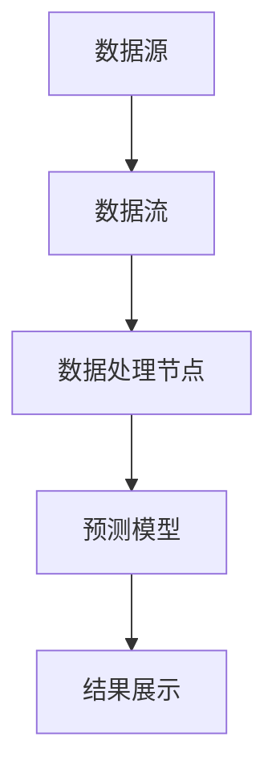

                 


# 实时数据分析与预测

> 关键词：实时数据分析、预测模型、流计算、时间序列分析、系统架构、算法实现

> 摘要：本文深入探讨了实时数据分析与预测的核心概念、算法原理、系统架构及实际应用。通过详细讲解滑动窗口算法和指数平滑法，结合系统设计和项目实战，帮助读者掌握实时数据分析与预测的关键技术。

---

# 第一部分: 实时数据分析与预测的背景与概述

## 第1章: 实时数据分析与预测的背景与问题描述

### 1.1 实时数据分析与预测的背景
- 数据分析的演变：从批量处理到实时分析。
- 实时数据分析的重要性：在金融、医疗、交通等领域的实时决策需求。
- 企业级实时数据分析的挑战：数据量大、处理复杂、实时性要求高等。

### 1.2 问题背景与问题描述
- 数据实时性需求的出现：传统批量分析的局限性。
- 实时数据分析的核心问题：如何高效处理和预测实时数据流。
- 问题边界与外延：区分实时与非实时分析，明确实时处理的范围。

### 1.3 核心概念与概念结构
- 实时数据分析与预测的定义：对实时数据流进行处理和建模预测。
- 核心概念的组成与关系：数据流、流计算、时间序列分析等的相互作用。

---

# 第二部分: 实时数据分析与预测的核心概念与联系

## 第2章: 实时数据分析与预测的核心概念

### 2.1 实时数据流处理
- 数据流的基本特征：连续性、实时性、动态性。
- 数据流处理的关键技术：滑动窗口、流计算框架等。

### 2.2 流计算框架
- 流计算的定义与特点：分布式、高吞吐量、低延迟。
- 流计算框架的核心组件：数据采集、处理引擎、结果存储。

### 2.3 时间序列分析
- 时间序列的基本属性：趋势、周期性、随机性。
- 时间序列分析的核心方法：滑动平均、指数平滑法等。

### 2.4 实时预测模型
- 预测模型的基本组成：数据输入、特征提取、预测算法。
- 实时预测模型的特点：快速响应、持续更新。

### 2.5 核心概念对比表
| 概念对比 | 数据流处理 | 批量处理 |
|----------|------------|----------|
| 数据来源 | 实时流数据 | 批量数据 |
| 处理时间 | 实时处理 | 批处理 |
| 延迟要求 | 低延迟 | 高延迟 |

### 2.6 实时数据分析的ER实体关系图


---

# 第三部分: 实时数据分析与预测的算法原理

## 第3章: 实时数据分析的核心算法

### 3.1 滑动窗口算法
#### 3.1.1 满意条件
- 滑动窗口的基本原理：维护一个固定大小的窗口，滑动窗口处理数据流。
- 滑动窗口的实现流程：初始化窗口、滑动窗口、更新统计信息。
- 滑动窗口的优化方法：队列管理、内存优化。

#### 3.1.2 算法流程图


#### 3.1.3 算法优化
- 窗口大小选择：根据数据特点和需求调整。
- 数据结构优化：使用队列或环形缓冲区。

### 3.2 指数平滑法
#### 3.2.1 满意条件
- 指数平滑法的数学模型：$S_t = \alpha d_t + (1-\alpha)S_{t-1}$。
- 指数平滑法的实现流程：初始化平滑系数、计算平滑序列、预测未来值。
- 指数平滑法的优化方法：选择合适的平滑系数。

#### 3.2.2 算法流程图


---

## 第4章: 实时预测模型的实现

### 4.1 算法原理
- 滑动窗口与指数平滑法的结合：通过滑动窗口获取数据，使用指数平滑法进行预测。
- 算法的数学模型：$y_t = a y_{t-1} + (1-a)y_{t-2}$。

### 4.2 系统架构设计


### 4.3 系统实现
- 数据采集模块：实时读取数据流。
- 数据预处理模块：清洗和特征提取。
- 预测模型：滑动窗口与指数平滑法的结合。
- 结果展示模块：实时显示预测结果。

---

## 第5章: 项目实战——股票价格预测

### 5.1 环境配置
- 安装Python、Pandas、NumPy、Matplotlib。

### 5.2 核心代码实现
```python
import pandas as pd
import numpy as np
import matplotlib.pyplot as plt

# 滑动窗口实现
def moving_average(data, window_size):
    return data.rolling(window=window_size).mean()

# 指数平滑法实现
def exponential_smoothing(data, alpha):
    return data.ewm(alpha=alpha, adjust=False).mean()
```

### 5.3 代码解读与分析
- 滑动窗口实现：计算数据的移动平均值。
- 指数平滑法实现：计算数据的指数加权平均值。

### 5.4 实际案例分析
- 数据预处理：清洗股票价格数据。
- 模型训练：使用滑动窗口和指数平滑法进行预测。
- 模型评估：计算预测误差，如MAE、RMSE。

### 5.5 项目小结
- 项目实现的关键点：数据预处理、算法选择、模型评估。
- 项目经验：实时数据分析的挑战和解决方法。

---

## 第6章: 总结与展望

### 6.1 本章总结
- 实时数据分析与预测的核心技术：滑动窗口、指数平滑法、系统架构设计。
- 算法实现的关键点：数据处理、模型优化。

### 6.2 未来展望
- 结合边缘计算和AI技术：提升实时数据分析的效率和准确性。
- 新的算法和框架：如基于深度学习的时间序列预测模型。

### 6.3 最佳实践Tips
- 数据预处理的重要性：确保数据质量和准确性。
- 算法选择的灵活性：根据实际需求选择合适的预测模型。
- 系统优化：关注性能和资源消耗。

### 6.4 注意事项
- 数据实时性：确保数据采集和处理的实时性。
- 模型更新：定期更新模型以适应数据变化。

### 6.5 拓展阅读
- 推荐书籍和论文：深入学习实时数据分析与预测的技术细节。

---

通过以上结构，我们可以系统地学习实时数据分析与预测的核心内容，从理论到实践，帮助读者掌握这一领域的关键技术。

