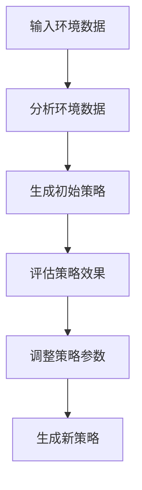
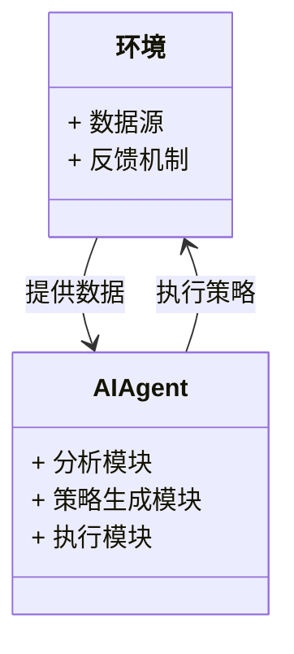
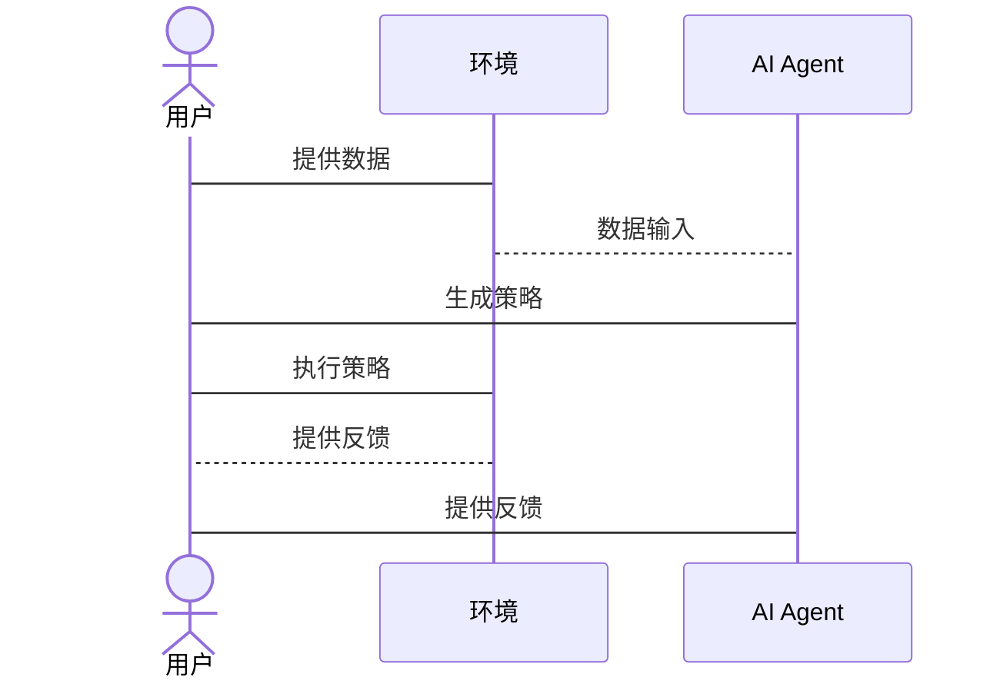

                 


# 实时策略生成AI Agent：LLM在动态决策中的应用

> **关键词**: 实时策略生成, AI Agent, 大语言模型, 动态决策, 智能决策系统, 机器学习

> **摘要**: 本文探讨了实时策略生成AI Agent在动态决策中的应用，重点分析了大语言模型（LLM）在动态决策过程中的核心作用。通过详细阐述实时策略生成AI Agent的核心概念、算法原理、系统架构设计以及实际项目案例，本文旨在为读者提供一个全面而深入的理解，帮助他们在复杂多变的环境中实现高效的实时决策。

---

# 第一部分: 背景介绍

# 第1章: 实时策略生成AI Agent概述

## 1.1 问题背景与描述

### 1.1.1 动态决策问题的背景

在现代商业和科技领域，动态决策问题日益重要。例如，在金融交易中，市场波动频繁，投资者需要实时调整策略；在游戏AI中，对手的行为变化要求AI实时调整策略；在自动驾驶中，车辆必须实时应对道路和交通的变化。动态决策的核心在于，环境是不断变化的，决策者需要在极短时间内做出最优或近似最优的决策。

### 1.1.2 实时策略生成的需求

实时策略生成的需求主要来自于以下几个方面：
1. **快速响应**：在动态环境中，决策必须快速生成，以避免机会损失或风险扩大。
2. **动态适应性**：策略需要根据环境变化实时调整，以应对不确定性。
3. **复杂性**：在复杂环境中，策略生成需要考虑多个变量和可能的组合。

### 1.1.3 LLM在动态决策中的作用

大语言模型（LLM）凭借其强大的理解和生成能力，成为动态决策中的关键工具。LLM能够快速分析上下文，生成符合当前环境的策略。例如，在金融交易中，LLM可以分析市场新闻、历史数据和当前趋势，实时生成买入或卖出的策略。

## 1.2 问题解决与边界

### 1.2.1 动态决策问题的解决方案

动态决策问题的传统解决方案包括基于规则的系统和基于模型的系统。然而，这些方法在面对复杂和动态变化的环境时，往往显得力不从心。基于规则的系统需要手动调整规则，而基于模型的系统需要频繁重新训练模型。

### 1.2.2 实时策略生成的边界与限制

实时策略生成的边界主要在于计算资源和数据获取速度。由于实时生成需要快速处理大量数据，计算资源的限制可能导致生成策略的延迟。此外，模型的泛化能力也是关键，模型必须能够在各种情况下生成合理的策略。

### 1.2.3 LLM在动态决策中的应用范围

LLM在动态决策中的应用范围非常广泛，包括但不限于金融交易、自动驾驶、智能助手、游戏AI等领域。例如，在金融领域，LLM可以实时分析市场数据，生成投资策略；在自动驾驶中，LLM可以辅助车辆做出实时的驾驶决策。

## 1.3 核心概念与结构

### 1.3.1 实时策略生成AI Agent的核心要素

实时策略生成AI Agent的核心要素包括：
1. **感知模块**：实时感知环境的变化。
2. **策略生成模块**：基于感知信息生成策略。
3. **执行模块**：将策略转化为具体行动。

### 1.3.2 动态决策过程的结构化分析

动态决策过程可以分为以下几个步骤：
1. **感知环境**：收集当前环境的数据。
2. **分析数据**：理解数据，识别关键信息。
3. **生成策略**：基于分析结果，生成策略。
4. **评估策略**：评估策略的可行性和效果。
5. **执行策略**：将策略转化为具体行动。

### 1.3.3 LLM在实时策略生成中的角色

LLM在实时策略生成中的角色主要体现在以下几个方面：
1. **数据分析**：LLM能够快速分析大量数据，提取关键信息。
2. **策略生成**：LLM可以根据分析结果，生成符合当前环境的策略。
3. **动态调整**：LLM可以根据反馈，动态调整策略。

## 1.4 本章小结

本章介绍了实时策略生成AI Agent的背景、需求和核心概念，分析了LLM在动态决策中的作用，并探讨了实时策略生成的边界和应用范围。

---

# 第二部分: 核心概念与联系

# 第2章: 实时策略生成AI Agent的核心原理

## 2.1 LLM的基本原理

### 2.1.1 大语言模型的定义与特点

大语言模型（LLM）是一种基于深度学习的自然语言处理模型，具有以下特点：
1. **大规模数据训练**：LLM通常使用海量数据进行训练，能够理解复杂的语言模式。
2. **生成能力强**：LLM能够生成自然语言文本，具有强大的上下文理解和生成能力。
3. **可微调性**：LLM可以根据具体任务进行微调，适应不同的应用场景。

### 2.1.2 LLM的训练过程

LLM的训练过程包括以下几个步骤：
1. **数据准备**：收集和预处理大规模的文本数据。
2. **模型选择**：选择合适的模型架构，如Transformer。
3. **模型训练**：使用训练数据对模型进行训练，优化模型参数。
4. **模型评估**：对模型进行评估，调整模型参数，优化性能。

### 2.1.3 LLM的推理机制

LLM的推理机制主要包括以下步骤：
1. **输入处理**：接收输入文本，生成初始状态。
2. **注意力机制**：计算输入文本中各个词的注意力权重。
3. **解码过程**：根据注意力权重，逐步生成输出文本。

## 2.2 动态决策的核心原理

### 2.2.1 动态决策的定义与特点

动态决策是指在不确定和变化的环境中，根据当前信息做出决策的过程。其特点包括：
1. **实时性**：决策必须在短时间内完成。
2. **动态性**：环境不断变化，决策需要实时调整。
3. **复杂性**：涉及多个变量和复杂的交互。

### 2.2.2 动态决策的过程模型

动态决策的过程模型可以分为以下几个阶段：
1. **感知环境**：收集环境中的相关信息。
2. **分析信息**：理解信息，识别关键因素。
3. **生成策略**：根据分析结果，生成策略。
4. **评估反馈**：评估策略的效果，获取反馈。
5. **动态调整**：根据反馈，调整策略。

### 2.2.3 LLM在动态决策中的应用原理

LLM在动态决策中的应用原理如下：
1. **实时感知**：通过自然语言处理，实时感知环境中的信息。
2. **分析推理**：利用LLM的分析能力，理解信息并推理出可能的策略。
3. **策略生成**：根据推理结果，生成符合当前环境的策略。
4. **动态调整**：根据反馈，动态调整策略，以应对环境的变化。

## 2.3 实时策略生成的算法流程

### 2.3.1 策略生成的基本流程

实时策略生成的算法流程包括以下几个步骤：
1. **数据输入**：接收当前环境的数据。
2. **数据分析**：分析数据，提取关键信息。
3. **策略生成**：根据分析结果，生成策略。
4. **策略评估**：评估策略的可行性和效果。
5. **策略调整**：根据评估结果，动态调整策略。

### 2.3.2 基于LLM的策略生成算法

基于LLM的策略生成算法如下：
1. **输入处理**：将环境数据输入LLM。
2. **上下文理解**：LLM理解输入数据的上下文。
3. **策略生成**：LLM根据理解生成策略。
4. **策略优化**：根据反馈优化策略。

### 2.3.3 动态调整的实现机制

动态调整的实现机制包括：
1. **反馈收集**：收集策略执行后的反馈。
2. **策略评估**：评估策略的效果。
3. **参数调整**：根据评估结果，调整模型参数。
4. **策略更新**：生成新的策略。

## 2.4 核心概念对比表格

| 对比维度 | 动态决策 | 静态决策 |
|----------|----------|----------|
| 时间性   | 实时     | 非实时   |
| 变异性   | 高       | 低       |
| 决策依据 | 动态环境 | 静态环境 |

## 2.5 ER实体关系图

```mermaid
er
actor: 用户
agent: AI Agent
environment: 环境
action: 行动
goal: 目标
feedback: 反馈
```

## 2.6 本章小结

本章详细阐述了实时策略生成AI Agent的核心原理，包括LLM的基本原理和动态决策的过程模型，并通过对比分析和ER图，进一步明确了核心概念之间的关系。

---

# 第三部分: 算法原理讲解

# 第3章: LLM的数学模型

## 3.1 基于Transformer的LLM模型

### 3.1.1 Transformer模型的结构

Transformer模型由编码器和解码器组成，编码器负责将输入序列编码为上下文向量，解码器负责根据编码器输出生成目标序列。

### 3.1.2 注意力机制的数学公式

注意力机制的计算公式如下：
$$
\text{Attention}(Q, K, V) = \text{softmax}\left(\frac{QK^T}{\sqrt{d_k}}\right)V
$$
其中，$Q$、$K$、$V$分别是查询、键和值矩阵，$d_k$是键的维度。

### 3.1.3 多层感知机的实现

多层感知机（MLP）的实现如下：
1. **输入层**：接收输入数据。
2. **隐藏层**：通过多个隐藏层进行特征提取。
3. **输出层**：生成最终的输出。

## 3.2 基于LLM的策略生成算法

### 3.2.1 算法流程



### 3.2.2 算法的数学模型

策略生成的数学模型如下：
$$
p(a_t | s_t) = \text{Policy}(s_t)
$$
其中，$s_t$是当前状态，$a_t$是采取的动作，Policy是策略生成函数。

## 3.3 动态调整机制的实现

### 3.3.1 动态调整的步骤

动态调整的步骤包括：
1. **收集反馈**：收集策略执行后的反馈。
2. **评估策略**：评估策略的效果。
3. **优化参数**：根据评估结果优化模型参数。
4. **生成新策略**：生成新的策略。

### 3.3.2 动态调整的数学模型

动态调整的数学模型如下：
$$
\theta_{t+1} = \theta_t + \eta \nabla_{\theta_t} J(\theta_t)
$$
其中，$\theta_t$是模型参数，$\eta$是学习率，$J(\theta_t)$是目标函数。

---

# 第四部分: 系统分析与架构设计

# 第4章: 系统架构设计

## 4.1 问题场景介绍

### 4.1.1 系统目标

系统的目标是实现一个实时策略生成AI Agent，能够在动态环境中快速生成和调整策略。

### 4.1.2 系统需求

系统需求包括：
1. **实时性**：决策必须在短时间内完成。
2. **动态性**：能够实时感知环境变化，并动态调整策略。
3. **准确性**：生成的策略必须准确可行。

## 4.2 系统功能设计

### 4.2.1 领域模型



### 4.2.2 系统架构

```mermaid
container 系统架构 {
  class LLM {
    + 模型
    + 参数
  }
  class 策略生成模块 {
    + 输入处理
    + 分析推理
    + 策略生成
  }
  class 执行模块 {
    + 策略执行
    + 反馈收集
  }
  策略生成模块 --> LLM: 使用模型
  执行模块 --> 策略生成模块: 提供反馈
}
```

### 4.2.3 系统接口设计

系统接口设计包括：
1. **输入接口**：接收环境数据。
2. **输出接口**：输出生成的策略。
3. **反馈接口**：接收策略执行后的反馈。

### 4.2.4 交互流程



## 4.3 本章小结

本章详细描述了系统的架构设计，包括系统目标、功能模块、接口设计和交互流程，为后续的实现奠定了基础。

---

# 第五部分: 项目实战

# 第5章: 项目实战

## 5.1 环境安装

### 5.1.1 安装Python

```bash
python --version
pip install --upgrade pip
```

### 5.1.2 安装必要的库

```bash
pip install numpy
pip install transformers
pip install torch
```

## 5.2 系统核心实现源代码

### 5.2.1 策略生成模块的实现

```python
import torch
from transformers import AutoModelForCausalLM, AutoTokenizer

class StrategyGenerator:
    def __init__(self, model_name):
        self.tokenizer = AutoTokenizer.from_pretrained(model_name)
        self.model = AutoModelForCausalLM.from_pretrained(model_name)
        
    def generate_strategy(self, input_text, max_length=50):
        inputs = self.tokenizer(input_text, return_tensors='pt')
        outputs = self.model.generate(**inputs, max_length=max_length)
        return self.tokenizer.decode(outputs[0], skip_special_tokens=True)
```

### 5.2.2 动态调整模块的实现

```python
class DynamicAdjuster:
    def __init__(self, model):
        self.model = model
        self.feedback = None
        
    def adjust_strategy(self, feedback):
        self.feedback = feedback
        # 根据反馈调整模型参数
        # 示例：简单调整模型的生成参数
        self.model.temperature = min(2.0, max(0.5, self.model.temperature + 0.1))
```

## 5.3 代码应用解读与分析

### 5.3.1 策略生成模块的解读

策略生成模块使用预训练的大语言模型，接收输入文本，生成符合当前环境的策略。代码中，我们使用了`AutoModelForCausalLM`和`AutoTokenizer`，加载预训练模型，并定义了生成策略的方法。

### 5.3.2 动态调整模块的解读

动态调整模块根据反馈调整模型的生成参数。例如，当策略执行效果不好时，动态调整模块会降低模型的生成温度，使得生成的策略更加保守。

## 5.4 实际案例分析

### 5.4.1 金融交易场景

假设在金融交易场景中，AI Agent需要实时生成买卖策略。当市场波动剧烈时，AI Agent会根据最新的市场新闻和数据，生成买入或卖出的策略，并根据交易结果动态调整策略。

### 5.4.2 游戏AI场景

在游戏AI场景中，AI Agent需要实时生成游戏策略。当对手的策略变化时，AI Agent会根据新的信息生成新的策略，并动态调整以应对变化。

## 5.5 本章小结

本章通过实际案例分析，详细讲解了实时策略生成AI Agent的实现过程，并提供了具体的代码实现，帮助读者理解如何将理论应用于实际场景。

---

# 第六部分: 总结与展望

# 第6章: 总结与展望

## 6.1 最佳实践Tips

1. **模型选择**：选择适合具体任务的模型，进行微调以提升性能。
2. **数据处理**：确保数据质量，实时更新数据以保持模型的适应性。
3. **反馈机制**：设计有效的反馈机制，及时调整策略。
4. **性能优化**：优化模型的运行效率，减少延迟。

## 6.2 小结

本文系统地探讨了实时策略生成AI Agent的实现，从背景介绍到算法原理，再到系统架构和项目实战，为读者提供了一个全面而深入的视角。

## 6.3 注意事项

1. **计算资源**：实时策略生成需要强大的计算资源，尤其是在处理大规模数据时。
2. **模型泛化能力**：模型需要具备良好的泛化能力，以应对各种不同的环境变化。
3. **反馈机制**：反馈机制的设计和实现直接影响策略调整的效果，需要特别注意。

## 6.4 拓展阅读

1. **深度强化学习**：进一步了解深度强化学习在动态决策中的应用。
2. **实时机器学习**：探索实时机器学习技术在动态决策中的潜力。
3. **分布式系统**：研究分布式系统在实时策略生成中的应用。

## 6.5 本章小结

本章总结了全文的主要内容，并展望了未来的发展方向，为读者提供了进一步学习和研究的参考。

---

# 结语

实时策略生成AI Agent是人工智能领域的重要应用，通过结合大语言模型和动态决策技术，能够实现实时的、动态的策略生成。随着技术的不断进步，实时策略生成AI Agent将在更多领域发挥重要作用，为人类社会带来更多的便利和效率提升。

