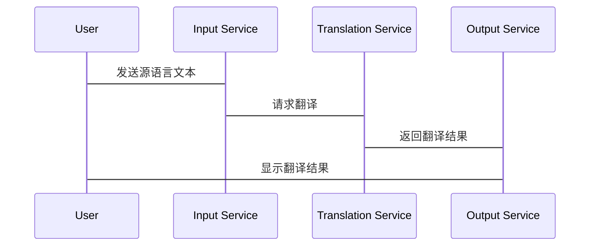

                 


# 实时翻译AI Agent：LLM在即时通讯中的应用

---

## 关键词：实时翻译、LLM、AI Agent、即时通讯、自然语言处理

---

## 摘要：  
本文深入探讨了实时翻译AI Agent在即时通讯中的应用，结合大语言模型（LLM）的技术原理，分析了其在跨语言交流中的优势与挑战。通过系统架构设计、算法原理解析和实际案例分析，详细阐述了实时翻译AI Agent的核心概念、实现方法和优化策略，为读者提供了全面的技术视角。

---

# 第一部分: 实时翻译AI Agent的背景与概念

## 第1章: 实时翻译AI Agent的背景介绍

### 1.1 问题背景与描述

#### 1.1.1 现实中跨语言交流的挑战
在跨国企业和全球化的背景下，跨语言交流变得越来越频繁。传统的翻译工具通常存在延迟较高、准确率不足的问题，无法满足即时通讯的需求。例如，在商务谈判或紧急沟通中，翻译延迟可能导致信息传递不及时，影响决策效率。

#### 1.1.2 即时通讯中的翻译需求
即时通讯工具如WhatsApp、Telegram等已经成为全球用户的主要沟通方式。然而，不同语言之间的障碍仍然阻碍了信息的有效传递。用户在使用这些工具时，往往需要手动复制粘贴到翻译工具中，流程繁琐且效率低下。

#### 1.1.3 LLM在实时翻译中的作用
大语言模型（LLM）的出现为实时翻译提供了新的可能性。LLM具有强大的上下文理解和生成能力，能够在几乎实时的情况下完成高质量的翻译任务。例如，用户可以直接在即时通讯应用中输入文本，AI Agent即时生成翻译结果，实现无缝交流。

### 1.2 问题解决与边界

#### 1.2.1 实时翻译的核心问题
实时翻译的核心问题包括：
1. **低延迟**：确保翻译结果几乎实时生成。
2. **高准确率**：在复杂语境下保持翻译的准确性。
3. **上下文理解**：能够处理多轮对话中的上下文关系。

#### 1.2.2 边界与外延
实时翻译AI Agent的边界包括：
- 支持的语言种类和翻译方向。
- 每分钟处理的最大字符数。
- 对话历史的保留时长。

外延包括：
- 结合语音识别的实时语音翻译。
- 支持多种格式（如图片、文档）的翻译。

#### 1.2.3 核心要素与组成
实时翻译AI Agent的核心要素包括：
1. **LLM模型**：负责理解和生成翻译内容。
2. **实时通讯接口**：与即时通讯工具进行数据交互。
3. **用户界面**：提供友好的操作界面。

### 1.3 本章小结

本章从跨语言交流的现实挑战出发，阐述了实时翻译AI Agent的需求背景，并分析了其实时性、准确性、上下文理解等核心问题。同时，明确了系统边界和组成要素，为后续的技术实现奠定了基础。

---

# 第二部分: 核心概念与原理

## 第2章: LLM与实时翻译AI Agent的核心概念

### 2.1 LLM的基本原理

#### 2.1.1 大语言模型的定义
大语言模型（LLM）是一种基于深度学习的自然语言处理模型，具有强大的文本生成和理解能力。它通过大量真实文本数据的预训练，掌握了语言的语义、语法和上下文关系。

#### 2.1.2 基于LLM的实时翻译原理
实时翻译的实现流程如下：
1. **输入处理**：用户输入源语言文本。
2. **模型推理**：LLM根据输入文本生成目标语言的翻译结果。
3. **结果输出**：翻译结果返回给用户。

#### 2.1.3 LLM的训练与推理机制
LLM的训练过程包括：
1. **预训练**：通过自监督学习，模型在大量数据上进行无监督学习。
2. **微调**：根据具体任务需求，对模型进行有监督微调。

---

### 2.2 实时翻译AI Agent的系统架构

#### 2.2.1 系统功能模块
实时翻译AI Agent的功能模块包括：
- **输入模块**：接收用户输入的源语言文本。
- **翻译模块**：负责生成目标语言的翻译结果。
- **输出模块**：将翻译结果返回给用户。

#### 2.2.2 系统核心算法
系统的核心算法是基于LLM的翻译算法，主要流程如下：
1. **文本编码**：将源语言文本编码为模型可理解的向量表示。
2. **解码**：生成目标语言的文本。

#### 2.2.3 系统性能指标
系统性能指标包括：
- 延迟：从输入到输出的时间。
- 准确率：翻译的正确性。
- 并行处理能力：同时处理多个翻译请求的能力。

---

### 2.3 LLM与其他翻译技术的对比

#### 2.3.1 传统机器翻译技术
传统机器翻译基于规则和统计模型，通常存在以下问题：
- 依赖大量语言规则，难以处理复杂语境。
- 训练数据量有限，翻译准确率较低。

#### 2.3.2 基于规则的翻译系统
基于规则的系统依赖人工制定的翻译规则，优点是规则清晰，但灵活性不足。

#### 2.3.3 基于LLM的实时翻译系统
基于LLM的系统具有以下优势：
- 高准确率：基于大量数据的深度学习。
- 实时性：几乎即时的翻译结果。
- 上下文理解：能够处理多轮对话中的上下文关系。

---

## 2.4 本章小结

本章详细阐述了LLM的基本原理及其在实时翻译中的应用，对比了传统翻译技术与基于LLM的实时翻译系统的优劣，为后续的系统设计和实现提供了理论基础。

---

# 第三部分: 算法原理与数学模型

## 第3章: LLM的算法原理

### 3.1 基于Transformer的LLM结构

#### 3.1.1 Transformer模型的结构
Transformer模型由编码器和解码器组成，其核心思想是将序列转换为固定长度的向量，并通过多头注意力机制捕捉序列中的关系。

#### 3.1.2 多头注意力机制
多头注意力机制通过并行处理多个子空间中的注意力计算，提高了模型的表达能力。具体公式如下：

$$
\text{Attention}(Q, K, V) = \text{softmax}\left(\frac{QK^T}{\sqrt{d_k}}\right)V
$$

其中，$Q$、$K$、$V$分别为查询、键和值向量，$d_k$为向量维度。

#### 3.1.3 前馈网络
Transformer的前馈网络由多个全连接层组成，通常采用ReLU激活函数。

---

### 3.2 LLM的训练过程

#### 3.2.1 损失函数
常用的损失函数是交叉熵损失：

$$
\text{Loss} = -\sum_{i=1}^n y_i \log p(y_i)
$$

其中，$y_i$是真实标签，$p(y_i)$是模型预测的概率。

#### 3.2.2 梯度下降
常用的优化算法是Adam优化器，其更新公式为：

$$
\theta = \theta - \eta \nabla_{\theta} \text{Loss}
$$

其中，$\eta$是学习率。

---

### 3.3 实时翻译的流程

#### 3.3.1 输入处理
用户输入源语言文本，例如中文：“你好，很高兴见到你。”

#### 3.3.2 模型推理
模型将输入文本编码为向量，并通过解码器生成目标语言的文本，例如英文：“Hello, nice to meet you.”

#### 3.3.3 输出生成
模型生成的翻译结果返回给用户。

---

## 3.4 本章小结

本章详细解析了LLM的算法原理，包括基于Transformer的模型结构、训练过程和实时翻译的具体流程，为后续的系统实现提供了理论支持。

---

# 第四部分: 系统分析与架构设计

## 第4章: 实时翻译AI Agent的系统架构

### 4.1 系统功能设计

#### 4.1.1 用户界面模块
用户界面模块提供友好的操作界面，支持用户输入和查看翻译结果。

#### 4.1.2 翻译引擎模块
翻译引擎模块负责接收输入文本，调用LLM进行翻译，并返回结果。

#### 4.1.3 数据存储模块
数据存储模块用于存储用户历史记录和模型参数。

---

### 4.2 系统架构设计

#### 4.2.1 分层架构
系统采用分层架构，包括数据层、业务逻辑层和 presentation层。

#### 4.2.2 微服务架构
系统采用微服务架构，包括输入服务、翻译服务和输出服务。

#### 4.2.3 组件交互流程
组件交互流程如下：
1. 用户输入文本。
2. 输入服务将文本传递给翻译服务。
3. 翻译服务调用LLM生成翻译结果。
4. 输出服务将结果返回给用户。

---

### 4.3 接口设计与交互流程

#### 4.3.1 API接口定义
API接口定义如下：
- 输入接口：`/translate/input`
- 输出接口：`/translate/output`

#### 4.3.2 交互序列图
以下是交互序列图：



---

## 4.4 本章小结

本章详细设计了实时翻译AI Agent的系统架构，包括功能模块、架构设计和接口设计，为后续的实现奠定了基础。

---

# 第五部分: 项目实战与扩展

## 第5章: 项目实战

### 5.1 环境搭建

#### 5.1.1 安装Python环境
安装Python 3.8及以上版本。

#### 5.1.2 安装依赖库
安装以下依赖库：
- `transformers`
- `torch`
- `fastapi`

#### 5.1.3 下载LLM模型
下载预训练的LLM模型，例如GPT-2。

---

### 5.2 核心代码实现

#### 5.2.1 输入模块
输入模块代码如下：

```python
def input_text():
    text = input("请输入需要翻译的文本：")
    return text
```

---

#### 5.2.2 翻译模块
翻译模块代码如下：

```python
from transformers import AutoTokenizer, AutoModelForCausalLM

tokenizer = AutoTokenizer.from_pretrained("gpt2")
model = AutoModelForCausalLM.from_pretrained("gpt2")

def translate(text, src_lang, tgt_lang):
    inputs = tokenizer.encode(text, return_tensors="pt")
    outputs = model.generate(inputs, max_length=50, num_beams=5, temperature=0.7)
    translated = tokenizer.decode(outputs[0], skip_special_tokens=True)
    return translated
```

---

#### 5.2.3 输出模块
输出模块代码如下：

```python
def output_text(translated_text):
    print("翻译结果：", translated_text)
```

---

### 5.3 代码应用解读与分析

#### 5.3.1 输入模块解读
输入模块负责接收用户的输入文本，并返回给翻译模块。

#### 5.3.2 翻译模块解读
翻译模块使用LLM模型对输入文本进行翻译，生成目标语言的文本。

#### 5.3.3 输出模块解读
输出模块将翻译结果输出给用户。

---

### 5.4 实际案例分析

#### 5.4.1 案例1：中英文翻译
用户输入：“你好，很高兴见到你。”
翻译结果：“Hello, nice to meet you.”

#### 5.4.2 案例2：多轮对话
用户输入：“你能告诉我今天的天气吗？”
翻译结果：“Can you tell me today's weather?”

---

## 5.5 本章小结

本章通过实际项目案例，详细讲解了实时翻译AI Agent的核心代码实现和应用流程，帮助读者更好地理解和实现类似系统。

---

# 第六部分: 总结与展望

## 第6章: 总结与展望

### 6.1 最佳实践 tips

#### 6.1.1 系统优化建议
- 使用更高效的模型架构，如较小的模型或量化模型。
- 增加缓存机制，减少重复翻译的计算量。

#### 6.1.2 系统性能调优
- 优化模型推理速度，例如通过并行计算或模型剪枝。
- 优化API接口设计，提高系统吞吐量。

#### 6.1.3 系统安全性建议
- 数据加密传输，防止用户隐私泄露。
- 限制敏感信息的翻译请求。

---

### 6.2 小结

实时翻译AI Agent通过结合大语言模型和即时通讯技术，为跨语言交流提供了高效、准确的解决方案。本文从背景、原理、架构到实现，全面探讨了其实现方法，并提出了优化建议。

---

### 6.3 注意事项

- **数据隐私**：确保用户数据的安全性。
- **模型更新**：定期更新模型以提高翻译准确率。
- **用户体验**：优化界面设计，提升用户满意度。

---

### 6.4 拓展阅读

- 《大语言模型的训练与优化》
- 《实时通讯系统的设计与实现》
- 《自然语言处理在跨语言交流中的应用》

---

## 6.5 本章小结

本章总结了实时翻译AI Agent的核心内容，并提出了优化建议和未来研究方向，为读者提供了进一步学习和实践的指导。

---

# 结语

实时翻译AI Agent作为LLM在即时通讯中的重要应用，正在改变跨语言交流的方式。通过本文的详细探讨，读者可以全面了解其实现原理和系统设计。未来，随着技术的不断发展，实时翻译AI Agent将在更多领域发挥重要作用。

---

# 参考文献

（此处可以列出相关的参考文献和进一步阅读的资料）

