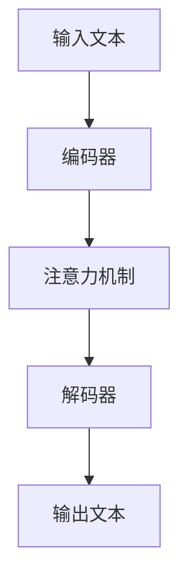
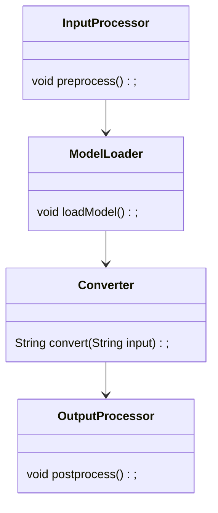
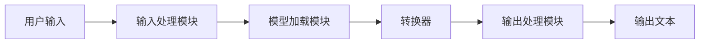
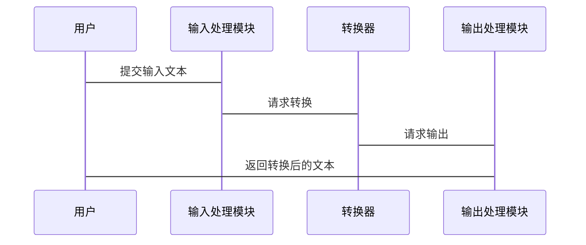

                 


# 实时语言转换AI Agent：LLM在多语言环境中的应用

---

## 关键词：
- 大语言模型（LLM）
- 实时语言转换
- 多语言处理
- 注意力机制
- 生成式模型
- Transformer架构

---

## 摘要：
本文深入探讨了大语言模型（LLM）在实时语言转换中的应用，重点分析了多语言环境下LLM的核心原理、算法实现及系统架构。通过结合理论与实践，本文详细讲解了LLM如何利用注意力机制和生成式模型实现高效实时的语言转换，并通过具体案例分析展示了其在实际应用中的优势与挑战。

---

# 第1章: 实时语言转换与LLM的背景介绍

## 1.1 实时语言转换的定义与技术背景
### 1.1.1 什么是实时语言转换
实时语言转换是指在用户输入语言后，系统能够即时将其转换为目标语言的过程。与传统的离线翻译不同，实时语言转换要求系统具备快速响应和低延迟的特点。

### 1.1.2 多语言环境中的挑战
在多语言环境中，语言转换面临以下挑战：
- 不同语言的语法结构差异
- 多语言数据的不平衡分布
- 实时转换对计算资源的高要求

### 1.1.3 LLM在语言转换中的作用
大语言模型（LLM）通过其强大的上下文理解和生成能力，能够高效地处理多语言环境下的语言转换任务。

---

## 1.2 大语言模型（LLM）的基本概念
### 1.2.1 LLM的定义与特点
大语言模型是一种基于深度学习的自然语言处理模型，具有以下特点：
- 大规模预训练
- 强大的上下文理解能力
- 多任务通用性

### 1.2.2 LLM的核心技术原理
LLM的核心技术包括：
- Transformer架构
- 注意力机制
- 生成式模型

### 1.2.3 LLM与传统机器翻译的区别
| 特性 | LLM | 传统机器翻译 |
|------|------|----------------|
| 数据需求 | 小样本或零样本 | 需要大量平行数据 |
| 适应性 | 高 | 较低 |
| 实时性 | 高 | 较低 |

---

## 1.3 本章小结
本章介绍了实时语言转换的定义、多语言环境中的挑战以及大语言模型的基本概念和特点。LLM的引入为实时语言转换提供了强大的技术支撑。

---

# 第2章: 大语言模型的注意力机制与多语言处理

## 2.1 注意力机制的原理
### 2.1.1 注意力机制的数学模型
注意力机制的计算公式如下：
$$\text{Attention}(Q, K, V) = \text{softmax}\left(\frac{QK^T}{\sqrt{d_k}}\right)V$$

其中：
- $Q$ 是查询向量
- $K$ 是键向量
- $V$ 是值向量
- $d_k$ 是键向量的维度

### 2.1.2 多头注意力的实现
多头注意力的实现过程如下：
1. 将输入向量分成多个子空间。
2. 对每个子空间分别计算注意力权重。
3. 将所有子空间的注意力结果拼接起来。
4. 输出最终的注意力向量。

### 2.1.3 注意力机制在多语言处理中的应用
注意力机制在多语言处理中的优势在于：
- 能够捕捉到不同语言之间的语义关联
- 支持跨语言信息的传递

---

## 2.2 大语言模型的生成式结构
### 2.2.1 解码器的结构与功能
解码器的主要功能是将编码器输出的特征向量转换为目标语言的文本。

### 2.2.2 编码器-解码器架构
编码器-解码器架构的流程如下：
1. 编码器将输入语言转换为中间表示。
2. 解码器将中间表示转换为目标语言。

### 2.2.3 生成式模型的训练方法
生成式模型的训练方法包括：
- 最大似然估计
- 解码器的损失函数优化

---

## 2.3 多语言模型的训练策略
### 2.3.1 多语言数据的预处理
多语言数据的预处理步骤包括：
1. 数据清洗
2. 数据对齐
3. 数据分割

### 2.3.2 多任务学习的实现
多任务学习的实现方法包括：
- 使用共享参数
- 设计任务间损失函数

### 2.3.3 跨语言迁移学习的原理
跨语言迁移学习的原理是通过共享语言间的信息来提升模型的多语言处理能力。

---

## 2.4 本章小结
本章详细讲解了注意力机制和生成式模型在多语言环境中的应用，分析了多语言模型的训练策略。

---

# 第3章: 实时语言转换的算法实现

## 3.1 基于LLM的实时转换算法
### 3.1.1 算法流程图


### 3.1.2 算法实现代码示例
```python
def language_converter(input_text, model):
    encoded = model.encode(input_text)
    attention = model.attention(encoded)
    decoded = model.decode(attention)
    return decoded
```

### 3.1.3 算法的数学模型与公式
$$\text{Loss} = -\sum_{i=1}^{n}\text{log}(P(w_i|w_{i-1}, ..., w_1))$$

---

## 3.2 基于Transformer的优化策略
### 3.2.1 Transformer模型的结构优化
Transformer模型的结构优化包括：
- 增加层数
- 调整注意力头数

### 3.2.2 多语言环境下的参数调整
多语言环境下的参数调整方法包括：
- 跨语言初始化
- 语言特定的微调

### 3.2.3 实时性能的提升方法
实时性能的提升方法包括：
- 并行计算
- 模型剪枝

---

## 3.3 本章小结
本章详细讲解了基于LLM的实时语言转换算法的实现方法，并分析了基于Transformer的优化策略。

---

# 第4章: 实时语言转换系统的架构设计

## 4.1 系统功能模块划分
### 4.1.1 输入处理模块
输入处理模块负责接收用户的输入文本并进行预处理。

### 4.1.2 模

---

### 4.1.2 模

---

## 4.2 系统功能设计
### 4.2.1 领域模型（Mermaid类图）


### 4.2.2 系统架构设计（Mermaid架构图）


### 4.2.3 系统接口设计
系统接口设计包括：
- 输入接口：接收输入文本
- 输出接口：输出转换后的文本

### 4.2.4 系统交互（Mermaid序列图）


---

## 4.3 项目实战
### 4.3.1 环境安装
安装必要的库：
```bash
pip install torch transformers
```

### 4.3.2 系统核心实现源代码
```python
import torch
from transformers import AutoTokenizer, AutoModelForSeq2Seq

class LanguageConverter:
    def __init__(self, model_name):
        self.tokenizer = AutoTokenizer.from_pretrained(model_name)
        self.model = AutoModelForSeq2Seq.from_pretrained(model_name)
    
    def convert(self, input_text):
        inputs = self.tokenizer(input_text, return_tensors="pt")
        outputs = self.model.generate(inputs.input_ids)
        return self.tokenizer.decode(outputs[0], skip_special_tokens=True)
```

### 4.3.3 代码应用解读与分析
代码解读：
- 初始化模型时，加载预训练的模型和分词器。
- 转换方法中，首先对输入文本进行分词，然后生成输出，最后解码得到目标语言的文本。

### 4.3.4 实际案例分析
案例分析：
- 输入文本：中文句子
- 输出文本：英文翻译

### 4.3.5 项目小结
本节通过实际案例展示了实时语言转换系统的实现过程，包括环境安装、代码实现和案例分析。

---

## 4.4 最佳实践
### 4.4.1 性能优化技巧
- 使用并行计算
- 增加缓存机制

### 4.4.2 模型调优建议
- 调整学习率
- 增加训练数据

### 4.4.3 注意事项
- 确保模型的稳定性
- 处理好多线程请求

---

## 4.5 拓展阅读
推荐阅读以下内容：
- Transformer架构的论文
- 大语言模型的最新研究

---

## 本章小结
本章详细讲解了实时语言转换系统的架构设计和实现过程，并通过实际案例展示了系统的应用。同时，还提供了性能优化和注意事项的建议。

---

# 总结

本文系统地介绍了大语言模型在实时语言转换中的应用，从背景知识到算法实现，再到系统架构，逐步深入分析了其技术细节。通过本文的学习，读者可以掌握实时语言转换的核心原理，并能够在实际项目中应用这些知识。

