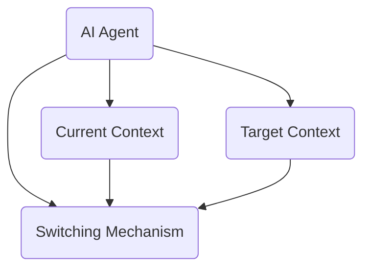
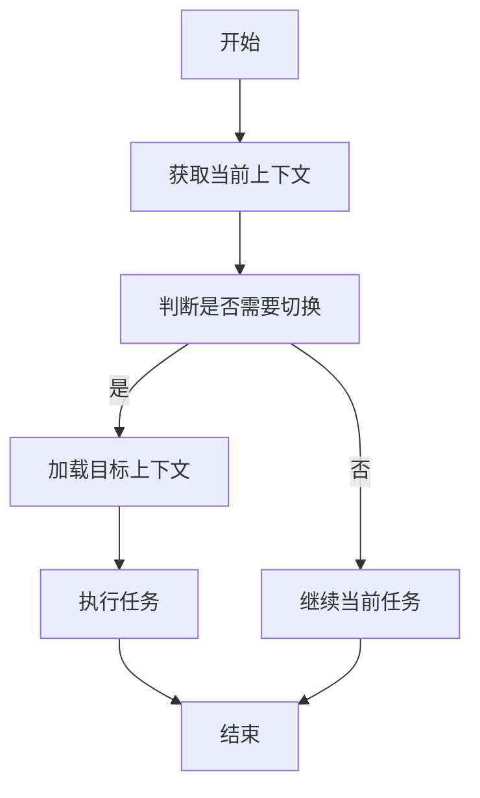
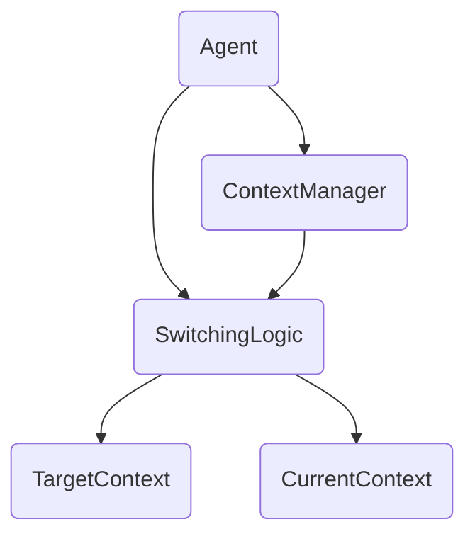
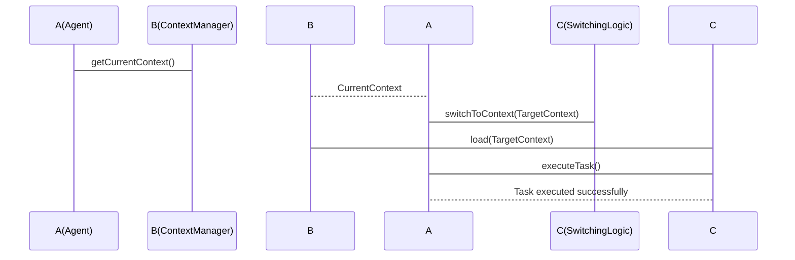

                 


# 实现AI Agent的上下文切换能力

## 关键词：AI Agent，上下文切换，智能体，算法原理，系统架构

## 摘要：本文深入探讨了AI Agent的上下文切换能力，从基本概念到算法原理，再到系统架构和项目实战，详细讲解了如何实现这一关键功能。文章通过理论分析和实际案例，帮助读者理解并掌握AI Agent上下文切换的核心技术。

---

# 第一部分: AI Agent与上下文切换概述

## 第1章: AI Agent与上下文切换概述

### 1.1 问题背景
#### 1.1.1 AI Agent的基本概念
AI Agent（人工智能代理）是指能够感知环境、自主决策并执行任务的智能实体。AI Agent广泛应用于自动驾驶、智能助手、机器人等领域，其核心能力之一是能够根据环境和任务需求动态调整行为。

#### 1.1.2 上下文切换的必要性
在实际应用场景中，AI Agent可能需要同时处理多个任务或在不同环境中切换。例如，智能助手可能需要在处理用户查询的同时监控其他任务进度；自动驾驶系统可能需要在城市道路和高速公路之间切换驾驶模式。这种动态切换能力是AI Agent高效运作的关键。

#### 1.1.3 问题的解决思路
上下文切换的核心在于如何快速、准确地切换到目标上下文，同时保持系统的稳定性和连续性。本文将从算法原理、系统架构和实现细节三个方面展开讨论，提出一种基于状态管理和上下文表示的切换方法。

### 1.2 核心概念与联系
#### 1.2.1 AI Agent的定义与属性
AI Agent可以被定义为一个具有感知、决策、执行能力的智能实体。其核心属性包括：
- **感知能力**：通过传感器或接口获取环境信息。
- **决策能力**：基于当前状态和目标，做出决策。
- **执行能力**：通过执行机构或接口执行决策结果。

#### 1.2.2 上下文切换的核心要素
上下文切换涉及以下几个核心要素：
1. **当前上下文**：AI Agent当前所处的任务或环境状态。
2. **目标上下文**：AI Agent需要切换到的目标任务或环境状态。
3. **切换机制**：实现上下文切换的具体方法，包括状态管理、上下文表示和切换逻辑。

#### 1.2.3 实体关系图（ER图）
以下是AI Agent上下文切换的核心实体关系图：



### 1.3 本章小结
本章介绍了AI Agent的基本概念及其在上下文切换中的重要性，明确了上下文切换的核心要素和实现思路。下一章将深入探讨上下文切换的算法原理。

---

# 第二部分: 上下文切换的核心原理

## 第2章: 上下文切换的算法原理

### 2.1 算法原理概述
上下文切换的实现依赖于高效的算法设计。本文提出一种基于状态管理和上下文表示的切换算法，具体包括以下几个步骤：

#### 2.1.1 上下文表示
上下文可以通过状态向量表示，例如：
$$ C = (c_1, c_2, \ldots, c_n) $$
其中，$c_i$ 表示上下文的特征。

#### 2.1.2 状态管理
AI Agent需要维护当前上下文和目标上下文，通过状态管理模块实现上下文的切换。

#### 2.1.3 切换逻辑
切换逻辑包括以下步骤：
1. 判断是否需要切换上下文。
2. 加载目标上下文。
3. 执行任务。

### 2.2 算法流程图（Mermaid）
以下是上下文切换算法的流程图：



### 2.3 数学模型与公式
#### 2.3.1 上下文表示模型
$$ C = f_{context}(S) $$
其中，$C$ 表示上下文，$S$ 表示当前状态，$f_{context}$ 表示上下文提取函数。

#### 2.3.2 切换概率计算
$$ P_{switch} = \frac{C_{target} - C_{current}}{D} $$
其中，$P_{switch}$ 表示切换概率，$C_{target}$ 表示目标上下文，$C_{current}$ 表示当前上下文，$D$ 表示距离或差异度量。

### 2.4 本章小结
本章详细介绍了上下文切换的算法原理，包括上下文表示、状态管理和切换逻辑。通过数学模型和流程图的描述，读者可以清晰理解切换过程。

---

# 第三部分: 系统架构与设计

## 第3章: 系统分析与架构设计

### 3.1 问题场景介绍
#### 3.1.1 使用场景分析
以智能助手为例，AI Agent需要在处理用户查询的同时监控其他任务进度，这需要频繁的上下文切换。

#### 3.1.2 核心需求分析
1. 快速切换上下文。
2. 稳定性和可靠性。
3. 实时性。

#### 3.1.3 约束条件与边界
1. 切换时间限制：上下文切换必须在限定时间内完成。
2. 资源消耗：上下文切换过程必须控制资源消耗。

### 3.2 系统功能设计
#### 3.2.1 领域模型（Mermaid类图）

```mermaid
classDiagram
class Agent {
    +state: Context
    +currentContext: Context
    -targetContext: Context
    +switchContext()

class Context {
    +id: int
    +attributes: map<string, any>
}

Agent --> Context
Agent --> Context
```

### 3.3 系统架构设计
#### 3.3.1 架构图（Mermaid）



### 3.4 系统接口设计
上下文切换涉及以下几个关键接口：
1. `getCurrentContext()`：获取当前上下文。
2. `switchToContext(targetContext)`：切换到目标上下文。

### 3.5 系统交互流程（Mermaid序列图）



### 3.6 本章小结
本章通过系统架构设计和交互流程图，详细描述了AI Agent上下文切换的实现方式，为后续的项目实战奠定了基础。

---

# 第四部分: 项目实战

## 第4章: 项目实战

### 4.1 环境安装与配置
要实现上下文切换功能，首先需要安装以下工具和库：
- Python 3.8+
- Mermaid CLI
-依赖库：numpy, matplotlib

### 4.2 核心功能实现
以下是上下文切换的核心代码实现：

```python
class Agent:
    def __init__(self):
        self.current_context = None
        self.target_context = None

    def switch_context(self, target_context):
        self.target_context = target_context
        self._load_context()

    def _load_context(self):
        # 加载目标上下文
        pass

    def execute_task(self):
        # 执行任务
        pass
```

### 4.3 代码解读与分析
1. **Agent类**：定义AI Agent的基本结构，包含当前上下文和目标上下文。
2. **switch_context方法**：实现上下文切换。
3. **_load_context方法**：加载目标上下文。
4. **execute_task方法**：执行任务。

### 4.4 实际案例分析
以下是一个实际案例：

```python
agent = Agent()
current_context = {"task": "monitor", "status": "running"}
target_context = {"task": "query", "status": "idle"}

agent.current_context = current_context
agent.switch_context(target_context)
agent.execute_task()
```

### 4.5 项目小结
本章通过实际案例，详细讲解了如何实现上下文切换功能，帮助读者掌握代码实现和系统设计。

---

# 第五部分: 总结与展望

## 第5章: 总结与展望

### 5.1 最佳实践
1. **状态管理**：确保状态管理模块的高效性和准确性。
2. **上下文表示**：选择合适的上下文表示方法，提高切换效率。
3. **切换策略**：根据具体场景选择合适的切换策略。

### 5.2 小结
本文详细探讨了AI Agent上下文切换能力的实现，从算法原理到系统架构，再到项目实战，全面覆盖了相关技术。

### 5.3 注意事项
1. 切换上下文时要确保系统的稳定性和连续性。
2. 注意资源消耗和切换时间的优化。

### 5.4 拓展阅读
1. 探讨上下文切换的优化方法。
2. 研究上下文切换在不同应用场景中的具体实现。

---

# 结语
上下文切换是AI Agent实现复杂任务的关键能力，本文通过系统化的分析和实践，为读者提供了实现这一能力的技术指导。希望本文能够帮助读者更好地理解AI Agent的上下文切换能力，并在实际应用中灵活运用。

--- 

# 附录
## 附录A: Mermaid图示例
1. 实体关系图
2. 系统架构图
3. 系统交互流程图

## 附录B: 代码示例
1. Python实现代码
2. 算法流程图代码

## 附录C: 参考文献
1. 相关技术文献
2. 开源项目链接

