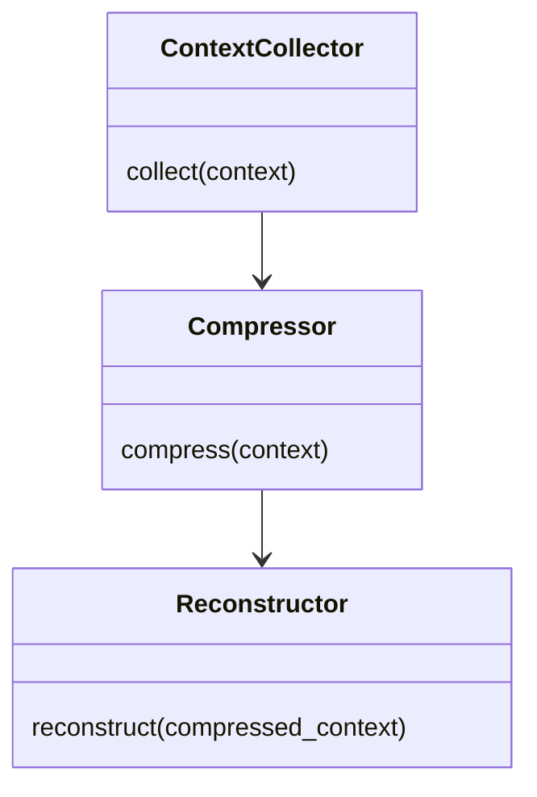
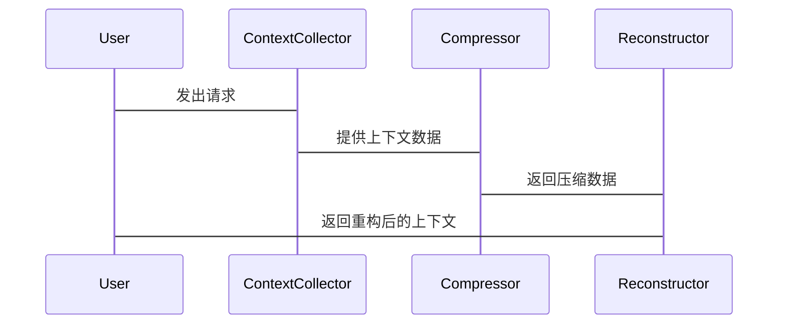

                 


# 实现AI Agent的动态上下文压缩与重构

## 关键词：AI Agent, 动态上下文, 上下文压缩, 上下文重构, 算法实现, 系统架构

## 摘要：  
AI Agent的动态上下文压缩与重构是实现高效智能系统的核心技术。随着AI Agent应用场景的扩展，动态上下文处理的重要性日益凸显。本文从背景、原理、算法、系统架构、项目实战和最佳实践等多个维度，详细探讨了动态上下文压缩与重构的关键技术。通过对比不同算法，分析系统架构设计，并结合实际案例，为读者提供深入的技术解析和实践指导。

---

## 第一部分: AI Agent的动态上下文压缩与重构概述

### 第1章: AI Agent与动态上下文压缩概述

#### 1.1 AI Agent的基本概念
##### 1.1.1 AI Agent的定义与分类
AI Agent（智能代理）是一种能够感知环境、自主决策并执行任务的智能实体。根据功能和应用场景的不同，AI Agent可以分为简单反射型、基于模型的反射型、目标驱动型和实用驱动型等类型。

##### 1.1.2 动态上下文的定义与特征
动态上下文指的是在AI Agent运行过程中，随着时间推移而不断变化的环境信息。其主要特征包括：动态性、关联性、实时性和不确定性。

##### 1.1.3 动态上下文压缩的背景与意义
在实际应用中，AI Agent需要处理海量的上下文信息，这些信息往往具有冗余性和不相关性。动态上下文压缩通过去除冗余信息，提取核心内容，提升系统的处理效率和响应速度。

#### 1.2 问题背景与目标
##### 1.2.1 上下文信息爆炸的挑战
随着AI Agent应用场景的扩展，上下文信息量呈指数级增长，导致系统处理能力不足。

##### 1.2.2 动态上下文压缩的目标
通过压缩和重构技术，优化上下文信息的存储和传输效率，提升系统性能。

##### 1.2.3 问题解决的边界与外延
动态上下文压缩的边界在于信息的压缩率和重构精度，外延则涉及多种应用场景，如自然语言处理、推荐系统等。

#### 1.3 技术发展现状
##### 1.3.1 现有压缩算法的优缺点
现有压缩算法包括熵编码、游程编码等，但这些算法在动态上下文处理中存在实时性不足和压缩率不高等问题。

##### 1.3.2 动态上下文处理的技术趋势
当前技术趋势包括深度学习驱动的压缩算法、分布式上下文处理等。

##### 1.3.3 当前研究的热点与难点
热点包括基于强化学习的压缩算法、多模态上下文处理等；难点在于如何在保证压缩率的同时，实现高效的重构。

---

## 第二部分: 动态上下文压缩的核心概念与联系

### 第2章: 核心概念原理

#### 2.1 动态上下文压缩的基本原理
动态上下文压缩通过去除冗余信息，保留关键内容，实现信息的高效存储和传输。

#### 2.2 动态重构的核心机制
动态重构基于压缩后的上下文，恢复原始信息的语义和结构。

#### 2.3 压缩与重构的平衡点
在压缩和重构过程中，需要在压缩率和重构精度之间找到平衡点。

### 第3章: 动态上下文压缩的算法原理

#### 3.1 基于概率的压缩算法
##### 3.1.1 算法流程
1. 输入原始上下文数据。
2. 计算每个信息块的概率分布。
3. 根据概率值进行信息筛选和压缩。

##### 3.1.2 算法实现
```python
import numpy as np

def probability_based_compression(context):
    probabilities = np.random.rand(len(context))
    threshold = np.quantile(probabilities, 0.25)
    compressed_context = [info for info, prob in zip(context, probabilities) if prob > threshold]
    return compressed_context
```

##### 3.1.3 算法的数学模型
$$ P(x) = \frac{1}{N} \sum_{i=1}^{N} x_i $$  
其中，$P(x)$ 表示信息块 $x$ 的概率。

#### 3.2 基于聚类的压缩算法
##### 3.2.1 算法流程
1. 将上下文信息划分为多个簇。
2. 选择每个簇的代表信息进行压缩。

##### 3.2.2 算法实现
```python
from sklearn.cluster import KMeans

def cluster_based_compression(context, num_clusters):
    model = KMeans(n_clusters=num_clusters)
    model.fit(context)
    compressed_context = model.cluster_centers_
    return compressed_context
```

##### 3.2.3 聚类算法的数学模型
$$ C = \arg\min \sum_{i=1}^{n} \sum_{j=1}^{k} w_{ij}^2 $$
其中，$C$ 表示聚类结果，$w_{ij}$ 表示第 $i$ 个样本到第 $j$ 个簇的距离。

---

## 第三部分: 系统分析与架构设计方案

### 第4章: 系统功能设计

#### 4.1 问题场景介绍
AI Agent需要处理复杂多变的上下文信息，如用户行为数据、环境传感器数据等。

#### 4.2 系统功能模块
- 上下文采集模块：负责采集原始上下文数据。
- 压缩模块：对采集到的数据进行压缩处理。
- 重构模块：根据压缩数据恢复原始上下文。

#### 4.3 领域模型设计


### 第5章: 系统架构设计

#### 5.1 系统架构图


#### 5.2 系统接口设计
- 上下文采集接口：`get_context()`
- 压缩接口：`compress(context)`
- 重构接口：`reconstruct(compressed_context)`

#### 5.3 系统交互流程


---

## 第四部分: 项目实战

### 第6章: 动态上下文压缩的项目实战

#### 6.1 环境安装
```bash
pip install numpy scikit-learn
```

#### 6.2 核心代码实现
```python
import numpy as np
from sklearn.cluster import KMeans

def compress(context):
    model = KMeans(n_clusters=2)
    model.fit(context)
    return model.cluster_centers_

def reconstruct(compressed_context):
    return compressed_context.tolist()
```

#### 6.3 代码实现解读
- `compress` 函数：使用KMeans算法对上下文数据进行聚类，返回聚类中心。
- `reconstruct` 函数：将压缩后的数据转换为原始上下文。

#### 6.4 实际案例分析
以客服对话系统为例，通过压缩和重构技术，提升对话系统的响应速度和准确性。

---

## 第五部分: 最佳实践与总结

### 第7章: 最佳实践与总结

#### 7.1 关键点总结
- 算法选择：根据具体场景选择合适的压缩算法。
- 系统设计：注重模块化设计，便于扩展和维护。

#### 7.2 小结
动态上下文压缩与重构是实现高效AI Agent的重要技术，通过合理的算法选择和系统设计，可以显著提升系统的性能。

#### 7.3 注意事项
- 压缩率与重构精度的平衡。
- 算法的实时性和可扩展性。

#### 7.4 拓展阅读
建议读者深入研究强化学习在动态上下文处理中的应用。

---

通过以上内容，希望读者能够全面理解AI Agent的动态上下文压缩与重构技术，并能够在实际项目中灵活应用。

