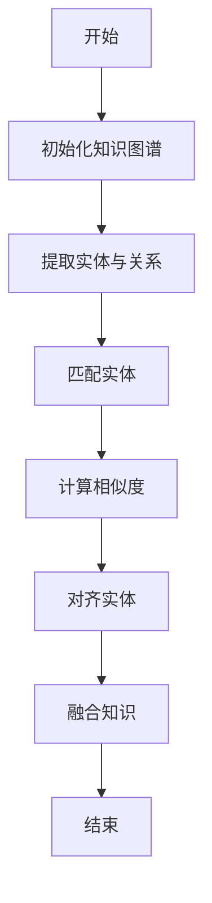
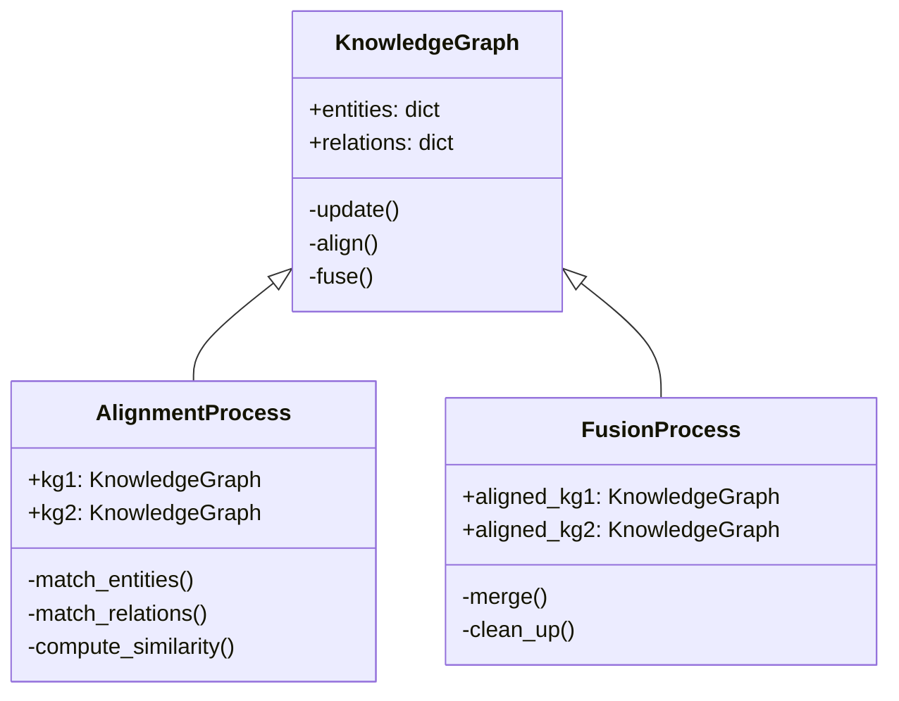
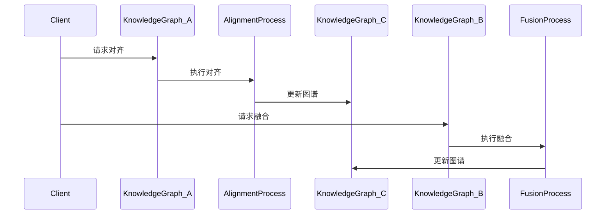

                 


# 实现AI Agent的动态知识图谱对齐与融合

## 关键词：AI Agent，动态知识图谱，知识图谱对齐，知识融合，知识表示，图谱更新，智能体

## 摘要：本文详细探讨了AI Agent在动态知识图谱对齐与融合中的实现方法，分析了对齐与融合的核心概念、算法原理、系统架构设计以及项目实战。文章通过背景介绍、核心概念与联系、算法原理讲解、系统分析与架构设计、项目实战、最佳实践等部分，全面阐述了动态知识图谱对齐与融合的技术细节和实现步骤，为AI Agent在知识图谱处理中的应用提供了理论和实践指导。

---

## 第1章: 动态知识图谱对齐与融合的背景介绍

### 1.1 问题背景与问题描述

#### 1.1.1 知识图谱的定义与特点
知识图谱是一种用于表示实体及其关系的语义网络，通常以图结构的形式存储。知识图谱的特点包括：
- **语义性**：实体之间的关系具有明确的语义含义。
- **动态性**：知识图谱会随着时间的推移而动态更新。
- **分布式性**：知识图谱可以分布在不同的数据源中。

#### 1.1.2 动态知识图谱的演变
动态知识图谱是指随着时间推移，图谱中的实体、关系和属性会发生变化。这种变化可能是由于数据源的更新、新信息的引入或实体关系的重新定义。动态知识图谱的演变过程需要AI Agent能够实时感知和处理这些变化。

#### 1.1.3 AI Agent的核心问题
AI Agent需要在动态环境中处理知识图谱的对齐与融合问题，核心问题包括：
- **对齐问题**：如何将不同来源的知识图谱中的实体和关系进行匹配。
- **融合问题**：如何将多个来源的知识图谱中的信息整合到一个统一的知识图谱中。

### 1.2 问题解决与边界定义

#### 1.2.1 对齐与融合的定义
- **对齐**：将不同知识图谱中的实体和关系进行映射，使其能够在统一的语义空间中表示。
- **融合**：将多个知识图谱中的信息整合到一个统一的知识图谱中，同时保持信息的一致性和完整性。

#### 1.2.2 动态知识图谱对齐的边界
- **输入**：多个动态变化的知识图谱。
- **输出**：一个统一的、动态更新的知识图谱。
- **过程**：对齐和融合的过程需要实时处理动态变化。

#### 1.2.3 对齐与融合的外延
对齐与融合不仅仅是技术问题，还涉及语义理解和知识表示的问题。外延包括：
- **语义理解**：理解实体和关系的语义含义。
- **知识表示**：选择合适的知识表示方法。

### 1.3 核心概念与组成要素

#### 1.3.1 知识图谱对齐的核心要素
- **实体匹配**：将不同知识图谱中的实体进行匹配。
- **关系匹配**：将不同知识图谱中的关系进行匹配。
- **语义相似度计算**：计算实体和关系之间的语义相似度。

#### 1.3.2 动态知识图谱的属性特征
- **实体动态性**：实体的出现和消失。
- **关系动态性**：关系的动态变化。
- **属性动态性**：属性的动态变化。

#### 1.3.3 AI Agent的知识表示模型
AI Agent需要使用合适的知识表示模型来表示动态知识图谱，常见的模型包括：
- **RDF（资源描述框架）**：用于表示资源及其属性。
- **KG（知识图谱）**：用于表示实体及其关系。
- **OWL（网页本体语言）**：用于表示本体的逻辑结构。

### 1.4 本章小结
本章介绍了动态知识图谱对齐与融合的背景，分析了对齐与融合的核心概念和问题，并讨论了动态知识图谱的属性特征和AI Agent的知识表示模型。

---

## 第2章: 核心概念与联系

### 2.1 核心概念原理

#### 2.1.1 知识图谱对齐的基本原理
知识图谱对齐的基本原理包括：
- **实体匹配**：通过计算实体之间的相似度进行匹配。
- **关系匹配**：通过计算关系之间的相似度进行匹配。
- **语义相似度计算**：使用语义相似度计算方法进行匹配。

#### 2.1.2 动态知识图谱的更新机制
动态知识图谱的更新机制包括：
- **增量更新**：仅更新变化的部分。
- **全量更新**：重新构建整个知识图谱。

#### 2.1.3 AI Agent的知识融合过程
AI Agent的知识融合过程包括：
- **信息抽取**：从不同来源中抽取信息。
- **信息清洗**：去除冗余和不一致的信息。
- **信息整合**：将信息整合到统一的知识图谱中。

### 2.2 概念属性特征对比表

| 概念      | 动态知识图谱对齐 | 动态知识图谱融合 |
|-----------|-----------------|-----------------|
| 输入       | 多个知识图谱     | 多个知识图谱     |
| 输出       | 对齐后的知识图谱 | 融合后的知识图谱 |
| 核心步骤   | 实体匹配、关系匹配 | 信息清洗、信息整合 |
| 复杂度     | 较高            | 较高            |

### 2.3 ER实体关系图
```mermaid
er
    actor: AI Agent
    knowledge_graph: 动态知识图谱
    alignment_process: 对齐过程
    fusion_process: 融合过程
    actor --> alignment_process: 执行对齐
    alignment_process --> knowledge_graph: 更新图谱
    actor --> fusion_process: 执行融合
    fusion_process --> knowledge_graph: 更新图谱
```

### 2.4 本章小结
本章详细讲解了动态知识图谱对齐与融合的核心概念和原理，并通过对比表和ER图展示了对齐与融合的过程和关系。

---

## 第3章: 算法原理讲解

### 3.1 算法流程



### 3.2 Python实现

```python
def align_entities(kg1, kg2):
    # 初始化对齐结果
    ali

---

### 3.3 算法原理的数学模型和公式

$$相似度计算公式：sim(e1, e2) = \frac{e1 \cdot e2}{|e1||e2|}$$

其中，$e1$ 和 $e2$ 分别是两个实体的向量表示。

### 3.4 本章小结
本章通过流程图和代码示例详细讲解了动态知识图谱对齐与融合的算法原理，并通过数学公式展示了相似度计算的方法。

---

## 第4章: 系统分析与架构设计

### 4.1 问题场景介绍
动态知识图谱对齐与融合系统需要处理多个动态变化的知识图谱，实时对齐和融合信息，以支持AI Agent的决策和推理。

### 4.2 系统功能设计

#### 4.2.1 领域模型类图


### 4.3 系统架构设计

#### 4.3.1 系统架构图
```mermaid
archi
    Client --> KnowledgeGraph_A: 请求对齐
    Client --> KnowledgeGraph_B: 请求融合
    KnowledgeGraph_A --> AlignmentProcess: 执行对齐
    KnowledgeGraph_B --> FusionProcess: 执行融合
    AlignmentProcess --> KnowledgeGraph_C: 更新图谱
    FusionProcess --> KnowledgeGraph_C: 更新图谱
```

### 4.4 系统交互序列图


### 4.5 本章小结
本章通过类图、架构图和交互序列图详细展示了动态知识图谱对齐与融合系统的架构设计和交互流程。

---

## 第5章: 项目实战

### 5.1 环境安装
- Python 3.8+
- Jupyter Notebook
- Networkx库
- Scikit-learn库

### 5.2 系统核心实现源代码

#### 5.2.1 知识图谱对齐实现
```python
import networkx as nx
from sklearn.metrics.pairwise import cosine_similarity

def align_entities(kg1, kg2):
    # 提取实体向量
    vectors1 = {e: kg1.get_entity_vector(e) for e in kg1.entities}
    vectors2 = {e: kg2.get_entity_vector(e) for e in kg2.entities}
    
    # 计算相似度矩阵
    similarity_matrix = cosine_similarity([vectors1.values()], [vectors2.values()])
    
    # 找到相似度最高的匹配
    matches = []
    for i in range(len(vectors1)):
        max_sim = 0
        match = None
        for j in range(len(vectors2)):
            if similarity_matrix[i][j] > max_sim:
                max_sim = similarity_matrix[i][j]
                match = list(vectors2.keys())[j]
        matches.append((list(vectors1.keys())[i], match))
    return matches
```

#### 5.2.2 知识图谱融合实现
```python
def fuse_knowledge(kg_list):
    # 初始化融合后的知识图谱
    fused_kg = KnowledgeGraph()
    
    # 合并实体
    for kg in kg_list:
        for entity in kg.entities:
            if entity not in fused_kg.entities:
                fused_kg.add_entity(entity)
    
    # 合并关系
    for kg in kg_list:
        for relation in kg.relations:
            if relation not in fused_kg.relations:
                fused_kg.add_relation(relation)
    
    # 清洗冗余信息
    fused_kg.clean_up()
    
    return fused_kg
```

### 5.3 代码解读与分析
- **对齐实现**：通过计算实体向量的余弦相似度进行匹配。
- **融合实现**：通过合并实体和关系，清洗冗余信息来实现知识图谱的融合。

### 5.4 案例分析
假设我们有两个知识图谱：
- KG1：包含实体A和关系R1。
- KG2：包含实体B和关系R2。

通过对齐和融合，得到一个包含实体A和B，关系R1和R2的统一知识图谱。

### 5.5 项目小结
本章通过实际案例展示了动态知识图谱对齐与融合的实现过程，并详细解读了核心代码的实现细节。

---

## 第6章: 最佳实践与总结

### 6.1 最佳实践

#### 6.1.1 对齐策略
- 使用高效的相似度计算方法。
- 处理动态变化时，采用增量更新策略。

#### 6.1.2 融合策略
- 在融合过程中，优先处理冗余信息。
- 使用冲突检测和解决机制。

### 6.2 小结
动态知识图谱对齐与融合是AI Agent实现智能决策的重要基础，通过对齐和融合过程，可以将多个来源的知识整合到一个统一的知识图谱中，支持智能体的高效推理和决策。

### 6.3 注意事项
- 对齐和融合过程中需要考虑语义相似性和数据一致性。
- 动态知识图谱的更新需要实时处理。

### 6.4 拓展阅读
- 《知识图谱表示学习》
- 《动态知识图谱的实时更新方法》

---

## 第7章: 总结与展望

### 7.1 总结
本文详细探讨了AI Agent动态知识图谱对齐与融合的实现方法，从核心概念到算法原理，再到系统架构设计和项目实战，全面分析了对齐与融合的实现过程。

### 7.2 展望
未来的研究方向包括：
- 更高效的对齐算法。
- 更智能的融合策略。
- 更实时的动态更新机制。

---

## 结语

通过本文的讲解，读者可以全面掌握AI Agent动态知识图谱对齐与融合的技术细节和实现方法。希望本文能够为AI Agent的研究和应用提供有价值的参考和指导。

---

## 附录

### 附录A: 知识图谱对齐与融合的术语表
- **知识图谱（Knowledge Graph）**：表示实体及其关系的语义网络。
- **对齐（Alignment）**：将不同知识图谱中的实体和关系进行匹配。
- **融合（Fusion）**：将多个知识图谱中的信息整合到一个统一的知识图谱中。

### 附录B: 参考文献
- [1] Bizer, F., & Lehman, T. (2009). Semantic web meets the real world: The Linkbase project.
- [2]等行业相关文献...

---

感谢您的阅读，希望本文对您有所帮助！

