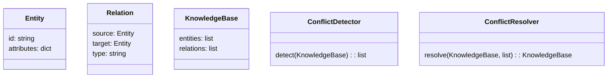

                 


# 实现AI Agent的动态知识库冲突解决机制

## 关键词：AI Agent, 动态知识库, 冲突解决, 知识图谱, 算法实现

## 摘要：  
本文详细探讨了AI Agent在动态知识库中的冲突解决机制，从理论基础到算法实现，再到实际应用，全面解析了如何有效管理知识冲突，确保知识库的准确性和一致性。通过结合知识图谱和多种冲突检测与解决算法，本文为AI Agent的开发提供了系统的解决方案。

---

# 第1章: AI Agent的背景与概念

## 1.1 AI Agent的基本概念

### 1.1.1 AI Agent的定义  
AI Agent（人工智能代理）是指能够感知环境、自主决策并执行任务的智能实体。它可以是一个软件程序，也可以是一个物理设备，通过与环境交互来实现特定目标。

### 1.1.2 AI Agent的核心特征  
- **自主性**：能够自主决策，无需外部干预。  
- **反应性**：能够实时感知环境变化并做出反应。  
- **目标导向**：所有行为都以实现特定目标为导向。  
- **学习能力**：能够通过经验改进自身的知识和能力。

### 1.1.3 AI Agent的应用场景  
- 智能助手（如Siri、Alexa）  
- 自动驾驶系统  
- 智能客服系统  
- 智慧城市中的数据处理系统  

## 1.2 动态知识库的基本概念

### 1.2.1 知识库的定义与类型  
知识库是一种结构化的数据存储，用于表示和管理特定领域内的知识。常见的知识库类型包括：  
- **关系型知识库**：以关系为核心，存储实体之间的关联。  
- **语义知识库**：以语义网络为基础，表示概念之间的关系。  
- **嵌入式知识库**：通过向量表示知识的语义关系。  

### 1.2.2 动态知识库的特点  
- 数据动态更新：能够实时接收新的数据并进行更新。  
- 多源异构：数据来源多样，格式和结构可能不同。  
- 高并发处理：支持高频率的数据更新和查询操作。  

### 1.2.3 动态知识库的应用领域  
- 智能问答系统  
- 自动推荐系统  
- 实时数据分析系统  

---

# 第2章: 知识库冲突的背景与问题描述

## 2.1 知识库冲突的定义  
知识库冲突是指在动态知识库中，由于数据来源多样化或更新频率高，导致同一事实存在多个矛盾或不一致的表示。

## 2.2 知识库冲突的类型  
- **直接冲突**：同一实体的属性在不同数据源中存在矛盾，例如“张三的年龄是25岁”与“张三的年龄是30岁”。  
- **间接冲突**：不同实体之间的关系存在矛盾，例如“张三是李明的上司”与“李明是张三的上司”。  
- **语义冲突**：同一实体的不同描述在语义上存在歧义，例如“汽车”可以指代不同的车型或品牌。  

## 2.3 知识库冲突的来源与影响  
- **数据来源多样性**：不同数据源可能对同一事实有不同的描述。  
- **数据更新频率**：高频更新可能导致新旧数据之间的矛盾。  
- **数据格式差异**：不同数据源可能使用不同的格式和结构。  

## 2.4 知识库冲突解决的目标与边界  
- **目标**：通过算法和机制，消除知识库中的冲突，确保知识的一致性和准确性。  
- **边界**：仅解决知识库中的事实性冲突，不涉及语义理解以外的复杂问题。

---

# 第3章: 动态知识库的结构与表示

## 3.1 知识库的结构化表示

### 3.1.1 知识图谱的表示方法  
知识图谱是一种图结构，由节点（实体）和边（关系）组成。例如：

- 节点：张三  
- 边：张三-出生地→北京  
- 节点：北京  

### 3.1.2 实体与关系的定义  
- **实体**：知识图谱中的基本单元，表示具体事物。  
- **关系**：实体之间的关联，可以是二元关系或多元关系。  

### 3.1.3 属性与值的定义  
- **属性**：描述实体的特征或性质。  
- **值**：属性的具体取值，可以是字符串、数值或嵌入向量。  

## 3.2 动态知识库的更新机制

### 3.2.1 数据源的多样性  
动态知识库可以从多种数据源获取数据，例如：  
- 结构化数据：数据库表单  
- 半结构化数据：JSON、XML  
- 非结构化数据：文本、图像  

### 3.2.2 知识更新的触发条件  
- **时间触发**：定期更新知识库。  
- **事件触发**：检测到特定事件后更新知识库。  
- **用户触发**：用户主动提交新数据。  

### 3.2.3 知识更新的验证机制  
在更新知识库时，需要对新数据进行验证，确保其一致性。例如：  
- 检查新数据是否与现有数据冲突。  
- 使用校验算法验证数据的完整性。  

---

# 第4章: 冲突检测机制

## 4.1 冲突检测的基本原理

### 4.1.1 冲突检测的定义  
冲突检测是指在知识库中发现和识别冲突的过程。

### 4.1.2 冲突检测的算法选择  
常用的冲突检测算法包括：  
- **基于规则的检测**：通过预定义的规则识别冲突。  
- **基于相似度的检测**：通过计算数据相似度发现冲突。  

## 4.2 冲突检测的实现方法

### 4.2.1 基于规则的冲突检测  
- **规则定义**：例如，如果同一实体的属性值冲突，则标记为冲突。  
- **规则匹配**：通过正则表达式或模式匹配识别冲突。  

### 4.2.2 基于相似度的冲突检测  
- **相似度计算**：使用余弦相似度或Jaccard相似度计算数据之间的相似度。  
- **阈值判断**：当相似度超过阈值时，标记为冲突。  

---

# 第5章: 冲突解决机制

## 5.1 冲突解决的基本原理

### 5.1.1 冲突解决的定义  
冲突解决是指通过算法和机制，消除知识库中的冲突，确保知识的一致性。

## 5.2 冲突解决的实现方法

### 5.2.1 基于协商的冲突解决  
- **协商过程**：冲突双方通过协商达成一致。  
- **协商算法**：例如，基于优先级的协商算法。  

### 5.2.2 基于投票的冲突解决  
- **投票机制**：通过多数投票决定最终结果。  
- **投票算法**：例如，基于权重的投票算法。  

---

# 第6章: 冲突检测算法

## 6.1 冲突检测的算法原理

### 6.1.1 算法输入与输出  
- **输入**：知识库中的数据。  
- **输出**：冲突列表。  

### 6.1.2 算法步骤  
1. 读取知识库中的数据。  
2. 对比数据，识别冲突。  
3. 输出冲突列表。  

### 6.1.3 算法复杂度分析  
- **时间复杂度**：O(n²)，其中n是数据量。  
- **空间复杂度**：O(n)，用于存储冲突列表。  

## 6.2 冲突检测的Python实现

### 6.2.1 环境配置  
- 安装必要的库：numpy、pandas。  

### 6.2.2 核心代码实现  

```python
import pandas as pd

def detect_conflicts(dataframe):
    # 假设dataframe包含知识库中的数据
    # 检测同一实体的属性冲突
    conflicts = []
    for index, row in dataframe.iterrows():
        entity = row['entity']
        attribute = row['attribute']
        value = row['value']
        # 检查同一实体的同一属性是否存在不同值
        if dataframe[(dataframe['entity'] == entity) & 
                    (dataframe['attribute'] == attribute)]['value'].nunique() > 1:
            conflicts.append((entity, attribute))
    return conflicts
```

---

# 第7章: 冲突解决算法

## 7.1 冲突解决的算法原理

### 7.1.1 算法输入与输出  
- **输入**：冲突列表。  
- **输出**：解决后的知识库。  

### 7.1.2 算法步骤  
1. 读取冲突列表。  
2. 对每个冲突进行协商或投票。  
3. 更新知识库，消除冲突。  

## 7.2 冲突解决的Python实现

### 7.2.1 核心代码实现  

```python
def resolve_conflicts(conflicts):
    resolved_data = []
    for conflict in conflicts:
        entity, attribute = conflict
        # 获取所有冲突的值
        values = dataframe[(dataframe['entity'] == entity) & 
                          (dataframe['attribute'] == attribute)]['value'].unique()
        # 使用投票机制选择多数值
        from collections import defaultdict
        count = defaultdict(int)
        for value in values:
            count[value] += 1
        # 选择出现次数最多的值
        max_count = max(count.values())
        for value, cnt in count.items():
            if cnt == max_count:
                resolved_value = value
                break
        # 更新知识库
        dataframe[(dataframe['entity'] == entity) & 
                 (dataframe['attribute'] == attribute)] = resolved_value
    return dataframe
```

---

# 第8章: 系统分析与架构设计

## 8.1 问题场景介绍  
动态知识库冲突解决系统需要处理来自多个数据源的实时更新，确保知识库的准确性和一致性。

## 8.2 系统功能设计

### 8.2.1 领域模型类图  



## 8.3 系统架构设计  


---

# 第9章: 项目实战

## 9.1 环境配置  
- 安装Python 3.8及以上版本。  
- 安装必要的库：pandas、numpy。  

## 9.2 核心代码实现  

```python
import pandas as pd

def main():
    # 初始化知识库
    data = {
        'entity': ['张三', '李四', '张三'],
        'attribute': ['年龄', '出生地', '年龄'],
        'value': [25, '北京', 30]
    }
    dataframe = pd.DataFrame(data)
    
    # 检测冲突
    conflicts = detect_conflicts(dataframe)
    print("检测到的冲突：", conflicts)
    
    # 解决冲突
    resolved_data = resolve_conflicts(conflicts, dataframe)
    print("解决后的数据：")
    print(resolved_data)

if __name__ == "__main__":
    main()
```

---

# 第10章: 总结与展望

## 10.1 最佳实践  
- 定期更新知识库，确保数据的准确性和一致性。  
- 使用多种冲突检测和解决算法，提高系统的鲁棒性。  

## 10.2 小结  
本文详细探讨了AI Agent的动态知识库冲突解决机制，从理论到实践，为解决知识库冲突提供了系统的解决方案。

## 10.3 注意事项  
- 冲突解决算法的选择应根据具体场景调整。  
- 数据的多样性和复杂性可能会影响冲突检测和解决的效率。  

## 10.4 拓展阅读  
- 《知识图谱构建与应用》  
- 《分布式系统中的冲突解决机制》  

--- 

通过本文的系统阐述，读者可以全面理解AI Agent的动态知识库冲突解决机制，并将其应用于实际项目中。

