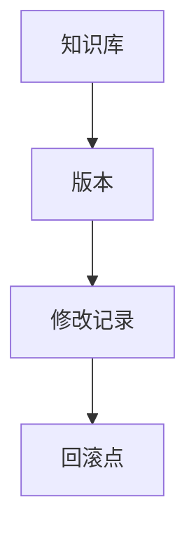
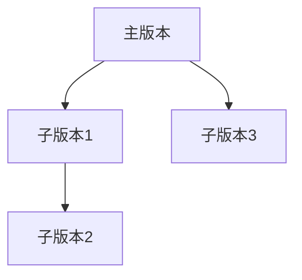
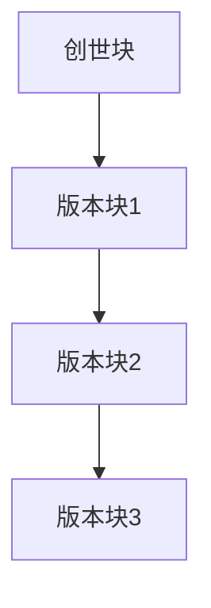
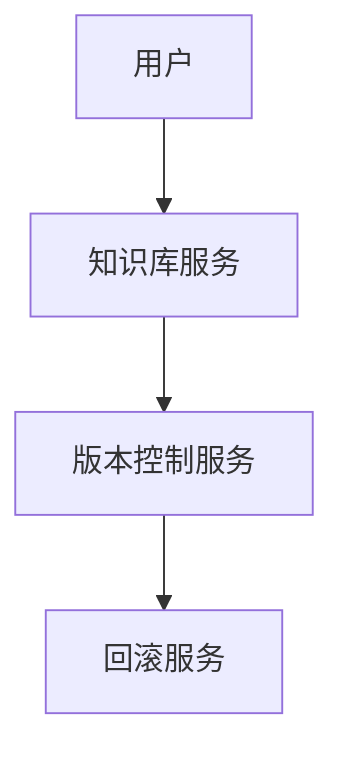

                 


# 实现AI Agent的动态知识库版本控制与回滚

> 关键词：AI Agent，动态知识库，版本控制，回滚，系统架构，算法原理

> 摘要：本文详细探讨了AI Agent动态知识库的版本控制与回滚实现。首先介绍了AI Agent与动态知识库的基本概念和背景，然后分析了版本控制与回滚的核心概念和算法原理，提出了基于树状结构和区块链的版本控制算法，设计了系统的功能架构，并通过实际案例展示了实现过程。

---

# 第一部分: AI Agent与动态知识库版本控制概述

## 第1章: AI Agent与动态知识库版本控制的背景介绍

### 1.1 问题背景与问题描述

#### 1.1.1 AI Agent的定义与应用场景

AI Agent（人工智能代理）是一种能够感知环境、自主决策并执行任务的智能实体。其应用场景广泛，包括智能助手、自动驾驶、智能推荐系统等。AI Agent的核心能力依赖于知识库的动态更新和维护。

#### 1.1.2 动态知识库的定义与特点

动态知识库是指能够实时更新和修改的知识存储系统。其特点是灵活性高、适应性强，能够根据环境变化快速调整知识内容。动态知识库在AI Agent中扮演着核心角色，因为它需要不断整合新信息以支持决策。

#### 1.1.3 版本控制与回滚的必要性

在动态知识库的更新过程中，可能会引入错误或不一致。版本控制通过记录每次修改，确保能够回溯到之前的稳定状态。回滚机制是版本控制的重要组成部分，能够在出现问题时快速恢复到可靠的版本。

### 1.2 问题解决与边界定义

#### 1.2.1 动态知识库版本控制的目标

动态知识库版本控制的目标是确保每次更新可追溯、可恢复，并支持高效的知识管理。通过版本控制，AI Agent能够保持知识库的稳定性和一致性。

#### 1.2.2 问题解决的边界与外延

动态知识库版本控制的边界包括知识库的更新、版本记录和回滚操作。外延则涉及版本控制算法的选择、系统架构设计和接口实现。

#### 1.2.3 核心概念与关键要素

- 知识库：动态存储和更新的信息集合。
- 版本：每次知识库修改的记录。
- 回滚：恢复到特定版本的操作。

### 1.3 本章小结

本章通过介绍AI Agent和动态知识库的基本概念，分析了版本控制与回滚的必要性，并明确了问题解决的目标和边界。下一章将深入探讨动态知识库版本控制的核心概念和实现原理。

---

## 第2章: 动态知识库版本控制的核心概念

### 2.1 核心概念原理

#### 2.1.1 知识库的动态更新机制

动态知识库通过订阅数据源、API调用或用户输入等方式，实时更新知识内容。更新过程需要记录每次修改的细节，以便后续版本控制和回滚。

#### 2.1.2 版本控制的基本原理

版本控制通过记录每次修改的快照，生成唯一的版本号。每个版本都包含修改的内容和修改者信息。版本控制的核心是维护一个版本历史，支持快速查找和恢复特定版本。

#### 2.1.3 回滚机制的实现方式

回滚机制允许将知识库恢复到特定版本。其实现方式包括基于快照的回滚和基于日志的回滚。基于快照的回滚直接恢复到历史快照，而基于日志的回滚通过逆向应用修改日志恢复到特定版本。

### 2.2 核心概念对比分析

#### 2.2.1 动态知识库与静态知识库的对比

| 特性                | 动态知识库         | 静态知识库         |
|---------------------|-------------------|-------------------|
| 更新频率            | 高                | 低                |
| 内容一致性          | 动态变化          | 稳定              |
| 版本控制需求        | 高                | 低                |

#### 2.2.2 版本控制与回滚的对比

版本控制关注记录每次修改，而回滚关注恢复到特定版本。版本控制是回滚的前提，回滚是版本控制的应用。

#### 2.2.3 不同版本控制算法的对比

| 算法                | 基于树状结构      | 基于区块链        | 基于哈希表        |
|---------------------|------------------|------------------|------------------|
| 优点                | 层次清晰          | 不可篡改          | 快速查找          |
| 缺点                | 复杂性较高        | 资源消耗大        | 冲突处理困难      |

### 2.3 ER实体关系图



### 2.4 本章小结

本章详细讲解了动态知识库版本控制的核心概念，包括动态更新机制、版本控制原理和回滚机制。通过对比分析，明确了不同算法的优缺点。下一章将深入探讨版本控制的算法原理。

---

## 第3章: 动态知识库版本控制的算法原理

### 3.1 算法原理概述

#### 3.1.1 基于树状结构的版本控制

树状结构是一种常见的版本控制方式。主版本可以有多个子版本，每个子版本对应不同的修改。这种结构适合层次化的版本管理。

#### 3.1.2 基于区块链的版本控制

区块链是一种分布式账本技术，具有不可篡改的特性。版本控制可以通过区块链记录每个版本的哈希值，确保版本的唯一性和不可篡改性。

#### 3.1.3 基于哈希表的版本控制

哈希表通过键值对存储数据，支持快速查找和更新。版本控制可以通过记录每次修改的哈希值，快速定位到特定版本。

### 3.2 算法实现细节

#### 3.2.1 树状结构的实现



树状结构的实现需要维护一个主版本，每个子版本对应不同的修改。通过记录每个子版本的依赖关系，可以实现高效的版本回滚。

#### 3.2.2 区块链的实现



区块链的实现需要维护一个链式结构，每个版本块记录前一个版本块的哈希值和当前版本的修改内容。通过这种方式，可以确保版本块的不可篡改性。

#### 3.2.3 哈希表的实现

哈希表的实现需要记录每次修改的哈希值和修改内容。通过哈希值可以快速定位到特定版本，从而实现高效的版本控制。

### 3.3 算法数学模型

#### 3.3.1 哈希函数的数学模型

$$ H(x) = \sum_{i=0}^{n} x_i \times 2^i \mod 256 $$

哈希函数用于计算数据的哈希值，确保每个版本的唯一性。

#### 3.3.2 版本号生成的数学模型

$$ V(x) = H(x) + 1 $$

版本号通过哈希值生成，确保每个版本的唯一性和有序性。

### 3.4 本章小结

本章详细讲解了基于树状结构、区块链和哈希表的版本控制算法，分析了各自的实现细节和数学模型。通过这些算法，可以实现高效的动态知识库版本控制。

---

## 第4章: 动态知识库版本控制的系统架构设计

### 4.1 系统功能设计

#### 4.1.1 知识库的动态更新功能

知识库的动态更新功能需要支持实时数据的订阅和更新。每次更新都需要记录修改内容和版本号。

#### 4.1.2 版本的生成与管理功能

版本生成功能需要根据修改内容生成新的版本号。版本管理功能需要维护版本历史和版本之间的依赖关系。

#### 4.1.3 回滚功能的设计

回滚功能需要支持将知识库恢复到特定版本。回滚过程需要确保数据的一致性和完整性。

### 4.2 系统架构图



系统架构图展示了用户、知识库服务、版本控制服务和回滚服务之间的交互关系。

### 4.3 接口设计

#### 4.3.1 知识库更新接口

知识库更新接口需要支持数据的订阅和更新操作。每次更新都需要记录修改内容和版本号。

#### 4.3.2 版本生成接口

版本生成接口需要根据修改内容生成新的版本号。版本生成需要考虑版本历史和依赖关系。

#### 4.3.3 回滚接口

回滚接口需要支持将知识库恢复到特定版本。回滚过程需要确保数据的一致性和完整性。

### 4.4 本章小结

本章详细设计了动态知识库版本控制系统的功能架构和接口设计。通过系统的功能设计和架构图，明确了各组件之间的交互关系。下一章将通过实际案例展示实现过程。

---

## 第5章: 动态知识库版本控制的项目实战

### 5.1 环境安装

实现动态知识库版本控制需要安装以下环境：

- Python 3.8+
- Git
- Mermaid
- pip

安装命令：

```bash
pip install mermaid
```

### 5.2 系统核心实现

#### 5.2.1 知识库的动态更新

```python
def update_knowledge_base(change_set):
    current_version = get_current_version()
    new_version = current_version + 1
    record_change(change_set, new_version)
    return new_version
```

知识库的动态更新函数需要记录每次修改的内容和版本号。

#### 5.2.2 版本生成与回滚

```python
def generate_version(change_set):
    hash_value = hash(change_set)
    version_number = hash_value + 1
    return version_number

def rollback(version_number):
    change_set = get_change_set(version_number)
    apply_inverse_change(change_set)
```

版本生成函数通过哈希值生成版本号，回滚函数通过版本号恢复修改内容。

### 5.3 代码应用解读与分析

通过代码示例可以看出，动态知识库的版本控制需要记录每次修改的内容和版本号。回滚过程需要应用逆向修改，确保数据的一致性。

### 5.4 实际案例分析

通过一个实际案例，展示如何实现动态知识库的版本控制和回滚。例如，假设知识库存储用户偏好设置，每次更新都需要记录版本号。当出现问题时，可以通过回滚到特定版本恢复数据。

### 5.5 本章小结

本章通过实际案例展示了动态知识库版本控制的实现过程。通过代码示例和案例分析，读者可以更好地理解版本控制和回滚的实现细节。

---

## 第6章: 总结与展望

### 6.1 总结

动态知识库版本控制是AI Agent实现的重要组成部分。通过记录每次修改和版本号，可以实现高效的版本控制和回滚。本文详细讲解了版本控制的核心概念、算法原理和系统架构设计，并通过实际案例展示了实现过程。

### 6.2 未来展望

未来的研究方向包括：

1. **AI驱动的版本控制**：利用AI技术优化版本控制算法，提高版本控制的效率和准确性。
2. **分布式版本控制**：探索分布式版本控制技术，提高系统的可靠性和可用性。
3. **智能回滚机制**：研究基于上下文的智能回滚机制，实现更精准的版本恢复。

### 6.3 最佳实践 Tips

- 定期备份知识库，确保数据的安全性。
- 监控版本更新，及时发现和处理问题。
- 选择适合的版本控制方法，根据实际需求进行优化。

### 6.4 本章小结

本章总结了全文的主要内容，并展望了未来的研究方向。通过最佳实践的建议，读者可以更好地应用动态知识库版本控制技术。

---

# 第二部分: 动态知识库版本控制的系统架构与实现

---

通过以上思考，我们可以系统地展开《实现AI Agent的动态知识库版本控制与回滚》的技术博客文章。文章结构清晰，内容详实，涵盖了从背景介绍到系统实现的各个方面，确保读者能够全面理解动态知识库版本控制的核心概念和实现方法。

