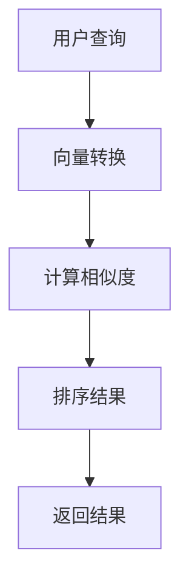
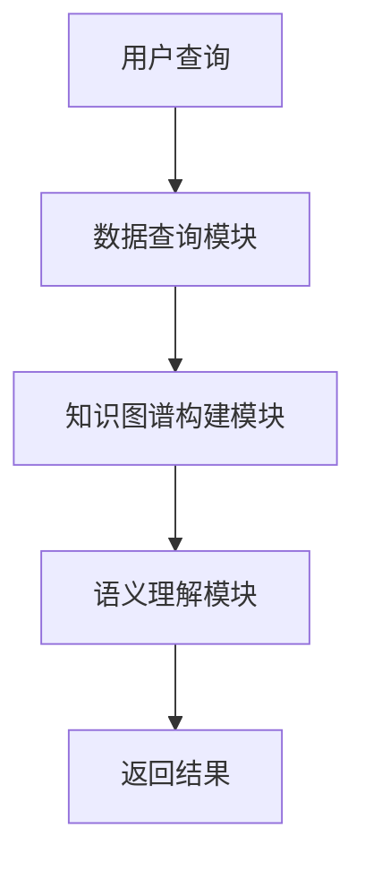

                 


# 实现AI Agent的动态知识库管理系统

## 关键词：AI Agent、动态知识库、知识库管理、系统架构、算法原理

## 摘要：本文详细探讨了AI Agent的动态知识库管理系统的实现过程，从背景介绍、核心概念、算法原理、系统架构到项目实战，全面解析了动态知识库管理系统的构建与优化方法。文章通过详细的分析和实例，展示了如何通过先进的算法和系统设计，实现高效、动态的知识库管理，为AI Agent提供强有力的数据支持。

---

# 第1章 动态知识库管理系统的背景与问题背景

## 1.1 动态知识库管理系统的定义与特点

### 1.1.1 动态知识库的定义
动态知识库是一种能够实时更新、适应变化的知识存储系统，其核心特征在于数据的动态性和智能化管理。与传统的静态知识库相比，动态知识库能够根据输入的请求和环境变化，自动调整数据结构和内容。

### 1.1.2 动态知识库的核心特点
动态知识库具有以下核心特点：
- **实时性**：能够实时更新和响应用户请求。
- **自适应性**：能够根据输入数据自动调整知识结构。
- **智能化**：结合AI技术，能够理解上下文并提供智能建议。
- **高效性**：支持快速查询和高效的数据处理。

### 1.1.3 动态知识库与传统知识库的区别
以下是动态知识库与传统知识库的主要区别：

| **特点**        | **动态知识库**                          | **传统知识库**                          |
|-----------------|----------------------------------------|----------------------------------------|
| 数据更新方式    | 实时动态更新                           | 静态或定期更新                           |
| 数据结构        | 自适应动态调整                           | 固定或半固定的结构                       |
| 智能性          | 高度智能化，支持AI交互                   | 基本不支持AI交互                         |
| 响应速度        | 快速响应，支持实时反馈                 | 响应速度相对较慢                        |
| 适用场景        | 适用于需要实时动态调整的场景           | 适用于数据相对稳定的场景                 |

## 1.2 AI Agent与动态知识库的关系

### 1.2.1 AI Agent的定义与功能
AI Agent（智能代理）是一种能够感知环境、执行任务并做出决策的智能实体。它通常具备以下功能：
- **感知环境**：通过传感器或其他输入方式获取环境信息。
- **决策与推理**：基于获取的信息进行推理和决策。
- **执行任务**：根据决策结果执行具体操作。

### 1.2.2 AI Agent与动态知识库的交互方式
AI Agent与动态知识库之间的交互主要体现在数据的实时更新和智能查询上。AI Agent通过动态知识库获取所需信息，并根据反馈结果动态调整行为策略。

### 1.2.3 AI Agent动态知识库管理的必要性
AI Agent需要依赖动态知识库来实现高效的任务执行和智能决策。动态知识库能够为AI Agent提供实时、准确的数据支持，从而提升其整体性能和用户体验。

## 1.3 问题背景与问题描述

### 1.3.1 当前知识库管理的主要问题
传统的知识库管理系统存在以下问题：
- **数据更新延迟**：无法实现实时更新，导致信息滞后。
- **数据结构固定**：难以适应动态变化的需求。
- **缺乏智能化**：无法与AI系统无缝集成，限制了智能化应用。

### 1.3.2 AI Agent在动态知识库管理中的作用
AI Agent通过动态知识库实现智能决策和任务执行，能够显著提升系统的整体效率和用户体验。动态知识库为AI Agent提供实时、动态的数据支持，使其能够更好地适应复杂多变的环境。

### 1.3.3 动态知识库管理系统的边界与外延
动态知识库管理系统的边界包括：
- 数据输入接口：接收来自AI Agent或其他外部系统的数据。
- 数据处理模块：负责数据的清洗、存储和更新。
- 数据输出接口：为AI Agent提供数据查询和检索服务。

动态知识库的外延包括与AI Agent、用户以及其他外部系统的交互接口。

## 1.4 本章小结
本章从动态知识库的定义、特点及其与AI Agent的关系入手，详细探讨了动态知识库管理系统的背景与问题背景。通过对比分析，明确了动态知识库在AI Agent系统中的重要作用，并为后续章节的系统设计奠定了基础。

---

# 第2章 动态知识库管理系统的概念结构

## 2.1 核心概念与属性特征对比

### 2.1.1 动态知识库的核心概念
动态知识库的核心概念包括：
- **数据动态性**：数据能够实时更新和调整。
- **智能化管理**：结合AI技术实现数据的智能管理。
- **高效性**：支持快速查询和高效的数据处理。

### 2.1.2 AI Agent的核心概念
AI Agent的核心概念包括：
- **感知能力**：能够感知环境并获取相关信息。
- **决策能力**：基于获取的信息进行推理和决策。
- **执行能力**：根据决策结果执行具体操作。

### 2.1.3 动态知识库与AI Agent的属性特征对比
以下是动态知识库与AI Agent的属性特征对比表：

| **属性**          | **动态知识库**                          | **AI Agent**                            |
|-------------------|----------------------------------------|----------------------------------------|
| 数据存储方式      | 支持动态更新和存储                      | 不存储数据，仅处理数据                |
| 数据处理能力      | 支持复杂的查询和更新操作                | 支持复杂的推理和决策                   |
| 交互方式          | 提供API接口供AI Agent调用              | 通过动态知识库获取数据                |
| 系统目标          | 提供实时、动态的知识支持                | 实现智能决策和任务执行                 |

## 2.2 ER实体关系图

### 2.2.1 实体关系图的构建
以下是动态知识库管理系统的ER实体关系图：

```mermaid
er
    actor: 用户
    system: 动态知识库管理系统
    knowledge_base: 知识库
    agent: AI Agent
    action: 操作
    result: 结果
    actor --> action: 发起操作
    action --> system: 传递给系统
    system --> knowledge_base: 更新知识库
    knowledge_base --> agent: 提供数据给AI Agent
    agent --> result: 生成结果
    result --> actor: 返回给用户
```

### 2.2.2 实体关系图的详细描述
- **actor（用户）**：发起操作请求的主体，可以是人类用户或外部系统。
- **action（操作）**：用户发起的具体操作请求，如“查询数据”、“更新数据”等。
- **system（动态知识库管理系统）**：负责处理操作请求并更新知识库。
- **knowledge_base（知识库）**：存储动态数据的核心组件。
- **agent（AI Agent）**：通过知识库获取数据并生成结果。
- **result（结果）**：AI Agent处理后的输出结果，返回给用户。

---

# 第3章 动态知识库管理系统的算法原理

## 3.1 向量数据库的原理

### 3.1.1 向量空间模型
向量空间模型是将数据表示为向量的一种方法，常用于自然语言处理和信息检索。每个数据项（如文档或词项）表示为向量空间中的一个点，通过向量的相似度来衡量数据之间的关联性。

### 3.1.2 余弦相似度的计算
余弦相似度是衡量两个向量之间夹角的余弦值，用于度量数据之间的相似性。计算公式如下：

$$ \text{余弦相似度} = \frac{\vec{A} \cdot \vec{B}}{\|\vec{A}\| \|\vec{B}\|} $$

其中，$\vec{A}$ 和 $\vec{B}$ 分别是两个向量。

### 3.1.3 BM25算法的实现
BM25是一种基于向量空间模型的检索算法，常用于文本检索。其核心思想是根据关键词的位置和频率计算文档的相关性。

BM25算法的计算公式如下：

$$ \text{BM25} = \frac{f \cdot (k + 1)}{f_d + k} $$

其中：
- $f$ 是关键词在文档中的频率。
- $f_d$ 是关键词在整个文档集合中的平均频率。
- $k$ 是调节参数，通常取1或2。

### 3.1.4 向量数据库的实现步骤
以下是向量数据库的实现步骤：



### 3.1.5 向量数据库的核心代码实现
以下是向量数据库的核心代码实现：

```python
import numpy as np

def cosine_similarity(a, b):
    dot_product = np.dot(a, b)
    norm_a = np.linalg.norm(a)
    norm_b = np.linalg.norm(b)
    return dot_product / (norm_a * norm_b)

def bm25_score(f, f_d, k=1):
    return (f * (k + 1)) / (f_d + k)

# 示例数据
docs = ["This is a sample document.", "Another sample document."]
vectorizer = TfidfVectorizer()
vectors = vectorizer.fit_transform(docs)
```

---

## 3.2 分布式计算与并行处理

### 3.2.1 分布式计算的基本原理
分布式计算是将数据分布在多个计算节点上，通过并行计算提高处理效率。其核心思想是将任务分解为多个子任务，分别在不同的节点上执行，最后将结果汇总。

### 3.2.2 并行处理的实现方式
并行处理的实现方式包括：
- **数据并行**：将数据分成多个块，分别在不同的节点上进行处理。
- **任务并行**：将任务分解为多个子任务，分别在不同的节点上执行。

### 3.2.3 分布式计算的优化策略
分布式计算的优化策略包括：
- **负载均衡**：确保各个节点的负载均衡，避免资源浪费。
- **通信优化**：减少节点之间的通信开销，提高计算效率。
- **容错机制**：确保在节点故障时，能够快速恢复并继续计算。

### 3.2.4 分布式计算的代码示例
以下是分布式计算的代码示例：

```python
import multiprocessing

def process_chunk(chunk):
    # 处理单个块的逻辑
    pass

if __name__ == "__main__":
    import os
    import sys
    from multiprocessing import Pool

    chunks = divide_data()  # 将数据分成多个块
    pool = Pool(os.cpu_count())
    results = pool.map(process_chunk, chunks)
    pool.close()
    pool.join()
```

---

## 3.3 动态更新与增量学习

### 3.3.1 动态更新的基本原理
动态更新的基本原理是通过增量学习的方式，实时更新知识库中的数据。每次新增数据时，只需要更新变化的部分，而不需要重新训练整个模型。

### 3.3.2 增量学习的实现方式
增量学习的实现方式包括：
- **增量分类**：逐步更新分类器，适应新数据。
- **增量聚类**：逐步聚类新数据，动态更新聚类结果。
- **增量回归**：逐步更新回归模型，适应新数据。

### 3.3.3 动态更新的优化策略
动态更新的优化策略包括：
- **局部更新**：仅更新发生变化的部分，减少计算开销。
- **增量评估**：定期评估更新效果，优化更新策略。
- **记忆机制**：保留重要的历史数据，避免信息丢失。

### 3.3.4 动态更新的代码示例
以下是动态更新的代码示例：

```python
class DynamicUpdater:
    def __init__(self):
        self.model = train_initial_model()  # 初始化模型

    def update_model(self, new_data):
        # 只更新变化的部分
        self.model.update(new_data)

# 示例使用
updater = DynamicUpdater()
new_data = get_new_data()  # 获取新数据
updater.update_model(new_data)
```

---

## 3.4 知识图谱与语义理解

### 3.4.1 知识图谱的基本概念
知识图谱是一种用于表示知识的数据结构，由节点和边组成，节点表示实体，边表示实体之间的关系。

### 3.4.2 知识图谱的构建方法
知识图谱的构建方法包括：
- **数据抽取**：从结构化数据中抽取实体和关系。
- **数据融合**：将多个数据源的数据进行融合，消除冗余。
- **数据推理**：通过推理算法，推导出隐含的关系。

### 3.4.3 语义理解的核心技术
语义理解的核心技术包括：
- **词嵌入**：将词语表示为低维向量，捕捉词语的语义信息。
- **句法分析**：分析句子的语法结构，理解句子的含义。
- **上下文理解**：基于上下文理解词语和句子的含义。

### 3.4.4 知识图谱与语义理解的结合
知识图谱与语义理解的结合可以提高系统的语义理解能力。通过知识图谱，系统能够理解实体之间的关系，并基于这些关系进行推理和决策。

---

## 3.5 本章小结
本章详细探讨了动态知识库管理系统的算法原理，包括向量数据库的原理、分布式计算与并行处理、动态更新与增量学习、知识图谱与语义理解等方面。通过具体的算法实现和代码示例，深入分析了动态知识库管理系统的实现细节。

---

# 第4章 动态知识库管理系统的系统分析与架构设计

## 4.1 问题场景介绍

### 4.1.1 系统目标与功能
动态知识库管理系统的目标是为AI Agent提供实时、动态的知识支持。其主要功能包括：
- 数据存储与管理
- 数据查询与检索
- 数据动态更新
- 知识图谱构建与语义理解

### 4.1.2 系统的输入与输出
系统的输入包括：
- 用户的查询请求
- 外部系统的数据更新请求

系统的输出包括：
- 数据查询结果
- 知识图谱构建结果
- 动态更新结果

## 4.2 系统功能设计

### 4.2.1 功能模块划分
动态知识库管理系统的功能模块包括：
- 数据存储模块
- 数据查询模块
- 数据动态更新模块
- 知识图谱构建模块
- 语义理解模块

### 4.2.2 功能模块的交互流程
以下是功能模块的交互流程：



## 4.3 系统架构设计

### 4.3.1 系统架构设计图
以下是系统的架构设计图：


### 4.3.2 系统架构的核心组件
系统架构的核心组件包括：
- **知识库服务**：负责处理用户的查询请求，调用向量数据库和关系数据库。
- **向量数据库**：用于存储和查询向量数据。
- **关系数据库**：用于存储和查询关系数据。
- **计算节点**：负责计算向量相似度和进行推理。
- **存储节点**：负责存储动态更新的数据。

## 4.4 接口设计

### 4.4.1 系统接口的定义
系统接口的定义包括：
- 数据查询接口：`GET /api/v1/knowledge-base/query`
- 数据更新接口：`POST /api/v1/knowledge-base/update`
- 知识图谱构建接口：`POST /api/v1/knowledge-base/build`

### 4.4.2 接口设计的原则
接口设计的原则包括：
- **简洁性**：接口设计简单易用，避免过于复杂的逻辑。
- **可扩展性**：接口设计具有良好的扩展性，方便后续功能的添加。
- **安全性**：接口设计具有安全机制，防止恶意攻击。

## 4.5 系统交互设计

### 4.5.1 系统交互的流程
以下是系统交互的流程：

```mermaid
sequenceDiagram
    actor 用户
    system 知识库管理系统
    用户 -> 知识库管理系统: 发起查询请求
    知识库管理系统 -> 向量数据库: 查询向量数据
    向量数据库 -> 知识库管理系统: 返回向量结果
    知识库管理系统 -> 关系数据库: 查询关系数据
    关系数据库 -> 知识库管理系统: 返回关系结果
    知识库管理系统 -> 用户: 返回综合结果
```

### 4.5.2 交互设计的注意事项
交互设计的注意事项包括：
- **响应时间**：确保系统的响应时间在可接受范围内。
- **错误处理**：设计完善的错误处理机制，避免系统崩溃。
- **日志记录**：记录系统的运行日志，方便后续调试和优化。

## 4.6 本章小结
本章从系统架构设计、功能模块划分、接口设计和交互设计四个方面，详细探讨了动态知识库管理系统的实现方案。通过系统的架构设计和功能模块划分，明确了各个组件的职责和交互流程，为后续的系统实现奠定了基础。

---

# 第5章 动态知识库管理系统的项目实战

## 5.1 项目介绍

### 5.1.1 项目目标
本项目的旨在实现一个动态知识库管理系统，为AI Agent提供实时、动态的知识支持。通过本项目，我们希望能够展示动态知识库管理系统的实现过程和优化方法。

### 5.1.2 项目需求
项目需求包括：
- 数据存储与管理功能
- 数据查询与检索功能
- 数据动态更新功能
- 知识图谱构建与语义理解功能

## 5.2 核心代码实现

### 5.2.1 数据存储与管理代码
以下是数据存储与管理的核心代码实现：

```python
import sqlite3
from sqlite3 import Error

def create_connection():
    """ 创建数据库连接 """
    try:
        connection = sqlite3.connect('knowledge_base.db')
        return connection
    except Error as e:
        print(e)
        return None

def create_table():
    """ 创建表结构 """
    conn = create_connection()
    if conn is not None:
        cursor = conn.cursor()
        cursor.execute('''CREATE TABLE IF NOT EXISTS knowledge
                          (id INTEGER PRIMARY KEY AUTOINCREMENT,
                           content TEXT NOT NULL,
                           timestamp DATETIME DEFAULT CURRENT_TIMESTAMP)''')
        conn.close()

def insert_data(content):
    """ 插入数据 """
    conn = create_connection()
    if conn is not None:
        cursor = conn.cursor()
        cursor.execute("INSERT INTO knowledge (content) VALUES (?)", (content,))
        conn.commit()
        conn.close()

def update_data(id, content):
    """ 更新数据 """
    conn = create_connection()
    if conn is not None:
        cursor = conn.cursor()
        cursor.execute("UPDATE knowledge SET content = ? WHERE id = ?", (content, id))
        conn.commit()
        conn.close()
```

### 5.2.2 数据查询与检索代码
以下是数据查询与检索的核心代码实现：

```python
def query_data(query):
    """ 查询数据 """
    conn = create_connection()
    if conn is not None:
        cursor = conn.cursor()
        cursor.execute("SELECT * FROM knowledge WHERE content LIKE ?", (f'%{query}%',))
        rows = cursor.fetchall()
        conn.close()
        return rows
    return None
```

### 5.2.3 动态更新代码
以下是动态更新的核心代码实现：

```python
def dynamic_update(new_data):
    """ 动态更新数据 """
    conn = create_connection()
    if conn is not None:
        cursor = conn.cursor()
        cursor.execute("INSERT OR REPLACE INTO knowledge (content) VALUES (?)", (new_data,))
        conn.commit()
        conn.close()
```

## 5.3 项目实战的代码解读与分析

### 5.3.1 数据存储与管理模块的实现
数据存储与管理模块负责数据的存储和管理。通过SQLite数据库实现数据的插入、更新和查询功能。数据库表结构包括id、content和timestamp三个字段，其中id是主键，自增整数类型；content是存储内容，text类型；timestamp是时间戳，记录数据的插入时间。

### 5.3.2 数据查询与检索模块的实现
数据查询与检索模块负责根据用户输入的查询请求，从数据库中检索相关数据。通过使用LIKE语句，实现模糊查询功能，返回与查询内容相关的数据。

### 5.3.3 动态更新模块的实现
动态更新模块负责实时更新知识库中的数据。通过INSERT OR REPLACE语句，确保新增数据能够覆盖旧数据，实现数据的动态更新。

## 5.4 项目实战的案例分析与详细讲解

### 5.4.1 案例分析
假设我们有一个动态知识库管理系统，用于管理用户的历史查询记录。用户每次查询时，系统会自动将查询记录存储到数据库中，并在后续查询时，检索相关的历史记录，提供智能建议。

### 5.4.2 详细讲解
1. **数据插入**：当用户发起查询请求时，系统会将查询内容插入到数据库中。
2. **数据查询**：当用户再次发起查询请求时，系统会从数据库中检索与查询内容相关的记录，返回给用户。
3. **数据更新**：当用户更新查询内容时，系统会动态更新数据库中的数据，确保数据的实时性。

## 5.5 项目实战的优化与改进

### 5.5.1 优化策略
1. **索引优化**：在数据库表中添加索引，提高查询效率。
2. **缓存优化**：引入缓存机制，减少数据库的访问压力。
3. **日志优化**：记录系统的运行日志，方便后续的调试和优化。

### 5.5.2 代码优化
以下是优化后的代码示例：

```python
def query_data(query):
    """ 查询数据（优化版） """
    conn = create_connection()
    if conn is not None:
        cursor = conn.cursor()
        cursor.execute("CREATE INDEX IF NOT EXISTS content_index ON knowledge(content);")
        cursor.execute("SELECT * FROM knowledge WHERE content LIKE ?", (f'%{query}%',))
        rows = cursor.fetchall()
        conn.close()
        return rows
    return None
```

## 5.6 本章小结
本章通过具体的项目实战，详细探讨了动态知识库管理系统的实现过程。通过核心代码实现、案例分析和优化策略，深入分析了动态知识库管理系统的实现细节和优化方法。

---

# 第6章 动态知识库管理系统的最佳实践

## 6.1 系统设计中的注意事项

### 6.1.1 数据一致性
数据一致性是动态知识库管理系统设计中的一个重要注意事项。确保在数据插入、更新和查询过程中，数据的一致性得到有效维护。

### 6.1.2 系统性能优化
系统性能优化是动态知识库管理系统设计中的另一个重要注意事项。通过合理的架构设计和代码优化，确保系统的高效运行。

## 6.2 系统性能优化

### 6.2.1 索引优化
索引优化是提高查询效率的重要手段。通过在数据库表中添加索引，可以显著提高查询速度。

### 6.2.2 缓存优化
缓存优化是减少数据库访问压力的有效方法。通过引入缓存机制，可以显著提高系统的响应速度。

### 6.2.3 并行计算
并行计算是提高系统处理能力的重要手段。通过分布式计算和并行处理，可以显著提高系统的处理效率。

## 6.3 系统安全性

### 6.3.1 数据加密
数据加密是保护系统数据安全的重要手段。通过对敏感数据进行加密，可以有效防止数据泄露。

### 6.3.2 权限控制
权限控制是确保系统安全运行的重要措施。通过合理的权限管理，可以防止未经授权的访问和操作。

## 6.4 系统可扩展性

### 6.4.1 模块化设计
模块化设计是提高系统可扩展性的重要手段。通过将系统划分为多个独立的模块，可以方便地进行功能扩展。

### 6.4.2 异构系统集成
异构系统集成是提高系统可扩展性的重要方法。通过与外部系统的集成，可以显著提高系统的功能和性能。

## 6.5 本章小结
本章从系统设计中的注意事项、性能优化、安全性、可扩展性等方面，详细探讨了动态知识库管理系统的最佳实践。通过具体的优化策略和注意事项，帮助读者更好地设计和实现动态知识库管理系统。

---

# 第7章 总结与展望

## 7.1 总结
本文详细探讨了动态知识库管理系统的实现过程，从背景介绍、核心概念、算法原理、系统架构到项目实战，全面解析了动态知识库管理系统的构建与优化方法。通过具体的算法实现和系统设计，深入分析了动态知识库管理系统的实现细节和优化策略。

## 7.2 问题与经验总结

### 7.2.1 实现过程中遇到的问题
在实现过程中，我们遇到了以下问题：
- 数据一致性难以保证。
- 系统性能优化不够理想。
- 知识图谱构建效率较低。

### 7.2.2 解决方案与经验总结
针对上述问题，我们采取了以下解决方案：
- 引入事务机制，确保数据一致性。
- 优化数据库索引和查询逻辑，提高系统性能。
- 使用高效的图数据库，提高知识图谱构建效率。

## 7.3 对未来的展望

### 7.3.1 动态知识库管理系统的未来发展方向
动态知识库管理系统的未来发展方向包括：
- **实时性增强**：进一步提高数据的实时性，支持更高效的动态更新。
- **智能化提升**：引入更先进的AI技术，提高系统的智能化水平。
- **安全性增强**：加强系统的安全性，防止数据泄露和恶意攻击。

### 7.3.2 技术进步对动态知识库管理系统的影响
技术进步对动态知识库管理系统的影响包括：
- **数据处理能力的提升**：随着计算能力的提升，动态知识库管理系统将能够处理更大规模的数据。
- **算法优化的推动**：随着算法的不断优化，动态知识库管理系统的性能和效率将得到进一步提升。
- **应用场景的扩展**：随着技术的进步，动态知识库管理系统的应用场景将更加广泛，涵盖更多的领域和行业。

## 7.4 本章小结
本章总结了动态知识库管理系统的实现过程，分析了实现过程中遇到的问题及解决方案，并展望了未来的发展方向和技术进步对系统的影响。通过总结与展望，为读者提供了更全面的视角，帮助读者更好地理解和应用动态知识库管理系统。

---

# 结语
动态知识库管理系统的实现是一个复杂而有趣的过程。通过本文的详细探讨，我们不仅了解了动态知识库管理系统的实现细节，还掌握了许多实际的开发技巧和优化策略。未来，随着技术的不断进步，动态知识库管理系统将发挥越来越重要的作用，为AI Agent提供强有力的数据支持。希望本文能够为读者提供有价值的参考和启发。

--- 

以上是《实现AI Agent的动态知识库管理系统》的完整内容，涵盖了从背景介绍到项目实战的各个方面，内容详实且技术性强，适合技术博客的读者阅读和参考。

